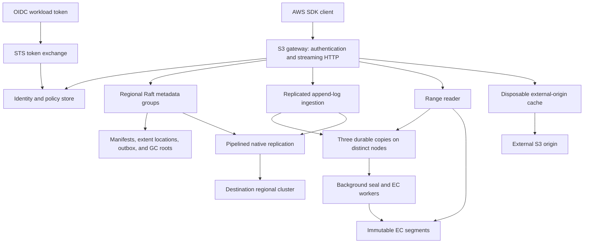
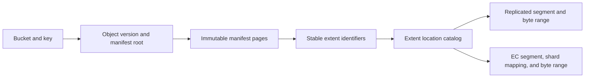
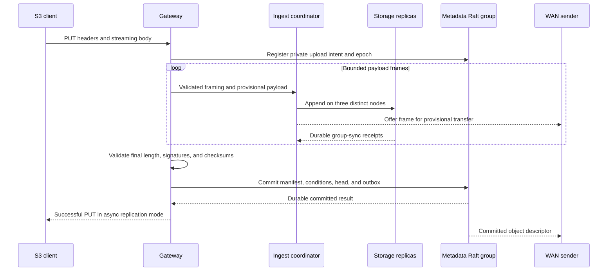
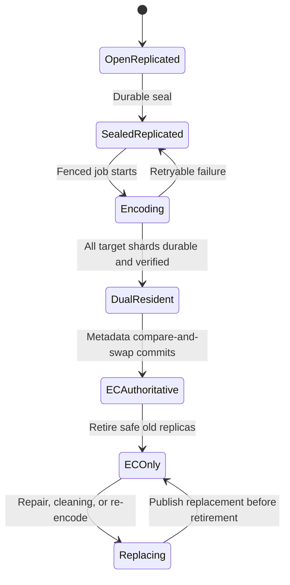
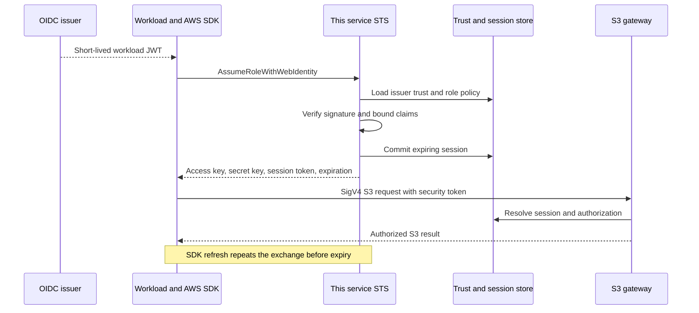
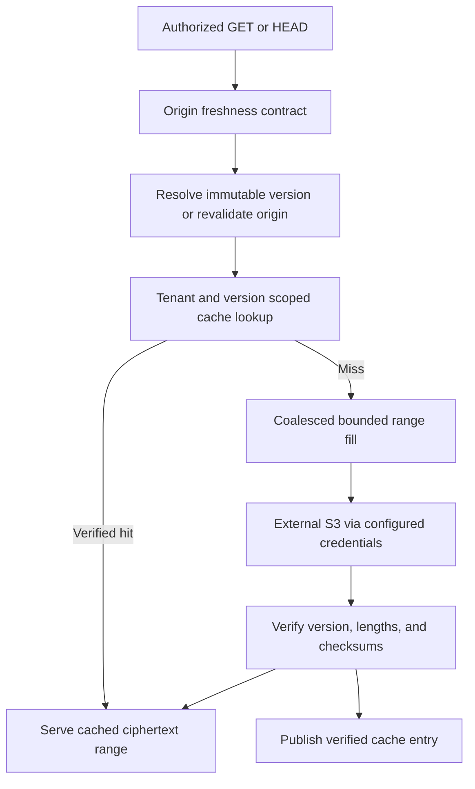
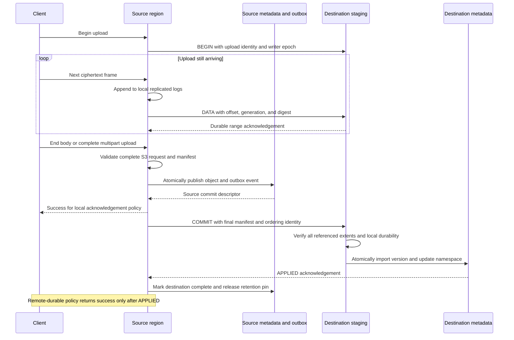

# SkyS3: Deferred Erasure Coding and Streaming Replication

**Status:** Proposed architecture, not an implemented or benchmark-validated system  
**Date:** 2026-09-18  
**Revision:** 2 - durable-operation amplification and upload-time replication clarified  
**Scope:** Rust storage service, S3 data plane and workload identity, ciphertext storage, remote S3 read caching, and native multi-region replication  
**Decision:** Replicated append-only ingestion; immutable, packed EC segments; a strongly consistent mutable namespace; regional rather than cross-region EC; and pre-commit streaming replication with atomic object publication.

## Contents

- [1. Executive decision](#1-executive-decision)
- [2. Requirements, assumptions, and non-goals](#2-requirements-assumptions-and-non-goals)
- [3. System architecture and ownership](#3-system-architecture-and-ownership)
- [4. Storage model and on-disk contracts](#4-storage-model-and-on-disk-contracts)
- [5. Foreground writes and namespace semantics](#5-foreground-writes-and-namespace-semantics)
- [6. Automatic EC and safe representation changes](#6-automatic-ec-and-safe-representation-changes)
- [7. Topology-aware defaults and honest durability](#7-topology-aware-defaults-and-honest-durability)
- [8. Capacity, durable I/O amplification, and flow control](#8-capacity-durable-io-amplification-and-flow-control)
- [9. S3 wire compatibility and workload identity](#9-s3-wire-compatibility-and-workload-identity)
- [10. External S3 read-through caching](#10-external-s3-read-through-caching)
- [11. Pipelined native multi-region replication](#11-pipelined-native-multi-region-replication)
- [12. Rust dependencies and replaceable boundaries](#12-rust-dependencies-and-replaceable-boundaries)
- [13. Correctness, recovery, and security invariants](#13-correctness-recovery-and-security-invariants)
- [14. Testing, benchmarks, and operational acceptance](#14-testing-benchmarks-and-operational-acceptance)
- [15. Delivery sequence and exit criteria](#15-delivery-sequence-and-exit-criteria)
- [16. Alternatives and convergence on the Pareto frontier](#16-alternatives-and-convergence-on-the-pareto-frontier)
- [17. Illustrative configuration and decisions still requiring measurement](#17-illustrative-configuration-and-decisions-still-requiring-measurement)
- [References](#references)

## 1. Executive decision

Build a small object-storage system, not a filesystem with an S3 facade and not a new consensus algorithm. The proposed baseline has five architectural commitments:

1. A PUT appends ciphertext to three node-separated logs and commits a small metadata transaction. Group commit amortizes durable flushes across requests. No erasure encoding is required on this foreground path.
2. Background workers convert sealed segments into systematic Reed-Solomon shards. Objects remain overwritable and deletable because names point to immutable object manifests; neither overwriting an object nor reclaiming deleted objects requires modifying existing parity in place.
3. Regional Raft metadata groups serialize object publication, conditional updates, multipart completion, placement changes, and durable replication outbox entries. Payload bytes do not pass through the metadata database or its Raft log.
4. Native replication sends object frames while the upload is still arriving. A separate commit record makes the complete object visible at the destination. Replication does not wait for EC conversion or for a whole object to be reread after upload.
5. External S3 caching is a separate, disposable read-through tier. It is not a durability replica and does not silently become a bidirectional write-back system.

The selected Rust stack is `s3s`/Hyper/Tokio, an explicit STS service, `raft-rs`, `redb` for authoritative metadata, append-only payload files, `reed-solomon-simd`, Quinn/rustls, and `aws-sdk-s3`/`aws-config` for remote origins. Keep narrow interfaces for metadata engines, EC codecs, transports, and deterministic I/O. Do not implement multiple production backends initially.

This is a **proposed non-dominated design for the stated priorities**, not a proof of universal Pareto optimality. Foreground durable-operation fan-out, durability barriers per acknowledged request, tail latency, total bytes written, steady-state capacity, recovery traffic, availability, and engineering effort are separate objectives. The primary write-amplification objective here is **I/O operations and durable storage fan-out, not payload byte amplification**. Section 16 identifies alternatives that remain preferable under different objective weights.

### Comparison on the requested performance axes

RustFS currently documents per-object Reed-Solomon encoding across an erasure set. The limitation addressed here is **synchronous durable I/O fan-out**: each small object can involve many shard devices even when the total number of payload bytes is modest. Replicated append ingestion narrows the foreground payload participant set and shares durable flushes across objects; background packing amortizes the wider EC work over many objects. Higher payload byte writes are a separate bandwidth/endurance cost, not a rebuttal of this IOPS benefit. Exact comparisons must measure each implementation's batching, metadata I/O, write quorum, and acknowledged failure budget. [^1]

SeaweedFS already documents automatic EC selection and collections containing both normal and EC volumes. Its EC limitations include no updates to EC volume contents and compaction through conversion back to normal volumes; deletion is supported. Therefore, "a writable namespace over immutable EC" alone is not a new advantage. The intended differences are smaller lifecycle units, first-class EC-to-EC cleaning, freely configurable geometry, explicit failure-domain contracts, and native pre-commit WAN streaming. Its current documentation distinguishes the open-source 10+4 default from enterprise custom ratios. [^2]

AWS documents CRR/SRR as asynchronous object replication, while multipart upload creates the source object only on completion. The relevant distinction is therefore **completed-object replication versus durable pre-completion byte streaming**, not whether S3 waits a fixed 15 minutes. RTC is not an upload-start-to-remote-publication bound; the upload itself can take longer than 15 minutes. The documented interfaces do not provide a durable remote range/resume contract for unfinished uploads. This is a service-contract comparison, not proof about undocumented internal AWS byte scheduling. Our protocol explicitly overlaps upload and WAN transfer, measures their overlap, and preserves whole-object S3 publication. [^6][^7][^30][^31]

## 2. Requirements, assumptions, and non-goals

### 2.1 Required outcomes

| Requirement | Architectural response |
|---|---|
| Low durable IOPS amplification for small writes, followed by automatic EC | Narrow replicated append fan-out, group commit, tunable segment sealing/promotion; count metadata durability too |
| Sensible EC defaults for the actual cluster | Node/rack-aware placement, minimum parity, bounded stripe width, explicit small-cluster fallback |
| AWS SDK compatibility, especially OIDC/STS WIF | Standard S3 wire protocol plus actual `AssumeRoleWithWebIdentity`, temporary credentials, session tokens, and refresh tests |
| E2EE; no server-side data encryption/KMS requirement | Opaque ciphertext payloads; no SSE-C, SSE-S3, or SSE-KMS implementation |
| Cache hot reads from external S3 | Range-capable read-through origin buckets with explicit freshness contracts |
| Pipelined multi-region replication before full upload | Stream frames during PUT and UploadPart; no full-object, full-part, or EC-seal gate; resumable durable acknowledgements and separate visibility commit |

### 2.2 Initial operating assumptions

The initial target is Linux on x86-64 and AArch64, persistent local disks, and a mixture of small objects and large multipart objects. Nodes may have heterogeneous disk counts and capacities. A useful production starting point is at least five storage nodes per region; three-node clusters remain supported with an explicitly weaker service fault budget.

No particular object-size distribution, ingestion rate, retention period, or disk medium has been supplied. Numerical settings below are initial tuning values, not demonstrated optima. Support a single region first, then multiple autonomous regional clusters. A region must remain independently readable without fetching EC parity over the WAN.

Within a bucket's home region, successful operations have strong namespace semantics. Outside that region, distinguish strong reads forwarded to the home from explicitly selected asynchronous local reads. Do not advertise globally linearizable local reads under asynchronous replication.

### 2.3 Deliberate exclusions

No POSIX filesystem, append-to-an-existing-S3-object API, distributed filesystem locking, transparent server-side compression of ciphertext, content-based global deduplication, server-side data encryption, KMS, SQL query engine, AWS Organizations clone, or general-purpose active-active conflict resolution.

External origins are read-through in the first complete release. Write-through/write-back mounts, automatic origin tiering, automatic cross-region writer failover, and direct foreground EC are separate extensions. Their absence does not prevent native buckets from being writable or automatically erasure-coded.

E2EE does not remove the need for TLS, authorization, secret handling, checksums, or audit. It also does not hide object keys, sizes, metadata, access timing, or retention patterns unless the client deliberately conceals them. The service never needs an object decryption key.

## 3. System architecture and ownership



Use one binary with independently selectable roles: gateway, metadata, storage, and worker. Co-location is the deployment default, not a requirement. Avoid external Redis, Kafka, PostgreSQL, or a mandatory external coordination service.

**Regional control group.** Stores membership, bucket-to-metadata-group routing, placement policies, writer-home epochs, identity configuration, and administrative jobs. Its failure-domain budget must be no weaker than the data service it controls.

**Metadata groups.** Each owns a set of complete buckets, their immutable manifests, extent-location catalog, upload state, outbox, and GC roots. Start with one group per region and support adding groups and assigning new buckets. Do not confuse an embedded database with distributed consensus: the database persists one replica's state; Raft provides ordering and replication. [^9]

Keeping an entire bucket in one metadata group makes conditional PUT, multipart completion, versioning, and ordered listing tractable. It also limits the write throughput of one exceptionally hot bucket. Range-sharding an existing bucket is explicitly a later feature, not a hidden assumption of the baseline scalability claim.

**Storage nodes.** Own per-disk append files and immutable shard files. They expose bounded append, seal, read-range, sync, checksum, repair, and retire operations. They never decide which S3 version is current.

**Workers.** Execute idempotent, fenced jobs for encoding, cleaning, healing, balancing, scrubbing, and replication. Jobs persist intent and progress before they can delete authoritative storage.

## 4. Storage model and on-disk contracts

### 4.1 Separate identity, location, and representation



An S3 object version is an immutable logical byte sequence plus user metadata, tags, checksums, and ETag. Its manifest is a bounded-page tree of extent references. Large uploads and multipart completion must not require one unbounded metadata value or a transaction containing millions of extents.

An extent is typically up to 1 MiB of payload; a small object may occupy one smaller extent. It has a stable identifier independent of the disk file holding it. A packed segment holds extents from multiple requests belonging to the same metadata group and compatible storage policies. Avoid a separate active log for every tiny bucket or tenant unless isolation requirements justify its tail-space cost.

There are two distinct relocation operations:

* **EC promotion** preserves the logical bytes of a sealed segment and updates its representation descriptor. Object manifests do not change.
* **Cleaning** repacks live extents into new segments and atomically changes their extent-location entries in bounded batches. Object and version identity still do not change.

The stable extent indirection has a metadata cost. Benchmark that cost rather than claiming O(1) metadata for arbitrarily large objects. Cache manifest pages and extent maps, but validate location generations when a stale locator fails.

### 4.2 Payload format

Use append-only regular files on ext4 or XFS initially, with an explicit file format:

```text
SegmentHeader:
  magic, format_version, cluster_id, region_id, group_id,
  segment_id, writer_epoch, checksum_scheme

Record:
  record_version, bounded_header_length, bounded_payload_length,
  upload_id, attempt_id, part_number, part_generation,
  extent_id, object_offset, payload_digest, header_checksum,
  payload, alignment_padding

SealFooter:
  sealed_length, record_index_root, segment_digest,
  writer_epoch, seal_generation, footer_checksum
```

Record parsing must check lengths before allocation, use checked arithmetic, and reject malformed or unknown versions. A torn tail is truncated only past the last verified recoverable boundary. Never infer S3 visibility merely from finding a complete record on disk.

Checksums serve different purposes. Use CRC32C for cheap framing checks and BLAKE3 for internal extent or verification-block integrity. Preserve S3-requested checksums and ETags separately. An internal BLAKE3 digest is not an S3 ETag, and a multipart ETag is not a universal content hash. [^7]

Use 64 KiB internal verification blocks initially. Payload extents, transport frames, EC processing blocks, and S3 multipart parts are different units and must not share one overloaded `chunk_size` setting.

### 4.3 Durability is explicit

A storage receipt acknowledges bytes only after the relevant file data is durably synchronized. New-file creation and rename paths also require the appropriate directory durability steps. An async write completion or data reaching the page cache is not a durable receipt.

Use dedicated disk workers and group sync rather than blocking Tokio's reactor. Start with portable file I/O and bounded worker queues. Add io_uring or direct I/O only behind the same durability contract after measured evidence; those are not substitutes for correct flush ordering.

A receipt binds the segment/extent, content digest, durable offset or generation, node, disk, and placement epoch. Metadata publication verifies the required number and failure-domain diversity of receipts. Uncommitted uploaded bytes may exist; committed metadata must never point to bytes that were only volatile.

## 5. Foreground writes and namespace semantics

### 5.1 Small-object PUT



The upload intent reserves quota, identifies a private manifest-building namespace, and pins uploaded extents. It can be batched with other intents; it is not one metadata transaction per frame. Upload manifest pages in bounded batches, then publish a single validated root.

A normal successful PUT requires three durable payload copies on distinct nodes and a committed namespace update. A 2 ms maximum group-commit delay is an initial tuning value. Flush earlier at the batch byte limit or an approaching request deadline. The objective is fewer durable operations per object through a three-node payload fan-out and shared sync boundaries. This is a payload-path statement, not a claim that the complete PUT costs only three device operations: upload-intent persistence, final Raft publication, filesystem work, and background I/O must also be counted. Separate participant fan-out from the number of sequential durability rounds and from bytes written.

Validate final SigV4 payload checks, streaming chunk signatures where applicable, decoded length, and requested checksums before publication. A stream can be provisionally stored or replicated before its final checksum is known, but no successful response or committed destination object may rely on unvalidated bytes.

The final metadata transaction performs the condition check, creates the object version, changes the current-key pointer, updates namespace indexes and accounting, records the outbox event, and releases the upload root into the committed object graph. A conditional PUT must test the current version inside this transaction, not against a stale gateway read.

### 5.2 Retry, overwrite, delete, and copy

Use separate upload, attempt, and object-version identifiers. Internal append and replication retries are idempotent. An arbitrary client retry of an S3 PUT is not assumed to carry an idempotency token; with versioning enabled it may legitimately create another version. A timeout can leave an operation committed even though the client did not receive success.

An overwrite creates a new immutable manifest and atomically swaps the current pointer. DELETE publishes a tombstone or delete marker as appropriate. Neither modifies old EC bytes. Unversioned superseded versions remain internally pinned while replication, active reads, or unfinished cleanup still need them.

Within one metadata group, CopyObject can share an immutable manifest root with atomic ownership/reference updates. Cross-group copy initially performs a streamed deep copy; do not introduce an unimplemented distributed reference-count transaction. UploadPartCopy follows the same source-version pinning and range rules.

### 5.3 Multipart upload

Each upload part has an independent generation and immutable manifest. Re-uploading part 7 creates a new generation; concurrent attempts cannot accidentally contribute mixed bytes. Parts may be erasure-coded before the multipart object is completed, and unfinished upload roots continue to protect them from GC.

CompleteMultipartUpload validates the ordered submitted part list, ETags, sizes, checksums, and current part generations, then atomically publishes a manifest composed from those exact part roots. It does not concatenate all part payloads into another local file. Abort releases the upload root through the ordinary safe reclamation process.

Store validated per-part digests and lengths. Full-object CRC32/CRC32C/CRC64NVME checksums can be combined in part order without rereading the object; SHA1/SHA256 multipart checksums use the supported composite form, not a fabricated full-object hash. This keeps ordinary completion proportional to part metadata rather than payload size. [^29]

For the selected non-SSE compatibility mode, use the conventional single-PUT MD5 ETag and multipart MD5-of-part-MD5s plus part-count suffix. These are wire validators, not the internal security/integrity primitive. Sharing payload storage during CopyObject does not imply copying all checksum metadata unchanged: single-action copy and changed checksum algorithms can require recomputation or a bounded payload reread. No new full payload allocation is required. [^29]

Persist a completion result keyed by upload and completion attempt so internal retries cannot publish different manifests. Match S3-compatible retry/error behavior, including the possibility that an HTTP success status contains an operation-level error in APIs that permit it. Conformance tests, not a happy-path SDK upload, define correctness. [^7][^23]

### 5.4 Reads and lists

Resolve a current key through a linearizable metadata read or valid leader/read-index mechanism, then read its immutable version. GET, HEAD, conditions, tags, and listing must agree on the same committed namespace semantics. Do not serve an unvalidated follower's namespace state as a strong read. [^28]

For healthy systematic EC, read only the data-shard ranges containing the requested bytes; decoding is unnecessary. Missing or corrupt ranges are reconstructed from sufficient verified matching ranges of other shards. Small healthy reads must not fan out to all `k` data shards merely because the object resides in EC storage.

S3 listing uses ordered metadata indexes, bounded page sizes, prefixes, delimiters, and opaque authenticated continuation tokens. A page is evaluated against one coherent state. A multi-page listing is not advertised as an indefinitely pinned global snapshot unless a separate snapshot contract is implemented.

## 6. Automatic EC and safe representation changes

### 6.1 Policy and starting values

| Setting | Proposed starting value | Meaning |
|---|---:|---|
| Target packed segment size | 256 MiB | Logical bytes before EC; not per S3 object |
| Maximum active segment age | 5 minutes | Seal even under continuous low-rate ingestion |
| Minimum efficient EC candidate | 8 MiB | Prefer packing smaller sealed tails together |
| Hard promotion age target | 30 minutes | Prevent tiny tails remaining replicated forever when resources permit |
| Internal verification block | 64 KiB | Integrity and bounded degraded-range recovery |
| Encoder processing batch | 1 MiB per shard | Bounded CPU/RAM batch, divisible into verification blocks |
| Payload replicas / durable receipts | 3 / 3 | Distinct storage nodes |
| Maximum group-commit wait | 2 ms | Tune for device and latency target |
| Low-live-ratio cleaner trigger | 50% live | Initial heuristic, not a universal optimum |
| Direct foreground EC | Disabled | Optional extension, section 16 |

Seal on size OR age, not only after an idle period: a continuously written stream must still produce EC candidates. Promotion also responds to replicated-tier pressure. Small sealed segments can be repacked into a new immutable candidate, retaining old sources until the new representation is committed. That repacking has extra I/O and must appear in metrics.

At the hard age target, an undersized candidate may be encoded with recorded logical lengths and zero padding. The target is not permission to violate placement or reserve-space requirements. When safe promotion is impossible, report the reason and eventually throttle ingestion rather than deleting replicas or silently lowering parity.

Changing EC policy affects new encodings. Existing segments retain their exact codec and geometry. A re-encode job is explicit and uses the same safe replacement protocol. Topology fluctuations never make readers guess an old segment's layout from today's cluster size.

### 6.2 EC layout

Use systematic Reed-Solomon, initially through `reed-solomon-simd`, with a fixed, versioned codec profile and byte layout. The library offers Rust implementations with AArch64 and x86 SIMD paths; its published microbenchmarks are not a performance result for this service. Keep a scalar/reference verification path and test actual small stripe widths. [^12]

A segment's packed bytes are divided into `k` contiguous data-shard spans; parity is generated over corresponding aligned verification blocks. Record original lengths and deterministic padding. Encoding can process bounded batches, and degraded reads can decode a verification block without loading an entire shard or segment.

Freeze and persist: codec ID and format version, field/matrix or algorithm profile, `k`, `m`, shard order, segment logical length, shard lengths, block size, padding convention, checksums, and placement generation. A crate upgrade is not allowed to reinterpret old parity. Different EC libraries are not automatically format-compatible. The selected library's own comparison warns of weaker decode performance at small recovery counts; benchmark two-parity recovery against a GF(2^8) alternative before freezing the production codec. [^12]

### 6.3 Publish before retire



A promotion worker first acquires a job generation and a stable sealed source descriptor. It creates new shard files under a unique generation, writes and durably seals every required shard, verifies digests, and checks current failure-domain placement. Verification failure leaves the original replicas authoritative.

Only then does a Raft compare-and-swap replace the segment representation. Publication requires the full configured durability profile, not merely `k` shards sufficient to read the data. A code with `m=2` is not considered fully protected when only `k+1` shards are durable.

After publication, readers using stale location caches refresh and retry. Retire old files only through the current authoritative generation and the reader/repair lifetime protocol. A delayed worker cannot delete a replacement created by a newer job. A crash can leave extra copies, but must never leave neither valid representation.

### 6.4 Direct EC-to-EC cleaning

The cleaner identifies live extents using committed manifests and all auxiliary roots: uploads, outbox/history, snapshots, copies in progress, and active-reader protections. Reference counters may accelerate discovery but are not the only source of truth for destructive decisions.

It reads the necessary live ranges from old replicated or EC segments, streams them into new packed segments and EC shards, durably seals the destination, and moves extent-location entries with generation checks. Unmoved extents continue to resolve to old locations. A job can resume at its last committed batch after a crash.

There is **no required intermediate full replicated volume** when cleaning an already coded segment. This removes a particular temporary-capacity and workflow cost; it does not remove the need to read surviving data, write new shards, or retain old storage during cutover.

Use mark epochs and bounded reader leases/watermarks so GC does not race new references. Gateways register reader generations in batches; a gateway that loses its lease must stop or renew affected reads. Do not add a consensus transaction to every individual GET just to implement a pin. Object-copy and upload-root publication must atomically establish reachability before their source protection can disappear.

## 7. Topology-aware defaults and honest durability

### 7.1 Choose a failure budget before choosing a ratio

The standard policy targets survival of **any two storage-node failures**, assuming independent nodes, honest durable storage acknowledgements, and no additional corruption beyond the remaining redundancy. At five or more nodes, match the entire service to that target:

- Ingest data: three durable copies on three distinct nodes.
- Coded data: at least two parity shards, with at most one shard of a stripe on a node.
- Authoritative metadata and regional control: five Raft voters on distinct nodes, with durable majority commit.

Five voters are selected for the fault budget, not for metadata throughput. Three metadata voters would make the service only one-node-failure tolerant even when the payload survives two. Five voters still commit through a majority; they do not require all five to respond to every write.

This is a failure-count contract, not an annual durability probability. It does not cover two node failures plus an additional unreadable necessary block, correlated rack loss outside the placement policy, operator deletion of all replicas, or dishonest hardware flushes. Scrubbing, repair time, backups, and actual fault correlations still matter.

After failure, distinguish readable data, the ability to accept new writes, and restoration of full redundancy. A code using every eligible node cannot restore a missing shard onto a new failure domain until a replacement node exists. New writes remain possible only when three eligible storage nodes, the metadata quorum, and capacity reserves are available. Promotions may pause while replicated ingestion continues.

### 7.2 Automatic geometry

Count eligible independent **nodes**, not raw disks. With the standard two-parity policy, consider `3+2`, `4+2`, `6+2`, and `8+2`. Prefer the widest permitted profile leaving at least one eligible node outside the stripe; allow `3+2` on a five-node bootstrap cluster with an explicit no-spare warning. Cap automatic data width at eight to bound degraded-read and repair fan-in.

| Eligible storage nodes in the region | Default new-segment representation | Payload capacity multiplier | Qualification |
|---|---|---:|---|
| 1-2 | Explicit development replication policy | 1-2x | No production HA claim |
| 3-4 | Three replicas; automatic EC deferred | 3x | Three metadata voters; one-node metadata fault budget |
| 5-6 | RS 3+2 after staging | 1.667x | Five nodes have no spare failure domain |
| 7-8 | RS 4+2 after staging | 1.5x | At least one node outside each stripe |
| 9-10 | RS 6+2 after staging | 1.333x | At least one node outside each stripe |
| 11 or more | RS 8+2 after staging | 1.25x | Width bounded even as the cluster grows |

The metadata-voter notes describe bootstrap configurations. Temporary node unavailability must not automatically shrink a five-voter group to three or change the advertised fault budget. A provisioned five-voter group retains its membership until an explicit safe reconfiguration. Eligible-node counts govern new payload placement, not ad hoc consensus membership changes.

These are policy choices, not mathematically optimal ratios for every disk or workload. A four-node `2+2` code is technically possible and can be an explicit override; it is not the automatic default because metadata availability, spare placement, small-stripe overhead, and operational headroom remain constrained. A three-node cluster cannot keep accepting three-copy writes after losing a node. It must wait for replacement or use an explicitly weaker, separately named degraded-write policy.

The topology planner filters out unhealthy, draining, near-full, and policy-ineligible nodes. Select disks within each chosen node using capacity and load weighting. More disks increase throughput and capacity but do not create additional node-failure independence. Persist the chosen placement and geometry; placement must never be recomputed implicitly from a changed hash ring when reading old data.

### 7.3 Racks, zones, expansion, and overrides

The default guarantees node separation, not rack survival. A rack-aware policy must verify that losing the required set of racks removes no more than `m` shards. Apply the same failure-domain check to ingest copies and metadata voters. Reject unsatisfiable policies rather than claiming that a large disk count solves a lack of independent racks.

Operators may override data/parity counts, failure domains, spare targets, and storage pools. Increasing parity to three does not make the staging phase or three/five-voter metadata automatically three-failure tolerant: the configuration validator must expose the weakest phase and require a matching ingest/metadata policy for an end-to-end claim.

Adding nodes changes placement eligibility for new segments. Existing stripes remain readable without immediate rewrite. Rebalance through rate-limited publish-before-retire jobs; a profile change is not an automatic rewrite storm. A single spare domain is useful for one repair, but does not guarantee full redundancy can be restored after two simultaneous failures without replacements.

## 8. Capacity, durable I/O amplification, and flow control

### 8.1 Separate operation amplification from byte amplification

#### 8.1.1 Primary objective: durable operations and fan-out

Here **write amplification refers primarily to I/O operations per logical write**, especially synchronous writes/flushes across independent storage participants. IOPS is the corresponding rate. A small object split into ten shards can impose more device operations and durable participants than three full copies even when those ten shards contain fewer total bytes.

Let `n = k+m` be the full EC width, `r` the ingest replication factor, `b_ec` the number of small objects sharing an EC-path durability batch, and `b_log` the number sharing an append-log durability batch. In a simplified payload-only model with one sync boundary per participant per batch:

```text
EC payload sync participations per object       ~= n / b_ec
Replicated-log sync participations per object   ~= r / b_log
Sync participation reduction factor            ~= (n / r) * (b_log / b_ec)
```

These are amortized participant-sync counts, **not exact physical device IOPS or latency predictions**. Filesystems, block-layer merging, flush/FUA behavior, multiple writes per batch, and metadata can change actual counts. Compare equal acknowledgement-time failure budgets. For an MDS code with `k` required shards, `q` durable distinct shards provide at most `q-k` immediately tolerable additional shard losses; waiting for fewer than `k+m` is not equivalent to acknowledging the full `m`-loss budget. Record both shards written and shards required before ACK.

| Healthy payload path | Durable payload participants for the stated full two-node-loss budget | Relative participant cost at equal batching |
|---|---:|---:|
| Three full replicas | 3 | 1x |
| Full 4+2 EC | 6 | 2x |
| Full 8+2 EC | 10 | 3.33x |

The table assumes one fragment/copy per independent node and excludes metadata. It is an illustrative comparison of layouts, not a measured RustFS result. Replicated append logs can further improve batching, but per-object EC implementations can also batch: do not assume `b_ec = 1` without measuring the comparison implementation.

For a small PUT containing one payload batch, foreground payload fan-out stays at `r` even as the retained EC width grows. Large uploads naturally span more batches/segments; the claim is not that every object of any size touches only three disks. Background conversion writes large sequential shard ranges and publishes durability at segment/job boundaries, amortizing wide fan-out over many objects rather than issuing a separate shard sync for each tiny object. Conversion still consumes real bandwidth and device commands; scheduling must bound its interference with foreground work.

**Metadata remains part of the budget.** The baseline has upload-intent and final-publication stages, with payload durability between them. Group metadata proposals and persistence; never persist one Raft entry per transport frame or sync each metadata index independently. Instrument the target/ACK participant count, device operations, group size, and sequential barrier rounds for every stage. A three-replica payload path can still lose an end-to-end comparison if its metadata path introduces enough unbatched I/O or serial durable rounds.

The acceptance objective is lower foreground durable operations per small PUT and lower p99 ACK latency at equivalent durability, while maintaining bounded EC backlog and sustainable steady-state throughput. Total operations after encoding/cleaning, byte amplification, and endurance remain separate constraints.

#### 8.1.2 Secondary budgets: bytes, endurance, and temporary space

Let `B` be newly ingested logical payload bytes, `r` the number of ingest replicas, and `c = (k+m)/k` the EC expansion factor. Ignore metadata, padding, retries, filesystem overhead, and later cleaning for this first-order comparison.

| Path | Foreground payload writes | Later payload writes | Total payload writes | Final occupied payload space |
|---|---:|---:|---:|---:|
| Direct foreground EC | `cB` | None | `cB` | `cB` |
| Replication retained forever | `rB` | None | `rB` | `rB` |
| Baseline deferred EC | `rB` | `cB` | `(r+c)B` | `cB` |
| Optional systematic-shard adoption | `rB` | Ideally `(m/k)B` | Ideally `(r+m/k)B` | `cB` |

For three replicas and 4+2 EC, the baseline writes **3x before acknowledgement and approximately 4.5x over ingest plus initial conversion**, ending at 1.5x occupied space. Conversion also reads roughly one logical copy. While all old copies and the new shards coexist, that segment can occupy approximately 4.5x. These figures are arithmetic consequences of the design, not measurements.

These byte totals do not measure the requested IOPS improvement. The primary win is narrowing foreground durable fan-out and amortizing storage operations through packing/group commit; parity CPU is an additional benefit, not the main rationale. More sequential bytes can be an acceptable cost for fewer synchronous small operations. Byte bandwidth, temporary capacity, and SSD endurance can still become independent limits; section 16 describes the optional large-object direct-EC path.

For a cleaner selecting a segment with live fraction `u`, approximately `u/(1-u)` coded bytes must be rewritten per coded byte reclaimed, assuming comparable layout and ignoring extra padding. At 50% live, the ratio is about one; at 90%, it is nine. Grouping similar retention or churn classes can help, but creating too many tiny active segments creates a different amplification problem.

### 8.2 Capacity accounting and admission

A useful physical-capacity model is:

```text
physical_required = r * unconverted_logical_bytes
                  + c * converted_live_or_pinned_logical_bytes
                  + conversion_and_cleaning_workspace
                  + repair_and_rebalance_reserve
                  + metadata_and_filesystem_overhead
                  + disposable_origin_cache
```

Versions retained solely for replication are included in one of the first two terms, not counted again as a separate full data copy. They remain real space consumption. Per-disk free space and node placement constraints matter; aggregate cluster free space alone is insufficient.

Start with a 15% physical reserve floor, then raise the required reserve to cover the largest admitted conversion/repair jobs and placement-specific needs. This percentage is an initial policy, not a proof of repair feasibility. Admission must reserve destination bytes before starting jobs. Cache allocations are reclaimable and lowest priority; they cannot consume space already reserved for authoritative data.

The long-term encoder service rate must exceed the rate of bytes entering the replicated tier. Similarly, WAN drain capacity must keep up with the rate of data requiring remote retention. Otherwise the queue grows without bound, regardless of scheduling cleverness. Measure queue age and bytes, not just object counts.

Under pressure, evict disposable cache, accelerate safe promotion/cleaning within foreground latency budgets, reject new expensive jobs, and eventually throttle new uploads with retryable errors. Never reclaim acknowledged-but-unreplicated extents merely to meet a space target. Preserve dedicated capacity and scheduling for metadata, repair, and tombstone progress.

### 8.3 Bounded scheduling

Use separate concurrency and byte budgets for client ingress, client reads, encode, repair, scrub, origin fill, and WAN transfer. A bounded message count is not enough when messages have variable sizes. Limit per-tenant active uploads, staged multipart bytes, uncommitted WAN bytes, and outstanding body buffers.

Disk flush batches have both byte and delay bounds. Encode CPU runs in a bounded worker pool rather than on the networking reactor. Background bandwidth adapts to foreground tail latency, but minimum repair progress must remain possible. Limit active segment count per disk and scheduling class.

Do not pin the original three-copy log solely because a WAN destination is down. The outbox pins the **logical extents and manifest**, so local EC may proceed; the sender resolves their current representation when it resumes.

## 9. S3 wire compatibility and workload identity

### 9.1 Treat compatibility as a tested contract

Use `s3s` for S3 HTTP parsing, operation types, and response serialization, backed by a storage service implementing the required operations. The project identifies itself as experimental; its own documentation calls for explicit authentication and input limits. It is a useful adapter, not a complete object store, IAM implementation, or security boundary. Its AWS SDK integration is not an STS server. [^8]

Publish a compatibility matrix and a CI artifact for every release. Do not equate importing an S3 crate with being on par with an established service. The parity target is the declared common SDK surface, not every feature either comparison product happens to expose.

| Surface | Required for the complete baseline |
|---|---|
| Object APIs | PUT, GET, HEAD, GetObjectAttributes, DELETE, batch delete, copy, range/part reads, conditional requests, metadata and tags |
| Bucket APIs | Create, delete, head, location, list buckets, ListObjects V1/V2, prefixes and delimiters |
| Multipart | Create, UploadPart, UploadPartCopy, ListParts, ListMultipartUploads, complete, abort |
| Signing | SigV4 header authentication, presigned URLs, temporary session credentials, signed streaming bodies where used by SDKs |
| Data integrity | Supported SDK-default checksum algorithms, aws-chunked decoding/trailers, multipart full/composite rules, Content-MD5 where required |
| Identity | OIDC trust configuration, AssumeRoleWithWebIdentity, expiring session credentials, automatic SDK refresh tests |
| Policy | A documented IAM/bucket-policy subset with explicit deny; supported condition operators are enumerated |
| Common browser/backup behavior | CORS, versioning including suspension/null-version semantics, delete markers, lifecycle expiration and abandoned-MPU cleanup |
| Explicitly deferred | Object Lock, legal hold, S3 Select, inventory/analytics, comprehensive AWS IAM administration, advanced notifications, directory buckets/S3 Express |
| Explicitly unsupported | All server-side data-encryption modes and KMS integration |

Presigned POST can be added when a target application needs it; do not claim it merely because presigned GET/PUT works. Public access is disabled by default. ACL behavior must be explicit: either implement the selected owner-enforced/no-ACL mode with compatible errors or implement a tested ACL subset, rather than accepting and ignoring permissions.

AWS SDK checksum defaults have changed over time. Current SDKs may send CRC32 or CRC64NVME and use streaming trailers. Implement and test the actual SDK defaults rather than instructing clients to disable integrity checks. Keep ETag semantics separate from additional checksum fields. The initial checksum matrix includes CRC32, CRC32C, CRC64NVME, SHA1, SHA256, and required Content-MD5/ETag behavior; newer optional checksum algorithms are explicit exclusions until tested, never silently accepted. [^18][^29]

Requests asking for SSE-S3, SSE-KMS, or SSE-C must receive an explicit unsupported-feature error; silently ignoring an encryption request is unacceptable. TLS still protects request credentials and metadata. Store the client's ciphertext exactly; no server transformation may alter content-length, range, or checksum semantics.

### 9.2 Real OIDC-to-STS exchange

Implement the STS Query API action `AssumeRoleWithWebIdentity`, including its form-encoded request, API version, XML response/error format, role/session parameters, and returned `AccessKeyId`, `SecretAccessKey`, `SessionToken`, and `Expiration`. Support the POST form used by the tested SDK providers. Accepting a JWT as a custom bearer header on S3 requests does not satisfy AWS SDK WIF. RustFS documents STS and SeaweedFS has web-identity integration tests; this is part of the comparison bar, not an optional add-on. [^4][^5][^15][^17]



The trust policy binds an allowed issuer, audience, subject constraints, role identifier, and permitted session duration. Verify signature, `iss`, `aud`, `sub`, `exp`, `nbf` where present, and appropriate time bounds. Apply `azp`/multi-audience rules for issuer profiles that require them. Do not impose a browser-login nonce flow on workload token exchanges.

Use `openidconnect` for discovery and relevant token-verification building blocks, but add an explicit workload-token verification profile. Its documented limitations include no built-in `azp` validation; application policy must close that gap. Restrict signing algorithms and reject unsigned tokens. Discovery/JWKS fetches are allowlisted, bounded, cached, refreshed on unknown key IDs with rate limits, and protected against SSRF. Never follow attacker-selected `jku` or arbitrary issuer URLs. [^19]

Trust authorizes the exchange; the resulting role and session policies authorize S3 actions. An optional session policy can only narrow the role's authority. Unknown policy operators or unsupported grant semantics are rejected, not treated as permissive. Secret/session-token comparison is constant-time where appropriate, and request logs redact all credentials and web-identity tokens.

### 9.3 Session storage and endpoints

Use stateful session records initially. SigV4 verification needs access to the session secret; a one-way hash alone is insufficient. Store secrets in a tightly restricted identity store, hash opaque session tokens where practical, expire records, and bound authorization caches. Protecting authentication secrets is still required even though object SSE/KMS is excluded. Avoid designing a new stateless credential encryption scheme in the first release.

Sessions have cluster scope. Regional STS endpoints resolve a shared identity authority or a controlled replicated view; unknown or insufficiently fresh records are looked up at the authority or fail closed. Policy revocation is bounded by an explicitly configured cache lifetime. Source-region availability and remote-region identity availability must not be conflated. Automatic identity-authority failover needs the same fencing discipline as other control-plane ownership.

A typical client environment is:

```sh
export AWS_ROLE_ARN='arn:aws:iam::123456789012:role/object-client'
export AWS_WEB_IDENTITY_TOKEN_FILE='/var/run/identity/token'
export AWS_ROLE_SESSION_NAME='workload-1'
export AWS_REGION='us-east-1'
export AWS_ENDPOINT_URL_S3='https://s3.example.test'
export AWS_ENDPOINT_URL_STS='https://sts.example.test'
```

These are illustrative identifiers and endpoints. Both S3 and STS must be redirected; configuring only the S3 endpoint can leave credential acquisition talking to AWS STS. Service-specific endpoint configuration is documented by AWS, but provider/version support is part of the test matrix. Where the chosen SDK provider does not honor the endpoint setting, use its explicit STS client/provider configuration or a documented `credential_process` adapter. [^15][^16]

Test Python/botocore, Go v2, JavaScript v3, Java v2, Rust, and AWS CLI with their normal credential provider chains, token-file rotation, credential expiry, and presigned requests. Compatibility means the refresh path works under load, not just that a manually supplied access key can upload once.

## 10. External S3 read-through caching

### 10.1 Separate authoritative and cached bucket types

Support two explicit namespace types: **native buckets**, whose authoritative data is managed here, and **origin buckets**, which expose a configured external S3 bucket or prefix through a read-only local cache. SeaweedFS Cloud Drive is useful prior art for this separation. Do not confuse this feature with moving native data to a remote cold tier. [^3]

The first release does not merge writable local objects with independently mutable remote objects under the same keyspace. No implicit write-back, delete propagation, or bidirectional conflict resolution is included. PUT/DELETE against a read-only origin bucket fail explicitly.



### 10.2 Freshness contracts

Offer three explicit modes:

| Mode | Validation | Staleness contract |
|---|---|---|
| Immutable version | Pin an origin version ID or an externally guaranteed immutable key | Cached bytes remain valid for that exact identity |
| Revalidate on request | Resolve current origin metadata/version, then conditionally fill the selected version | Reflects an origin version selected during the request; no silent TTL staleness |
| Bounded stale | Cache the origin validator for a configured TTL | May serve the previous version or miss a deletion during that interval |

Make revalidation the default for mutable origins. A positive TTL is an intentional relaxation, not a free strongly consistent cache. Revalidate-on-request can save payload egress without eliminating the origin metadata round trip. Immutable/versioned origins are the best fit for low-latency repeated reads.

The cache key includes tenant/security context, origin configuration identity and generation, bucket/key, exact version or validator, representation metadata, and byte range. Authorization runs on every request, including hits. Changing origin credentials or trust configuration cannot accidentally expose entries filled under a different security context.

ETags are opaque validators, not universal cryptographic content digests. A multi-range fill pins one origin version ID or uses consistent conditional requests; a precondition failure restarts against the new version. Never assemble a synthetic object from ranges belonging to different origin versions. Negative-cache entries have separate short lifetimes and cannot turn an old absence into indefinite `NoSuchKey` responses.

### 10.3 Cache policy and failure behavior

Start with fixed-size 1 MiB cache ranges, streaming delivery before the full object is cached, and small metadata entries. Coalesce concurrent fills for the same scoped range. Begin with a simple bounded admission/eviction policy and collect hit-rate/scan-pollution data before adopting a more complex TinyLFU implementation. Sequential one-time scans can bypass admission once their budget is exhausted.

Cache data has one local copy by default, uses checksums, and is evictable without consensus. It is not EC-coded or regionally replicated unless explicitly promoted to a different authoritative feature. Avoid using the authoritative metadata Raft group as a per-cache-block index.

Use `aws-sdk-s3` and `aws-config` for origin access, including supported credential providers, range/conditional requests, retries, and configured addressing style. Validate compatibility against each selected non-AWS origin; sharing an S3 label does not guarantee identical behavior. Remote list operations initially forward to the origin. Mirroring a complete namespace and offering offline listing is a separate feature.

On origin outage, serve only what the selected freshness contract permits. Immutable-version cache hits may remain usable; mutable revalidate-on-request reads fail rather than silently becoming stale. An explicitly configured stale-on-error mode reports that relaxation. Detect loops where an origin endpoint resolves to this same mount or a cyclic chain of mounts.

## 11. Pipelined native multi-region replication

### 11.1 Transfer bytes early; publish only complete objects

Native replication connects independent regional clusters. It sends provisional ciphertext during PUT or UploadPart, before source object publication and before local EC conversion. The destination writes private staged extents and applies its own local protection policy; it does not need to duplicate the source's segment packing or EC geometry.

**Transfer eligibility is a bounded frame, not a completed object, completed multipart part, or sealed EC segment.** Data moves while an UploadPart body is still arriving; final part validation binds the accepted generation. Frames may be provisional until end-of-request validation, but cannot be published as an S3 object. Remote durability receipts are cumulative/batched and pipeline asynchronously: never wait for a WAN round trip before sending each next frame. Local and destination group-sync policies are independent of transport-frame size.



Send logical ciphertext once per destination, not all source replicas or EC shards. Destination replication/EC is regional traffic; retries and repair can add WAN bytes.

A streaming receiver is not an S3 partial-object reader. Before commit, HEAD/GET at the destination return the previous committed version or absence. Invalid final checksums, failed conditions, aborted MPUs, and rejected signatures never publish provisional bytes. An ordinary UploadPart does not publish the multipart object either.

### 11.2 Protocol and recovery state

Use Quinn reliable streams over authenticated QUIC for native peer traffic. Allocate independent logical streams for uploads and priority control traffic; do not use unreliable datagrams for durable payload. QUIC is a transport choice, not a durability protocol. Application acknowledgements remain mandatory. [^13]

Start with 256 KiB transport frames, distinct from 1 MiB logical extents and S3 multipart parts. Every frame identifies the source cluster/region, bucket, home epoch, upload/attempt, part generation, extent, offset, length, and digest. Use explicit protocol versions and bounded fields. Final manifests contain content identities and logical ordering, not source-specific disk paths.

| Message | Meaning |
|---|---|
| `BEGIN` | Create or resume private destination staging under an authenticated source identity |
| `DATA` | Transfer a bounded frame; duplicate offsets must have identical content identities |
| `SEAL` | Finalize an extent or part's length/digest; still not an S3 publication |
| `COMMIT` | Supply the source's committed final manifest, object metadata, and ordering identity |
| `ABORT` | Release provisional state after authoritative cancellation; idempotent |
| `DURABLE` | Acknowledge recoverable ranges after the configured local protection is durable |
| `APPLIED` | Confirm final namespace import is committed in destination metadata |
| `RESUME` | Exchange durable range maps and missing manifest/pages after reconnect |

Persist enough destination state to recover durable offsets and staging ownership after restart. A checkpoint may lag data files, but recovery must rescan before acknowledging missing durable state. Receiving into RAM is not `DURABLE`; receiving all bytes is not `APPLIED`. Validate same-offset conflicts as corruption or protocol violations, not as arbitrary last-writer wins.

`COMMIT` may arrive before some frames; retain it privately until every referenced extent and checksum is verified and the destination's full durability profile is satisfied. A destination that has already EC-coded staged parts may count that protected representation rather than recreate three replicas. Persist final import IDs for idempotent retries.

The source's namespace transaction creates the outbox event atomically with publication. A best-effort tee from the HTTP body alone is insufficient: a gateway may crash after local commit but before sending the final message. A background outbox walker reads committed extents, resumes missing ranges, and retries `COMMIT` until `APPLIED` is durable at the source.

**Pre-commit catch-up must also survive a sender restart.** The durable active-upload intent and manifest checkpoints identify accepted extents/part generations and replication destinations before an object-level outbox event exists. A staging sender enumerates this state and resumes durable missing ranges during an ongoing multipart upload; it must not wait for CompleteMultipartUpload to recover from a broken tee. Persist source and destination checkpoints in batches, not a metadata transaction or fsync per frame. The final outbox event remains the authoritative obligation to publish a committed version. Bytes not durably accepted locally may need client retransmission. This design does not by itself promise that an unfinished multipart upload can be resumed after loss of its home region; that requires a separately specified cross-region upload-metadata/failover contract.

### 11.3 Ordering, deletion, and retained history

Assign replication ordering only at committed namespace mutation, not at upload start. Each key has a home-epoch and monotonically ordered mutation identity. Distribute committed events across fixed key-hash lanes; preserve per-key order and use explicit barriers for bucket-wide destructive operations. A slow upload must not reserve a global sequence slot that prevents unrelated completed uploads from replicating.

A late PUT cannot resurrect a key after a newer delete. Destination application checks epoch and mutation order, imports version history as configured, and preserves tombstones/high-water marks long enough to reject delayed events. Replicate tags and relevant metadata mutations as ordered version-specific events. For copy operations, request missing extents rather than assuming that shared local source storage already exists remotely.

Pin superseded source versions while an outbox entry still needs their bytes. On a heavily overwritten key during WAN outage, retained intermediate versions can be substantial. The initial policy preserves committed replication events; coalescing unversioned intermediate states is an optional policy with a different replication-history contract, not an invisible optimization.

Destination provisional data has quotas and cleanup rules. After a staging timeout, it may discard uncommitted bytes, but the source must retain enough state to resend an actual committed object. Timeouts alone must not delete a committed destination object or acknowledge delivery of an object whose source event is still pending.

### 11.4 Acknowledgement policies and consistency

| Policy | Client success means | WAN failure behavior |
|---|---|---|
| `local` (default) | Source payload and namespace are durable locally | Continue while retention capacity permits; region-loss RPO is nonzero |
| `remote_durable` | Local commit plus required destination payload and namespace commits are durable | Wait or time out when a required destination is unavailable |
| `bounded_lag_local` (extension) | Local durability while configured lag/admission limits are satisfied | Stop admitting new work when lag or retained bytes exceed policy |

Streaming narrows normal asynchronous lag but does not make the `local` policy zero-RPO. `remote_durable` protects successfully acknowledged versions against loss of the source region under its stated destination failure budget. It does not create a globally atomic distributed transaction: a timeout may leave a locally visible object that subsequently finishes replicating. Document that ambiguity rather than attempting rollback after commit.

Each bucket has one write-home region. Strong GET/HEAD/LIST/conditional mutations use that home; remote endpoints either forward strong operations or explicitly expose asynchronously replicated local state. Never present both as the same consistency mode. No EC stripe spans regions.

Start with manual, fenced writer-home failover. Establish that the old home can no longer accept authoritative writes before assigning a new epoch. A replicated configuration entry alone cannot fence a partitioned old home that never receives it. Initial failover uses positive infrastructure fencing or an explicit no-overlap administrative procedure; automatic failover requires a separately specified global epoch/lease service and enforced expiry assumptions. Do not promote a stale replica based only on wall-clock timestamps.

During asynchronous disaster recovery, identify the destination's committed frontier and explicitly report versions acknowledged only in the lost source. Failback is a reconciliation/ownership operation, not blindly replaying both sides. A home-epoch change rejects stale import and mutation attempts.

### 11.5 Backpressure and achievable latency

Let `B` be object size, `Rin` the effective client-to-source rate, and `Rwan` the useful source-to-destination rate including the destination's durable-ingest limit. Distinguish upload-start-to-remote-publication time from the residual delay after source completion:

```text
Completion-gated transfer, from upload start ~= B/Rin + B/Rwan + overhead
Fully pipelined transfer, from upload start  ~= max(B/Rin, B/Rwan) + overhead
Pipelined residual after source completion  ~= max(0, B/Rwan - B/Rin) + tail
```

These are fluid models for steady useful rates, no pre-existing backlog, bounded pipeline startup, and final validation/commit that does not rescan the complete payload. They are not claims about AWS's measured internal transfer behavior. Real systems add RTT, hashing, queueing, flushes, retries, flow-control, final manifest work, and part replacement. For actual traces, measure missing committed-version bytes at source completion and their effective drain rate rather than assuming uniform arrival.

For a hypothetical 100 GiB upload with both links sustaining 100 MiB/s, each full transfer takes 1,024 seconds (17 minutes 4 seconds). A completion-gated two-stage transfer takes about 34 minutes 8 seconds plus overhead; a fully overlapping transfer approaches 17 minutes 4 seconds plus tail. Thus an entire greater-than-15-minute post-upload transfer can be avoided in this example. If `Rwan < Rin`, streaming still overlaps useful work, but cannot promise a size-independent completion tail.

AWS's multipart documentation creates the source object on completion; CRR/SRR is documented as asynchronous object replication, and RTC does not promise remote durability of unfinished upload ranges. A multipart upload can remain incomplete arbitrarily long, so RTC must not be interpreted as a bound from CreateMultipartUpload or the first request byte. This is the relevant contract limitation. The separate fact that RTC is not a fixed 15-minute sleep does not remove it. [^6][^7][^30][^31]

Measure three clocks separately: **ingest-to-remote-durable frame lag**, **source-commit-to-destination-publication lag**, and **upload-start-to-destination-publication duration**. For unordered multipart uploads, use per-part-generation accepted ranges/byte counts rather than one misleading global contiguous offset. Report first-frame-to-first-remote-durable latency, fraction of final-version bytes remotely durable before source completion, and residual missing bytes at completion. Private range durability is not equivalent to a committed, recoverable S3 object.

Provision transport windows from the measured bandwidth-delay product, subject to per-peer and per-tenant disk-backed limits. A slow asynchronous destination stops consuming the fast in-memory tee; the sender later catches up from durable extents. When the retained-data budget fills, apply source admission control. Infinite partition tolerance with finite disk, no write latency, and zero loss is not a feasible contract.

Track separately: bytes received, bytes durably protected, final source commit time, destination publication time, and retained source bytes. Expose per-destination pending/completed/failed state; map the supported surface to S3 replication-status headers only when their semantics are actually implemented. Native peer configuration is initially an admin API rather than an unimplemented claim of complete AWS replication-control compatibility. [^26]

### 11.6 Optional replication to a vanilla S3 destination

A normal external S3 endpoint cannot speak this protocol. An adapter can upload multipart parts while source data arrives and call CompleteMultipartUpload after source validation, respecting that provider's part/size/checksum rules. Publication remains whole-object atomic. Retries, abandoned uploads, versioning, and copy/rename limitations require a separate adapter contract. Do not promise native durable-range resume or the same failure behavior against arbitrary external S3 services. [^7]

## 12. Rust dependencies and replaceable boundaries

### 12.1 Selected stack

| Concern | Initial choice | Rationale and boundary |
|---|---|---|
| S3 HTTP | `s3s`, `hyper`, `http`, `bytes` | Reuse wire adaptation; implement storage, authorization, and resource limits explicitly. [^8] |
| Async execution | `tokio`; bounded dedicated disk/CPU workers | Separate network scheduling from blocking file sync and EC work |
| Regional consensus | `raft` from `tikv/raft-rs` | Existing consensus algorithm, embedded ownership; application must persist and transport it correctly. [^9][^28] |
| Authoritative metadata | `redb` | Pure-Rust transactional B+tree; ordered indexes and single-writer apply fit the initial Raft state machine. [^10][^27] |
| Payload store | Versioned append-only and immutable files | Avoid putting ciphertext payloads through a metadata LSM/CoW database |
| EC codec | `reed-solomon-simd` behind `EcCodec` | Rust SIMD implementation; format compatibility and narrow-width measurements are release gates. [^12] |
| Native transport | `quinn` + `rustls` | Reliable per-upload streams, mutual authentication, bounded flow control. [^13] |
| Control wire format | `prost` protobuf messages; separately framed raw payload | Explicit field numbering/versioning; payload is not serialized into huge object messages. [^14] |
| External origin client | `aws-sdk-s3`, `aws-config` | Prefer full AWS operation/credential fidelity to a second generic abstraction. [^24] |
| OIDC components | `openidconnect`, bounded HTTPS client | Discovery/key handling plus explicit workload trust validation. [^19] |
| Integrity and secrets | `blake3`, CRC32C, selected S3 checksum implementations, `secrecy`, `zeroize` | Separate internal integrity, wire checksums, and authentication-secret handling |
| Configuration/admin | `serde`, `toml`; small authenticated admin HTTP service | Do not put S3 path canonicalization behind a generic route normalizer |
| Testing/observability | `proptest`, `cargo-fuzz`, `loom` where relevant, `tracing`, metrics exporter | Stateful fault testing and visibility into amplification, queues, and durability |

Pin exact versions and features in `Cargo.lock` after compatibility, license, and advisory checks. Do not embed speculative current version numbers in this architecture. The selected dependencies reduce work; none turns the unimplemented service into a proven storage system.

### 12.2 Metadata and consensus alternatives

**redb versus fjall.** Choose redb initially for transactions, ordered reads, and a simpler persistence model. Its single writer matches one serialized apply stream, but CoW page writes and large indexes can be expensive. Fjall is a sensible Rust LSM candidate for write-heavy metadata; evaluate compaction stalls, range/list behavior, snapshots, recovery, and physical write amplification. Its persistence behavior must be configured explicitly: a flush to the OS buffer is not a durable commit. [^10][^11][^27]

Define a narrow engine interface for atomic batches, ordered scans, point reads, durable commit, snapshot export/install, and statistics. Run engine experiments on freshly initialized clusters with the same logical workloads. **Cross-engine online migration is not required** for this boundary. Keep engine-specific optimizations below the interface and avoid an abstraction so generic that transactions or durability disappear.

`raft-rs` is a consensus core, not an automatically durable database. Persist entries and hard state in the required Ready ordering before dependent messages or acknowledgements. Apply commands with an atomic state update and persisted applied index, so replay cannot double-increment quota or references. Snapshot installation, log truncation, and membership changes are first-class implementations and tests. [^9][^28]

OpenRaft is a reasonable alternative when its higher-level integration contract reduces implementation effort for the team. Select one Raft implementation before building metadata; do not maintain two production consensus backends. A separate global coordination service may later own topology or failover epochs, but adding an immature WAN consensus dependency to every object commit would undermine the minimal regional design.

RocksDB, FoundationDB, or TiKV can be appropriate at larger operational scale, but add native/runtime or external-cluster complexity. An external transactional store may become preferable when a single hot bucket needs substantial distributed metadata write throughput. The baseline deliberately does not claim that an embedded B+tree solves that scaling problem.

### 12.3 Codec, transport, and client alternatives

`reed-solomon-erasure` is an alternative when GF(2^8) behavior, ecosystem interoperability, or measured small-profile performance is preferable. ISA-L through FFI is another benchmark candidate, at the cost of native build/portability work. Never swap codecs by configuration while retaining the same format identifier. Local reconstruction codes can reduce some repair traffic but add profile/placement complexity; retain RS until observed recovery cost justifies them. [^12][^25]

QUIC avoids TCP's cross-stream head-of-line blocking, but it can cost CPU and be awkward on UDP-restricted networks. Tonic/HTTP2 is an alternative for simpler deployment and tooling, not an automatically inferior transport. Choose based on WAN loss, RTT, throughput, CPU, and operational tests. The baseline does not implement two transports just to claim flexibility.

Protobuf control messages are selected for explicit evolution across rolling upgrades. Postcard is a lean alternative when a strict versioned Rust schema and measured serialization savings justify it. Neither is used to serialize a whole multi-gigabyte object into memory. Do not make a serialization library's default enum layout the permanent on-disk storage format.

OpenDAL or Arrow's `object_store` can reduce future multi-backend integration effort. For an S3-only external-origin feature, start directly with the AWS SDK to avoid losing required version, conditional-read, or credential-provider behavior behind a least-common-denominator API. Add a generic origin interface only when a second backend provides a concrete benefit.

## 13. Correctness, recovery, and security invariants

### 13.1 Non-negotiable invariants

| Invariant | Required enforcement |
|---|---|
| Visibility implies validated complete bytes and configured durability | Final publication checks receipts, checksums, lengths, conditions, and manifest reachability |
| Representation replacement never removes the last valid readable form | New generation is durable before metadata cutover; old deletion follows safe retirement |
| Stale workers cannot publish or delete current state | Epoch/generation compare-and-swap and identity-scoped delete commands |
| No object mixes upload attempts, part generations, or origin versions | Identities appear in manifests, frames, cache keys, and verification |
| Retained history is not silently lost | Upload, outbox, reader, copy, snapshot, and repair roots participate in reclamation |
| Replication cannot resurrect a superseded key | Home epoch plus committed per-key ordering/tombstone state |
| Resource use is bounded independently of total object size | Byte-budgeted frames, bounded manifest pages, queues, and admission |
| Authentication cannot accidentally become anonymous | Explicit S3 auth adapter, fail-closed policy, session-token checks, bounded caches |

### 13.2 Append-log and GC recovery

A segment has a single fenced ingest coordinator and ordered record sequence. Replicas acknowledge the content identity and durable prefix/range they actually hold. After a coordinator failure, do not assume all tails match or select a tail merely by greatest length. Recover authoritative referenced extents, verify and reconcile replicas, and start a new epoch/segment rather than letting two coordinators append conflicting bytes at reused offsets.

Never recycle a segment or generation identifier. Sealing verifies the canonical content and rebuilds indexes from validated records where needed. Orphaned uncommitted bytes can be collected after their upload ownership is resolved; metadata-committed bytes cannot be truncated just because another replica has a shorter tail. A read-only forensic tool must inspect files without mutating them.

GC needs a precise acquisition rule, not an arbitrary sleep. A gateway establishes an active read epoch before resolving a manifest; retirement waits until readers that could hold the old representation have quiesced or are positively fenced. Batch registration amortizes this cost across requests. Storage access enforces fencing too; trusting only a partitioned gateway to stop is insufficient.

For the initial implementation, a nonresponsive unfenced gateway may delay reclamation. Prefer extra retained data over unsafe deletion. An optimized lease-expiry reclamation scheme requires explicit clock/expiry assumptions and partition tests; do not treat wall-clock timeout alone as a proof that a reader is gone. A manifest copy/reference publication must establish reachability atomically while its source remains protected.

### 13.3 Failure matrix

| Failure | Correct outcome |
|---|---|
| Gateway dies before local namespace commit | No new S3 object; private local/remote staging eventually reclaimed |
| Gateway dies after local commit but before response or WAN commit | Local version remains; retry is potentially ambiguous; durable outbox completes replication |
| Encoder dies midway | Original replicas remain authoritative; temporary shards are resumable or collectable |
| Encoder dies after EC cutover but before old-copy deletion | EC remains authoritative; extra replicas are safe garbage |
| One or two EC shards fail under the standard policy | Recover matching verified ranges; prioritize repair; do not call partially healed state fully protected |
| Metadata quorum is unavailable | Reject authoritative mutations/strong reads that cannot establish safety; no split-brain fallback |
| Disk is full or sync fails | No false durability receipt; preserve reserve and apply admission control |
| Destination restarts or loses staging | Resume/retransmit missing bytes; no publication from incomplete manifests |
| Old PUT arrives after a delete | Ordering check prevents resurrection |
| Origin changes during range fill | Discard/retry inconsistent fill; no mixed-version cache object |
| OIDC key rotates, token expires, or JWKS endpoint fails | Bounded refresh and appropriate failure; no unsigned or unknown-key fallback |
| Source region is lost under local acknowledgement | Only remotely applied versions are promised; report potential data loss explicitly |

### 13.4 Security scope

Treat clients, their object keys, XML, headers, chunk framing, and user metadata as untrusted. Preserve canonical request bytes needed by SigV4; avoid proxy/path normalization ambiguities. Bound XML depth, header sizes, part counts, ranges, request duration, decompression if ever added, and concurrent credential/key fetches. Reject invalid arithmetic before allocation.

Authenticate internal peers with mutual TLS and explicit cluster/role identities. Separate admin and S3 privileges. Disable replayable early-data mutation handling; do not accept QUIC 0-RTT as authorization for a storage mutation. Network encryption is independent of user E2EE.

Maintain signed/verifiable internal content identities and checksums as appropriate to the selected trust model, but do not claim Byzantine consensus: the default assumes storage nodes and metadata voters are non-malicious. E2EE can detect or prevent some content disclosure/modification at the client; it does not prevent the service from deleting ciphertext or lying about availability. Metadata and credential compromise remain serious threats.

Back up metadata snapshots and required logs with a durable catalog that pins every referenced payload generation. A metadata-only backup is not a complete object-store backup. Restore drills must verify reachability and ordering, including pending outbox state and identities; do not restore destructive GC jobs blindly into a different cluster epoch.

## 14. Testing, benchmarks, and operational acceptance

### 14.1 Deterministic fault testing from the beginning

Structure ownership and lifecycle logic as deterministic state transitions with explicit ports for clock, randomness, network, and disk effects. Simulate message loss/duplication/reordering, partitions, process restarts, disk errors, delayed sync, torn tails, stale epochs, and worker races. Persist the random seed and a compact replayable event trace for every failure.

A simulated disk distinguishes issued, completed, and durably synchronized writes; a crash discards only what the model permits. Do not let a simulator that makes every completed write durable conceal production ordering bugs. Complement simulation with real filesystems, process kills, fault-injection block devices, and restart tests. Simulation is not proof that a particular disk honors flushes.

Generate histories of conditional writes, deletes, copies, multipart replacement/completion, and reads. Check linearizability at the home-region namespace boundary, exact version integrity, and post-ack durability against the configured failure budget. Test every representation-transition crash edge and all shard-loss combinations up to the promised parity count for the default profiles.

Fuzz record parsers, manifest trees, protobuf limits, S3 XML/query parsing, canonicalization, chunked encoding, OIDC trust evaluation, and corrupted EC inputs. Preserve golden file/codec vectors across upgrades. Use concurrency tools for small in-process synchronization structures; do not claim a mutex model checker verifies the whole distributed system.

### 14.2 SDK and security compatibility gates

Run the selected `ceph/s3-tests` cases plus explicit tests for the declared unsupported set; document intentional exclusions. Add end-to-end suites using AWS SDKs/CLI rather than relying solely on hand-written HTTP requests. [^23]

Include streaming bodies of unknown length, signed and unsigned payload variants allowed by the selected policy, trailers, default SDK checksums, multipart checksum variants, abort/re-upload races, error responses inside successful HTTP envelopes where relevant, Unicode/escaped keys, zero-byte objects, ranges, conditional requests, versioning suspension, and token expiry during long-lived workloads.

WIF tests use real test issuers or standards-conforming local issuer fixtures: valid rotation, unknown `kid`, wrong audience/subject/issuer, unsigned token, bad algorithm, expired/not-yet-valid token, session-policy escalation attempt, revoked role, incorrect session token, and failed discovery. Include workload-shaped tokens such as Kubernetes projected service-account tokens and CI-issued OIDC tokens without forcing interactive browser login.

Cache tests cover cross-tenant isolation, credential-context changes, origin version races, deletion, partial fill restart, origin outage, scan pollution, and cyclic origins. Replication tests interrupt transfers before and after every durability/publication boundary, overwrite/delete during catch-up, fence the old home, and exhaust retention budgets.

### 14.3 Performance experiment matrix

Compare equal fault budgets and durability acknowledgement policies. A three-copy/five-voter design is not fairly compared with a configuration that acknowledges less durable state. Fix hardware, filesystems, network limits, dataset, cache warmth, payload validation, and SDK settings.

| Dimension | Required cases |
|---|---|
| Object size | 1 KiB, 4 KiB, 64 KiB, 1 MiB, 64 MiB, 1 GiB, and larger multipart streams |
| Workload | New keys, overwrites, deletes, short-lived objects, sequential backup, mixed hot/cold reads |
| Read range | Small ranges, aligned EC blocks, cross-shard ranges, whole-object streams |
| Background state | EC caught up, active EC, cleaning, one/two failures, repair, low free space |
| Metadata engine | redb baseline; fjall on fresh equivalent clusters if metadata is limiting |
| EC | Default profiles, encode/decode CPU, small-range degraded fan-in, codec golden vectors |
| WAN | Shaped RTT/jitter/loss/bandwidth; upload and part bodies lasting more than 15 minutes; paused MPU before completion; sender restart/reconnect before completion; slower destination; concurrent large/small uploads |
| Cache | Cold miss, immutable hit, revalidated hit, bounded-stale hit, large sequential scan |

Report p50/p95/p99 acknowledgement and read latency, sustained throughput after EC catches up, CPU, bounded peak memory, and network bytes. For the primary IOPS objective, record **device commands by type per acknowledged PUT, flush/FUA or equivalent durable-boundary activity, fsync/fdatasync count and latency, payload and metadata target/ACK participant counts, objects per group commit, and sequential durable rounds**. Attribute foreground, metadata, encoding, and cleaning I/O separately and together; syscall count is not physical device IOPS. Report physical bytes read/written, padding, file count, metadata growth, cleanup workspace, and endurance separately. For WAN, report all three clocks and pre-completion coverage from section 11.5, not only replication time measured after source completion. Observe the steady state rather than ending the test before the background bill comes due.

A streaming acceptance test must hold a multipart upload open without completing it, verify that accepted part ranges become durably staged at the destination, restart/reconnect the sender, and verify catch-up continues before completion. Also keep a single UploadPart body open after several frames to prove there is no full-part gate. Inject final checksum failure, abort, and part replacement; none may publish invalid/stale bytes. During these tests, destination HEAD/GET must still show only a previously committed version or absence.

The baseline pays for an upload intent and a final metadata commit in addition to payload durability. Batching may amortize these, but low-concurrency small writes can still be dominated by those rounds. Measure this directly before claiming improvement over synchronous EC. An optimized preallocated-intent path is a later change requiring its own quota/pinning proof.

### 14.4 Metrics and runbooks

Expose replicated-tier bytes/oldest age, EC backlog by reason, per-profile protected/degraded bytes, encode and cleaning amplification, repair backlog, available repair domains, per-disk reserves, metadata quorum health, GC blocked-by-reader bytes, multipart orphan bytes, outbox retained bytes, and destination durable versus visible lag.

Provide dry-run placement validation, drain/decommission, scrub, lost-node replacement, metadata snapshot/restore, stuck-job inspection, cache purge, replication pause/resume, and manual writer-home failover commands. Destructive actions show their failure-budget impact and require explicit administrative authorization.

Rolling upgrades negotiate protocol capabilities. Do not write a new on-disk format until every reader that may own that data supports it. Preserve downgrade boundaries and verify snapshots across supported versions. Track build IDs, codec IDs, and feature flags in diagnostics without logging secrets.

## 15. Delivery sequence and exit criteria

These are milestone boundaries, not a claim that each is one review-sized PR. Split implementation by interfaces, state transitions, and tests; land deterministic tests alongside the behavior they protect.

| Milestone | Scope | Exit criterion |
|---|---|---|
| A. Formats and model | IDs, manifests, append records, fake network/disk, storage policy validator | Replayable crash tests and golden format vectors |
| B. Minimal S3 and STS | s3s adapter, explicit auth, core PUT/GET, actual web-identity exchange | Multiple SDKs upload/read using automatically refreshed temporary credentials |
| C. Regional durability | Raft metadata, redb persistence, three-copy append/group-sync, MPU roots | Acknowledged namespace/data survive the declared local failures; no invalid publication |
| D. Automatic EC | Seal thresholds, topology profiles, encoding, healthy/degraded reads, cutover | All default loss combinations tested; old replicas retired only after safe cutover |
| E. Reclamation and full namespace | EC-to-EC cleaning, overwrite/delete, versioning, copy, lifecycle | Bounded physical growth under steady churn; no reachable extent collected |
| F. Origin caching | Version-scoped range cache, freshness modes, isolation | No mixed versions or authorization leakage; measurable hit/miss accounting |
| G. Streaming WAN | Private staging, frame resume, outbox, final publication, ordering | Traffic starts before source completion; restart and WAN outage retain committed data |
| H. Operations and compatibility | Conformance matrix, upgrades, restore/fencing runbooks, metrics | Published supported/unsupported surface and successful recovery drills |
| I. Performance convergence | Equal-durability comparisons and workload calibration | Demonstrated steady-state advantage for the target workload, or a revised choice |

Do not label the B/C prototype as equivalent to SeaweedFS or RustFS. Production acceptance follows the complete declared compatibility and recovery gates. In particular, versioning, lifecycle, garbage collection, repair, and failed multipart behavior are not optional finishing details for a long-lived store.

## 16. Alternatives and convergence on the Pareto frontier

### 16.1 Architecture alternatives

| Alternative | Advantage | Cost or mismatch for this request | Decision |
|---|---|---|---|
| Per-object foreground EC | Low lifetime payload writes and immediate space efficiency | Encoding/fan-out and small-object overhead remain on the request path | Retain as an optional large-object path, not the small-write baseline |
| Three replicas forever | Simple hot-path and repair behavior | 3x long-term payload capacity | Small-cluster fallback and explicitly hot retention class |
| Deferred packed EC | Amortizes small writes and isolates encoding; good final density | More lifetime writes, transient space, lifecycle/GC machinery | Selected baseline |
| Mutable stripe EC with parity updates | Potentially lower rewrite cost for some update shapes | Stripe coordination, update logging, recovery, and partial-write complexity | Not needed for immutable S3 object versions |
| SeaweedFS plus targeted extensions | Reuses an existing S3/STS, volume, and cloud-drive system | Not Rust; native EC cleaning and pre-commit WAN semantics need focused assessment/work | Strongest build-versus-extend alternative if Rust is negotiable. [^2][^3][^5] |
| RustFS storage-path refactor | Reuses Rust S3/IAM and operational features | Deferred packed storage changes the persistence/heal boundary substantially | Prototype before assuming it is either trivial or cheaper than a new data plane. [^1][^4] |
| Ceph RGW/RADOS | Established distributed storage with sophisticated EC options | Different implementation stack and a broader operational system | Deployment alternative, not the selected minimal Rust implementation. [^20] |
| Garage-style replicated Rust store | Useful example of a compact geo-oriented Rust design | Different consistency/replication tradeoffs; deferred EC and the required identity contract need independent work | Source of operational/design lessons, not an assumed drop-in match. [^21][^22] |

Ceph's current documentation describes optimized EC small-I/O support, so the comparison must not assume all mutable EC systems are naive. Likewise, SeaweedFS already automates EC and keeps collections writable through normal volumes. Evaluate actual required behavior rather than a feature-name caricature. [^2][^20]

For the objective **deliver these workflows with the least new storage code**, extending an existing service may be Pareto preferable. For **Rust implementation, explicit lifecycle semantics, and control over pre-commit replication**, the selected architecture is a defensible baseline. A benchmark or implementation spike may move that decision.

### 16.2 Optional optimization: retain systematic data shards

A secondary **byte-amplification/endurance** experiment is systematic-shard adoption. It is not required to achieve the primary durable-IOPS objective; first establish narrow ingest fan-out, group commit, metadata batching, and bounded background interference. Arrange replicated ingestion so that, at seal time, each of the `k` data-shard spans already has a retained compatible copy on a different eligible node. Generate only the `m` parity spans, publish the resulting EC representation, then drop surplus replicas.

For three-copy ingestion and 4+2 EC, the ideal initial-conversion write total falls from 4.5x to **3.5x**, because only 0.5x parity is newly written. Existing data spans must be usable directly or via truly metadata-only adoption; copying/reformatting them erases some or all of the gain. Reads for parity computation and future cleaning still exist.

This is not free in the baseline. One replicated segment located on just three nodes cannot supply four or eight independently placed systematic shards without moving data. Adoption needs code-ready ingest placement across a wider cohort, stable block layout/padding, individually retainable spans/files, and safe ownership/refcount transitions. Express total writes as `r + m/k + relocation_bytes/B`; only the zero-relocation case achieves the ideal.

Test adoption behind the same representation interface. Keep the rewrite encoder as a correct fallback for incompatible existing layouts, placement failures, and cleaning. Do not make foreground ingestion wait indefinitely for a complete wide cohort merely to save later writes.

### 16.3 Optional optimization: direct EC for large known-length objects

Large sequential uploads may favor direct streaming EC because coding overhead is well amortized and write endurance matters. An initial experimental threshold could be 64 MiB, subject to measurement and request information. The gateway still streams data to remote regions before final publication and validates final checksums before commit.

This path requires durable receipts for the full target EC profile, tail-padding rules, failed-shard behavior, restart/abort handling, and fair scheduling with replicated writes. Unknown-length bodies stay on the log path initially; do not start in one mode and silently switch mid-object without a specified hybrid manifest and recovery protocol.

Direct EC and shard adoption optimize different cases. Neither is necessary to make the baseline correct. Add the one supported by observed workloads, not both simply because both look attractive in a diagram.

### 16.4 Final decision

Ship one coherent path first: **replicated, group-committed append ingestion; background immutable EC; direct EC-to-EC cleaning; strongly consistent regional metadata; actual OIDC/STS; disposable origin caching; and durable-outbox-backed pre-commit WAN streaming**.

Do not put synchronous parity, global consensus, a mutable-stripe filesystem, a general external write-back cache, or an online metadata-engine migration framework on the mandatory path. Preserve narrow extension points for measurements to justify shard adoption, direct EC, metadata LSM, or range-sharded buckets later.

This is the proposed Pareto point under the stated weighting: prioritize **low foreground durable IOPS/fan-out**, small-write p99 latency, **overlap of upload and cross-region durable transfer**, operationally bounded complexity, S3 correctness, and low steady-state space. It accepts more lifetime payload bytes written and substantial correctness engineering for those benefits. Systematic-shard adoption is a secondary bandwidth/endurance optimization, not a prerequisite for the IOPS rationale. It is not proven non-dominated against every possible implementation, and it should be rejected or adjusted if the controlled experiments fail to show the intended advantage.

## 17. Illustrative configuration and decisions still requiring measurement

The following is a **proposed configuration schema**, not configuration accepted by an existing binary. Thresholds are initial values and all byte limits are explicit. Production bootstrap must validate topology, failure budgets, capacity, and endpoints before enabling writes.

```toml
[cluster]
region_id = "region-a"
failure_domain = "node"
metadata_voters = 5
allow_degraded_write_policy = false

[ingest]
replicas = 3
required_durable_receipts = 3
extent_bytes = 1048576
segment_target_bytes = 268435456
segment_max_age_seconds = 300
group_commit_max_delay_ms = 2
group_commit_max_bytes = 4194304

[ec]
enabled = true
profile = "auto"
minimum_parity_shards = 2
maximum_data_shards = 8
preferred_spare_nodes = 1
allow_five_node_no_spare_bootstrap = true
minimum_candidate_bytes = 8388608
promotion_max_age_target_seconds = 1800
verification_block_bytes = 65536
encoder_batch_bytes_per_shard = 1048576
systematic_shard_adoption = false
direct_large_object_ec = false

[capacity]
physical_reserve_floor_fraction = 0.15
reserve_workspace_before_job = true
cleaning_target_max_live_fraction = 0.50

[replication]
mode = "local"
transport_frame_bytes = 262144
ordering_lanes = 64
max_buffered_bytes_per_peer = 33554432
max_retained_logical_bytes_per_destination = 1099511627776
on_retention_limit = "throttle_new_uploads"
writer_home_failover = "manual_fenced"

[origin_cache]
enabled = true
mode = "read_only"
freshness = "revalidate_on_request"
range_bytes = 1048576
copies = 1
ec_enabled = false
max_physical_bytes_per_node = 107374182400
stale_on_error = false

[identity]
anonymous_access = false
sts_web_identity = true
session_default_seconds = 3600
session_maximum_seconds = 3600
policy_cache_max_age_seconds = 30

[security]
internal_mtls_required = true
accept_mutations_in_zero_rtt = false
server_side_object_encryption = "unsupported"
```

The 1 TiB replication-retention and 100 GiB per-node cache caps are example operator budgets, not universally sensible defaults. Validate them against disk capacity and replica/EC overhead; cap cache at the space left after authoritative reserves. A one-hour session default is an example aligned with common STS use, while trust policy may impose shorter bounds. Local three/four-node mode must deliberately choose the corresponding metadata policy instead of blindly accepting this five-voter example.

Before freezing the first production profile, measure the actual object-size/churn distribution, disk media and flush behavior, region RTT/bandwidth, expected cache consistency mode, and single-bucket operation rate. Resolve exact API exclusions with the real applications. None of those unknowns prevents implementing the baseline, but they prevent an honest claim that a particular threshold or codec is universally optimal.

## References

Primary sources consulted for the architecture comparison and protocol/library contracts. Repository default branches and latest documentation are moving sources; pin revisions during implementation review. Statements about this proposed system are design decisions unless explicitly attributed below. No implementation benchmark results are claimed.

[^1]: RustFS, *Erasure Coding - Normative Algorithm & On-Disk Compatibility Contract*. [Source](https://github.com/rustfs/rustfs/blob/main/docs/architecture/erasure-coding.md)

[^2]: SeaweedFS, *Erasure Coding for warm storage*. [Source](https://github.com/seaweedfs/seaweedfs/wiki/Erasure-Coding-for-warm-storage)

[^3]: SeaweedFS, *Cloud Drive Architecture*. [Source](https://github.com/seaweedfs/seaweedfs/wiki/Cloud-Drive-Architecture)

[^4]: RustFS, *Security Token Service (STS)*. [Source](https://docs.rustfs.com/en/security-compliance/iam/sts)

[^5]: SeaweedFS, IAM integration tests including web identity. [Source](https://github.com/seaweedfs/seaweedfs/blob/master/weed/iam/integration/iam_integration_test.go)

[^6]: AWS, *Meeting compliance requirements with S3 Replication Time Control*. [Source](https://docs.aws.amazon.com/AmazonS3/latest/userguide/replication-time-control.html)

[^7]: AWS, *Uploading and copying objects using multipart upload*. [Source](https://docs.aws.amazon.com/AmazonS3/latest/userguide/mpuoverview.html)

[^8]: s3s project, README and security notes. [Source](https://github.com/s3s-project/s3s)

[^9]: TiKV, *raft-rs*. [Source](https://github.com/tikv/raft-rs)

[^10]: redb project, README. [Source](https://github.com/cberner/redb)

[^11]: Fjall crate documentation, including durability guidance. [Source](https://docs.rs/fjall/latest/fjall/index.html)

[^12]: Anders Trier, *reed-solomon-simd*. [Source](https://github.com/AndersTrier/reed-solomon-simd)

[^13]: Quinn project, README. [Source](https://github.com/quinn-rs/quinn)

[^14]: Tokio project, *prost*. [Source](https://github.com/tokio-rs/prost)

[^15]: AWS, *Assume role with web identity credential provider*. [Source](https://docs.aws.amazon.com/sdkref/latest/guide/access-assume-role-web.html)

[^16]: AWS, *Service-specific endpoints*. [Source](https://docs.aws.amazon.com/sdkref/latest/guide/feature-ss-endpoints.html)

[^17]: AWS STS, *AssumeRoleWithWebIdentity API*. [Source](https://docs.aws.amazon.com/STS/latest/APIReference/API_AssumeRoleWithWebIdentity.html)

[^18]: AWS, *Data Integrity Protections for Amazon S3*. [Source](https://docs.aws.amazon.com/sdkref/latest/guide/feature-dataintegrity.html)

[^19]: openidconnect-rs, README including supported features/limitations. [Source](https://github.com/ramosbugs/openidconnect-rs)

[^20]: Ceph, *Erasure code*, latest development documentation. [Source](https://docs.ceph.com/en/latest/rados/operations/erasure-code/)

[^21]: Garage, configuration reference. [Source](https://garagehq.deuxfleurs.fr/documentation/reference-manual/configuration/)

[^22]: Garage, S3 compatibility reference. The page itself notes version-age limitations; it is not evidence of exhaustive current feature absence. [Source](https://garagehq.deuxfleurs.fr/documentation/reference-manual/s3-compatibility/)

[^23]: Ceph, *s3-tests*. [Source](https://github.com/ceph/s3-tests)

[^24]: AWS, *AWS SDK for Rust Developer Guide*. [Source](https://docs.aws.amazon.com/sdk-for-rust/latest/dg/welcome.html)

[^25]: Huang et al., *Erasure Coding in Windows Azure Storage*, USENIX ATC 2012, publication landing page/abstract. [Source](https://www.usenix.org/conference/atc12/technical-sessions/presentation/huang)

[^26]: AWS, *Replication status*. [Source](https://docs.aws.amazon.com/AmazonS3/latest/userguide/replication-status.html)

[^27]: redb, design document. [Source](https://github.com/cberner/redb/blob/master/docs/design.md)

[^28]: raft-rs, `Ready` API documentation. [Source](https://tikv.github.io/doc/raft/raw_node/struct.Ready.html)

[^29]: AWS, *Checking object integrity for data uploads in Amazon S3*. [Source](https://docs.aws.amazon.com/AmazonS3/latest/userguide/checking-object-integrity-upload.html)

[^30]: AWS, *Replicating objects within and across Regions*. Describes live replication as asynchronous object replication. [Source](https://docs.aws.amazon.com/AmazonS3/latest/userguide/replication.html)

[^31]: AWS, *Amazon S3 Replication Time Control Feature Service Level Agreement*. RTC is a replication-percentage commitment, not a bound on an arbitrarily long client upload. [Source](https://aws.amazon.com/s3/sla-rtc/)
