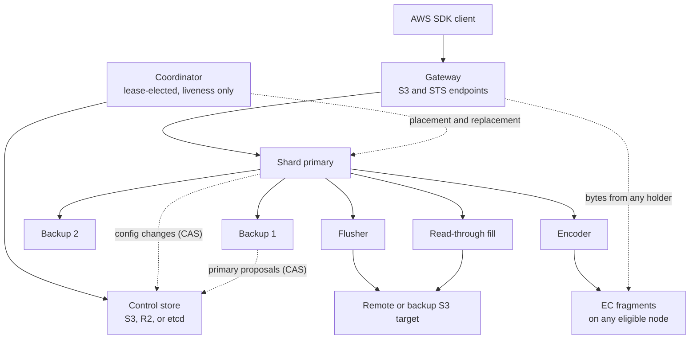
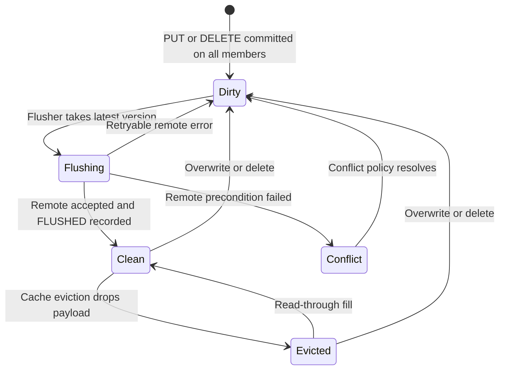
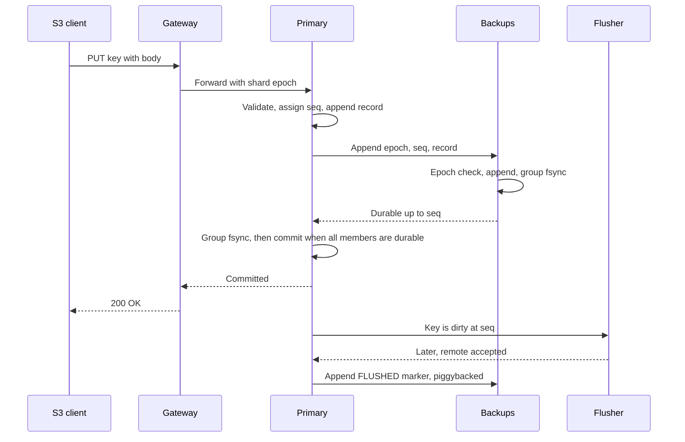
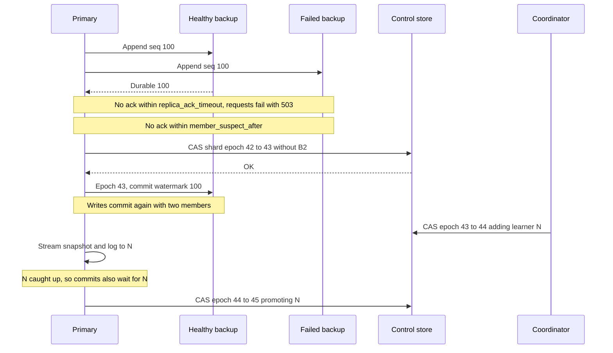
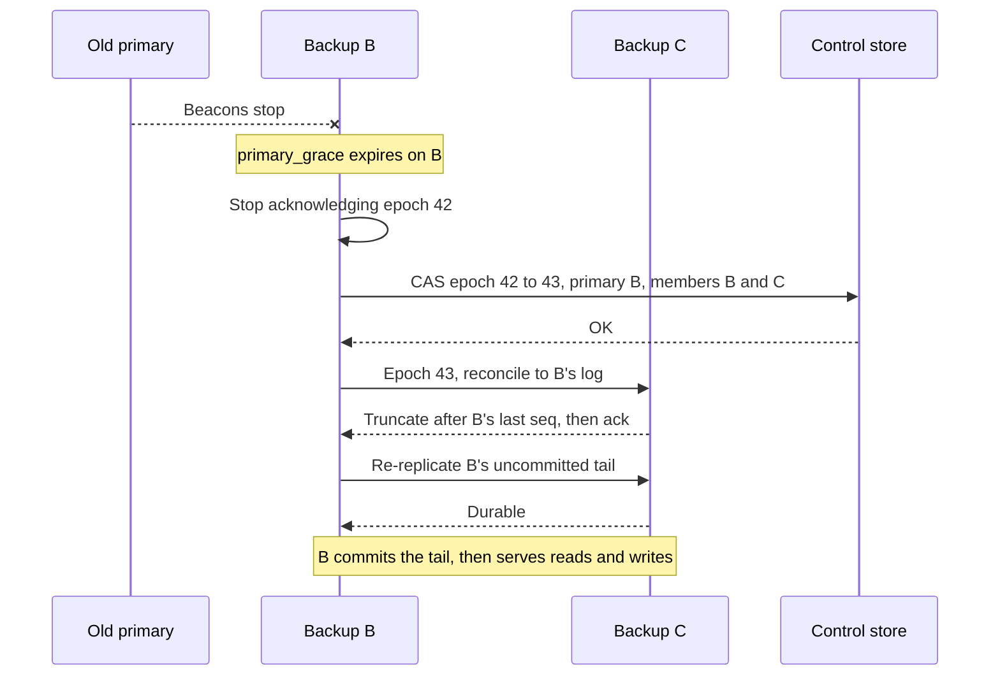
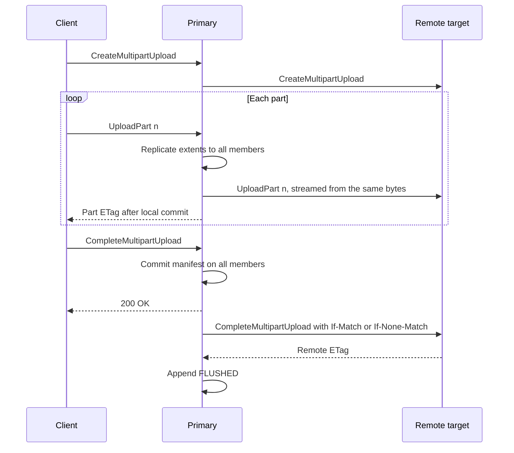
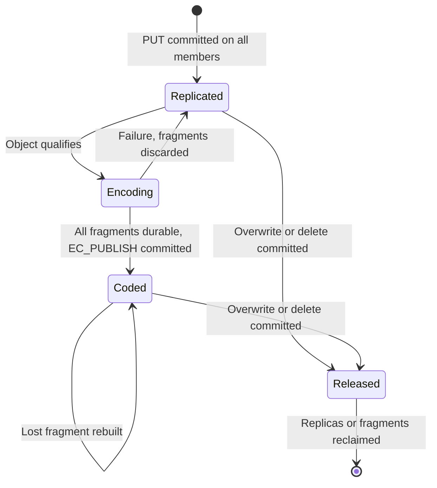

# SkyS3: Replicated S3 Cache and Object Store Design

**Status:** Proposed, for review
**Date:** 2026-09-22
**Supersedes:** the architecture proposal in [skys3/skys3#2](https://github.com/skys3/skys3/pull/2)
**Scope:** S3-compatible storage cluster in Rust whose buckets are either write-back caches in front of remote S3 targets or local, erasure-coded object storage

## Contents

- [1. Context and summary](#1-context-and-summary)
- [2. Goals, non-goals, and assumptions](#2-goals-non-goals-and-assumptions)
- [3. Architecture](#3-architecture)
- [4. Data model](#4-data-model)
- [5. Shard replication: all members acknowledge](#5-shard-replication-all-members-acknowledge)
- [6. Automatic membership without a consensus service](#6-automatic-membership-without-a-consensus-service)
- [7. Write-back flush](#7-write-back-flush)
- [8. Local buckets and erasure coding](#8-local-buckets-and-erasure-coding)
- [9. Reads, namespace, and cache management](#9-reads-namespace-and-cache-management)
- [10. Node storage engine](#10-node-storage-engine)
- [11. S3 surface and workload identity](#11-s3-surface-and-workload-identity)
- [12. Security](#12-security)
- [13. Failure matrix](#13-failure-matrix)
- [14. Illustrative configuration](#14-illustrative-configuration)
- [15. Rust dependencies](#15-rust-dependencies)
- [16. Testing and acceptance](#16-testing-and-acceptance)
- [17. Delivery plan](#17-delivery-plan)
- [18. Alternatives considered](#18-alternatives-considered)
- [19. Open questions and risks](#19-open-questions-and-risks)
- [References](#references)

## 1. Context and summary

SkyS3 is an S3-compatible storage cluster. Each bucket runs in one of two main modes, which share the same write path, replication, and membership machinery:

- **Write-back buckets** sit in front of a remote S3 target. Clients get local latency for reads and writes. The remote target is the system of record: every write is flushed to it asynchronously, and local copies of flushed data are cache.
- **Local buckets** keep their data only in the cluster. Large objects are erasure-coded in the background for space efficiency, and small objects stay replicated. A local bucket can also flush to a backup target.

The previous proposal (#2) designed SkyS3 as an authoritative object store with deferred erasure coding, Raft metadata groups, and native cross-region replication. Three review findings shaped this design:

1. Two Raft rounds per PUT cost more durable I/O than the replication scheme saved. A replicated log where every member acknowledges needs one durable round and no consensus on the request path.
2. Membership must change automatically. Operators should never have to evict, promote, or replace replicas by hand.
3. The main use case is a write-back cache, but local-only buckets must remain possible. The design covers both, so it can replace the previous proposal without Raft (section 1.3).

### 1.1 Decisions

1. **No consensus on the request path.** Each key belongs to a shard. Each shard has one primary and a small set of backups (three replicas by default). A write succeeds only after **every current member** has made it durable. If any member fails to acknowledge in time, the request fails. This is the SeaweedFS volume model[^seaweed-repl] applied to both payload and metadata.
2. **Membership changes automatically through a pluggable control store.** Every shard's configuration is one small compare-and-swap register. The first backends are S3 conditional writes (`If-Match` / `If-None-Match`)[^s3-cond], on AWS S3, Cloudflare R2[^r2-api], or any provider that passes a startup probe, and etcd[^etcd-api] for sites that prefer an on-site store. Epochs fence stale primaries. Primary leases are granted by the backups, and every node keeps a durable local copy of the control state it uses, so the data path never waits on the control store. This is the PacificA / Vertical Paxos family of designs[^pacifica][^vpaxos], with the control store as the configuration master.
3. **Replicate first, then move data to its durable home.** New writes are replicated to every shard member (3 by default). A write-back bucket then flushes to its remote target and keeps `clean_copies` local copies as evictable cache. A local bucket erasure-codes each large object in the background and keeps small objects replicated. Each object is encoded on its own, so deletes free space without a cross-node cleaner.
4. **Ordered, coalescing, conditional flush.** Each shard flushes its keys in commit order, uploads only the latest version of a key, and uses conditional requests so that out-of-band writes to the remote are detected instead of silently overwritten.
5. **Streaming flush for large objects.** Multipart parts, and large single PUTs, are streamed to the remote while the client is still uploading. The remote object becomes visible only when the local upload has committed.
6. **One durable round per small PUT.** Payload and metadata travel in a single replicated log record. A small PUT costs 3 group-committed fsyncs in one round, with no consensus round.
7. **Reads scale out.** The shard primary resolves which version is current. The bytes can come from any replica, fragment, or node-local hot cache holding that exact version.

### 1.2 Changes from the previous proposal

| Area | Previous proposal (#2) | This design |
|---|---|---|
| Role of the local cluster | Authoritative object store, plus a separate read-through cache | Per bucket: write-back cache (remote is the system of record), local store, or read-only origin cache |
| Metadata | Regional Raft groups with 5 voters | Per-shard primary/backup replication, every member acknowledges |
| Membership changes | Raft reconfiguration | CAS registers in a pluggable control store (S3, R2, etcd) plus a lease-elected coordinator, fully automatic |
| Local redundancy | 3 replicas, then deferred EC | Write-back: replicas while dirty, then `clean_copies` evictable copies. Local: replicas, then per-object EC for large objects |
| Erasure coding and cleaning | Packed segments with cross-node EC-to-EC cleaning | Per-object EC in local buckets; node-local compaction only |
| Cross-region durability | Native streaming replication over QUIC | Streaming flush to a remote or backup target, which may be another SkyS3 cluster |
| Small PUT before acknowledgement | 3 serial durable rounds, about 13 sync participants | 1 round, 3 participants |

### 1.3 Coverage of the previous proposal

With local buckets, this design covers the previous proposal's single-region feature set without Raft:

| Previous proposal (#2) | This design | Remaining gap |
|---|---|---|
| 3-replica ingest, then deferred EC | 3-replica ingest, then per-object EC for objects of at least `ec_min_object_bytes` (section 8) | Small objects stay replicated. Packing them into shared EC segments is deferred (section 19). |
| Strongly consistent regional metadata | Per-shard, all-member commit with leases (sections 5 and 6) | None |
| Survives two node failures | Any two of a shard's three replicas, or two of a stripe's fragments | A single surviving replica is read-only until replacements catch up |
| Fully on-site operation | The data path is fully on-site. Membership changes need the control store. | Sites without S3 access use etcd, or the future embedded-Raft backend (section 6.1) |
| S3 API, STS / workload identity, read-through origins | Same (sections 9 and 11) | Local versioning is deferred (section 19) |
| Native pre-completion multi-region replication | A backup target that is another SkyS3 cluster, with streaming flush (section 8.9) | A failed transfer resumes per multipart part, not per byte range |

## 2. Goals, non-goals, and assumptions

### 2.1 Goals

| Goal | How the design meets it |
|---|---|
| Low-latency, low-IOPS writes, especially small objects | One replicated log append per PUT, group commit, no consensus on the path |
| Durability of acknowledged writes before flush | Durable on every member of the shard (3 by default) before success |
| No manual membership changes | Failure detection, member removal, primary failover, replacement, and rebalancing are automatic |
| Remote S3 as system of record for write-back buckets | Ordered, conditional, idempotent flush; clean data is evictable |
| Space-efficient local-only storage | Per-object erasure coding of large objects in local buckets |
| Hot reads served locally, and read scaling | Clean cache with read-through fill; bytes served by any holder of the exact version, plus node-local hot caches |
| AWS SDK compatibility including OIDC/STS workload identity | Standard S3 wire protocol plus `AssumeRoleWithWebIdentity` |
| Client-side encryption (E2EE) | Ciphertext is stored and flushed byte for byte; no SSE or KMS |
| Upload overlaps transfer to the remote | Streaming flush of multipart parts and large PUTs |

### 2.2 Non-goals for the first release

- Multiple SkyS3 clusters writing the same remote prefix. Other clusters may attach it read-only.
- Sharing a remote prefix with other writers. Out-of-band writes are detected (section 7.2), not merged.
- Local S3 versioning APIs (`ListObjectVersions`, version-id reads). The remote bucket of a write-back bucket may have versioning enabled. Local buckets are the main reason to add versioning later (section 19).
- Packing small objects into shared erasure-coded segments, and tiering between local storage classes.
- Object Lock, S3 Select, inventory, notifications, and bucket-level replication APIs.
- Server-side encryption (SSE-S3, SSE-KMS, SSE-C). Requests for them are rejected explicitly.

### 2.3 Assumptions

- Linux on x86-64 or AArch64 with local disks that honor `fsync`.
- 3 or more storage nodes per cluster. Nodes may have different disk counts.
- Monotonic clocks whose rate drift is bounded by `ρ` (1% is assumed). Wall-clock agreement is not required.
- The control store offers a linearizable compare-and-swap per key (section 6.1): an S3 bucket with conditional writes, such as AWS S3 or Cloudflare R2, or an etcd cluster. S3 providers must pass a startup probe.
- Erasure coding needs at least 5 eligible nodes. Smaller clusters keep local buckets fully replicated.
- Remote targets of write-back buckets are reachable most of the time. SkyS3 rides through remote outages for reads of cached data and for writes up to a dirty-data budget.

## 3. Architecture



All roles run from a single binary. Every node runs the gateway and the storage engine by default, and any node can be elected coordinator.

- **Gateway.** Terminates S3 and STS HTTP, authenticates requests, routes each key to its shard primary using a cached shard map, and streams request bodies.
- **Shard replica.** Holds one shard's log records, index, and replicated or cached payload. The primary orders writes, replicates them, resolves reads, and runs the shard's flusher and encoder.
- **Fragment store.** Every node stores erasure-coded fragments for any shard's objects in node-local fragment segments (section 10.1).
- **Coordinator.** Handles placement, replacement, rebalancing, and node bookkeeping. It holds a lease in the control store. It is never on the request path, and it can never break safety, because every change it makes is a CAS.
- **Control store.** A set of CAS registers, in an S3 bucket or an etcd key prefix, holding the cluster, bucket, shard, and identity configuration. No client request touches it, and every node keeps a durable local copy of the parts it uses (section 6.2). It should be the store nearest the cluster, which need not be a data target's endpoint, and it must not be a SkyS3 bucket.

## 4. Data model

### 4.1 Buckets, targets, and shards

Each **bucket** has a mode, fixed at creation:

| Mode | System of record | After a write commits |
|---|---|---|
| `write_back` | A remote S3 target: endpoint, bucket, optional prefix, credentials | Flushed to the target; `clean_copies` local copies kept as evictable cache |
| `local` | The SkyS3 cluster | Large objects erasure-coded, small objects stay replicated, and optionally everything flushed to a backup target (section 8) |
| `read_only` | An external origin that SkyS3 does not own | Writes are rejected; reads fill a cache (section 9.5) |

Attaching a `write_back` bucket imports the remote namespace (section 9.1). Deleting a SkyS3 bucket detaches it and leaves any remote untouched.

Replication is configured per bucket, because every shard belongs to exactly one bucket:

- `replicas`: the number of shard members, and so of copies of every write until it reaches its durable home (default 3).
- `min_write_replicas`: the fewest members a shard may have and still accept writes (default 2).
- `clean_copies`: for `write_back` buckets, how many members keep a flushed object as cache, from 0 to `replicas` (default 1). More copies spread read load (section 9.2).

Each bucket has a fixed number of shards chosen at creation (`shards_per_bucket`, default 8, maximum 256). A key is assigned by `hash(bucket_id, key) mod shards`. Hash sharding avoids split and merge machinery. The cost is that LIST merges results from every shard of the bucket (section 9.4). Changing a bucket's shard count later is deferred.

Each shard has a **configuration**: an epoch, a primary, members, learners, and `min_write_replicas`. Members acknowledge every write. Learners receive the log while catching up and do not acknowledge.

### 4.2 Object states

Every key in a shard's index has one entry. In a `write_back` bucket, entries move through these states:



- **Dirty** entries carry payload on every member and are never evicted.
- **Clean** entries match the remote. At most `clean_copies` members keep the payload (default 1).
- **Evicted** entries (stubs) keep metadata only: key, size, ETag, remote ETag, remote version ID, checksums, user metadata, and tags.
- A flushed delete removes the entry from the index entirely.

Local buckets use the same replicated state for new writes, then move large objects to a coded state instead of flushing them (section 8.4).

An entry records `local_etag` (what S3 clients see), `remote_etag` (what the remote returned), and `remote_version_id` when the remote is versioned. These usually match (section 7.4).

## 5. Shard replication: all members acknowledge

### 5.1 Write path



1. The gateway sends the request to the shard primary. The request carries the shard epoch the gateway knows about. A primary that is not current rejects it with a redirect hint.
2. The primary validates the request: authorization, conditional headers against its index, signature, length, and checksums. It then assigns the next per-shard sequence number `seq` and appends one record to its local log. The record holds the key, the object metadata, and either the payload inline (up to `inline_max_bytes`) or references to extent records already streamed.
3. The primary sends the record to every member in parallel. Each member rejects appends from an epoch older than the newest one it knows, checks that `seq` follows its last record, appends, and acknowledges once a group fsync covers the record.
4. **Commit rule.** A record at `seq` in epoch `e` is committed when every member of epoch `e`'s configuration, including the primary, has acknowledged it as durable. The primary then applies it to its index and returns success.
5. Members learn the commit watermark from later appends and heartbeats, and apply committed records to their own index.

Large bodies are streamed as 1 MiB extent records, which are replicated the same way while the body arrives. The final PUT record references them. Payload and metadata never take separate durable rounds.

### 5.2 Failed writes

If any member has not acknowledged within `replica_ack_timeout`, the request fails with `503 SlowDown`. That is what "require all acks" means here.

A failed response means **not acknowledged**, not **not applied**. S3 has the same semantics for a 5xx or a timeout. The record may already be on some members. It will later either commit, when a reconfiguration removes the unresponsive member (section 6.4), or be discarded, when a new primary does not have it (section 6.6). Two rules keep this safe:

- **No reordering.** The log is strictly sequential per shard. A later committed write always supersedes an earlier failed one, so a failed PUT can never resurface over a later PUT or DELETE of the same key.
- **No holes.** A member cannot accept `seq + 1` without `seq`. While a member is unresponsive, the shard cannot commit anything until that member catches up or is removed.

Setting `replica_ack_timeout` above the time a reconfiguration takes lets requests wait through a member removal instead of failing. The default fails fast, as requested.

### 5.3 Durable I/O per small PUT

| | Previous proposal, no batching | This design |
|---|---:|---:|
| Serial durable rounds before success | 3 (intent Raft round, payload, publish Raft round) | 1 |
| Sync participants before success | about 13, up to about 23 with durable Raft apply | 3 (primary and 2 backups) |
| Consensus or control-store calls on the path | 2 Raft commits | 0 |
| Background I/O per object | EC conversion writes about 1.5x the payload, plus cleaning | Write-back: one remote PUT. Local, large objects: one encoding pass writing `(k+m)/k` × the payload. Either way, a marker record carried in a later group commit |

Group commit batches fsyncs across all shards that share a disk, so the per-object sync count falls further under concurrency. Section 16.3 defines how these counts are measured.

The cost of this model is tail latency. Every PUT waits for the slowest of the member fsyncs, and one sick member stalls its shards until it is removed. Section 6.4 bounds that stall to roughly `member_suspect_after` plus one CAS round trip.

### 5.4 Leases and strong reads

The primary serves strongly consistent reads (GET, HEAD, LIST, and conditional checks) only while it holds a **lease from every member**. Leases are carried on heartbeats and appends every `lease_renew_interval`.

- A member that acknowledges a beacon sent at primary-local time `t` grants a lease valid until `t + primary_lease`, measured on the primary's clock.
- A member does not propose a new primary until `primary_grace` has passed on its own clock since the last beacon it acknowledged. `primary_grace ≥ primary_lease × (1+ρ)/(1−ρ) + margin` (defaults: 4 s lease, 6 s grace).
- **A new primary acknowledges nothing, neither reads nor writes, until the old primary can no longer serve reads.** There are two ways to establish that:
  - *Takeover after silence.* The candidate proposes only after `primary_grace` has passed since it last granted the old primary a lease. By then that lease has expired under the drift bound. The old primary needs a lease from every member, so it has already stopped serving. The new primary can serve as soon as reconciliation (section 6.6) finishes.
  - *Planned handoff.* The old primary first stops serving reads and writes, stops renewing its leases, and sends the candidate a step-down message with its last `seq`. Only then does the candidate propose. If the step-down message does not arrive, the candidate falls back to waiting out `primary_grace`.

  Epochs alone fence the old primary's writes. The wait is for reads: without it, a gateway with a stale shard map could read an old value from the old primary after the new primary had acknowledged a newer write.

Clock assumptions affect **read linearizability** only. Write safety depends on epochs and the all-member commit rule, not on clocks. Leases come from members, not from the control store, so reads and writes continue while the control store is unreachable as long as no shard needs to change membership.

## 6. Automatic membership without a consensus service

### 6.1 The control store

The control store is a small interface, so different backends can hold the same registers:

```rust
trait ControlStore {
    /// Read a register and its version, or None if it does not exist.
    async fn get(&self, key: &str) -> Result<Option<(Bytes, Version)>>;
    /// Write only if the register is still at `expected`, or still absent.
    async fn put_if(&self, key: &str, expected: Expected, value: Bytes) -> Result<PutOutcome>;
    /// List registers under a prefix, for bootstrap and recovery.
    async fn list(&self, prefix: &str) -> Result<Vec<(String, Version)>>;
    /// Stream changes after a generation, from a native watch or by polling.
    async fn changes(&self, after: Generation) -> Result<ChangeStream>;
}
```

`put_if` must be linearizable per key. Nothing else is required: SkyS3 needs no transactions across registers, and the coordinator lease (section 6.7) is built from `put_if` plus local timers.

| Backend | Compare-and-swap | Change notification | Status |
|---|---|---|---|
| AWS S3 | `PutObject` with `If-Match: <etag>` or `If-None-Match: *`[^s3-cond] | Poll `cluster.json` | First release |
| Cloudflare R2 | The same headers, listed as supported on `PutObject`[^r2-api] | Poll `cluster.json` | First release, subject to the probe |
| Other S3-compatible stores | The same headers | Poll `cluster.json` | Only if the probe passes |
| etcd v3 | A transaction that compares the key's `mod_revision`[^etcd-api] | Native watch | First release |
| Embedded Raft on SkyS3 nodes | Compare-and-swap applied from the Raft log | Push | Future, for air-gapped sites |

etcd and embedded Raft are consensus systems themselves. They need no external service, but if a majority of their voters is lost permanently, recovering them needs an operator. An S3 or R2 backend has no voters to lose, but its provider must be reachable for membership to change (section 6.10).

Every backend uses the same register layout:

```text
<cluster-prefix>/
  cluster.json                  cluster id, format version, generation, global settings
  coordinator.lease             coordinator lease register
  nodes/<node-id>.json          node registration: address, failure domain, disks
  buckets/<bucket>.json         bucket mode, target binding, shard count, replication settings
  shards/<bucket>/<n>.json      shard configuration register
  identity/                     OIDC providers, roles, trust and session policies
```

**S3 backends.** Registers are objects in a control bucket. They are updated with `PutObject` and `If-Match: <etag>`, or created with `If-None-Match: *`. A precondition failure (412) means someone else won. A `409 ConditionalRequestConflict` means a concurrent conditional write was in progress, and the caller retries after re-reading[^s3-cond]. At startup, each node probes an S3 control store: it races two conditional writes on a scratch key, requires exactly one to succeed, and checks read-after-write consistency. A store that fails the probe is refused.

**Lost responses.** Each write includes a unique `proposal_id` in the value. If a response is lost and the retry fails its precondition, the proposer re-reads the register. If the register contains its own `proposal_id`, the write succeeded. This applies to every backend.

An example shard register:

```json
{
  "bucket_id": "b-7f3a",
  "shard": 5,
  "epoch": 42,
  "primary": "node-3",
  "members": ["node-3", "node-7", "node-9"],
  "learners": [],
  "min_write_replicas": 2,
  "replicas": 3,
  "proposal_id": "01J8Z6K3V2Q4"
}
```

#### Traffic and latency

**No client request reads or writes the control store.** Routing, leases, commits, and reads all stay inside the cluster. The control store sees background traffic, plus bursts when membership changes:

| Activity | Control-store requests | Effect of a 100 ms round trip |
|---|---|---|
| Any client request | 0 | None |
| Primary leases | 0 (granted by backups, section 5.4) | None |
| Coordinator lease renewal | 1 conditional PUT every `coordinator_lease / 3` | None while renewal fits well inside the lease |
| Configuration propagation (section 6.2) | S3 backends: 1 conditional GET per node every `config_poll_interval`, usually `304 Not Modified`. etcd: a watch. | None |
| Member removal or primary takeover | 1 CAS per affected shard | Adds about 1–2 round trips to a failover dominated by `member_suspect_after` or `primary_grace` |
| Member replacement | 2 CAS per shard (add learner, promote) | None on writes; promotion does not pause commits (section 6.7) |
| Node restart with an intact local copy | 0 for shards whose membership did not change | None |
| Node restart without a local copy | 1 GET per register it needs, issued in parallel | Proportional to register count ÷ parallelism |

Losing a node generates a burst of CAS requests: one per shard the node belonged to, for example about 240 in a 20-node cluster with 1,600 shards. Issued in parallel, the burst adds well under a second. It stays far below S3 per-prefix request limits.

**Placement.** The control store does not have to use the data targets' endpoint or region. Put it in the region or endpoint nearest the cluster, even when the data targets are far away. Its latency only affects failover time, and its availability only affects membership changes. An R2 control store can serve a cluster whose buckets are all `local`, with no remote data at all.

### 6.2 Local copies of control state

The control store holds **only cluster control state**. Object metadata lives in each shard's index on every shard replica (section 9.1). The remote targets hold the objects and their S3 metadata.

Every node also keeps a durable local copy of the control state it uses:

| State | Local copy | Kept current by |
|---|---|---|
| Configuration of each shard the node belongs to | A `CONFIG` record in that shard's log (section 10.1) | The replica appends it, and group commit makes it durable, before the replica acts on the new epoch |
| Shard map used by the gateway for routing | Node-local index, with each shard's epoch | Redirect hints from shard replicas, and coordinator pushes |
| Bucket bindings, identity and trust configuration, node registry | Node-local index, tagged with a configuration generation | Coordinator pushes, plus polling of `cluster.json` |

**Propagation.** Every control-store change the coordinator makes also increments the generation number in `cluster.json`, and the coordinator pushes the change to every node. As a backstop, each node polls `cluster.json` every `config_poll_interval` with `If-None-Match: <etag>`, and refetches changed objects only when the generation moves.

**Stale routing.** A shard replica that is not the current primary rejects a forwarded request with its current configuration (epoch, primary, members). The gateway updates its shard map from that hint and retries, without touching the control store. It reads the shard register directly only if no member of the configuration it knows answers.

**The control store is the authority; local copies are caches.** Membership changes are CAS operations against the control store's current version, so there is exactly one place where competing changes are ordered. A stale local copy cannot cause an incorrect commit, because every data-path message carries an epoch and members reject old ones (rule R2 in section 6.3). The worst a stale copy costs is a redirect.

What the local copies make possible:

- **Restart while the control store is unreachable.** On restart, a replica loads each shard's latest `CONFIG` record and resumes. A shard whose membership did not change while the node was down resumes serving without contacting the control store. A shard whose membership did change is fenced by epochs, because the other members reject the stale configuration, until the node can read the current register.
- **STS during a control-store outage.** STS keeps validating tokens with the cached trust configuration and roles. A revocation made in the control store during the outage cannot reach the node, so new session issuance fails closed once the cached identity configuration is older than `identity_max_staleness`. Sessions already issued stay valid until they expire.
- **Rebuilding a lost control store.** If the control bucket is lost, a replacement can be rebuilt from the newest `CONFIG` record of every shard plus the cached bucket and identity configuration. Rebuilding is a deliberate operator action (section 6.9). Doing it automatically could let two clusters claim the same prefix.

### 6.3 Configuration rules

A new configuration always has epoch `e+1` and is written with CAS over configuration `e`. Four kinds of change exist:

| Change | Who proposes | Precondition |
|---|---|---|
| Remove a member | Current primary, or the coordinator | Member unresponsive for `member_suspect_after`, or the coordinator's placement decision |
| Take over as primary | A member of `e`, for itself only | `primary_grace` has passed since it last granted the primary a lease, or the primary has stepped down (section 5.4) |
| Add a learner | Coordinator | Placement rules allow the node |
| Promote a learner to member | Current primary | The primary already requires the learner's acknowledgements, and the learner is durable up to the commit watermark (section 6.7) |

Three rules carry the safety argument (section 6.8):

- **R1.** A configuration with a new primary can be written only by that new primary. It must have been a member (not a learner) of `e`, and before it proposes it must stop acknowledging epoch-`e` appends and stop granting leases.
- **R2.** Every member rejects appends stamped with an epoch older than the newest one it has seen.
- **R3.** A learner becomes a member only after it holds every committed record.

### 6.4 Member failure



Records that were pending when the member failed commit under the new epoch, because every remaining member has them.

If removing a member would leave fewer than `min_write_replicas` members, the removal still happens, so the shard stays readable. The shard rejects writes until a learner is promoted.

The default `min_write_replicas = 2` with `replicas = 3` means a shard keeps accepting writes after losing one node, with two copies of new data, and returns to three copies without anyone intervening.

### 6.5 Primary failure



If several backups propose at once, CAS picks exactly one winner. The losers read the new register and follow it. Candidates may add a small random delay that shrinks as their durable `seq` grows, so the member with the longest log usually wins. That preference is not needed for safety.

If only one member survives, it can still take over. Every committed record is on every member, so a single survivor holds the full committed history. That is the main durability advantage of all-member commit over majority quorums. The shard stays readable, and becomes writable again once enough learners have caught up.

A deposed primary finds out on its next CAS attempt or on its next rejected append, and then stops serving.

Planned handoffs, used for rebalancing, follow the step-down path in section 5.4, so they do not wait for `primary_grace`.

### 6.6 Reconciling logs after a primary change

The new primary's log is authoritative for the new epoch:

1. It collects each member's last `(epoch, seq)`.
2. Members truncate records past the new primary's last `seq`. These were never committed, because committing requires the new primary's acknowledgement. The shared per-disk log is not physically truncated. A `TRUNCATE(shard, epoch, seq)` record invalidates them (section 10.1).
3. The new primary re-replicates its own uncommitted tail to every member, commits it, and then accepts new writes.

The uncommitted tail is **rolled forward**. Clients that received a 503 for those writes may find them applied. Section 5.2 allows exactly that.

### 6.7 Placement, replacement, and node lifecycle

The coordinator holds `coordinator.lease`. It renews every `coordinator_lease / 3` with `If-Match`. A candidate takes over only after it has observed the same lease ETag for longer than `coordinator_lease × (1+ρ)`, measured on its own monotonic clock. No clock comparison between nodes is needed.

Every change the coordinator makes is a CAS, so two nodes that briefly both believe they are coordinator can only compete. They cannot corrupt state.

The coordinator:

- Tracks node health from heartbeats it receives directly. This is advisory only. Shard failover never depends on it.
- **Replaces** lost members. It adds a learner on an eligible node that respects failure-domain separation and capacity. The primary streams a snapshot of the shard index plus dirty payload, then the live log. Clean payload of write-back buckets is not copied, because the new member can fetch it from the remote if needed. Replicated objects of local buckets are copied. Coded objects are not, because their fragments live outside the shard (section 8.6).
- **Promotes** caught-up learners **without pausing commits**. Once a learner is close to the log head, the primary adds it to the set of acknowledgements every new commit waits for. When the learner is durable up to the commit watermark, it holds every committed record, and the primary CASes the promotion. Commits keep flowing during the CAS and only wait for the learner's LAN acknowledgement. The control-store round trip is never on the write path. Requiring an extra acknowledgement never weakens the commit rule. If the CAS fails, the primary re-reads the register and either retries or stops waiting for the learner.
- **Rebalances** shards and primaries across nodes, including newly joined ones, with add-learner, promote, remove steps. Primaries are moved by planned handoff: the current primary steps down and the target member proposes itself (section 5.4 and rule R1).
- **Re-admits** returning nodes. A node that was removed from a shard rejoins only as a learner. Its old records for that shard may seed catch-up after their `(epoch, seq)` prefix is verified, and are otherwise discarded.
- **Forgets** nodes that stay unreachable for `node_forget_after`, after re-homing their shards.

Joining a new node is a provisioning action: the node starts with valid credentials and registers itself. Every membership decision after that is automatic.

### 6.8 Safety argument (sketch)

- **Committed records survive.** A committed record is durable on every member of its epoch (commit rule). R3 extends this to every later member, and R1 guarantees any new primary was a member. Committed data is lost only if every member of a shard loses its disk before the data reaches its durable home.
- **One writer per epoch.** Committing in epoch `e` needs every member of `e`. When a member takes over, it first stops acknowledging `e` (R1). The CAS on the register serializes competing proposals, and R2 fences stragglers. A deposed primary therefore cannot commit anything after the takeover begins. A member removal leaves the primary unchanged and only shrinks the set whose acknowledgements are required.
- **Linearizable reads.** A primary serves reads only while every member's lease is valid. A new primary acknowledges nothing until the old primary has either stepped down or lost its lease from the new primary (section 5.4). So no read at the old primary can follow a write acknowledged by the new one.
- **Promotion keeps R3.** A learner is promoted only while every commit already waits for it and it has everything up to the commit watermark. Nothing commits in between without it.
- **Stale coordinators and stale local copies are harmless.** Every register update is a CAS, and every data-path message carries an epoch (section 6.2).

This protocol is PacificA's[^pacifica] with a control-store register as the configuration manager. Vertical Paxos[^vpaxos] gives the general correctness argument for this design family. The state machine will be model-checked before implementation (section 16.1).

### 6.9 What still needs a human

- **Provisioning hardware.** Adding and physically retiring machines. Membership changes that follow are automatic.
- **Loss of the control store.** Bucket deleted, credentials revoked, or a provider that stops honoring conditional writes. The data path keeps running from local copies (section 6.2), but no membership change can happen until the store is restored, or an operator rebuilds it from the nodes' local copies.
- **Flush conflicts under the `hold` policy** (section 7.2).
- **Loss of a majority of voters** in an etcd or embedded-Raft control store.
- **Every member of a shard lost.** Data that had not reached its durable home is lost, and SkyS3 reports exactly which keys. For a local bucket, the shard's index is lost too. Coded objects can be re-indexed from their fragment headers (section 8.4) by an operator-run recovery.

### 6.10 Control-store outages and the choice of referee

Local copies (section 6.2) let a cluster run **indefinitely** without its control store, not just for a grace period, as long as no shard needs a membership change. Reads, writes, flushing, encoding, and fragment repair all continue. STS is the one bounded exception (`identity_max_staleness`).

What cannot happen without the control store is a membership change. If a node fails while the control store is unreachable, every shard that includes the node stops accepting writes at once, and stops serving reads when its leases lapse (about `primary_lease`). The shards recover automatically once the control store is back.

Local copies cannot remove that dependency, because the problem is agreement, not information. Take a shard with members A, B, and C. Two properties would both be useful:

1. **Survive the loss of one member without the control store**, by letting the two surviving members agree on the next configuration.
2. **Let a single survivor take over automatically**, with the control store as referee.

They are incompatible. Under property 1, A and C may agree to drop B. Under property 2, B may at the same time get the control store to accept B alone. The two decisions have no participant in common, so nothing prevents both, and the shard would have two primaries.

This design chooses property 2: the control store is the only referee. The exposure is a node failure during a control-store outage, which is roughly the store's unavailability per node failure. Sites that cannot accept that use a control store that runs on-site: etcd now, or embedded Raft later.

## 7. Write-back flush

### 7.1 Ordering and coalescing

Each shard primary runs a flusher over committed records in `seq` order:

- **Per-key order is preserved.** Each key has at most one flush in flight. If a newer version commits while an older one is being flushed, the newer version is flushed next, conditioned on the ETag the older flush produced.
- **Intermediate versions are coalesced.** Only the latest committed state of a key is flushed. If that state is a tombstone, the flusher issues `DeleteObject`.
- **Keys flush concurrently**, with adaptive concurrency per shard between `flush_min_concurrency_per_shard` and `flush_max_concurrency_per_shard` (section 7.7). Remote observers may see writes to different keys in a different order than they were committed. SkyS3 does not provide a cross-key snapshot at the remote.
- When the remote accepts, the primary appends a `FLUSHED(key, seq, remote_etag, remote_version_id)` record. The record is piggybacked on the next group commit and never triggers an fsync of its own. If it is lost in a crash, the key is flushed again. The retry is idempotent (section 7.2).

### 7.2 Conditional flush and ownership conflicts

SkyS3 assumes it **exclusively owns** the remote prefix. Every flush is conditional, so a violation of that assumption is detected:

| Local knowledge | Flush request |
|---|---|
| Key absent at the remote (imported namespace or earlier delete) | `PutObject` with `If-None-Match: *` |
| Key present with a known `remote_etag` | `PutObject`, `CompleteMultipartUpload`, or `DeleteObject` with `If-Match: <remote_etag>` |
| Remote state unknown, because the key was written locally before the import reached it (section 9.1) | `HeadObject` first, then one of the rows above |

**Write identity.** Every object SkyS3 writes to a remote carries a write identity in its user metadata: `x-amz-meta-skys3-wid: <cluster>/<bucket>/<shard>/<epoch>.<seq>`. It names exactly one committed local write. SkyS3 strips it from responses to its own clients, and reserves its size (at most 96 bytes) out of the 2 KiB user-metadata limit it enforces. Other readers of the remote bucket can see it.

On 412, the flusher HEADs the remote object. If the object carries the write identity being flushed, an earlier attempt succeeded and only its response was lost, so the flush is recorded as done. A matching checksum and size are not enough: another writer could upload identical bytes with different metadata or tags. For a delete, a 412 followed by a HEAD that finds no object means the delete already happened. Anything else puts the key in **conflict**, and `flush_conflict_policy` decides what happens:

- `hold` (default). The key stays dirty and is not flushed. The conflict is reported through metrics and the admin API. Local reads keep returning the local version.
- `overwrite`. Flush unconditionally. Local writes win.
- `discard_local`. Adopt the remote version and drop the local one. This loses acknowledged writes, so it must be opted into per bucket.

Conditional-write support differs by provider and operation. When a target is attached, SkyS3 probes which of `PutObject`, `CompleteMultipartUpload`, and `DeleteObject` honor preconditions. Cloudflare R2, for example, lists conditional headers on `PutObject` but not on the other two[^r2-api]. Operations without support are sent unconditionally, so an out-of-band write to that key can be overwritten silently. The bucket's status lists which operations are unprotected.

### 7.3 Streaming flush for large objects

For multipart uploads, and for single PUTs of at least `streaming_flush_min_bytes`, data is sent to the remote while the client uploads:



- Each remote part is streamed from the incoming body and also from the local extents, so a slow remote falls back to reading local data instead of holding memory. A part that fails local validation is never listed in the remote Complete call. A client's re-upload of that part replaces it at the remote too.
- The remote object appears only after the local commit and the remote `CompleteMultipartUpload`. No partial object is ever visible there.
- The remote `CreateMultipartUpload` carries the write identity, so the completed object has it.
- Remote multipart upload IDs are stored in the shard log. If the local upload is aborted, or a remote upload is orphaned, the flusher calls `AbortMultipartUpload`. The remote bucket should also have an abort-incomplete-uploads lifecycle rule as a backstop.
- A large single PUT is streamed as a remote multipart upload with `flush_part_bytes` parts. Its `remote_etag` then differs from the MD5 `local_etag` that clients see (section 7.4).

### 7.4 ETag and checksum fidelity

- A single PUT flushed as a single PUT gets the same MD5 ETag locally and at the remote.
- A multipart upload is flushed with the client's exact part boundaries, so the remote multipart ETag equals the local one.
- Client checksums (`x-amz-checksum-*`, `Content-MD5`) are stored and forwarded on flush, so the remote verifies the same bytes end to end. Ciphertext is never transformed.

### 7.5 Write-through buckets

A bucket may set `ack_policy = "write_through"`. A PUT then succeeds only after the local commit **and** the remote flush. Every acknowledged write is already at the remote, so losing the local cluster loses no acknowledged data (zero RPO). The cost is at least one remote round trip on every write, plus transfer time. Streaming flush (section 7.3) hides the transfer time for large objects, but not the final round trip. Reads still benefit from the cache.

### 7.6 Backpressure and loss exposure

- A dirty-data budget applies per bucket and per cluster (`max_dirty_bytes`). New writes get `503 SlowDown` when it is exhausted, including during a remote outage.
- Loss exposure (RPO) with `ack_policy = "local"` is the dirty set of any shard whose members are all lost together. The metrics `dirty_bytes`, `oldest_dirty_age`, and `flush_lag_seconds` measure it.
- Flush bandwidth must exceed the ingest rate over time, or the dirty set grows until admission control stops writes. Remote request-rate limits (for example per-prefix limits) are handled with adaptive concurrency and retry with backoff.

### 7.7 High-latency remote targets

Remote targets may sit behind a slow link, for example a 100 ms round trip. That latency never reaches local writes with `ack_policy = "local"`, but it bounds flush throughput and shows up wherever a request has to wait for the remote:

| Path | Effect of round trip `RTT` | Mitigation |
|---|---|---|
| Local writes, `ack_policy = "local"` | None | |
| Small-object flush throughput | About `concurrency ÷ RTT` requests per second per shard | Adaptive concurrency sized from the bandwidth-delay product |
| Large-object flush | Transfer overlaps the client upload | Streaming flush (section 7.3) |
| Write-through PUT | At least one `RTT` per write | Use only on buckets that need zero RPO |
| Cache miss | At least one `RTT` before the first byte | Cache sizing, fill coalescing |
| Namespace import | 1,000 keys per `RTT` per listing stream | Parallel import by key range (section 9.1) |

Flush concurrency adapts per target. It grows additively while throughput rises and latency stays near the target's base round trip, and it shrinks multiplicatively on `503 SlowDown` or rising latency. The ceiling, `flush_max_concurrency_per_shard`, together with `flush_max_inflight_bytes_per_target`, keeps enough requests in flight to fill the link: roughly `bandwidth × RTT ÷ average object size`. For example, 8 shards at 64 requests each keep 512 small-object PUTs in flight. At a 100 ms round trip that is about 5,000 PUTs per second per bucket, before the target's own rate limits apply.

## 8. Local buckets and erasure coding

A `local` bucket is its own system of record. It uses the same write path as a `write_back` bucket (section 5): every write is durable on every shard member before it is acknowledged. What changes is where data goes afterwards.

### 8.1 Durable homes by bucket mode

| | `write_back` bucket | `local` bucket |
|---|---|---|
| Until the object is moved | `replicas` copies on the shard members | The same |
| Durable home | The remote target | Small objects: the shard members. Large objects: erasure-coded fragments. |
| Local copies afterwards | `clean_copies` evictable copies | Small objects: `replicas` copies. Large objects: `k + m` fragments per stripe, no replicas. |
| Final local space | About `clean_copies` × size, evictable | `replicas` × size for small objects, `(k+m)/k` × size for large ones |

Both modes use one mover. The shard primary walks committed records. For each object, it moves the object to its durable home, records the result in a replicated log record, and only then drops the replicas that are no longer needed.

### 8.2 What gets encoded, and when

A committed object in a `local` bucket is encoded when all of these hold:

- it is at least `ec_min_object_bytes` (default 4 MiB), so each data fragment of a 4+2 stripe is at least 1 MiB,
- it has been committed for `ec_after_seconds` (default 600), so short-lived objects are usually deleted before anything is encoded,
- the cluster has at least `min_eligible_nodes` (default 5) eligible nodes.

An object is encoded as a sequence of stripes of up to `ec_stripe_data_bytes` (default 64 MiB) of data. Each stripe is placed independently, so a very large object spreads across the cluster. Smaller objects stay replicated at `replicas` copies. They usually hold a small share of the bytes (section 19).

### 8.3 Geometry and placement

Count eligible **nodes**, not disks, and put at most one fragment of a stripe on a node. With the default two parity fragments:

| Eligible nodes | Geometry for new stripes | Space | Nodes left outside a stripe |
|---|---|---:|---|
| 3–4 | None; large objects stay replicated | 3x | n/a |
| 5–6 | 3+2 | 1.67x | 0–1 |
| 7–8 | 4+2 | 1.5x | 1–2 |
| 9–10 | 6+2 | 1.33x | 1–2 |
| 11 or more | 8+2 | 1.25x | 1 or more |

Two parity fragments survive any two node losses, the same failure budget as three replicas. A stripe with a spare node outside it can be repaired onto a new failure domain right away. A 5-node cluster has no spare, so repair waits for a replacement node.

Fragments may land on any eligible node, not only the shard's members. Placement follows failure domains and free space. Each stripe records its geometry, codec ID, and fragment locations, and these are never recomputed from the current cluster size. Growing the cluster changes only new stripes. Rebalancing moves fragments with the same publish-before-retire steps as encoding.

### 8.4 Encoding: publish before retire



1. The primary's encoder reads the object from its local replica and encodes it stripe by stripe with a systematic Reed-Solomon code (`reed-solomon-simd`[^rs-simd] behind a versioned `EcCodec` interface).
2. It writes each fragment to its target node. The node appends the fragment to a fragment segment, fsyncs it, and acknowledges with a fragment ID. A fragment's header holds the bucket, key, version identity, stripe number, and object metadata. So if a shard's index is ever lost, coded objects can be re-indexed from their fragments.
3. Once every fragment of every stripe is durable, the primary commits an `EC_PUBLISH` record with the geometry and fragment locations. Like any write, it commits only when every member has it.
4. After that, each member drops its replicated copy of the object.

A crash before step 3 leaves the replicas authoritative, plus some unreferenced fragments. Fragment nodes reclaim such fragments after `fragment_orphan_after_seconds`, once the shard primary confirms that no `EC_PUBLISH` references them. A crash after step 3 leaves extra replicas, which the members drop on recovery. There is never a moment when neither representation is complete.

If the object is overwritten or deleted while it is being encoded, the `EC_PUBLISH` is dropped when it is applied, because it names a version that is no longer current. Its fragments become orphans.

### 8.5 Reads of coded objects

The read plan (section 9.2) lists the fragment nodes for the requested range. The code is systematic, so a healthy read fetches only the data fragments that cover the range, with no decoding. If a fragment is missing or fails its checksum, the gateway reads any `k` fragments of that stripe and decodes the needed range.

### 8.6 Repair

When a node is lost, each shard primary uses its per-shard index from node to fragments to find the stripes that had a fragment there. For each stripe, it reads `k` surviving fragments, rebuilds the missing one on another eligible node, and commits an `EC_RELOCATE` record. Stripes that have lost two fragments are repaired first. Repair bandwidth is capped per node (`repair_bytes_per_second_per_node`).

Repair is automatic and follows the same publish-before-retire rule as encoding. It costs `k` fragment reads per rebuilt fragment. That is the price of keeping data only locally: a lost node's coded data must be rebuilt, because there is no remote copy to fetch.

### 8.7 Overwrites, deletes, and space reclamation

An overwrite or delete commits like any other write. The superseded version's fragments are then released with an `EC_RELEASE` record. Fragment nodes keep released fragments for `fragment_release_delay_seconds`, so reads already holding the old read plan can finish, and then mark them dead.

Dead fragments are reclaimed by node-local compaction of fragment segments (section 10.3). Fragment locations inside a node never appear in shard metadata, so no stripe is ever re-encoded and there is no cross-node cleaner. That is the difference from the previous proposal's packed segments, where deleting one object meant rewriting a shared stripe across nodes.

Local buckets support lifecycle expiration rules and cleanup of abandoned multipart uploads. Each shard primary evaluates them over its index, and expirations commit as ordinary deletes.

### 8.8 Space and I/O

For a large object of size `B` in a 4+2 geometry:

| Phase | Writes | Space held |
|---|---:|---:|
| Foreground, every member acknowledges | `3B` | `3B` |
| Encoding | `1.5B` more, plus a `1B` read | `4.5B` briefly |
| After the replicas are dropped | | `1.5B` |

For example, if 95% of bytes are in objects of at least 4 MiB, the overall footprint is about `0.95 × 1.5 + 0.05 × 3 ≈ 1.58x`, versus 3x with replication alone.

Encoding runs off the request path, in large sequential writes. The small-PUT cost of one durable round with three participants (section 5.3) is unchanged.

### 8.9 Backup targets and multi-cluster replication

A `local` bucket may name a `backup_target`. The flusher (section 7) then also uploads every committed change to it, with the same ordering, conditional writes, write identity, and streaming multipart flush, but nothing is evicted locally. `backup_ack` is `local` (the default, asynchronous) or `write_through`, where a write succeeds only after the backup has it.

The backup target can be any S3-compatible store, including another SkyS3 cluster's S3 endpoint. That gives cross-region replication without a separate protocol. Large uploads stream to the other cluster while the client is still uploading, and objects appear there only after the local commit. Compared with the previous proposal's native replication, one difference remains: a failed transfer resumes from the last completed multipart part, not from an arbitrary byte offset.

## 9. Reads, namespace, and cache management

### 9.1 Namespace mirror

Every shard's index holds an entry for every key in its slice of the bucket, including keys whose payload has been evicted. This makes HEAD, LIST, conditional checks, and 404 responses local and strongly consistent.

Attaching a `write_back` bucket runs a resumable **import**. The remote prefix is listed, and the primary commits an `IMPORT` record for each object: key, size, ETag, last-modified, and storage class. User metadata and content type are loaded lazily on the first HEAD or GET. The import rate is limited.

Clients can use the bucket while the import runs, so an `IMPORT` must never overwrite a newer local change. `IMPORT` records go through the shard log like any write, and applying one is conditional: it creates a stub only if the key has **no entry at all**, and is dropped otherwise. Two rules make "no entry" mean "no local change":

- A DELETE of a key with no entry still commits a tombstone while the import is running. The tombstone is kept until the import has passed that key and the delete has been flushed. A later `IMPORT` of the key finds the tombstone and is dropped, so the key is not resurrected.
- A PUT of a key with no entry creates a dirty entry whose remote state is unknown. The flusher resolves it with a HEAD before its conditional write (section 7.2).

Log order makes this deterministic: every member applies the same `IMPORT` and client records in the same order, so they all reach the same decision.

One listing stream imports at most 1,000 keys per round trip, which is about 10,000 keys per second at 100 ms. A 100-million-object bucket would take roughly three hours that way. So the import splits the key space and lists ranges in parallel (`import_parallel_streams`). It first discovers split points with delimiter listings, or by sampling keys, then lists each range with `StartAfter` up to the next split point. Each range checkpoints its last imported key, so a restart resumes where it stopped.

Until the import finishes, a local miss falls through to a remote HEAD, and LIST merges the remote listing with local entries. Afterwards, a local miss is a 404.

An optional periodic **reconciliation scan** re-lists the remote and reports differences. Under exclusive ownership there should be none.

### 9.2 GET and HEAD

1. The gateway sends the request to the shard primary, which resolves the key under a valid lease. HEAD and conditional checks are answered here.
2. For a GET, the primary returns a **read plan**: the object's version identity (`seq` and ETag), its size, and the holders of its bytes. Holders are members with a local copy, fragment nodes for coded objects, or the remote for evicted write-back objects. Holder lists are hints: a holder that no longer has the version says so, and the gateway tries the next.
3. The gateway fetches the bytes directly from the best holder. It prefers its own node-local hot cache, then the least-loaded member with a copy, then fragments, then the remote. Any holder of that exact version is correct, because a version never changes. The primary only sends metadata, so it does not become a bandwidth bottleneck.
4. A fill from the remote uses `If-Match: <remote_etag>`, plus `versionId` when the remote is versioned. Concurrent fills of the same range are coalesced. Ranges are served while the fill streams, and the filled payload becomes clean cache on up to `clean_copies` members.
5. If the fill precondition fails, the remote was changed out of band. For a clean entry, SkyS3 adopts the remote object's current metadata and retries. The remote is the system of record for clean data. The conflict is also counted.

**Hot cache.** Every node can keep recently read objects in a node-local cache (`hot_cache_bytes_per_node`), keyed by bucket, key, and version identity. It is only used for the version named in the primary's read plan, so it never serves a stale version. It spreads reads of hot objects across every gateway without adding copies inside the shard.

### 9.3 Clean copies and eviction

When a key becomes clean, `clean_copies` members keep the payload as cache, the primary first. The other members mark their copies dead. A bucket with more read load than one copy can serve raises `clean_copies`, up to `replicas`. Eviction is local LRU per node, bounded by `cache_max_bytes_per_node`, and needs no coordination.

Dirty payload is never evicted. The capacity model per node is: dirty and unencoded replicas + EC fragments + clean cache + learner catch-up reserve + filesystem overhead. Cache is reclaimed first.

For write-back buckets, repair traffic after a node is lost is therefore proportional to **metadata plus the dirty set**, not the total data volume. Local buckets also rebuild the fragments the node held (section 8.6).

### 9.4 Listing

`ListObjectsV2` (and V1) fans out to every shard primary of the bucket. Each shard returns a sorted page from its index with prefix and delimiter handling. The gateway k-way merges the pages, deduplicates common prefixes, and returns an opaque, HMAC-authenticated continuation token that holds the last key.

Each page reflects a lease-valid read on each shard. A multi-page listing is not a snapshot. The cost per page grows with `shards_per_bucket`, which is why the default is small.

### 9.5 Read-only origin buckets

A bucket can also be attached with `mode = "read_only"` to a remote prefix that SkyS3 does not own. Writes are rejected. Every GET revalidates with the origin by default (`freshness = "revalidate"`). Alternatively, a bounded-staleness TTL can be configured. There is no namespace import: LIST is forwarded to the origin. The cache key includes the origin configuration and its credential scope.

## 10. Node storage engine

### 10.1 Log segments

Each disk has append-only segment files shared by every shard replica on that disk. Group commit therefore amortizes one fsync across all of them. There are two segment classes, so that small records and bulk payload age separately:

- **hot** segments for metadata records and inline payload up to `inline_max_bytes`,
- **bulk** segments for 1 MiB extent records of large objects,
- **fragment** segments for erasure-coded fragments, which any shard's encoder may place on the node.

Record header: magic, format version, record kind, shard id, epoch, seq, key hash, header and payload lengths, and CRC32C. Record kinds are `PUT`, `DELETE`, `EXTENT`, `MPU_CREATE`, `MPU_PART`, `MPU_COMPLETE`, `MPU_ABORT`, `FLUSHED`, `TAGS`, `IMPORT`, `EC_PUBLISH`, `EC_RELOCATE`, `EC_RELEASE`, `TRUNCATE`, and `CONFIG`.

A `CONFIG` record holds a full shard configuration: epoch, primary, members, learners, and replica targets. A replica appends one, and group commit makes it durable, whenever it adopts a new epoch, before it acknowledges or serves anything in that epoch. Checkpoints keep each shard's latest `CONFIG` record reachable, so it survives log reclamation. It is the replica's local copy of its membership (section 6.2).

Parsing checks lengths before allocating, uses checked arithmetic, and rejects unknown versions. On recovery, a torn tail is cut back to the last record whose CRC verifies.

### 10.2 Index and checkpoints

A per-node `redb` database[^redb] holds:

- each shard's namespace index, keyed by `(shard, key)`, with state, ETags, checksums, metadata, and payload location,
- the node-local location map, from extent to `(segment, offset, length)`,
- each shard's applied `(epoch, seq)`,
- the node's local copy of control state: the gateway shard map, bucket bindings, identity configuration, and node registry, each tagged with its configuration generation (section 6.2).

Index updates are committed **without fsync** (`Durability::None`). A durable checkpoint runs every `index_checkpoint_interval`. After a crash, redb reverts to the last durable checkpoint, and records after the checkpointed `seq` are replayed from the log. The log is the source of truth, and only log appends are fsynced on the write path. Log segments are released only once they are behind the durable checkpoint.

### 10.3 Reclaiming space

Segments are reclaimed on each node, with no cross-node coordination, because payload locations are node-local. A segment with a low live ratio (`compaction_live_threshold`) is reclaimed as follows:

- dirty records and metadata records that are still needed are copied to a new segment,
- clean payload is **evicted instead of copied**, unless it is recently used and fits the cache budget. Cache semantics make that legal, so compaction rarely rewrites much data.
- in fragment segments, live fragments are copied and the node-local fragment map is updated. Fragment locations inside a node never appear in shard metadata, so this needs no coordination either.

### 10.4 Durability discipline

A member acknowledges a record only after `fdatasync` covers it. New segment files also get a directory `fsync`. Disk I/O runs on dedicated blocking workers, never on the Tokio reactor. A sync error takes the disk out of service, and the node reports it. It never acknowledges after a failed sync.

## 11. S3 surface and workload identity

| Surface | First release |
|---|---|
| Objects | PUT, GET, HEAD, DELETE, DeleteObjects, CopyObject, range reads, conditional requests, user metadata, tagging |
| Multipart | Create, UploadPart, UploadPartCopy, Complete, Abort, ListParts, ListMultipartUploads |
| Listing | ListObjectsV2, ListObjects V1, prefixes and delimiters |
| Buckets | Create (with a mode, and a target for `write_back`), Delete (detach), Head, ListBuckets, GetBucketLocation |
| Local buckets | Lifecycle expiration rules and abandoned-multipart cleanup (section 8.7) |
| Signing and integrity | SigV4 headers, presigned URLs, session tokens, aws-chunked bodies and trailers, SDK-default checksums (CRC32, CRC32C, CRC64NVME, SHA1, SHA256), Content-MD5 |
| Identity | STS `AssumeRoleWithWebIdentity` with OIDC trust policies, expiring session credentials |
| Rejected explicitly | SSE-S3, SSE-KMS, SSE-C, Object Lock, local versioning APIs, ACL grants other than bucket-owner-enforced |

S3 parsing and serialization use `s3s`[^s3s]. SkyS3 implements authentication, authorization, and resource limits itself.

CopyObject within the cluster copies the bytes into the destination shard. If the source is clean and in the same target, the flush uses a remote server-side `CopyObject` to save WAN bandwidth.

**Workload identity.** STS implements `AssumeRoleWithWebIdentity`[^sts-wif]. It validates the JWT signature against allowlisted issuers (discovery and JWKS fetched with bounded size and rate), and checks `iss`, `aud`, `sub`, `exp`, `nbf`, and `azp` where required, using an algorithm allowlist. It then issues `AccessKeyId`, `SecretAccessKey`, `SessionToken`, and `Expiration`. Trust policies and roles live in the control store. Each node validates against its local copy, and stops issuing new sessions once that copy is older than `identity_max_staleness` (section 6.2). Session records live in an internal, local-only system bucket that is replicated like any shard and never flushed. Session tokens are stored hashed. Secrets needed for SigV4 are held in memory with `secrecy`/`zeroize`.

Clients point both `AWS_ENDPOINT_URL_S3` and `AWS_ENDPOINT_URL_STS` at SkyS3. The SDK matrix (section 16.2) verifies that each SDK's web-identity provider honors them.

SkyS3's own credentials for remote targets and the control store come from `aws-config` providers, including web identity when SkyS3 runs as a workload. The control-store credential is scoped to the control prefix.

## 12. Security

- Clients, headers, XML, chunk framing, and keys are untrusted. XML depth, header sizes, part counts, and ranges are bounded. Canonical request bytes are kept intact for SigV4.
- Internal traffic uses mutual TLS with node identities issued by the operator's PKI. Replication, lease, and admin messages are authenticated per node and per role.
- The control store is a trust anchor. Whoever can write it can reassign shards. It gets a dedicated bucket or prefix, least-privilege credentials, and remote-side versioning for audit.
- E2EE ciphertext never leaves its original form. The service never needs decryption keys. Keys, sizes, and access patterns remain visible to SkyS3 and to the remote.
- Nodes are assumed non-malicious. No Byzantine tolerance is claimed.

## 13. Failure matrix

| Failure | Outcome |
|---|---|
| Backup slow or dead | In-flight writes on its shards fail with 503. The primary removes it after `member_suspect_after` and writes resume with 2 members. The coordinator adds a replacement. |
| Primary dead | Its shards are unavailable for about `primary_grace` plus one CAS plus reconciliation (under 10 s by default). A backup takes over and rolls the tail forward. |
| Two of three members dead | The survivor becomes primary with the full committed history. The shard is read-only until a learner catches up. |
| Whole cluster loses power | Nodes replay logs from their checkpoints and resume from each shard's latest `CONFIG` record, even if the control store is unreachable. Shards whose membership changed while a node was down are fenced by epochs until that node reads the current register. |
| Every member of a shard permanently lost | Data that had not reached its durable home is lost, and SkyS3 reports the exact keys. Clean data is refilled from the remote. Coded objects survive in their fragments and can be re-indexed by an operator-run recovery. |
| Node holding EC fragments lost | Coded objects stay readable; degraded reads decode from any `k` fragments. Shard primaries rebuild the lost fragments on other nodes (section 8.6). |
| Node fails while the control store is unreachable | Shards that include the node stop taking writes, and stop serving reads when their leases lapse, until the control store returns (section 6.10). |
| Remote target unreachable | Writes continue up to the dirty budget. Reads of cached data continue. Reads of evicted data fail. |
| Control store unreachable | Data path continues from local copies. Shards that need a membership change stay unavailable for writes (and reads after lease expiry) until it returns. STS stops issuing new sessions after `identity_max_staleness`. |
| High-latency link to the control store | Client requests are unaffected. Failover and member removal take 1–2 extra round trips per CAS. |
| Coordinator dies | Another node takes the lease. Only placement work is delayed. |
| Primary partitioned from its backups | The primary loses its leases and stops serving. A backup takes over by CAS. |
| Out-of-band write at the remote | Detected at flush (conflict policy) or at fill (clean entry adopts the remote version). |
| Disk full or sync failure | No acknowledgement is issued. Admission control engages, and the disk is taken out of service on a sync error. |
| Clock rate drift beyond `ρ` | Read linearizability is at risk. Write safety is unaffected. |

## 14. Illustrative configuration

This schema is proposed, not implemented. The values are starting points to be tuned by measurement.

```toml
[cluster]
cluster_id = "skys3-prod-a"
failure_domain = "node"

[control_store]
backend = "s3"                # "s3" (AWS S3, R2, other probed stores) or "etcd"
endpoint = "https://s3.us-east-1.amazonaws.com"
bucket = "example-skys3-control"
prefix = "skys3-prod-a/"
coordinator_lease_seconds = 10
config_poll_interval_seconds = 30

[replication]
replica_ack_timeout_ms = 2000
member_suspect_after_ms = 3000
lease_renew_interval_ms = 1000
primary_lease_ms = 4000
primary_grace_ms = 6000
assumed_clock_drift = 0.01
node_forget_after_hours = 24

[storage]
inline_max_bytes = 131072
extent_bytes = 1048576
segment_bytes = 268435456
group_commit_max_delay_us = 500
group_commit_max_bytes = 4194304
index_checkpoint_interval_seconds = 10
compaction_live_threshold = 0.5

[cache]
hot_cache_bytes_per_node = 68719476736
cache_max_bytes_per_node = 1099511627776
reserve_fraction = 0.10

[flush]
ack_policy = "local"
flush_min_concurrency_per_shard = 4
flush_max_concurrency_per_shard = 64
flush_max_inflight_bytes_per_target = 1073741824
streaming_flush_min_bytes = 67108864
flush_part_bytes = 67108864
flush_conflict_policy = "hold"
max_dirty_bytes = 2199023255552

[ec]
parity_fragments = 2
max_data_fragments = 8
min_eligible_nodes = 5
fragment_release_delay_seconds = 300
fragment_orphan_after_seconds = 3600
repair_bytes_per_second_per_node = 104857600

[buckets.defaults]
mode = "write_back"           # "write_back", "local", or "read_only"
shards_per_bucket = 8
replicas = 3
min_write_replicas = 2
clean_copies = 1
import_parallel_streams = 32
ec_min_object_bytes = 4194304
ec_stripe_data_bytes = 67108864
ec_after_seconds = 600
backup_ack = "local"

[identity]
anonymous_access = false
sts_web_identity = true
session_default_seconds = 3600
session_maximum_seconds = 3600
identity_max_staleness_hours = 24
```

## 15. Rust dependencies

| Concern | Choice | Notes |
|---|---|---|
| S3 HTTP | `s3s`, `hyper`, `http`, `bytes` | Wire adaptation only. Auth and limits are implemented in SkyS3.[^s3s] |
| Async runtime | `tokio` | Dedicated blocking pools for disk and hashing |
| Index | `redb` | Non-durable commits plus periodic durable checkpoints (section 10.2)[^redb] |
| Remote targets and S3 control store | `aws-sdk-s3`, `aws-config` | Conditional writes, multipart, credential providers[^aws-sdk-rust] |
| etcd control store | `etcd-client` | Transactions and watches |
| Erasure coding | `reed-solomon-simd` behind a versioned `EcCodec` trait | The codec ID is stored with every stripe[^rs-simd] |
| Internal transport | TCP with `rustls`/`tokio-rustls`, `prost` headers, raw payload frames | Simple on a LAN. QUIC is unnecessary without native WAN replication. |
| Identity | `openidconnect`, `jsonwebtoken` or equivalent, `secrecy`, `zeroize` | Workload-token profile with explicit `azp` handling |
| Integrity | `crc32c`, `md-5`, `sha1`, `sha2`, a CRC64NVME implementation | Checksums are validated at the protocol boundary |
| Config and observability | `serde`, `toml`, `serde_json`, `tracing`, a metrics exporter | |
| Testing | `turmoil`, `proptest`, `cargo-fuzz` | Deterministic simulation of network, disk, and clocks[^turmoil] |

`Cargo.lock` pins exact versions once license and advisory checks pass.

## 16. Testing and acceptance

### 16.1 Model and simulation

- Specify the shard protocol (commit rule, R1 to R3, leases, reconciliation) and model-check it, in TLA+ or with a Rust model checker. Check durability of committed records, a single committing primary per epoch, and read linearizability under the drift bound.
- Run the real replication and flush code under deterministic simulation. The simulated disk distinguishes written from fsynced data. The simulated S3 store supports conditional writes, delay, 5xx errors, and lost responses. Inject crashes, partitions, message loss, reordering, and clock drift. Record seeds so failures replay.
- Include planned handoffs racing gateway reads that use stale shard maps, and imports racing client PUTs and DELETEs of the same keys.
- Run one conformance suite against every control-store backend: linearizable `put_if`, lost responses, 409 retries, and watch or poll delivery.
- For erasure coding: every loss combination up to `m` fragments, crashes at each encoding and repair step, repair racing overwrites and deletes, and golden codec vectors kept across upgrades.
- Include control-store faults: long outages, 100 ms and higher round trips, lost CAS responses, and whole-cluster restarts while the control store is unreachable. Nodes must resume from their `CONFIG` records, and stale configurations must stay fenced.
- Check histories for linearizability per key at the primary. Check that every acknowledged write is either flushed, or present on a surviving member, or reported lost.

### 16.2 Compatibility

- A selected subset of `ceph/s3-tests`[^s3-tests], plus explicit tests for every rejected feature.
- AWS SDK matrix (Python, Go v2, JavaScript v3, Java v2, Rust, CLI): default checksums, aws-chunked uploads, multipart, presigned URLs, and web-identity credential refresh under load.
- Remote targets: AWS S3 and each supported S3-compatible provider. Pass the conditional-write probe, streaming flush, and conflict detection.

### 16.3 Performance

Measure on fixed hardware and against remote targets with shaped links:

- PUT p50/p99 for 1 KiB to 1 GiB objects, including fsyncs per acknowledged PUT, records per group commit, and serial durable rounds. Section 5.3's table is the claim to verify.
- Failover time distribution for primary and backup failures, and the write-unavailability window per shard, with the control store at 1 ms and at 100 ms round trips. Confirm that learner promotion adds no write stall.
- Flush lag, dirty backlog, and sustained flush throughput at target round trips from 1 ms to 150 ms. Confirm that adaptive concurrency reaches the bandwidth-delay product. Measure import rate with parallel key ranges. Streaming-flush overlap: the fraction of bytes already at the remote when the client completes.
- Cache hit rate, fill latency, and compaction write amplification.
- Read scaling: GET throughput for one hot object as `clean_copies` and the number of gateways grow.
- Local buckets: stored bytes per logical byte at the measured object-size distribution, encoding backlog, and repair time after a node loss.

## 17. Delivery plan

| Milestone | Scope | Exit criterion |
|---|---|---|
| M1 Single node | S3 core, STS, log and index, flusher, read-through, eviction, `write_back` and replicated `local` buckets, `replicas = 1` | SDK matrix passes; crash tests lose no acknowledged write; flush and fill are correct against AWS S3 and one other provider |
| M2 Replicated shards | All-member commit, epochs, leases, planned handoff, the control-store interface with S3 (AWS S3, R2) and etcd backends, member removal, primary takeover, learner catch-up | Model check and simulation pass; kill and partition tests lose no acknowledged write |
| M3 Coordinator | Placement, replacement, rebalancing, node lifecycle | Node loss and addition heal with no operator action |
| M4 Large objects | Multipart, streaming flush, write identity, conflict policies, write-through buckets, backup targets | No partial remote objects under fault injection; ETags match |
| M5 Local erasure coding | Per-object encoding, placement, degraded reads, repair, fragment compaction, lifecycle expiration | All loss combinations up to `m` fragments pass; node loss heals with no operator action |
| M6 Hardening | Conformance matrix, fuzzing, metrics, runbooks, performance | Published compatibility matrix; section 16.3 targets met or the design revised |

## 18. Alternatives considered

| Alternative | Why not the baseline |
|---|---|
| Embedded Raft (openraft or raft-rs) as the only control store | Needs no external service, but brings a consensus implementation into the first release, and losing a voter majority permanently needs an operator. Kept as a future backend behind the same interface (section 6.1). |
| FoundationDB for configuration | Same majority-loss limitation as etcd and a heavier dependency. etcd is supported as a backend instead. |
| Membership by majority vote of shard members | Survives one member loss during a control-store outage, but then a single survivor cannot take over automatically (section 6.10) |
| Majority quorum per shard (Raft per shard, as in #2) | Masks one slow replica without reconfiguring, which gives better p99. But 3 replicas tolerate only 1 failure, versus 2 with all-member commit, and every write pays consensus |
| Chain replication[^chain] | Same fault tolerance as all-member commit and lower primary bandwidth, but latency grows with chain length. Small-write latency is the priority. |
| Hedged writes (send to r+1, wait for r) | Better p99, but it is a quorum system and needs quorum-style reconciliation. Worth revisiting if measured p99 demands it. |
| Packed-segment EC (#2) | Better space for small objects, but deleting one object means re-encoding a shared stripe across nodes. Per-object EC of large objects needs only node-local compaction. Revisit if small objects hold a large share of bytes. |
| SeaweedFS with Cloud Drive and `filer.remote.sync`[^seaweed-cloud] | Existing, proven write-back to cloud storage and the strongest reuse option. Not Rust. Its metadata consistency depends on the chosen filer store, and ordered conditional flush and streaming multipart flush would need assessment. |

## 19. Open questions and risks

1. **Control-store backend per deployment.** Failover needs the control store (section 6.10). S3 or R2 suits clusters with reliable internet access. Isolated sites need etcd, or the future embedded-Raft backend.
2. **Provider support.** Which remote targets must be supported, and which operations honor preconditions on each? An S3 control store needs linearizable conditional `PutObject`. Data targets need preconditions only for conflict detection.
3. **Dirty budget and RPO.** What dirty-data volume and flush lag are acceptable, and which buckets need `write_through`?
4. **Tail latency.** All-member commit makes p99 depend on the slowest fsync. Measure before considering hedging.
5. **Hot buckets.** A bucket's write throughput is bounded by `shards_per_bucket` primaries. Resharding is deferred.
6. **Metadata size.** The namespace mirror stores an entry per remote object on every member. Very large imported buckets need capacity planning, or a later lazy-namespace mode.
7. **Versioning.** Do applications need local S3 versioning APIs? Local buckets are the strongest case. Write-back buckets would also have to flush every version in order, with coalescing disabled.
8. **Small objects in local buckets.** What share of bytes sits in objects smaller than `ec_min_object_bytes`? If it is large, packing small objects into shared EC segments may be worth its cleaner.
9. **EC thresholds.** `ec_min_object_bytes`, `ec_stripe_data_bytes`, and `ec_after_seconds` need measurement against real object sizes and overwrite rates.

## References

[^seaweed-repl]: SeaweedFS, *Replication*. "All the writes are strongly consistent and all N replica should be successful. If one of the replica fails to write, the whole write request will fail." [Source](https://github.com/seaweedfs/seaweedfs/wiki/Replication)

[^s3-cond]: AWS, *Conditional requests* in the Amazon S3 User Guide. `PutObject` and `CompleteMultipartUpload` accept `If-Match` and `If-None-Match`, and `DeleteObject` accepts `If-Match`. A failed precondition returns 412, and a conflicting concurrent operation returns `409 ConditionalRequestConflict`. These details were checked against the API model in `aws-sdk-s3` 1.149.0. [Source](https://docs.aws.amazon.com/AmazonS3/latest/userguide/conditional-requests.html)

[^pacifica]: Wei Lin, Mao Yang, Lintao Zhang, Lidong Zhou, *PacificA: Replication in Log-Based Distributed Storage Systems*, Microsoft Research, 2008. [Source](https://www.microsoft.com/en-us/research/publication/pacifica-replication-in-log-based-distributed-storage-systems/)

[^vpaxos]: Leslie Lamport, Dahlia Malkhi, Lidong Zhou, *Vertical Paxos and Primary-Backup Replication*, MSR-TR-2009-63, 2009. [Source](https://www.microsoft.com/en-us/research/publication/vertical-paxos-and-primary-backup-replication/)

[^chain]: Robbert van Renesse, Fred B. Schneider, *Chain Replication for Supporting High Throughput and Availability*, OSDI 2004. [Source](https://www.usenix.org/conference/osdi-04/chain-replication-supporting-high-throughput-and-availability)

[^seaweed-cloud]: SeaweedFS, *Cloud Drive Architecture*. "Local changes are write back by the `weed filer.remote.sync` process, which is asynchronous." [Source](https://github.com/seaweedfs/seaweedfs/wiki/Cloud-Drive-Architecture)

[^r2-api]: Cloudflare, *R2 S3 API compatibility*. The table lists `If-Match` and `If-None-Match` as supported on `PutObject`, and no conditional headers for `DeleteObject` or `CompleteMultipartUpload`. Checked in the cloudflare-docs repository source of this page. [Source](https://developers.cloudflare.com/r2/api/s3/api/)

[^etcd-api]: etcd, *API guarantees and transactions*: a transaction compares key revisions and applies atomically. [Source](https://etcd.io/docs/v3.5/learning/api/)

[^rs-simd]: Anders Trier, *reed-solomon-simd*. [Source](https://github.com/AndersTrier/reed-solomon-simd)

[^redb]: redb, README and design notes. [Source](https://github.com/cberner/redb)

[^s3s]: s3s project. [Source](https://github.com/s3s-project/s3s)

[^sts-wif]: AWS STS, *AssumeRoleWithWebIdentity*. [Source](https://docs.aws.amazon.com/STS/latest/APIReference/API_AssumeRoleWithWebIdentity.html)

[^aws-sdk-rust]: AWS, *AWS SDK for Rust Developer Guide*. [Source](https://docs.aws.amazon.com/sdk-for-rust/latest/dg/welcome.html)

[^turmoil]: tokio-rs, *turmoil*: deterministic simulation of hosts, network, and filesystem faults. [Source](https://github.com/tokio-rs/turmoil)

[^s3-tests]: Ceph, *s3-tests*. [Source](https://github.com/ceph/s3-tests)
