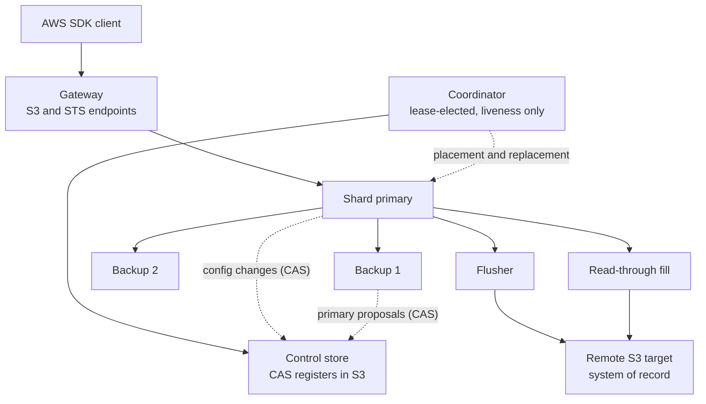
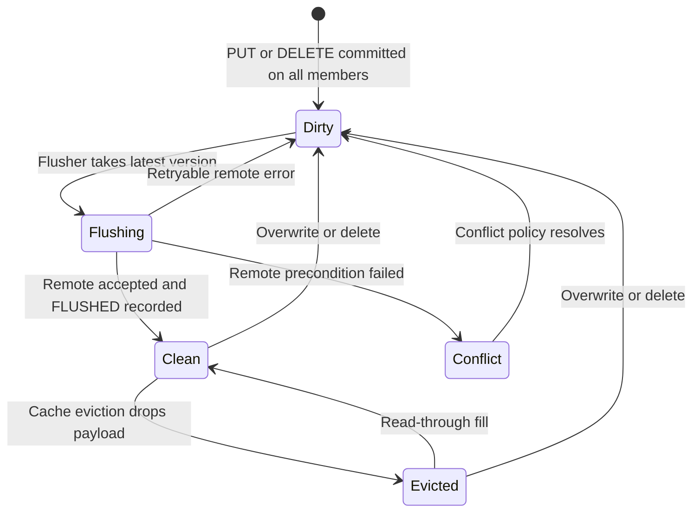
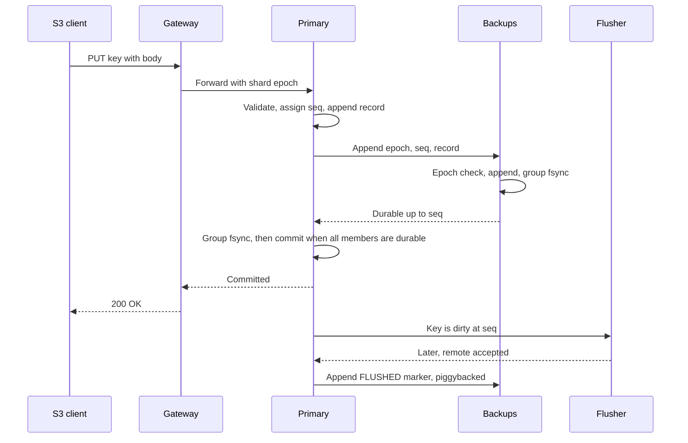
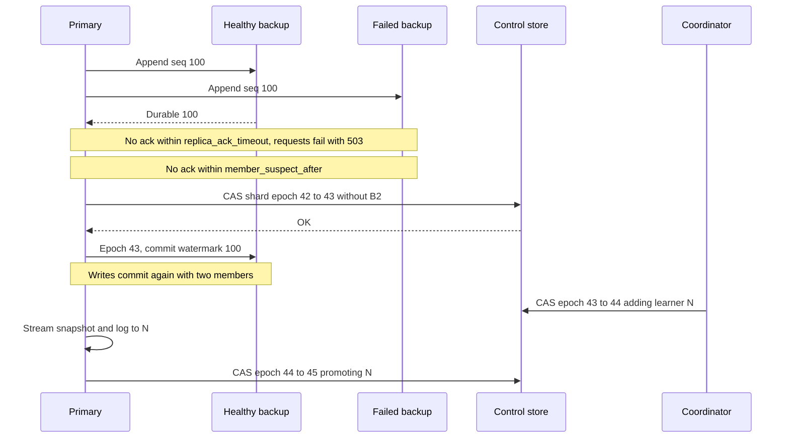
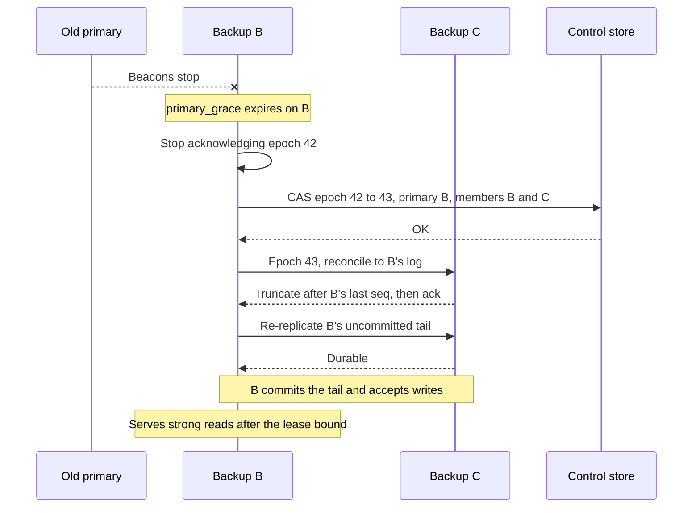
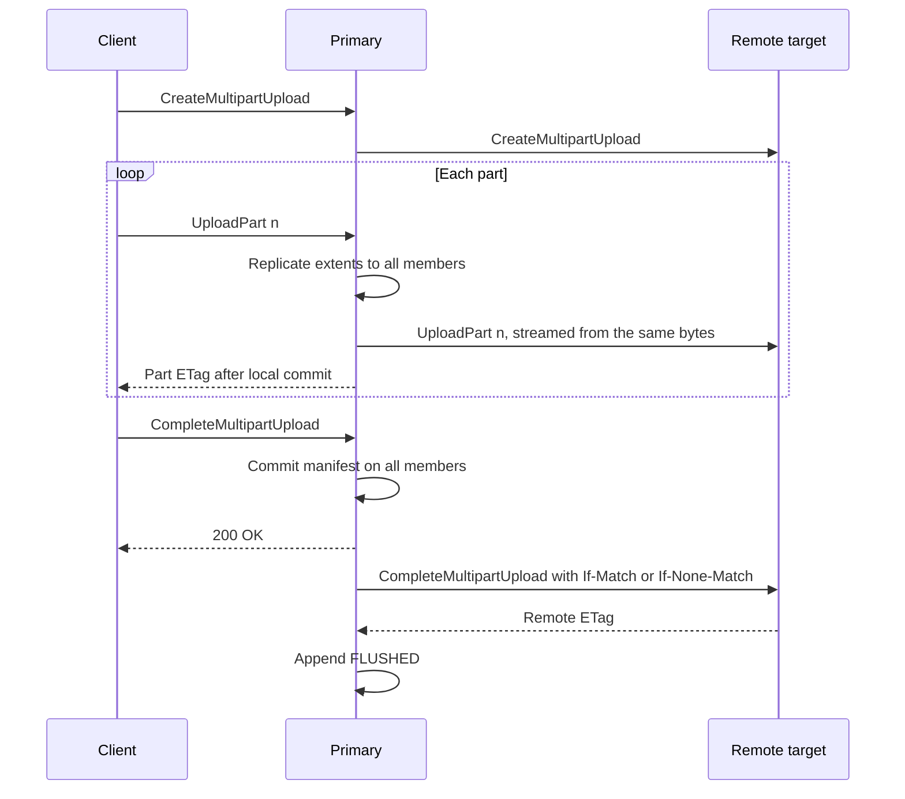

# SkyS3: Write-Back S3 Cache Design

**Status:** Proposed, for review
**Date:** 2026-09-22
**Supersedes:** the architecture proposal in [skys3/skys3#2](https://github.com/skys3/skys3/pull/2)
**Scope:** S3-compatible write-back caching cluster in front of remote S3 targets, written in Rust

## Contents

- [1. Context and summary](#1-context-and-summary)
- [2. Goals, non-goals, and assumptions](#2-goals-non-goals-and-assumptions)
- [3. Architecture](#3-architecture)
- [4. Data model](#4-data-model)
- [5. Shard replication: all members acknowledge](#5-shard-replication-all-members-acknowledge)
- [6. Automatic membership without a consensus service](#6-automatic-membership-without-a-consensus-service)
- [7. Write-back flush](#7-write-back-flush)
- [8. Reads, namespace, and cache management](#8-reads-namespace-and-cache-management)
- [9. Node storage engine](#9-node-storage-engine)
- [10. S3 surface and workload identity](#10-s3-surface-and-workload-identity)
- [11. Security](#11-security)
- [12. Failure matrix](#12-failure-matrix)
- [13. Illustrative configuration](#13-illustrative-configuration)
- [14. Rust dependencies](#14-rust-dependencies)
- [15. Testing and acceptance](#15-testing-and-acceptance)
- [16. Delivery plan](#16-delivery-plan)
- [17. Alternatives considered](#17-alternatives-considered)
- [18. Open questions and risks](#18-open-questions-and-risks)
- [References](#references)

## 1. Context and summary

SkyS3 is an S3-compatible caching layer that sits between S3 clients and one or more remote S3 targets. Clients get local latency for reads and writes. The remote target stays the system of record: every write is flushed to it asynchronously, and local copies of flushed data are disposable cache.

The previous proposal (#2) designed SkyS3 as an authoritative object store with deferred erasure coding, Raft metadata groups, and native cross-region replication. Two review findings changed the direction:

1. Two Raft rounds per PUT cost more durable I/O than the replication scheme saved. The main use case is a write-back cache, and a cache does not need an authoritative long-term local store.
2. Membership must change automatically. Operators should never have to evict, promote, or replace replicas by hand.

### 1.1 Decisions

1. **No consensus on the request path.** Each key belongs to a shard. Each shard has one primary and a small set of backups (three replicas by default). A write succeeds only after **every current member** has made it durable. If any member fails to acknowledge in time, the request fails. This is the SeaweedFS volume model[^seaweed-repl] applied to both payload and metadata.
2. **Membership changes automatically through compare-and-swap registers in the remote S3.** Every shard's configuration is one small object in a control bucket. Changes to it use S3 conditional writes (`If-Match` / `If-None-Match`)[^s3-cond]. Epochs fence stale primaries. Primary leases are granted by the backups, so the data path never waits on the control store. This is the PacificA / Vertical Paxos family of designs[^pacifica][^vpaxos], with S3 conditional writes as the configuration master.
3. **Three copies while dirty, one disposable copy after flush.** Unflushed data is replicated to every shard member. Once the remote target confirms it, SkyS3 keeps at most one local copy as evictable cache. Erasure coding, EC cleaning, and cross-node garbage collection are not needed.
4. **Ordered, coalescing, conditional flush.** Each shard flushes its keys in commit order, uploads only the latest version of a key, and uses conditional requests so that out-of-band writes to the remote are detected instead of silently overwritten.
5. **Streaming flush for large objects.** Multipart parts, and large single PUTs, are streamed to the remote while the client is still uploading. The remote object becomes visible only when the local upload has committed.
6. **One durable round per small PUT.** Payload and metadata travel in a single replicated log record. A small PUT costs 3 group-committed fsyncs in one round, with no consensus round.

### 1.2 Changes from the previous proposal

| Area | Previous proposal (#2) | This design |
|---|---|---|
| Role of the local cluster | Authoritative object store, plus a separate read-through cache | Write-back cache; the remote S3 is the system of record |
| Metadata | Regional Raft groups with 5 voters | Per-shard primary/backup replication, every member acknowledges |
| Membership changes | Raft reconfiguration | CAS registers in the remote S3 plus a lease-elected coordinator, fully automatic |
| Local redundancy | 3 replicas, then deferred EC | 3 replicas while dirty, then 1 evictable copy |
| Erasure coding and cleaning | Core features | Removed |
| Cross-region durability | Native streaming replication over QUIC | Streaming flush to the remote target; native cluster-to-cluster replication deferred |
| Small PUT before acknowledgement | 3 serial durable rounds, about 13 sync participants | 1 round, 3 participants |

## 2. Goals, non-goals, and assumptions

### 2.1 Goals

| Goal | How the design meets it |
|---|---|
| Low-latency, low-IOPS writes, especially small objects | One replicated log append per PUT, group commit, no consensus on the path |
| Durability of acknowledged writes before flush | Durable on every member of the shard (3 by default) before success |
| No manual membership changes | Failure detection, member removal, primary failover, replacement, and rebalancing are automatic |
| Remote S3 as system of record | Ordered, conditional, idempotent flush; clean data is evictable |
| Hot reads served locally | Clean cache with read-through fill on a miss |
| AWS SDK compatibility including OIDC/STS workload identity | Standard S3 wire protocol plus `AssumeRoleWithWebIdentity` |
| Client-side encryption (E2EE) | Ciphertext is stored and flushed byte for byte; no SSE or KMS |
| Upload overlaps transfer to the remote | Streaming flush of multipart parts and large PUTs |

### 2.2 Non-goals for the first release

- Multiple SkyS3 clusters writing the same remote prefix. Other clusters may attach it read-only.
- Sharing a remote prefix with other writers. Out-of-band writes are detected (section 7.2), not merged.
- Local S3 versioning APIs (`ListObjectVersions`, version-id reads). The remote bucket may have versioning enabled.
- Erasure coding, tiering between local storage classes, or authoritative local-only data, except internal system state.
- Object Lock, S3 Select, inventory, notifications, and bucket-level replication APIs.
- Server-side encryption (SSE-S3, SSE-KMS, SSE-C). Requests for them are rejected explicitly.

### 2.3 Assumptions

- Linux on x86-64 or AArch64 with local disks that honor `fsync`.
- 3 or more storage nodes per cluster. Nodes may have different disk counts.
- Monotonic clocks whose rate drift is bounded by `ρ` (1% is assumed). Wall-clock agreement is not required.
- The control store is an S3 bucket that supports linearizable conditional writes (section 6.1). AWS S3 qualifies[^s3-cond]. Other providers must pass a startup probe.
- The remote targets are reachable most of the time. SkyS3 rides through remote outages for reads of cached data and for writes up to a dirty-data budget.

## 3. Architecture



All roles run from a single binary. Every node runs the gateway and the storage engine by default, and any node can be elected coordinator.

- **Gateway.** Terminates S3 and STS HTTP, authenticates requests, routes each key to its shard primary using a cached shard map, and streams request bodies.
- **Shard replica.** Holds one shard's log records, index, and cached payload. The primary orders writes, replicates them, serves strong reads, and runs the shard's flusher.
- **Coordinator.** Handles placement, replacement, rebalancing, and node bookkeeping. It holds a lease in the control store. It is never on the request path, and it can never break safety, because every change it makes is a CAS.
- **Control store.** A prefix in an S3 bucket holding the cluster, bucket, shard, and identity configuration as CAS registers. It can live in the same account as a data target or a different one, but it must not be a SkyS3 bucket.

## 4. Data model

### 4.1 Buckets, targets, and shards

A **bucket** in SkyS3 is bound to exactly one **remote target**: an endpoint, a bucket, an optional prefix, and credentials. Attaching a bucket imports the remote namespace (section 8.1). Deleting a SkyS3 bucket detaches it and leaves the remote untouched.

Each bucket has a fixed number of shards chosen at creation (`shards_per_bucket`, default 8, maximum 256). A key is assigned by `hash(bucket_id, key) mod shards`. Hash sharding avoids split and merge machinery. The cost is that LIST merges results from every shard of the bucket (section 8.4). Changing a bucket's shard count later is deferred.

Each shard has a **configuration**: an epoch, a primary, members, learners, and `min_write_replicas`. Members acknowledge every write. Learners receive the log while catching up and do not acknowledge.

### 4.2 Object states

Every key in a shard's index has one entry.



- **Dirty** entries carry payload on every member and are never evicted.
- **Clean** entries match the remote. At most `clean_copies` members keep the payload (default 1).
- **Evicted** entries (stubs) keep metadata only: key, size, ETag, remote ETag, remote version ID, checksums, user metadata, and tags.
- A flushed delete removes the entry from the index entirely.

An entry records `local_etag` (what S3 clients see), `remote_etag` (what the remote returned), and `remote_version_id` when the remote is versioned. These usually match (section 7.4).

## 5. Shard replication: all members acknowledge

### 5.1 Write path



1. The gateway sends the request to the shard primary. The request carries the shard epoch the gateway knows about. A primary that is not current rejects it with a redirect hint.
2. The primary validates the request: authorization, conditional headers against its index, signature, length, and checksums. It then assigns the next per-shard sequence number `seq` and appends one record to its local log. The record holds the key, the object metadata, and either the payload inline (up to `inline_max_bytes`) or references to extent records already streamed.
3. The primary sends the record to every member in parallel. Each member rejects appends from an epoch older than the newest one it knows, checks that `seq` follows its last record, appends, and acknowledges once a group fsync covers the record.
4. **Commit rule.** A record at `seq` in epoch `e` is committed when every member of epoch `e`'s configuration, including the primary, has acknowledged it as durable. The primary then applies it to its index and returns success.
5. Members learn the commit watermark from later appends and heartbeats, and apply committed records to their own index.

Large bodies are streamed as 1 MiB extent records, which are replicated the same way while the body arrives. The final PUT record references them. Payload and metadata never take separate durable rounds.

### 5.2 Failed writes

If any member has not acknowledged within `replica_ack_timeout`, the request fails with `503 SlowDown`. That is what "require all acks" means here.

A failed response means **not acknowledged**, not **not applied**. S3 has the same semantics for a 5xx or a timeout. The record may already be on some members. It will later either commit, when a reconfiguration removes the unresponsive member (section 6.3), or be discarded, when a new primary does not have it (section 6.5). Two rules keep this safe:

- **No reordering.** The log is strictly sequential per shard. A later committed write always supersedes an earlier failed one, so a failed PUT can never resurface over a later PUT or DELETE of the same key.
- **No holes.** A member cannot accept `seq + 1` without `seq`. While a member is unresponsive, the shard cannot commit anything until that member catches up or is removed.

Setting `replica_ack_timeout` above the time a reconfiguration takes lets requests wait through a member removal instead of failing. The default fails fast, as requested.

### 5.3 Durable I/O per small PUT

| | Previous proposal, no batching | This design |
|---|---:|---:|
| Serial durable rounds before success | 3 (intent Raft round, payload, publish Raft round) | 1 |
| Sync participants before success | about 13, up to about 23 with durable Raft apply | 3 (primary and 2 backups) |
| Consensus or control-store calls on the path | 2 Raft commits | 0 |
| Background I/O per object | EC conversion writes about 1.5x the payload, plus cleaning | One remote PUT, and a FLUSHED marker carried in a later group commit |

Group commit batches fsyncs across all shards that share a disk, so the per-object sync count falls further under concurrency. Section 15.3 defines how these counts are measured.

The cost of this model is tail latency. Every PUT waits for the slowest of the member fsyncs, and one sick member stalls its shards until it is removed. Section 6.3 bounds that stall to roughly `member_suspect_after` plus one CAS round trip.

### 5.4 Leases and strong reads

The primary serves strongly consistent reads (GET, HEAD, LIST, and conditional checks) only while it holds a **lease from every member**. Leases are carried on heartbeats and appends every `lease_renew_interval`.

- A member that acknowledges a beacon sent at primary-local time `t` grants a lease valid until `t + primary_lease`, measured on the primary's clock.
- A member does not propose a new primary until `primary_grace` has passed on its own clock since the last beacon it acknowledged. `primary_grace ≥ primary_lease × (1+ρ)/(1−ρ) + margin` (defaults: 4 s lease, 6 s grace).
- A new primary starts serving reads only after the same bound has passed since it last granted a lease to the old primary. It can accept writes immediately, because epochs fence the old primary.

Clock assumptions affect **read linearizability** only. Write safety depends on epochs and the all-member commit rule, not on clocks. Leases come from members, not from the control store, so reads and writes continue while the control store is unreachable as long as no shard needs to change membership.

## 6. Automatic membership without a consensus service

### 6.1 The control store

```text
s3://<control-bucket>/<cluster-prefix>/
  cluster.json                  cluster id, format version, global settings
  coordinator.lease             coordinator lease register
  nodes/<node-id>.json          node registration: address, failure domain, disks
  buckets/<bucket>.json         bucket to target binding, shard count, policies
  shards/<bucket>/<n>.json      shard configuration register
  identity/                     OIDC providers, roles, trust and session policies
```

Every object is a register that is updated with `PutObject` and `If-Match: <etag>`, or created with `If-None-Match: *`. A precondition failure (412) means someone else won. A `409 ConditionalRequestConflict` means a concurrent conditional write was in progress, and the caller retries after re-reading[^s3-cond].

Each write includes a unique `proposal_id` in the body. If a response is lost and the retry fails with 412, the proposer re-reads the object. If the object contains its own `proposal_id`, the write succeeded.

At startup, each node probes the control store. It races two conditional writes on a scratch key and requires exactly one to succeed, and it checks read-after-write consistency. A store that fails the probe is refused.

Traffic to the control store is small. The coordinator renews its lease every few seconds, and shard registers change only when membership changes. Nodes cache every register they use and refresh one when an epoch mismatch shows it is stale.

An example shard register:

```json
{
  "bucket_id": "b-7f3a",
  "shard": 5,
  "epoch": 42,
  "primary": "node-3",
  "members": ["node-3", "node-7", "node-9"],
  "learners": [],
  "min_write_replicas": 2,
  "target_replicas": 3,
  "proposal_id": "01J8Z6K3V2Q4"
}
```

### 6.2 Configuration rules

A new configuration always has epoch `e+1` and is written with CAS over configuration `e`. Four kinds of change exist:

| Change | Who proposes | Precondition |
|---|---|---|
| Remove a member | Current primary, or the coordinator | Member unresponsive for `member_suspect_after`, or the coordinator's placement decision |
| Take over as primary | A member of `e`, for itself only | `primary_grace` has passed without beacons, or the current primary asked it to take over |
| Add a learner | Coordinator | Placement rules allow the node |
| Promote a learner to member | Current primary | Learner is durable up to the frozen commit watermark (section 6.6) |

Three rules carry the safety argument (section 6.7):

- **R1.** A configuration with a new primary can be written only by that new primary. It must have been a member (not a learner) of `e`, and it must stop acknowledging epoch-`e` appends before it proposes.
- **R2.** Every member rejects appends stamped with an epoch older than the newest one it has seen.
- **R3.** A learner becomes a member only after it holds every committed record.

### 6.3 Member failure



Records that were pending when the member failed commit under the new epoch, because every remaining member has them.

If removing a member would leave fewer than `min_write_replicas` members, the removal still happens, so the shard stays readable. The shard rejects writes until a learner is promoted.

The default `min_write_replicas = 2` with `target_replicas = 3` means a shard keeps accepting writes after losing one node, with two copies of new data, and returns to three copies without anyone intervening.

### 6.4 Primary failure



If several backups propose at once, CAS picks exactly one winner. The losers read the new register and follow it. Candidates may add a small random delay that shrinks as their durable `seq` grows, so the member with the longest log usually wins. That preference is not needed for safety.

If only one member survives, it can still take over. Every committed record is on every member, so a single survivor holds the full committed history. That is the main durability advantage of all-member commit over majority quorums. The shard stays readable, and becomes writable again once enough learners have caught up.

A deposed primary finds out on its next CAS attempt or on its next rejected append, and then stops serving.

### 6.5 Reconciling logs after a primary change

The new primary's log is authoritative for the new epoch:

1. It collects each member's last `(epoch, seq)`.
2. Members truncate records past the new primary's last `seq`. These were never committed, because committing requires the new primary's acknowledgement. The shared per-disk log is not physically truncated. A `TRUNCATE(shard, epoch, seq)` record invalidates them (section 9.1).
3. The new primary re-replicates its own uncommitted tail to every member, commits it, and then accepts new writes.

The uncommitted tail is **rolled forward**. Clients that received a 503 for those writes may find them applied. Section 5.2 allows exactly that.

### 6.6 Placement, replacement, and node lifecycle

The coordinator holds `coordinator.lease`. It renews every `coordinator_lease / 3` with `If-Match`. A candidate takes over only after it has observed the same lease ETag for longer than `coordinator_lease × (1+ρ)`, measured on its own monotonic clock. No clock comparison between nodes is needed.

Every change the coordinator makes is a CAS, so two nodes that briefly both believe they are coordinator can only compete. They cannot corrupt state.

The coordinator:

- Tracks node health from heartbeats it receives directly. This is advisory only. Shard failover never depends on it.
- **Replaces** lost members. It adds a learner on an eligible node that respects failure-domain separation and capacity. The primary streams a snapshot of the shard index plus dirty payload, then the live log. Clean payload is not copied, because the new member can fetch it from the remote if needed. To promote, the primary freezes its commit watermark, waits for the learner to reach it, CASes the promotion, and resumes. The pause is short.
- **Rebalances** shards and primaries across nodes, including newly joined ones, with add-learner, promote, remove steps. Primaries are moved by asking the target member to propose itself (rule R1).
- **Re-admits** returning nodes. A node that was removed from a shard rejoins only as a learner. Its old records for that shard may seed catch-up after their `(epoch, seq)` prefix is verified, and are otherwise discarded.
- **Forgets** nodes that stay unreachable for `node_forget_after`, after re-homing their shards.

Joining a new node is a provisioning action: the node starts with valid credentials and registers itself. Every membership decision after that is automatic.

### 6.7 Safety argument (sketch)

- **Committed records survive.** A committed record is durable on every member of its epoch (commit rule). R3 extends this to every later member, and R1 guarantees any new primary was a member. Committed data is lost only if every member of a shard loses its disk before the next flush.
- **One writer per epoch.** Committing in epoch `e` needs every member of `e`. When a member takes over, it first stops acknowledging `e` (R1). The CAS on the register serializes competing proposals, and R2 fences stragglers. A deposed primary therefore cannot commit anything after the takeover begins. A member removal leaves the primary unchanged and only shrinks the set whose acknowledgements are required.
- **Linearizable reads.** A primary serves reads only while every member's lease is valid (section 5.4). A new primary serves reads only after the old primary's leases must have expired, under the drift bound.
- **Stale coordinators and stale caches are harmless.** Every register update is a CAS, and every data-path message carries an epoch.

This protocol is PacificA's[^pacifica] with an S3 register as the configuration manager. Vertical Paxos[^vpaxos] gives the general correctness argument for this design family. The state machine will be model-checked before implementation (section 15.1).

### 6.8 What still needs a human

- **Provisioning hardware.** Adding and physically retiring machines. Membership changes that follow are automatic.
- **Loss of the control store.** Bucket deleted, credentials revoked, or a provider that stops honoring conditional writes. The data path keeps running, but no membership change can happen until it is restored.
- **Flush conflicts under the `hold` policy** (section 7.2).
- **Every member of a shard lost before flushing.** SkyS3 reports exactly which dirty keys were lost. It cannot recover them.

## 7. Write-back flush

### 7.1 Ordering and coalescing

Each shard primary runs a flusher over committed records in `seq` order:

- **Per-key order is preserved.** Each key has at most one flush in flight. If a newer version commits while an older one is being flushed, the newer version is flushed next, conditioned on the ETag the older flush produced.
- **Intermediate versions are coalesced.** Only the latest committed state of a key is flushed. If that state is a tombstone, the flusher issues `DeleteObject`.
- **Keys flush concurrently** (`flush_concurrency_per_shard`). Remote observers may see writes to different keys in a different order than they were committed. SkyS3 does not provide a cross-key snapshot at the remote.
- When the remote accepts, the primary appends a `FLUSHED(key, seq, remote_etag, remote_version_id)` record. The record is piggybacked on the next group commit and never triggers an fsync of its own. If it is lost in a crash, the key is flushed again. The retry is idempotent (section 7.2).

### 7.2 Conditional flush and ownership conflicts

SkyS3 assumes it **exclusively owns** the remote prefix. Every flush is conditional, so a violation of that assumption is detected:

| Local knowledge | Flush request |
|---|---|
| Key absent at the remote (imported namespace or earlier delete) | `PutObject` with `If-None-Match: *` |
| Key present with a known `remote_etag` | `PutObject`, `CompleteMultipartUpload`, or `DeleteObject` with `If-Match: <remote_etag>` |

On 412 the flusher HEADs the remote object. If the remote already has the bytes SkyS3 is flushing (same checksum and size), for example because an earlier attempt succeeded but its response was lost, the flush is recorded as done. Otherwise the key is in **conflict**, and `flush_conflict_policy` decides what happens:

- `hold` (default). The key stays dirty and is not flushed. The conflict is reported through metrics and the admin API. Local reads keep returning the local version.
- `overwrite`. Flush unconditionally. Local writes win.
- `discard_local`. Adopt the remote version and drop the local one. This loses acknowledged writes, so it must be opted into per bucket.

Remotes without conditional-write support can be used with `remote_conditional_writes = false`. Flushes are then unconditional and out-of-band writes are overwritten silently. The bucket's status reports this.

### 7.3 Streaming flush for large objects

For multipart uploads, and for single PUTs of at least `streaming_flush_min_bytes`, data is sent to the remote while the client uploads:



- Each remote part is streamed from the incoming body and also from the local extents, so a slow remote falls back to reading local data instead of holding memory. A part that fails local validation is never listed in the remote Complete call. A client's re-upload of that part replaces it at the remote too.
- The remote object appears only after the local commit and the remote `CompleteMultipartUpload`. No partial object is ever visible there.
- Remote multipart upload IDs are stored in the shard log. If the local upload is aborted, or a remote upload is orphaned, the flusher calls `AbortMultipartUpload`. The remote bucket should also have an abort-incomplete-uploads lifecycle rule as a backstop.
- A large single PUT is streamed as a remote multipart upload with `flush_part_bytes` parts. Its `remote_etag` then differs from the MD5 `local_etag` that clients see (section 7.4).

### 7.4 ETag and checksum fidelity

- A single PUT flushed as a single PUT gets the same MD5 ETag locally and at the remote.
- A multipart upload is flushed with the client's exact part boundaries, so the remote multipart ETag equals the local one.
- Client checksums (`x-amz-checksum-*`, `Content-MD5`) are stored and forwarded on flush, so the remote verifies the same bytes end to end. Ciphertext is never transformed.

### 7.5 Write-through buckets

A bucket may set `ack_policy = "write_through"`. A PUT then succeeds only after the local commit **and** the remote flush. Every acknowledged write is already at the remote, so losing the local cluster loses no acknowledged data (zero RPO), at the cost of remote latency on every write. Reads still benefit from the cache.

### 7.6 Backpressure and loss exposure

- A dirty-data budget applies per bucket and per cluster (`max_dirty_bytes`). New writes get `503 SlowDown` when it is exhausted, including during a remote outage.
- Loss exposure (RPO) with `ack_policy = "local"` is the dirty set of any shard whose members are all lost together. The metrics `dirty_bytes`, `oldest_dirty_age`, and `flush_lag_seconds` measure it.
- Flush bandwidth must exceed the ingest rate over time, or the dirty set grows until admission control stops writes. Remote request-rate limits (for example per-prefix limits) are handled with adaptive concurrency and retry with backoff.

## 8. Reads, namespace, and cache management

### 8.1 Namespace mirror

Every shard's index holds an entry for every key in its slice of the bucket, including keys whose payload has been evicted. This makes HEAD, LIST, conditional checks, and 404 responses local and strongly consistent.

Attaching a bucket runs a resumable **import**. The remote prefix is listed and a stub is committed for each object: key, size, ETag, last-modified, and storage class. User metadata and content type are loaded lazily on the first HEAD or GET. The import rate is limited.

Until the import finishes, a local miss falls through to a remote HEAD, and LIST merges the remote listing with local entries. Afterwards, a local miss is a 404.

An optional periodic **reconciliation scan** re-lists the remote and reports differences. Under exclusive ownership there should be none.

### 8.2 GET and HEAD

1. The primary resolves the key under a valid lease.
2. If the entry is dirty or clean and the primary has the payload locally, it serves it.
3. If the entry is clean and `clean_holder` points to another reachable member, the primary fetches from that member. `clean_holder` is a hint, not authoritative.
4. Otherwise the object is filled from the remote with `If-Match: <remote_etag>`, plus `versionId` when the remote is versioned. Concurrent fills of the same range are coalesced. Ranges are served while the fill streams, and the filled payload becomes local clean cache.
5. If the fill precondition fails, the remote was changed out of band. For a clean entry, SkyS3 adopts the remote object's current metadata and retries. The remote is the system of record for clean data. The conflict is also counted.

### 8.3 Clean copies and eviction

When a key becomes clean, the member that holds the payload (the primary, by default) keeps it as cache. Other members mark their copies dead. Eviction is local LRU per node, bounded by `cache_max_bytes`, and needs no coordination.

Dirty payload is never evicted. The capacity model per node is: dirty replicas + clean cache + learner catch-up reserve + filesystem overhead. Cache is reclaimed first.

Repair traffic after a node is lost is therefore proportional to **metadata plus the dirty set**, not the total data volume.

### 8.4 Listing

`ListObjectsV2` (and V1) fans out to every shard primary of the bucket. Each shard returns a sorted page from its index with prefix and delimiter handling. The gateway k-way merges the pages, deduplicates common prefixes, and returns an opaque, HMAC-authenticated continuation token that holds the last key.

Each page reflects a lease-valid read on each shard. A multi-page listing is not a snapshot. The cost per page grows with `shards_per_bucket`, which is why the default is small.

### 8.5 Read-only origin buckets

A bucket can also be attached with `mode = "read_only"` to a remote prefix that SkyS3 does not own. Writes are rejected. Every GET revalidates with the origin by default (`freshness = "revalidate"`). Alternatively, a bounded-staleness TTL can be configured. There is no namespace import: LIST is forwarded to the origin. The cache key includes the origin configuration and its credential scope.

## 9. Node storage engine

### 9.1 Log segments

Each disk has append-only segment files shared by every shard replica on that disk. Group commit therefore amortizes one fsync across all of them. There are two segment classes, so that small records and bulk payload age separately:

- **hot** segments for metadata records and inline payload up to `inline_max_bytes`,
- **bulk** segments for 1 MiB extent records of large objects.

Record header: magic, format version, record kind, shard id, epoch, seq, key hash, header and payload lengths, and CRC32C. Record kinds are `PUT`, `DELETE`, `EXTENT`, `MPU_CREATE`, `MPU_PART`, `MPU_COMPLETE`, `MPU_ABORT`, `FLUSHED`, `TAGS`, `TRUNCATE`, and `CONFIG`.

Parsing checks lengths before allocating, uses checked arithmetic, and rejects unknown versions. On recovery, a torn tail is cut back to the last record whose CRC verifies.

### 9.2 Index and checkpoints

A per-node `redb` database[^redb] holds:

- each shard's namespace index, keyed by `(shard, key)`, with state, ETags, checksums, metadata, and payload location,
- the node-local location map, from extent to `(segment, offset, length)`,
- each shard's applied `(epoch, seq)`.

Index updates are committed **without fsync** (`Durability::None`). A durable checkpoint runs every `index_checkpoint_interval`. After a crash, redb reverts to the last durable checkpoint, and records after the checkpointed `seq` are replayed from the log. The log is the source of truth, and only log appends are fsynced on the write path. Log segments are released only once they are behind the durable checkpoint.

### 9.3 Reclaiming space

Segments are reclaimed on each node, with no cross-node coordination, because payload locations are node-local. A segment with a low live ratio (`compaction_live_threshold`) is reclaimed as follows:

- dirty records and metadata records that are still needed are copied to a new segment,
- clean payload is **evicted instead of copied**, unless it is recently used and fits the cache budget. Cache semantics make that legal, so compaction rarely rewrites much data.

### 9.4 Durability discipline

A member acknowledges a record only after `fdatasync` covers it. New segment files also get a directory `fsync`. Disk I/O runs on dedicated blocking workers, never on the Tokio reactor. A sync error takes the disk out of service, and the node reports it. It never acknowledges after a failed sync.

## 10. S3 surface and workload identity

| Surface | First release |
|---|---|
| Objects | PUT, GET, HEAD, DELETE, DeleteObjects, CopyObject, range reads, conditional requests, user metadata, tagging |
| Multipart | Create, UploadPart, UploadPartCopy, Complete, Abort, ListParts, ListMultipartUploads |
| Listing | ListObjectsV2, ListObjects V1, prefixes and delimiters |
| Buckets | Create (attach to target), Delete (detach), Head, ListBuckets, GetBucketLocation |
| Signing and integrity | SigV4 headers, presigned URLs, session tokens, aws-chunked bodies and trailers, SDK-default checksums (CRC32, CRC32C, CRC64NVME, SHA1, SHA256), Content-MD5 |
| Identity | STS `AssumeRoleWithWebIdentity` with OIDC trust policies, expiring session credentials |
| Rejected explicitly | SSE-S3, SSE-KMS, SSE-C, Object Lock, local versioning APIs, ACL grants other than bucket-owner-enforced |

S3 parsing and serialization use `s3s`[^s3s]. SkyS3 implements authentication, authorization, and resource limits itself.

CopyObject within the cluster copies the bytes into the destination shard. If the source is clean and in the same target, the flush uses a remote server-side `CopyObject` to save WAN bandwidth.

**Workload identity.** STS implements `AssumeRoleWithWebIdentity`[^sts-wif]. It validates the JWT signature against allowlisted issuers (discovery and JWKS fetched with bounded size and rate), and checks `iss`, `aud`, `sub`, `exp`, `nbf`, and `azp` where required, using an algorithm allowlist. It then issues `AccessKeyId`, `SecretAccessKey`, `SessionToken`, and `Expiration`. Trust policies and roles live in the control store. Session records live in an internal, local-only system bucket that is replicated like any shard and never flushed. Session tokens are stored hashed. Secrets needed for SigV4 are held in memory with `secrecy`/`zeroize`.

Clients point both `AWS_ENDPOINT_URL_S3` and `AWS_ENDPOINT_URL_STS` at SkyS3. The SDK matrix (section 15.2) verifies that each SDK's web-identity provider honors them.

SkyS3's own credentials for remote targets and the control store come from `aws-config` providers, including web identity when SkyS3 runs as a workload. The control-store credential is scoped to the control prefix.

## 11. Security

- Clients, headers, XML, chunk framing, and keys are untrusted. XML depth, header sizes, part counts, and ranges are bounded. Canonical request bytes are kept intact for SigV4.
- Internal traffic uses mutual TLS with node identities issued by the operator's PKI. Replication, lease, and admin messages are authenticated per node and per role.
- The control store is a trust anchor. Whoever can write it can reassign shards. It gets a dedicated bucket or prefix, least-privilege credentials, and remote-side versioning for audit.
- E2EE ciphertext never leaves its original form. The service never needs decryption keys. Keys, sizes, and access patterns remain visible to SkyS3 and to the remote.
- Nodes are assumed non-malicious. No Byzantine tolerance is claimed.

## 12. Failure matrix

| Failure | Outcome |
|---|---|
| Backup slow or dead | In-flight writes on its shards fail with 503. The primary removes it after `member_suspect_after` and writes resume with 2 members. The coordinator adds a replacement. |
| Primary dead | Its shards are unavailable for about `primary_grace` plus one CAS plus reconciliation (under 10 s by default). A backup takes over and rolls the tail forward. |
| Two of three members dead | The survivor becomes primary with the full committed history. The shard is read-only until a learner catches up. |
| Whole cluster loses power | Nodes replay logs from their checkpoints, read cached or remote configuration, and resume. Epoch checks prevent stale primaries. |
| Every member of a shard permanently lost | Dirty data of that shard is lost. SkyS3 reports the exact keys. Clean data is refilled from the remote. |
| Remote target unreachable | Writes continue up to the dirty budget. Reads of cached data continue. Reads of evicted data fail. |
| Control store unreachable | Data path continues. Shards that need a membership change stay unavailable for writes (and reads after lease expiry) until it returns. |
| Coordinator dies | Another node takes the lease. Only placement work is delayed. |
| Primary partitioned from its backups | The primary loses its leases and stops serving. A backup takes over by CAS. |
| Out-of-band write at the remote | Detected at flush (conflict policy) or at fill (clean entry adopts the remote version). |
| Disk full or sync failure | No acknowledgement is issued. Admission control engages, and the disk is taken out of service on a sync error. |
| Clock rate drift beyond `ρ` | Read linearizability is at risk. Write safety is unaffected. |

## 13. Illustrative configuration

This schema is proposed, not implemented. The values are starting points to be tuned by measurement.

```toml
[cluster]
cluster_id = "skys3-prod-a"
failure_domain = "node"

[control_store]
endpoint = "https://s3.us-east-1.amazonaws.com"
bucket = "example-skys3-control"
prefix = "skys3-prod-a/"
coordinator_lease_seconds = 10

[replication]
target_replicas = 3
min_write_replicas = 2
replica_ack_timeout_ms = 2000
member_suspect_after_ms = 3000
lease_renew_interval_ms = 1000
primary_lease_ms = 4000
primary_grace_ms = 6000
assumed_clock_drift = 0.01
node_forget_after_hours = 24

[storage]
inline_max_bytes = 131072
extent_bytes = 1048576
segment_bytes = 268435456
group_commit_max_delay_us = 500
group_commit_max_bytes = 4194304
index_checkpoint_interval_seconds = 10
compaction_live_threshold = 0.5

[cache]
clean_copies = 1
cache_max_bytes_per_node = 1099511627776
reserve_fraction = 0.10

[flush]
ack_policy = "local"
flush_concurrency_per_shard = 16
streaming_flush_min_bytes = 67108864
flush_part_bytes = 67108864
flush_conflict_policy = "hold"
remote_conditional_writes = true
max_dirty_bytes = 2199023255552

[buckets.defaults]
shards_per_bucket = 8
mode = "write_back"

[identity]
anonymous_access = false
sts_web_identity = true
session_default_seconds = 3600
session_maximum_seconds = 3600
```

## 14. Rust dependencies

| Concern | Choice | Notes |
|---|---|---|
| S3 HTTP | `s3s`, `hyper`, `http`, `bytes` | Wire adaptation only. Auth and limits are implemented in SkyS3.[^s3s] |
| Async runtime | `tokio` | Dedicated blocking pools for disk and hashing |
| Index | `redb` | Non-durable commits plus periodic durable checkpoints (section 9.2)[^redb] |
| Remote targets and control store | `aws-sdk-s3`, `aws-config` | Conditional writes, multipart, credential providers[^aws-sdk-rust] |
| Internal transport | TCP with `rustls`/`tokio-rustls`, `prost` headers, raw payload frames | Simple on a LAN. QUIC is unnecessary without native WAN replication. |
| Identity | `openidconnect`, `jsonwebtoken` or equivalent, `secrecy`, `zeroize` | Workload-token profile with explicit `azp` handling |
| Integrity | `crc32c`, `md-5`, `sha1`, `sha2`, a CRC64NVME implementation | Checksums are validated at the protocol boundary |
| Config and observability | `serde`, `toml`, `serde_json`, `tracing`, a metrics exporter | |
| Testing | `turmoil`, `proptest`, `cargo-fuzz` | Deterministic simulation of network, disk, and clocks[^turmoil] |

`Cargo.lock` pins exact versions once license and advisory checks pass.

## 15. Testing and acceptance

### 15.1 Model and simulation

- Specify the shard protocol (commit rule, R1 to R3, leases, reconciliation) and model-check it, in TLA+ or with a Rust model checker. Check durability of committed records, a single committing primary per epoch, and read linearizability under the drift bound.
- Run the real replication and flush code under deterministic simulation. The simulated disk distinguishes written from fsynced data. The simulated S3 store supports conditional writes, delay, 5xx errors, and lost responses. Inject crashes, partitions, message loss, reordering, and clock drift. Record seeds so failures replay.
- Check histories for linearizability per key at the primary. Check that every acknowledged write is either flushed, or present on a surviving member, or reported lost.

### 15.2 Compatibility

- A selected subset of `ceph/s3-tests`[^s3-tests], plus explicit tests for every rejected feature.
- AWS SDK matrix (Python, Go v2, JavaScript v3, Java v2, Rust, CLI): default checksums, aws-chunked uploads, multipart, presigned URLs, and web-identity credential refresh under load.
- Remote targets: AWS S3 and each supported S3-compatible provider. Pass the conditional-write probe, streaming flush, and conflict detection.

### 15.3 Performance

Measure on fixed hardware and against remote targets with shaped links:

- PUT p50/p99 for 1 KiB to 1 GiB objects, including fsyncs per acknowledged PUT, records per group commit, and serial durable rounds. Section 5.3's table is the claim to verify.
- Failover time distribution for primary and backup failures, and the write-unavailability window per shard.
- Flush lag, dirty backlog, and sustained flush throughput. Streaming-flush overlap: the fraction of bytes already at the remote when the client completes.
- Cache hit rate, fill latency, and compaction write amplification.

## 16. Delivery plan

| Milestone | Scope | Exit criterion |
|---|---|---|
| M1 Single-node write-back | S3 core, STS, log and index, flusher, read-through, eviction, `target_replicas = 1` | SDK matrix passes; crash tests lose no acknowledged write; flush and fill are correct against AWS S3 and one other provider |
| M2 Replicated shards | All-member commit, epochs, leases, control store, member removal, primary takeover, learner catch-up | Model check and simulation pass; kill and partition tests lose no acknowledged write |
| M3 Coordinator | Placement, replacement, rebalancing, node lifecycle | Node loss and addition heal with no operator action |
| M4 Large objects | Multipart, streaming flush, conflict policies, write-through buckets | No partial remote objects under fault injection; ETags match |
| M5 Hardening | Conformance matrix, fuzzing, metrics, runbooks, performance | Published compatibility matrix; section 15.3 targets met or the design revised |

## 17. Alternatives considered

| Alternative | Why not the baseline |
|---|---|
| Embedded Raft control plane (openraft or raft-rs), off the data path | Membership changes keep working when the remote is unreachable. But it brings back a consensus implementation, and losing a voter majority permanently needs manual recovery, which conflicts with the no-manual-membership goal. It is the fallback if coupling membership changes to the remote is unacceptable (section 18). |
| External etcd or FoundationDB for configuration | Same majority-loss limitation, plus an operational dependency the project wants to avoid |
| Majority quorum per shard (Raft per shard, as in #2) | Masks one slow replica without reconfiguring, which gives better p99. But 3 replicas tolerate only 1 failure, versus 2 with all-member commit, and every write pays consensus |
| Chain replication[^chain] | Same fault tolerance as all-member commit and lower primary bandwidth, but latency grows with chain length. Small-write latency is the priority. |
| Hedged writes (send to r+1, wait for r) | Better p99, but it is a quorum system and needs quorum-style reconciliation. Worth revisiting if measured p99 demands it. |
| Deferred erasure coding (#2) | Steady-state local data is mostly single-copy disposable cache, so EC's space savings do not pay for its machinery |
| SeaweedFS with Cloud Drive and `filer.remote.sync`[^seaweed-cloud] | Existing, proven write-back to cloud storage and the strongest reuse option. Not Rust. Its metadata consistency depends on the chosen filer store, and ordered conditional flush and streaming multipart flush would need assessment. |

## 18. Open questions and risks

1. **Membership coupled to the remote.** Failover needs the control store to be reachable. At an edge site with an unreliable WAN, a node failure during a WAN outage blocks the affected shards. If that combination matters, adopt the embedded Raft control plane (section 17) for membership only.
2. **Provider support.** Which remote targets must be supported, and do they implement conditional writes linearizably? The control store needs this. The data targets need it only for conflict detection.
3. **Dirty budget and RPO.** What dirty-data volume and flush lag are acceptable, and which buckets need `write_through`?
4. **Tail latency.** All-member commit makes p99 depend on the slowest fsync. Measure before considering hedging.
5. **Hot buckets.** A bucket's write throughput is bounded by `shards_per_bucket` primaries. Resharding is deferred.
6. **Metadata size.** The namespace mirror stores an entry per remote object on every member. Very large imported buckets need capacity planning, or a later lazy-namespace mode.
7. **Versioning.** Do target applications need local S3 versioning APIs? If so, flush would have to upload every version in order and coalescing would be disabled.

## References

[^seaweed-repl]: SeaweedFS, *Replication*. "All the writes are strongly consistent and all N replica should be successful. If one of the replica fails to write, the whole write request will fail." [Source](https://github.com/seaweedfs/seaweedfs/wiki/Replication)

[^s3-cond]: AWS, *Conditional requests* in the Amazon S3 User Guide. `PutObject` and `CompleteMultipartUpload` accept `If-Match` and `If-None-Match`, and `DeleteObject` accepts `If-Match`. A failed precondition returns 412, and a conflicting concurrent operation returns `409 ConditionalRequestConflict`. These details were checked against the API model in `aws-sdk-s3` 1.149.0. [Source](https://docs.aws.amazon.com/AmazonS3/latest/userguide/conditional-requests.html)

[^pacifica]: Wei Lin, Mao Yang, Lintao Zhang, Lidong Zhou, *PacificA: Replication in Log-Based Distributed Storage Systems*, Microsoft Research, 2008. [Source](https://www.microsoft.com/en-us/research/publication/pacifica-replication-in-log-based-distributed-storage-systems/)

[^vpaxos]: Leslie Lamport, Dahlia Malkhi, Lidong Zhou, *Vertical Paxos and Primary-Backup Replication*, MSR-TR-2009-63, 2009. [Source](https://www.microsoft.com/en-us/research/publication/vertical-paxos-and-primary-backup-replication/)

[^chain]: Robbert van Renesse, Fred B. Schneider, *Chain Replication for Supporting High Throughput and Availability*, OSDI 2004. [Source](https://www.usenix.org/conference/osdi-04/chain-replication-supporting-high-throughput-and-availability)

[^seaweed-cloud]: SeaweedFS, *Cloud Drive Architecture*. "Local changes are write back by the `weed filer.remote.sync` process, which is asynchronous." [Source](https://github.com/seaweedfs/seaweedfs/wiki/Cloud-Drive-Architecture)

[^redb]: redb, README and design notes. [Source](https://github.com/cberner/redb)

[^s3s]: s3s project. [Source](https://github.com/s3s-project/s3s)

[^sts-wif]: AWS STS, *AssumeRoleWithWebIdentity*. [Source](https://docs.aws.amazon.com/STS/latest/APIReference/API_AssumeRoleWithWebIdentity.html)

[^aws-sdk-rust]: AWS, *AWS SDK for Rust Developer Guide*. [Source](https://docs.aws.amazon.com/sdk-for-rust/latest/dg/welcome.html)

[^turmoil]: tokio-rs, *turmoil*: deterministic simulation of hosts, network, and filesystem faults. [Source](https://github.com/tokio-rs/turmoil)

[^s3-tests]: Ceph, *s3-tests*. [Source](https://github.com/ceph/s3-tests)
