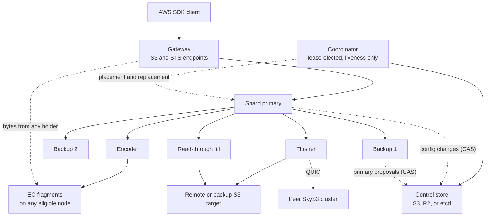
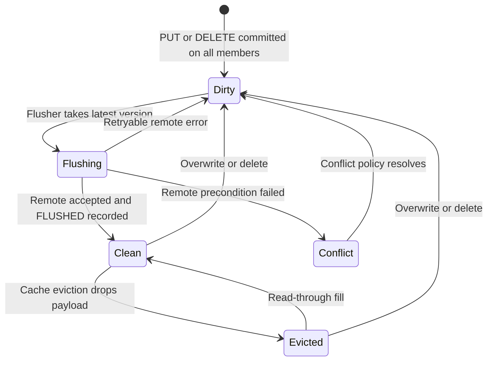
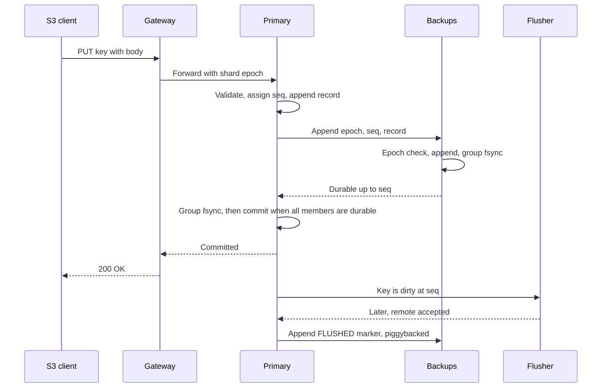
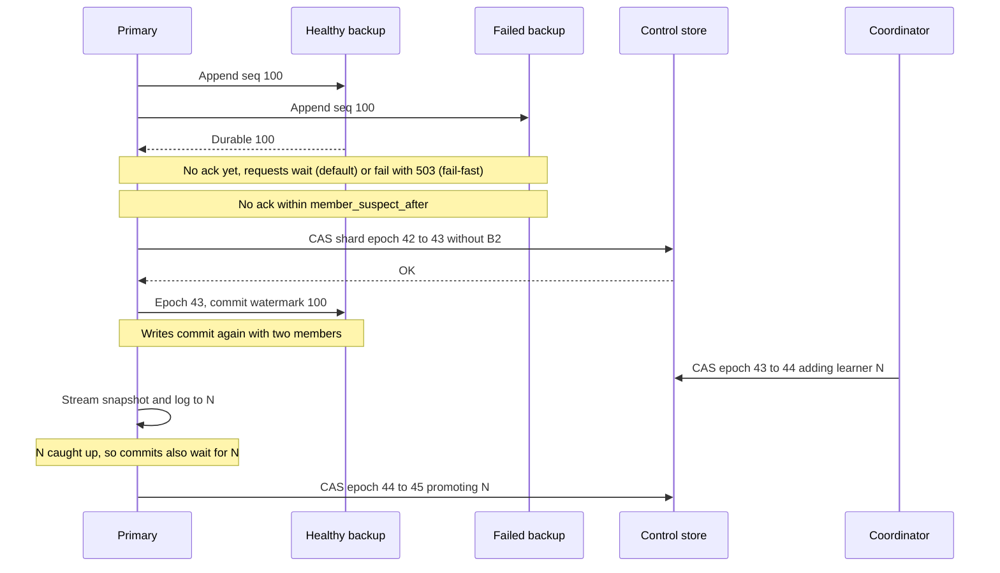
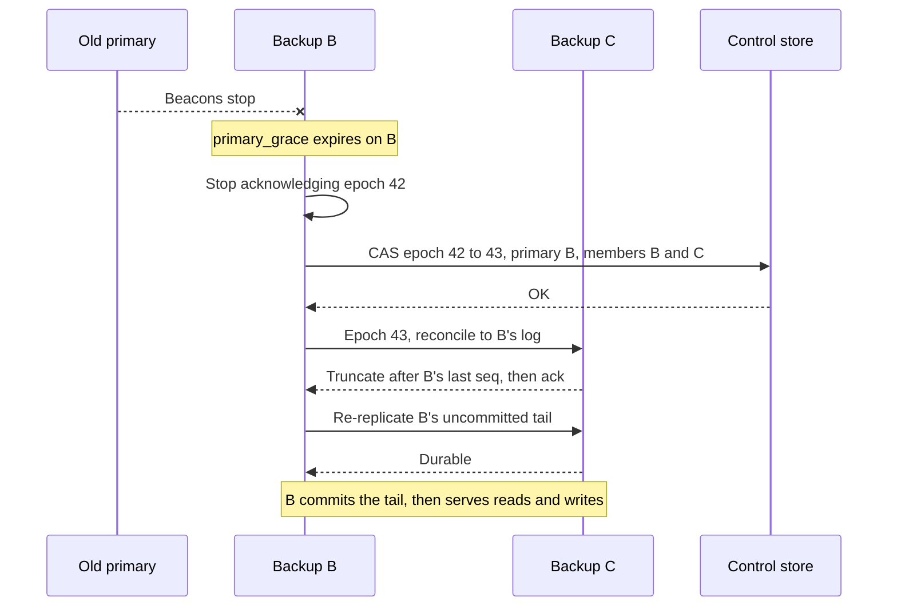
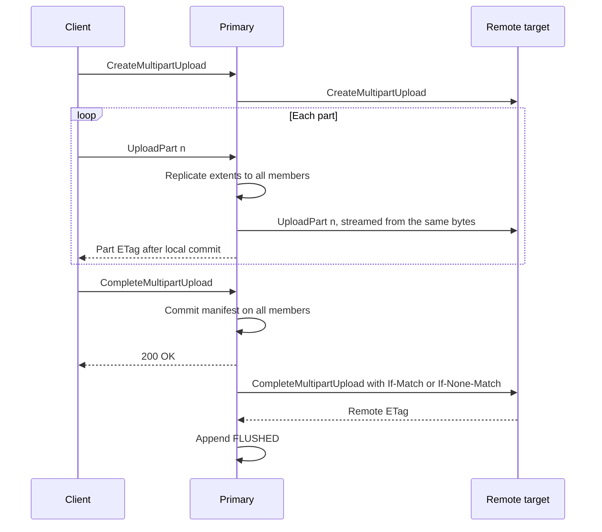
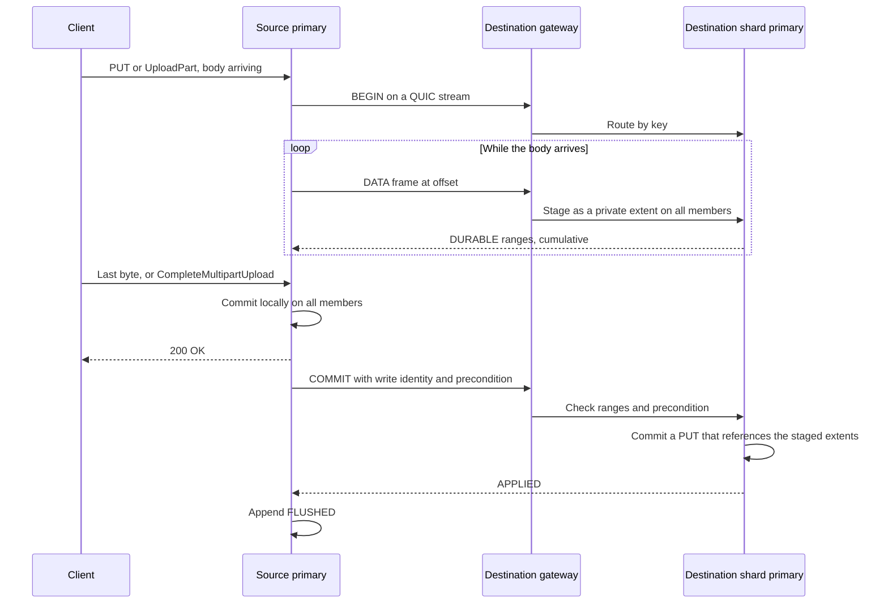
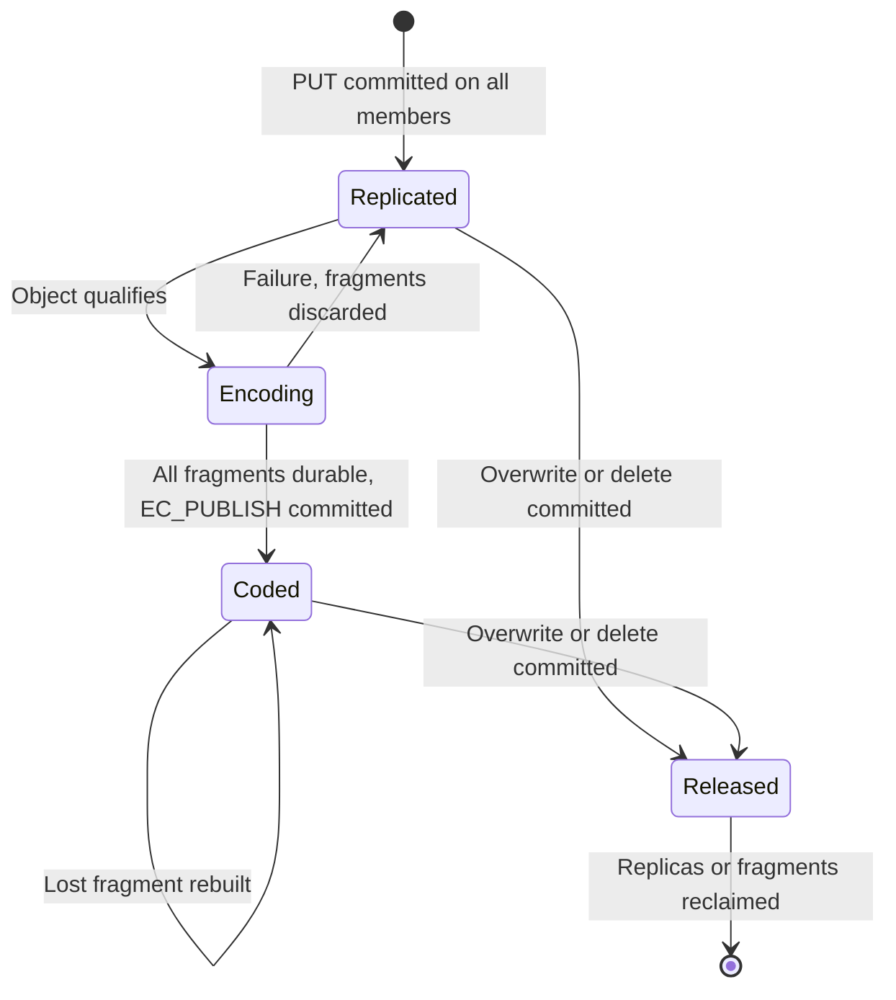

# SkyS3: Replicated S3 Cache and Object Store Design

**Status:** Proposed, for review
**Date:** 2026-09-22
**Supersedes:** the architecture proposal in [skys3/skys3#2](https://github.com/skys3/skys3/pull/2)
**Scope:** S3-compatible storage cluster in Rust whose buckets are either write-back caches in front of remote S3 targets or local, erasure-coded object storage

## Contents

- [1. Context and summary](#1-context-and-summary)
- [2. Goals, non-goals, and assumptions](#2-goals-non-goals-and-assumptions)
- [3. Architecture](#3-architecture)
- [4. Data model](#4-data-model)
- [5. Shard replication: all members acknowledge](#5-shard-replication-all-members-acknowledge)
- [6. Automatic membership without a consensus service](#6-automatic-membership-without-a-consensus-service)
- [7. Write-back flush](#7-write-back-flush)
- [8. Local buckets and erasure coding](#8-local-buckets-and-erasure-coding)
- [9. Reads, namespace, and cache management](#9-reads-namespace-and-cache-management)
- [10. Node storage engine](#10-node-storage-engine)
- [11. S3 surface and workload identity](#11-s3-surface-and-workload-identity)
- [12. Security](#12-security)
- [13. Failure matrix](#13-failure-matrix)
- [14. Illustrative configuration](#14-illustrative-configuration)
- [15. Rust dependencies](#15-rust-dependencies)
- [16. Testing and acceptance](#16-testing-and-acceptance)
- [17. Delivery plan](#17-delivery-plan)
- [18. Alternatives considered](#18-alternatives-considered)
- [19. Open questions and risks](#19-open-questions-and-risks)
- [References](#references)

## 1. Context and summary

SkyS3 is an S3-compatible storage cluster. Each bucket runs in one of two main modes, which share the same write path, replication, and membership machinery:

- **Write-back buckets** sit in front of a remote S3 target. Clients get local latency for reads and writes. The remote target is the system of record: every write is flushed to it asynchronously, and local copies of flushed data are cache.
- **Local buckets** keep their data only in the cluster. Large objects are erasure-coded in the background for space efficiency, and small objects stay replicated. A local bucket can also flush to a backup target.

The previous proposal (#2) designed SkyS3 as an authoritative object store with deferred erasure coding, Raft metadata groups, and native cross-region replication. Three review findings shaped this design:

1. Two Raft rounds per PUT cost more durable I/O than the replication scheme saved. A replicated log where every member acknowledges needs one durable round and no consensus on the request path.
2. Membership must change automatically. Operators should never have to evict, promote, or replace replicas by hand.
3. The main use case is a write-back cache, but local-only buckets must remain possible. The design covers both, so it can replace the previous proposal without Raft (section 1.3).

### 1.1 Decisions

1. **No consensus on the request path.** Each key belongs to a shard. Each shard has one primary and a small set of backups (three replicas by default). A write succeeds only after **every current member** has made it durable. A member that stops acknowledging is removed automatically. By default, requests wait through the removal; a fail-fast mode returns 503 instead (section 5.2). This is the SeaweedFS volume model[^seaweed-repl] applied to both payload and metadata.
2. **Membership changes automatically through a pluggable control store.** Every shard's configuration is one small compare-and-swap register. The first backends are etcd[^etcd-api], the recommended production default, and S3 conditional writes (`If-Match` / `If-None-Match`)[^s3-cond] on AWS S3, Cloudflare R2[^r2-api], or any provider that passes a startup probe, placed in a different failure domain from every data target (section 6.1). Epochs fence stale primaries. Primary leases are granted by the backups, and every node keeps a durable local copy of the control state it uses, so the data path never waits on the control store. This is the PacificA / Vertical Paxos family of designs[^pacifica][^vpaxos], with the control store as the configuration master.
3. **Replicate first, then move data to its durable home.** New writes are replicated to every shard member (3 by default). A write-back bucket then flushes to its remote target and keeps `clean_copies` local copies as evictable cache. A local bucket erasure-codes each large object in the background and keeps small objects replicated. Each object is encoded on its own, so deletes free space without a cross-node cleaner.
4. **Ordered, coalescing, conditional flush.** Each shard flushes its keys in commit order, uploads only the latest version of a key, and uses conditional requests so that out-of-band writes to the remote are detected instead of silently overwritten.
5. **Streaming flush for large objects.** Multipart parts, and large single PUTs, are streamed to the remote while the client is still uploading. The remote object becomes visible only when the local upload has committed. When the remote is another SkyS3 cluster, flush uses a native protocol over QUIC with byte-range resume, built for long, lossy links (section 7.8).
6. **One durable round per small PUT.** Payload and metadata travel in a single replicated log record. A small PUT costs 3 group-committed fsyncs in one round, with no consensus round.
7. **Reads scale out.** The shard primary resolves which version is current. The bytes can come from any replica, fragment, or node-local hot cache holding that exact version.

### 1.2 Changes from the previous proposal

| Area | Previous proposal (#2) | This design |
|---|---|---|
| Role of the local cluster | Authoritative object store, plus a separate read-through cache | Per bucket: write-back cache (remote is the system of record), local store, or read-only origin cache |
| Metadata | Regional Raft groups with 5 voters | Per-shard primary/backup replication, every member acknowledges |
| Membership changes | Raft reconfiguration | CAS registers in a pluggable control store (S3, R2, etcd) plus a lease-elected coordinator, fully automatic |
| Local redundancy | 3 replicas, then deferred EC | Write-back: replicas while dirty, then `clean_copies` evictable copies. Local: replicas, then per-object EC for large objects |
| Erasure coding and cleaning | Packed segments with cross-node EC-to-EC cleaning | Per-object EC in local buckets; node-local compaction only |
| Cross-region durability | Native streaming replication over QUIC | Streaming flush to a remote or backup target. Between SkyS3 clusters, a native QUIC protocol with byte-range resume; S3 REST otherwise |
| Small PUT before acknowledgement | 3 serial durable rounds, about 13 sync participants | 1 round, 3 participants |

### 1.3 Coverage of the previous proposal

With local buckets, this design covers the previous proposal's single-region feature set without Raft:

| Previous proposal (#2) | This design | Remaining gap |
|---|---|---|
| 3-replica ingest, then deferred EC | 3-replica ingest, then per-object EC for objects of at least `ec_min_object_bytes` (section 8) | Small objects stay replicated. Packing them into shared EC segments is deferred (section 19). |
| Strongly consistent regional metadata | Per-shard, all-member commit with leases (sections 5 and 6) | None |
| Survives two node failures | Any two of a shard's three replicas, or two of a stripe's fragments | The budget counts failures before repair completes. After a member loss, the shard's data has two copies until backfill restores the third, so the exposure is the repair time (section 6.4). A single surviving replica is read-only until replacements catch up. |
| Fully on-site operation | The data path is fully on-site. Membership changes need the control store. | Sites without S3 access use etcd, or the future embedded-Raft backend (section 6.1) |
| S3 API, STS / workload identity, read-through origins | Same (sections 9 and 11) | Local versioning is deferred (section 19) |
| Native pre-completion multi-region replication | A backup or write-back target that is another SkyS3 cluster, over the native QUIC transport (sections 7.8 and 8.9) | None between SkyS3 clusters. Other S3 providers resume per multipart part. |

## 2. Goals, non-goals, and assumptions

### 2.1 Goals

| Goal | How the design meets it |
|---|---|
| Low-latency, low-IOPS writes, especially small objects | One replicated log append per PUT, group commit, no consensus on the path |
| Durability of acknowledged writes before flush | Durable on every member of the shard (3 by default) before success |
| No manual membership changes | Failure detection, member removal, primary failover, replacement, and rebalancing are automatic |
| Remote S3 as system of record for write-back buckets | Ordered, conditional, idempotent flush; clean data is evictable |
| Space-efficient local-only storage | Per-object erasure coding of large objects in local buckets |
| Hot reads served locally, and read scaling | Clean cache with read-through fill; bytes served by any holder of the exact version, plus node-local hot caches |
| AWS SDK compatibility including OIDC/STS workload identity | Standard S3 wire protocol plus `AssumeRoleWithWebIdentity` |
| Client-side encryption (E2EE) | Ciphertext is stored and flushed byte for byte; no SSE or KMS |
| Upload overlaps transfer to the remote | Streaming flush of multipart parts and large PUTs |
| Reliable replication over long, lossy links | Native QUIC transport between SkyS3 clusters: byte-range resume, preconditions on every operation, and batched small objects (section 7.8) |

### 2.2 Non-goals for the first release

- Multiple SkyS3 clusters writing the same remote prefix. Other clusters may attach it read-only.
- Sharing a remote prefix with other writers. Out-of-band writes are detected (section 7.2), not merged.
- Local S3 versioning APIs (`ListObjectVersions`, version-id reads). The remote bucket of a write-back bucket may have versioning enabled. Local buckets are the main reason to add versioning later (section 19).
- Packing small objects into shared erasure-coded segments, and tiering between local storage classes.
- Object Lock, S3 Select, inventory, notifications, and bucket-level replication APIs.
- Server-side encryption (SSE-S3, SSE-KMS, SSE-C). Requests for them are rejected explicitly.

### 2.3 Assumptions

- Linux on x86-64 or AArch64 with local disks that honor `fsync`.
- 3 or more storage nodes per cluster. Nodes may have different disk counts.
- Monotonic clocks whose rate drift is bounded by `ρ` (1% is assumed). Wall-clock agreement is not required.
- The control store offers a linearizable compare-and-swap per key (section 6.1): an S3 bucket with conditional writes, such as AWS S3 or Cloudflare R2, or an etcd cluster. S3 providers must pass a startup probe.
- Erasure coding needs at least 5 eligible nodes. Smaller clusters keep local buckets fully replicated.
- Remote targets of write-back buckets are reachable most of the time. SkyS3 rides through remote outages for reads of cached data and for writes up to a dirty-data budget.

## 3. Architecture


```mermaid
flowchart TB
    Client["AWS SDK client"] --> GW["Gateway<br/>S3 and STS endpoints"]
    GW --> P["Shard primary"]
    P --> B1["Backup 1"]
    P --> B2["Backup 2"]
    P --> F["Flusher"]
    F --> Remote["Remote or backup S3 target"]
    F -. "QUIC" .-> Peer["Peer SkyS3 cluster"]
    P --> Fill["Read-through fill"]
    Fill --> Remote
    P --> Enc["Encoder"]
    Enc --> Frag["EC fragments<br/>on any eligible node"]
    GW -. "bytes from any holder" .-> Frag
    Coord["Coordinator<br/>lease-elected, liveness only"] --> CS["Control store<br/>S3, R2, or etcd"]
    P -. "config changes (CAS)" .-> CS
    B1 -. "primary proposals (CAS)" .-> CS
    Coord -. "placement and replacement" .-> P
```

All roles run from a single binary. Every node runs the gateway and the storage engine by default, and any node can be elected coordinator.

- **Gateway.** Terminates S3 and STS HTTP, authenticates requests, routes each key to its shard primary using a cached shard map, and streams request bodies.
- **Shard replica.** Holds one shard's log records, index, and replicated or cached payload. The primary orders writes, replicates them, resolves reads, and runs the shard's flusher and encoder.
- **Fragment store.** Every node stores erasure-coded fragments for any shard's objects in node-local fragment segments (section 10.1).
- **Coordinator.** Handles placement, replacement, rebalancing, and node bookkeeping. It holds a lease in the control store. It is never on the request path, and it can never break safety, because every change it makes is a CAS.
- **Control store.** A set of CAS registers, in an S3 bucket or an etcd key prefix, holding the cluster, bucket, shard, and identity configuration. No client request touches it, and every node keeps a durable local copy of the parts it uses (section 6.2). It should be the store nearest the cluster, which need not be a data target's endpoint, and it must not be a SkyS3 bucket.

## 4. Data model

### 4.1 Buckets, targets, and shards

Each **bucket** has a mode, fixed at creation:

| Mode | System of record | After a write commits |
|---|---|---|
| `write_back` | A remote S3 target: endpoint, bucket, optional prefix, credentials | Flushed to the target; `clean_copies` local copies kept as evictable cache |
| `local` | The SkyS3 cluster | Large objects erasure-coded, small objects stay replicated, and optionally everything flushed to a backup target (section 8) |
| `read_only` | An external origin that SkyS3 does not own | Writes are rejected; reads fill a cache (section 9.5) |

Attaching a `write_back` bucket imports the remote namespace (section 9.1). Deleting a SkyS3 bucket detaches it and leaves any remote untouched.

**Detaching.** DeleteBucket first seals every shard of the bucket. A sealed shard commits no client write, and reports what it holds, counting every write committed before the seal; flushing continues. A `write_back` bucket is refused with `409 BucketNotEmpty` while any entry is dirty, flushing, or in conflict, delete tombstones included: those changes exist nowhere else. Clean and evicted entries do not block, since their system of record is the remote. A `local` bucket is refused while it holds any object, as S3 refuses a non-empty bucket. A refusal lifts the seals, and the client retries once the flusher has drained the bucket. Detaching never waits for a drain itself, because a conflict held by the `hold` policy (section 7.2) may never drain without an operator. Otherwise the bucket register is deleted at the version read before sealing, and the shards are dropped. If the register changed in between, the seals are lifted and the request fails with `409 OperationAborted`. If the delete's outcome is unknown, the shards stay sealed, so no write is acknowledged into a bucket that may be gone, and the gateway remembers the pending deletion (at most 256, oldest forgotten first). A retried DeleteBucket resolves it by the lost-response rule for deletes (section 6.1). If the register is gone, or names a new bucket, the earlier delete applied: the retry drops the old shards, increments the generation that was never incremented, and answers `204`, the answer the first request would have had; AWS answers `404 NoSuchBucket` to a retry after a delete that succeeded, but there the client saw the success. If the register is still at the version the delete named, the delete may yet land, so the seals stay until a later attempt resolves it; once the register has moved to another version, no such delete can apply, and the seals are lifted. A restart lifts them too. Seals nest, so concurrent DeleteBucket requests cannot lift each other's. In M1 the gateway and every shard share a process, so a crash lifts the seals with everything else. Across nodes, the gateway sends a seal and its unseal to the shard's primary like any other request (section 6.2), and the primary holds the seal until it is lifted or the primary restarts; seals are not replicated. A gateway that crashes while it holds seals leaves them in place: lifting a seal without knowing whether its delete applied could acknowledge a write into a bucket that is gone. A retried DeleteBucket, through any gateway, seals again (seals nest) and finishes the deletion; a bucket whose deletion is abandoned keeps refusing writes until its primaries restart. Seals are not carried across a primary change: they are not replicated, so a member that takes over starts unsealed, and a write it acknowledges before the deleting gateway's register delete lands is dropped with the bucket. Closing that window belongs with takeover (plan M2-12). On a multi-node cluster, detaching drops the shards in two places: the bucket's shard registers, which the coordinator deletes once no bucket register names their bucket ID (section 6.7), and each node's replicas, which the deleting gateway's node removes at once and every other member at its next start, by the startup recovery below. Shards whose bucket ID no register names, left by a creation or deletion whose outcome was unknown, are dropped by startup recovery. It decides that only from bucket registers read from the control store at that start, never from the node's local copy (section 6.2), which may predate a creation, nor from a store that start created; a node that starts from its copy, or that claimed and bootstrapped an empty store, reclaims nothing until its next start. The system bucket that holds STS sessions (section 11) has no register and is never reclaimed.

Replication is configured per bucket, because every shard belongs to exactly one bucket:

- `replicas`: the number of shard members, and so of copies of every write until it reaches its durable home (default 3).
- `min_write_replicas`: the fewest copies every new write must reach, counting members and learners already acknowledging (default 2, section 6.4).
- `clean_copies`: for `write_back` buckets, how many members keep a flushed object as cache, from 0 to `replicas` (default 1). More copies spread read load (section 9.2).

Each bucket has a fixed number of shards chosen at creation (`shards_per_bucket`, default 8, maximum 256). A key is assigned by `hash(bucket_id, key) mod shards`. Hash sharding avoids split and merge machinery. The cost is that LIST merges results from every shard of the bucket (section 9.4). Changing a bucket's shard count later is deferred.

**Bucket IDs.** A bucket's ID is not its S3 name. It is assigned when the bucket is created and never reused in the cluster, even after the bucket is deleted. A bucket recreated with the same name and remote therefore hashes keys differently and writes identities that no object flushed by its predecessor carries, so the 412 recovery rule (section 7.2) cannot mistake an old remote object for a new write. Bucket IDs are at most 25 bytes (section 7.2).

**The shard hash.** A key's shard can never change for an existing bucket, so the hash is fixed and frozen with golden vectors. Version 1 hashes the bytes `"skys3-shard-v1" 0x00 bucket_id 0x00 key` with SHA-256 (FIPS 180-4), using the key's bytes exactly as stored. The first 8 bytes of the digest, read as a big-endian integer, are the key hash, and the shard is the key hash mod `shards_per_bucket`. A bucket ID never contains a zero byte, so the encoding is unambiguous, and the modulo bias is below 2⁻⁵⁶. SHA-256 is chosen because its specification is a standard that every language and `sha256sum` implement, so any tool can reproduce shard assignment. It is already a dependency for checksums (section 15), and its cost, about a microsecond or less for a typical key, is small next to a request. Rust's `DefaultHasher` makes no stability guarantee, and fast non-cryptographic hashes such as xxHash would add a dependency and a less universal specification for no measurable gain.

Each shard has a **configuration**: an epoch, a primary, members, learners, and `min_write_replicas`. Members acknowledge every write. Learners receive the log while catching up and do not acknowledge.

### 4.2 Object states

Every key in a shard's index has one entry. In a `write_back` bucket, entries move through these states:


```mermaid
stateDiagram-v2
    [*] --> Dirty: PUT or DELETE committed on all members
    Dirty --> Flushing: Flusher takes latest version
    Flushing --> Dirty: Retryable remote error
    Flushing --> Clean: Remote accepted and FLUSHED recorded
    Flushing --> Conflict: Remote precondition failed
    Conflict --> Dirty: Conflict policy resolves
    Clean --> Evicted: Cache eviction drops payload
    Evicted --> Clean: Read-through fill
    Clean --> Dirty: Overwrite or delete
    Evicted --> Dirty: Overwrite or delete
```

- **Dirty** entries carry payload on every member and are never evicted.
- **Clean** entries match the remote. At most `clean_copies` members keep the payload (default 1).
- **Evicted** entries (stubs) keep metadata only: key, size, ETag, remote ETag, remote version ID, checksums, user metadata, and tags.
- A flushed delete removes the entry from the index entirely.

Local buckets use the same replicated state for new writes, then move large objects to a coded state instead of flushing them (section 8.4).

**Applying records.** Every replica applies a shard's records with one deterministic function of the record and its index, specified in the `skys3-shard` crate's `machine` module. A rejected record leaves every entry as it was; it still advances the applied position, and the writer learns why. The rules the diagram leaves open:

- `PUT`, `DELETE`, and `TAGS` make a new version at the record's position, dirty, from any state and from no entry; a `DELETE` of a key with no entry leaves a tombstone (section 9.1). A key in conflict stays in conflict until the conflict policy resolves it. The new version keeps the entry's `remote_etag` and `remote_version_id`, which still describe the remote. `TAGS` keeps the bytes, size, ETag, and `Last-Modified`, and its version's write identity names the `TAGS` record. It reaches the remote like any version, as a conditional `PutObject` of the bytes with the new tags (section 7.2). It is rejected for a key with no live object.
- `FLUSHED` of the current `seq` moves a dirty, flushing, or conflicted entry to clean, or removes a tombstone; it is rejected for a clean or evicted entry, for a `seq` newer than the entry's, and when its `remote_etag` is absent for an object or present for a tombstone. `FLUSHED` of an older `seq` while a newer version is not yet clean records the remote ETag and version ID the flush produced, so that the newer version's flush conditions on them (section 7.1), and leaves the entry dirty. Once a newer version is clean, it is rejected. The flusher commits the `FLUSHED` of a tombstone only once the import has passed its key (section 9.1). A `local` bucket is never flushed, so after a `DELETE` commits there, its primary commits the `FLUSHED` of the tombstone itself, without a remote ETag; it removes the tombstone unless a later write of the key came first. If a crash loses that record, the tombstone stays: it hides nothing and only takes space.
- `IMPORT` creates an evicted stub, with `remote_etag` and `local_etag` the listed ETag, only for a key with no entry at all. A key written before the import reached it has a dirty entry, or one in conflict, with no `remote_etag`: its remote state is unknown. There the `IMPORT` records the listed ETag as the entry's `remote_etag` and changes nothing else, so the flush replaces the object the remote held with `If-Match` (section 7.2) instead of finding it foreign. Every other entry rejects it.
- `ADOPT` applies only to a clean or evicted entry whose `seq` is the one named. The remote version replaces it as an evicted stub at the `ADOPT` record's position, so its version identity is new; its tags are unknown and left empty.
- `EXTENT` and a `PUT` with inline data enter their record into the node-local location map. Applying never removes a location: which payload is still live is decided by compaction (section 10.3).
- `CONFIG` and `TRUNCATE` change no entry.

**Flushing and Conflict** are the primary flusher's view of a dirty entry, kept in its memory and never written to the log: no record moves an entry into them, and the index shows such an entry as dirty. A new primary, or a restarted one, flushes the entry again. The flush is conditional, so it finds an earlier success by its write identity and a conflict again by the remote's foreign write (section 7.2).

**Clean and Evicted** differ only in whether this replica holds the payload, so the moves between them are node-local and made by no record: a read-through fill makes an evicted entry clean with the `EXTENT` records it committed (section 9.2), and eviction drops a clean entry's payload (section 9.3). Each names the version it was decided for and is refused once the entry holds another, so a write that committed in between wins. Applying a record treats clean and evicted entries alike, so replicas may differ here, and replay after a crash may undo such a move but never contradicts one. An evicted multipart object keeps its part boundaries: its entry still lists its parts, and each part keeps its row, with its ETag and checksums, but no bytes, so `partNumber` reads and the multipart flush of a later `TAGS` find them; a fill gives each part its bytes again (section 9.3).

An entry records `local_etag` (what S3 clients see), `remote_etag` (what the remote returned), and `remote_version_id` when the remote is versioned. These usually match (section 7.4).

## 5. Shard replication: all members acknowledge

### 5.1 Write path


```mermaid
sequenceDiagram
    participant C as S3 client
    participant G as Gateway
    participant P as Primary
    participant B as Backups
    participant F as Flusher
    C->>G: PUT key with body
    G->>P: Forward with shard epoch
    P->>P: Validate, assign seq, append record
    P->>B: Append epoch, seq, record
    B->>B: Epoch check, append, group fsync
    B-->>P: Durable up to seq
    P->>P: Group fsync, then commit when all members are durable
    P-->>G: Committed
    G-->>C: 200 OK
    P->>F: Key is dirty at seq
    F-->>P: Later, remote accepted
    P->>B: Append FLUSHED marker, piggybacked
```

1. The gateway sends the request to the shard primary. The request carries the shard epoch the gateway knows about. A primary that is not current rejects it with a redirect hint.
2. The primary validates the request: authorization, conditional headers against its index, signature, length, and checksums. It then assigns the next per-shard sequence number `seq` and appends one record to its local log. The record holds the key, the object metadata, and either the payload inline (up to `inline_max_bytes`) or references to extent records already streamed.
3. The primary sends the record to every member in parallel. Each member rejects appends from an epoch older than the newest one it knows, checks that `seq` follows its last record, appends, and acknowledges once a group fsync covers the record.
4. **Commit rule.** A record at `seq` in epoch `e` is committed when every member of epoch `e`'s configuration, including the primary, has acknowledged it as durable. The primary then applies it to its index and returns success.
5. Members learn the commit watermark from later appends and heartbeats, and apply committed records to their own index.

Large bodies are streamed as 1 MiB extent records, which are replicated the same way while the body arrives. The final PUT record references them. Payload and metadata never take separate durable rounds. The `PUT` is committed only once the body has been read to its end without error and has passed its checks (section 11), so the extents of a body that fails, for example on a chunk signature or a checksum, are never referenced: compaction reclaims them (section 10.3).

**Conditional writes.** A write with a precondition (`If-Match`, or `If-None-Match: *`) is checked against the key's entry as of the write's own position. While a record of the key is sequenced but not yet applied, the check waits until it is, so it sees that record's outcome. The primary then reads the entry from its index, and gives the write its position only if no record of the key was sequenced since the read began; otherwise it reads again. Conditional writes are therefore linearizable with every write of the key, and a write that fails its check takes no position.

**Sequencing on a replica.** The primary checks that a record encodes, and for a `PUT`, that every extent it references is applied, before it gives the record a position, so a refused record never leaves a gap in the log. Records become durable out of order, because extents and other records are in segments that sync independently (section 10.1), but they are applied strictly in position order: a record is applied, and its writer answered, only once every earlier record of the shard is durable and applied. So an applied position means every earlier record was applied, `EXTENT` records included (section 10.2), and a small `PUT` is never applied ahead of the extents of an upload sequenced before it. A record that cannot be made durable stops the shard: it and every later record fail, and nothing is acknowledged on the shard until the node reopens it after replaying its log. A replica that opens a shard in a newer epoch first appends a `CONFIG` record at `(epoch, last seq)` (section 10.1). A replica that has the shard open already adopts a newer epoch in order with its writes: the `CONFIG` record takes `(epoch, last seq)` after every record sequenced before it, later records are sequenced in the new epoch, and none of them is acknowledged before the `CONFIG` record is durable and applied. Opening the shard in the configuration it is in returns it unchanged; a configuration in an older epoch, or another configuration in the same epoch, is refused, because one epoch names one configuration. A shard being removed cannot open again until the removal finished, so a reopened shard never sequences from index state the removal then deletes. A seal is ordered with the shard's writes: it waits for every record sequenced before it, and refuses client writes (`PUT`, `DELETE`, `TAGS`, and `EXTENT`) sequenced after it, while `FLUSHED`, `IMPORT`, and `ADOPT` continue (section 4.1).

**Replicating.** The `skys3-shard` crate's `replication` module specifies the messages. The rules that steps 3 to 5 leave open:

- **No holes.** A replica queues a shard's records to its log in position order, and on a replicated shard it queues a record of the other segment class only once every earlier record of the shard is durable (section 10.1). Its log therefore always holds a run of the shard's records without gaps, a crash can only shorten it, and an acknowledgement names the last `seq` of the run.
- **Sessions.** The primary keeps one link per member and shard, and opens it with a `Sync` that carries its configuration, its last `seq`, and the epoch it sequences in. Only the configuration's primary may open one, in the member's epoch or a newer one that keeps the primary and the member (a removal, section 6.4), which the member adopts. The member then refuses appends of every earlier session, such as appends of a primary's earlier life still in the network, waits until the records it already queued are durable or failed, and reports the last `seq` it holds. The primary sends it every record after that `seq`, each with the commit watermark, and beacons with the watermark when it has nothing to send. A link that fails, or hears nothing for a while, opens a new session.
- **A primary that opens in its own epoch**, after a restart for example, serves nothing until every member has reported, has rolled forward the records any member holds beyond its own log, and has committed its whole log. A member can make a record durable before its primary does, so a primary that lost power can be behind a member, but every record a member holds in the primary's epoch was sequenced by that primary, so it is rolled forward rather than truncated. A `seq` is given a second record only when no member and not the primary holds the first, and no earlier session can still deliver it.
- **Replay** applies a replica's whole log, its uncommitted tail included. In the primary's epoch that tail always commits, by the rule above. Reconciliation after a primary change (section 6.6, plan M2-12) truncates uncommitted records, so it must also undo any that a member's replay applied.
- **One epoch per record.** A replica takes a record only if the record's own position is in the epoch it sequences in, not only the message carrying it, so a record cannot move sequencing past or behind the configuration. A configuration change relaxes it deliberately: every replica switches epochs at the `seq` of the primary's `CONFIG` record, so a session of the new configuration carries the tail of the earlier epoch to a member that lacks it. A member that learns a newer configuration keeps sequencing in its earlier epoch, refuses appends stamped with the older one (R2), and appends its own `CONFIG` record at `(epoch, seq)` just before the first record of the new epoch, or once it holds the primary's last record if the `Sync` said the primary sequences in the new epoch and all of them are older. A member holding records of the earlier epoch past that point diverged, never switches, and is removed. A primary appends its `CONFIG` record only once every member of the new configuration has reported its log in this life, so no member holds a record of the earlier epoch it lacks. A replica that opens with a newer configuration than its last record, after a restart, does the same: it opens in its log's epoch and aligns. Reconciliation (plan M2-12) adds truncation.
- A replica that has stopped, after an append or index failure for example, serves no reads either: its index may miss records it acknowledged.
- A member serves no client request: it answers with its configuration as a redirect hint (section 6.2).

### 5.2 Failed writes

If any member has not acknowledged within `replica_ack_timeout`, the request fails with `503 SlowDown`. Every write needs every current member's acknowledgement. The timeout only decides how long a request waits for the membership to change.

A failed response means **not acknowledged**, not **not applied**. S3 has the same semantics for a 5xx or a timeout. The record may already be on some members. It will later either commit, when a reconfiguration removes the unresponsive member (section 6.4), or be discarded, when a new primary does not have it (section 6.6). Two rules keep this safe:

- **No reordering.** The log is strictly sequential per shard. A later committed write always supersedes an earlier failed one, so a failed PUT can never resurface over a later PUT or DELETE of the same key.
- **No holes.** A member cannot accept `seq + 1` without `seq`. While a member is unresponsive, the shard cannot commit anything until that member catches up or is removed.

`replica_ack_timeout` decides what clients see while a member is failing:

- **Wait through removal (default, 5 s).** The timeout is longer than `member_suspect_after` plus one control-store round trip. Configuration loading enforces this with a fixed allowance of 1 s for the removal CAS: `replica_ack_timeout > member_suspect_after + 1 s`. Requests in flight wait while the primary removes the member, then commit with the remaining members. Clients see added latency, not errors.
- **Fail fast (opt-in with `replica_ack_timeout_mode = "fail_fast"`, for example 2 s).** Requests fail with 503 as soon as a member is late. AWS SDK default retry policies (three attempts, backoff starting near 100 ms) usually give up inside the removal window. One sick disk then becomes client-visible errors on every shard that includes it: about `replicas × shards ÷ nodes` shards, or 240 in the section 6.1 example.

If the member cannot be removed, because the control store is unreachable, requests fail after the timeout in both modes. Section 16.3 measures the p99 cost of each.

The timeout runs from when the primary takes a request until its record is committed and applied, and covers every wait behind the members: a conditional write waiting for an earlier write of its key, and a seal waiting for the writes before it. A request that times out keeps its record's position. In fail-fast mode, once a request has timed out, the primary refuses new writes at once, without sequencing them, until every record sequenced before the timeout is applied. Since a failed write can commit after its answer, a read sent after the failure may miss it and a later read see it; it still takes effect before every write sequenced after it, so before any write sent after the failure was answered.

**Closing a shard** (node shutdown, or removing the shard) waits at most `replica_ack_timeout` for the records sequenced before it to commit, then stops the shard anyway. The records still waiting stay in the log but are not applied, and their writers have timed out by then. The next opening commits them, rolled forward in the primary's epoch (section 5.1), or a new primary discards them (section 6.6). A member whose primary is gone closes the same way. A node that shuts down closes all its shards at once, so it waits about one timeout in all, however many shards lose a member. A shard with a single member has no timeout, since it waits only for its own disk.

### 5.3 Durable I/O per small PUT

| | Previous proposal, no batching | This design |
|---|---:|---:|
| Serial durable rounds before success | 3 (intent Raft round, payload, publish Raft round) | 1 |
| Sync participants before success | about 13, up to about 23 with durable Raft apply | 3 (primary and 2 backups) |
| Consensus or control-store calls on the path | 2 Raft commits | 0 |
| Background I/O per object | EC conversion writes about 1.5x the payload, plus cleaning | Write-back: one remote PUT. Local, large objects: one encoding pass writing `(k+m)/k` × the payload. Either way, a marker record carried in a later group commit |

Group commit batches fsyncs across all shards that share a disk, so the per-object sync count falls further under concurrency. Section 16.3 defines how these counts are measured. These counts assume a full replica set. After a member loss, writes commit with one fewer copy until a replacement starts acknowledging, and existing data has one fewer copy until backfill finishes (section 6.4).

The cost of this model is tail latency. Every PUT waits for the slowest of the member fsyncs, and one sick member stalls its shards until it is removed. Section 6.4 bounds that stall to roughly `member_suspect_after` plus one CAS round trip.

### 5.4 Leases and strong reads

The primary serves strongly consistent reads (GET, HEAD, LIST, and conditional checks) only while it holds a **lease from every member**. Leases are carried on heartbeats and appends every `lease_renew_interval`.

- A member that acknowledges a beacon sent at primary-local time `t` grants a lease valid until `t + primary_lease`, measured on the primary's clock.
- A member does not propose a new primary until `primary_grace` has passed on its own clock since the last beacon it acknowledged. `primary_grace ≥ primary_lease × (1+ρ)/(1−ρ) + margin` (defaults: 4 s lease, 6 s grace). The margin is 500 ms. It covers the time between the primary's lease check and the index read it admits, and timer granularity. Configuration loading enforces the inequality, and also `lease_renew_interval < primary_lease`.
- A node that restarts does not know when it last acknowledged a beacon, so it counts the restart as one: it proposes no new primary until `primary_grace` has passed since the restart.
- Learners in the acknowledgement set (section 6.4) grant leases as members do. While a promotion CAS is outstanding, the primary also needs the learner's lease to serve reads (section 6.7).
- **A new primary acknowledges nothing, neither reads nor writes, until the old primary can no longer serve reads.** There are two ways to establish that:
  - *Takeover after silence.* The candidate proposes only after `primary_grace` has passed since it last granted the old primary a lease. By then that lease has expired under the drift bound. The old primary needs a lease from every member, so it has already stopped serving. The new primary can serve as soon as reconciliation (section 6.6) finishes.
  - *Planned handoff.* The old primary first stops serving reads and writes, stops renewing its leases, and sends the candidate a step-down message with its last `seq`. Only then does the candidate propose. If the step-down message does not arrive, the candidate falls back to waiting out `primary_grace`. The step-down is durable: the old primary never serves again in that epoch, even after a restart, because a delayed step-down message still lets the candidate propose at once. A step-down message counts only for the epoch it names.

    In detail: the old primary first checks that the shard register holds its configuration, and removes no member from then on, so the register cannot move past the epoch it steps down in. It lets the reads it admitted finish and the writes it sequenced commit, waiting for them at most `replica_ack_timeout`, so their clients get answers. It records the step-down in its index with one durable commit, keyed by shard with the epoch, before it sends anything. The message travels on the candidate's replication link after the last record, and every other link ends then, so no beacon renews a member's grace any more. The old primary removes no member after it steps down. It waits for the message to go out at most the link timeout, then answers requests `503` until the shard register names a newer configuration, and redirects to that one (section 6.5). The candidate proposes at once only once it holds every record up to the `seq` the message names; otherwise it treats the message as lost. It proposes what a takeover proposes (section 6.5): the old primary is left out and rejoins only as a learner. Rebalancing therefore hands a shard off when the old primary should leave it, once the learner that replaces it is a member, and a primary it moves alone leaves the shard short until replacement adds a learner (section 6.7). A candidate that resumes granting forgets the message.

  Epochs alone fence the old primary's writes. The wait is for reads: without it, a gateway with a stale shard map could read an old value from the old primary after the new primary had acknowledged a newer write.
- **Stamps.** Every append and beacon carries a stamp, the primary's clock reading when it sent it, and every acknowledgement echoes the latest stamp the member received in its session. That echo is the grant: the lease runs to the stamp plus `primary_lease`, and a stamp later than the primary's clock counts as sent when the acknowledgement arrives. The member restarts its grace when it sends such an acknowledgement, so the lease counts from before the grant and the grace from after it. Members answer every beacon, and the primary sends one at least every `lease_renew_interval` even while records flow, so a member whose log is slow to sync still renews the lease. Either end drops a link that stays silent for the link timeout, so the primary also beacons at least every quarter of that timeout, whatever `lease_renew_interval` is: a link that is busy but whose member acknowledges no record for a while stays up. Beacons more frequent than `lease_renew_interval` only renew leases sooner, so the lease inequality is unchanged. A node counts opening its replica of a shard as a grant, which is the restart rule above.
- **What needs the lease.** Every read of the index at the primary: GET and HEAD, object, upload, and part listings, and the check of a conditional write. Unconditional writes need none: the commit rule and epochs fence them.

Clock assumptions affect **read linearizability** only. Write safety depends on epochs and the all-member commit rule, not on clocks. Leases come from members, not from the control store, so reads and writes continue while the control store is unreachable as long as no shard needs to change membership.

## 6. Automatic membership without a consensus service

### 6.1 The control store

The control store is a small interface, so different backends can hold the same registers:

```rust
trait ControlStore {
    /// Read a register and its version, or None if it does not exist.
    async fn get(&self, key: &str) -> Result<Option<(Bytes, Version)>>;
    /// Write only if the register is still at `expected`, or still absent.
    async fn put_if(&self, key: &str, expected: Expected, value: Bytes) -> Result<PutOutcome>;
    /// Delete only if the register is still at `expected`.
    async fn delete_if(&self, key: &str, expected: Version) -> Result<DeleteOutcome>;
    /// List registers under a prefix, for bootstrap and recovery.
    async fn list(&self, prefix: &str) -> Result<Vec<(String, Version)>>;
    /// Stream changes after a generation, from a native watch or by polling.
    async fn changes(&self, after: Generation) -> Result<ChangeStream>;
}
```

`put_if` and `delete_if` must be linearizable per key, and every value a register holds, across deletions and re-creations, has a version of its own. Nothing else is required: SkyS3 needs no transactions across registers, and the coordinator lease (section 6.7) is built from `put_if` plus local timers.

| Backend | Compare-and-swap | Change notification | Status |
|---|---|---|---|
| AWS S3 | `PutObject` with `If-Match: <etag>` or `If-None-Match: *`[^s3-cond] | Poll `cluster.json` | First release |
| Cloudflare R2 | The same headers, listed as supported on `PutObject`[^r2-api] | Poll `cluster.json` | First release, subject to the probe |
| Other S3-compatible stores | The same headers | Poll `cluster.json` | Only if the probe passes |
| etcd v3 | A transaction that compares the key's `mod_revision`[^etcd-api] | Native watch | First release |
| Embedded Raft on SkyS3 nodes | Compare-and-swap applied from the Raft log | Push | Future, for air-gapped sites |
| Local directory | Under an exclusive lock on the directory: write a temporary file, `fsync`, rename, `fsync` the directory | In-process | Single-node development; refuses to open once a second node is registered |
| In memory | A map under a lock | In-process | Tests and simulation |

etcd and embedded Raft are consensus systems themselves. They need no external service, but if a majority of their voters is lost permanently, recovering them needs an operator. An S3 or R2 backend has no voters to lose, but its provider must be reachable for membership to change (section 6.10).

Every backend uses the same register layout:

```text
<cluster-prefix>/
  cluster.json                  cluster id, format version, generation, global settings
  coordinator.lease             coordinator lease register
  nodes/<node-id>.json          node registration: address, failure domain, disks
  buckets/<bucket-name>.json    bucket mode, target binding, shard count, replication settings
  shards/<bucket-id>/<n>.json   shard configuration register
  identity/providers/<name>.json  OIDC provider: issuer, audiences, authorized parties, algorithms
  identity/roles/<role>.json    role: trust policy and policies (section 11)
```

**S3 backends.** Registers are objects in a control bucket, under the cluster's prefix, and a register's version is its object's ETag. They are updated with `PutObject` and `If-Match: <etag>`, created with `If-None-Match: *`, and deleted with `DeleteObject` and `If-Match: <etag>`. A precondition failure (412), or the `404 NoSuchKey` S3 answers to `If-Match` on a key without a current object, means someone else won. A `409 ConditionalRequestConflict` means a concurrent conditional write was in progress and nothing was written; the caller sends the request again[^s3-cond]. A timeout or a `500` may hide an applied write and goes to the lost-response rule below; a `503` applied nothing and is retried; any other error, such as `403 AccessDenied` or `501 NotImplemented` for a header the store does not support, is not retried.

**The startup probe.** At startup, each node probes an S3 control store before using it. It runs 100 rounds across four scratch registers, `probe/<nonce>/<n>.json`, with a fresh 64-bit nonce per run so that probes from several nodes never share registers. In each round, at least two writers race as concurrent requests, each proposing its own value under the same precondition (`If-None-Match: *` in a register's first round, then `If-Match` on the previous winner's ETag), through the same retries and lost-response rule as every register write. Exactly one must win. Each loser then reads the register and must see the winner's value at the winner's version, because the lost-response rule depends on read-after-write. A listing of the scratch registers after each round must then show every register written so far, at its latest version, and nothing else. After the rounds, each scratch register is deleted at a version it no longer has, which must be refused, then at its current version, after which it must read as absent and no longer be listed. Listings are checked because change streams list the registers once per generation they observe (section 6.2), and a generation does not say which registers it announces, so a listing that lags the writes would lose them until the next increment. Relisting on every poll would turn each `304 Not Modified` into a `ListObjectsV2` and still not know when the listing has caught up, so a store whose listings lag its writes is refused instead. A store that fails any check is refused; one that only fails to answer is probed again later. Whether or not it passes, the probe deletes its scratch registers and reports those it could not delete. Change streams never report registers under `probe/`. The conformance suite (section 16.1) runs the same probe against every backend, not only at startup.

**No fallback for conditional deletes.** A store that ignores or rejects `If-Match` on `DeleteObject` is refused, even if its conditional `PutObject` works. Cloudflare R2 lists conditional headers only on `PutObject`[^r2-api], so the probe decides whether it qualifies. A fallback that writes a tombstone with a conditional `PutObject` and then removes it with an unconditional `DeleteObject` was rejected: tombstones with the same content share an ETag, so between the deleter's two requests a creator can replace a tombstone by `If-Match`, and the unconditional delete then removes the new value. Tombstones that are never removed are the design rejected under lost responses below.

**Credential scope.** An S3 backend sends requests only for keys under its prefix: an object key is the prefix followed by a register key, whose grammar cannot leave it, and listings ask for nothing else. Configuration loading refuses a backup or snapshot target, and attaching a bucket refuses a target, whose keys overlap the control prefix in the control bucket, even with `allow_correlated_control_store`, so no target's credential covers the registers and no flush or import touches them. The rest is the operator's: the control store gets a credential of its own, separate from every target's, that allows only `s3:GetObject`, `s3:PutObject`, and `s3:DeleteObject` on `arn:aws:s3:::<bucket>/<prefix>*`, and `s3:ListBucket` on the bucket with the condition `s3:prefix` starting with `<prefix>`. SkyS3 cannot verify a credential's scope without attempting writes outside its prefix, so it does not.

**etcd backend.** Registers are keys under the cluster's prefix, and a register's version is its key's `mod_revision`, which etcd never reuses, so a register deleted and created again never repeats a version. A create is a transaction that compares the key's `create_revision` with 0, and an update or delete one that compares its `mod_revision` with the expected version; a failed comparison means someone else won. Reads are linearizable, never `serializable`, and a listing reads pages of 1,000 keys at the revision of its first page, starting over if that revision is compacted away. A change stream is the generation-driven feed every backend uses (section 6.2), woken by a native watch on `cluster.json` instead of a timer. A watch that etcd ends, cancels, or compacts is opened again from the current revision, and the feed then reads the generation once, which covers every write made while no watch was open. No answer, a timeout, or the statuses `UNAVAILABLE` (etcd's "request timed out", "leader changed", "no leader"), `DEADLINE_EXCEEDED`, `CANCELLED`, `ABORTED`, `INTERNAL`, and `UNKNOWN` may hide an applied write and go to the lost-response rule below; no connection to any endpoint, and `RESOURCE_EXHAUSTED` ("too many requests", "database space exceeded"), applied nothing and are retried; any other status, such as `PERMISSION_DENIED` or `UNAUTHENTICATED`, is not retried. A request without an answer, or with one of these retried statuses, moves the client to the next endpoint, since a member cut off from its quorum still answers, with `UNAVAILABLE`. Endpoints are `http://` or `https://`, with TLS from `rustls` and `aws-lc-rs`; etcd's client-certificate authentication is supported, and its user-and-password tokens are not. The client is SkyS3's own, for the three calls it needs (section 15).

A bucket register is keyed by the bucket's S3 name, which requests use to find it. Its shards are keyed by the bucket ID, which is never reused (section 4.1), so a bucket recreated under the same name never inherits an old shard register. Keys are `/`-separated segments of ASCII letters, digits, `-`, `_`, and `.`, none empty or starting with `.`, so every backend can store them as object keys, etcd keys, or file paths.

**Lost responses.** Each write includes a unique `proposal_id` in the value. If a response is lost and the retry fails its precondition, the proposer re-reads the register. If the register contains its own `proposal_id`, the write succeeded. This applies to every backend. The retry sends the same value under the same precondition, so at most one attempt can apply, even one still in flight. A `409` or an outage applied nothing, and the request is sent again as it is. A write that landed and was overwritten before the re-read cannot be told from a lost race, and is treated as one: the proposer acts on the register's current value, as a loser would. For bootstrap, this means a node may not learn that it created `cluster.json`, which is harmless because bootstrap is idempotent.

A deleted register holds no `proposal_id`, so a lost delete response is resolved by the register's absence. The retry sends the same conditional delete, which can apply only while the register is still at the version the proposer read. If it fails its precondition after an unanswered attempt, the proposer re-reads: an absent register counts as deleted, whether by this proposal or by another proposer, since either way the version it read is gone. A present register means the delete did not apply, or applied before the register was created again; both are treated as a lost race. Because the original request reported neither, the change was never announced: the proposer that later learns an unannounced create or delete applied increments the generation then. CreateBucket increments it whenever its create loses to an existing register it did not know, which covers a creation whose answers were all lost, and DeleteBucket does when it resolves a pending deletion (section 4.1). Tombstone values carrying a `proposal_id` were rejected: registers would never disappear, and every reader and lister would have to skip them.

An example shard register:

```json
{
  "bucket_id": "b-7f3a",
  "shard": 5,
  "epoch": 42,
  "primary": "node-3",
  "members": ["node-3", "node-7", "node-9"],
  "learners": [],
  "min_write_replicas": 2,
  "replicas": 3,
  "proposal_id": "01J8Z6K3V2Q4"
}
```

Register values are JSON objects. Readers reject unknown fields and invalid values, and the format version in `cluster.json` covers every register, so a new field comes with a new format version.

#### Traffic and latency

**No object request reads or writes the control store.** Routing, leases, commits, and reads all stay inside the cluster. Of the bucket operations, only CreateBucket and DeleteBucket do: they write the bucket register and increment the generation, and DeleteBucket reads the register first. HeadBucket, ListBuckets, and GetBucketLocation are answered from the node's local copy (section 6.2). The control store sees background traffic, plus bursts when membership changes:

| Activity | Control-store requests | Effect of a 100 ms round trip |
|---|---|---|
| Any object request | 0 | None |
| CreateBucket, DeleteBucket | 2 to 4 (read, CAS, generation increment) | Adds a few round trips to an operation that is rare |
| Primary leases | 0 (granted by backups, section 5.4) | None |
| Coordinator lease renewal | 1 conditional PUT every `coordinator_lease / 3` | None while renewal fits well inside the lease |
| Node start (section 6.7) | 1 GET of the node's registration; 2 to 3 more (CAS, generation increment) if it changed | None |
| Heartbeats and the node registry (section 6.7) | Nodes: 0 while the coordinator answers; 2 GETs (lease, registration) after it moves. Coordinator: 1 LIST of `nodes/` per placement round, plus 1 GET per changed registration | None |
| Configuration propagation (section 6.2) | S3 backends: 1 conditional GET per node every `config_poll_interval`, usually `304 Not Modified`. etcd: a watch. | None |
| Member removal or primary takeover | 1 CAS per affected shard | Adds about 1–2 round trips to a failover dominated by `member_suspect_after` or `primary_grace` |
| Member replacement | 2 CAS per shard (the coordinator adds a learner, the primary promotes it); the coordinator's CASes go out in changes of up to 32 shards, each with 1 generation increment | None on writes; promotion does not pause commits (section 6.7) |
| Node restart with an intact local copy | 0 for shards whose membership did not change | None |
| Node restart without a local copy | 1 GET per register it needs, issued in parallel | Proportional to register count ÷ parallelism |

Losing a node generates a burst of CAS requests: one per shard the node belonged to, for example about 240 in a 20-node cluster with 1,600 shards. Issued in parallel, the burst adds well under a second. It stays far below S3 per-prefix request limits.

**Placement.** The control store must not share a failure domain with any data target. Otherwise one regional outage removes flushing and membership changes together, and during it a single node failure takes that node's shards offline: about `replicas × shards ÷ nodes` shards. For production:

- **etcd running on-site is the recommended default.** It is independent of every remote target by construction.
- **An S3 or R2 control store** is supported when it is in a different provider or region from every data target. For example, R2 can serve a cluster whose targets are in AWS, or whose buckets are all `local`.
- **The configuration validator refuses** a control store that it can tell shares a provider region with a data target, unless `allow_correlated_control_store = true`. It can tell when both endpoints have the same host name or IP address, or are AWS S3 endpoints in the same region. Configuration loading checks backup and snapshot targets; attaching a bucket checks its target.

Within those rules, prefer the store nearest the cluster. Its latency only affects failover time.

### 6.2 Local copies of control state

The control store holds **only cluster control state**. Object metadata lives in each shard's index on every shard replica (section 9.1). The remote targets hold the objects and their S3 metadata.

Every node also keeps a durable local copy of the control state it uses:

| State | Local copy | Kept current by |
|---|---|---|
| Configuration of each shard the node belongs to | A `CONFIG` record in that shard's log (section 10.1) | The replica appends it, and group commit makes it durable, before the replica acts on the new epoch |
| Shard map used by the gateway for routing | Node-local index, with each shard's epoch | Redirect hints from shard replicas, and coordinator pushes |
| Bucket bindings, identity and trust configuration, node registry | Node-local index, tagged with a configuration generation | Coordinator pushes, plus polling of `cluster.json` |

**Propagation.** Every control-store change the coordinator makes also increments the generation number in `cluster.json`, and the coordinator pushes the change to every node: a `ControlChanged` message over the intra-cluster transport (section 12) that names the new generation, acknowledged by the node. A push is only a hint. The node reads `cluster.json` and the registers from the store, so a lost, late, or forged push costs at most a read. As a backstop, each node polls `cluster.json` every `config_poll_interval` with `If-None-Match: <etag>`, and refetches changed objects only when the generation moves. A sync lists the registers it copies and reads only those whose listed version differs from the copy's, since a version names one value (section 6.1).

`cluster.json` is created at generation 1 with `If-None-Match: *`. The generation is incremented after the writes it announces, never before, so a node that sees the new generation and then lists the registers finds them. An increment that loses its CAS to another increment needs no retry: the winner wrote after the loser's changes, so its generation announces them.

`changes(after)` delivers reports with these semantics, for every backend:

- It reports when it observes a generation other than the one it last reported, or than `after` before its first report. The first report is a snapshot: every register under `nodes/`, `buckets/`, `shards/`, and `identity/`, with its version. Later reports list the registers whose version changed since the previous report. `cluster.json` and `coordinator.lease` are not reported.
- A write announced by generation `g` is reported, at its version or a later one, no later than the first report at or after `g`. A write never followed by an increment may be reported early, or never.
- Reports are coalesced and at least once: a register written several times between reports appears once, at its latest version, and the reader acts on the value it reads, not on the reported version. A node with no local copy passes generation 0 and receives a snapshot at once.

**Stale routing.** A shard replica that is not the current primary rejects a forwarded request with its current configuration (epoch, primary, members). The gateway updates its shard map from that hint and retries, without touching the control store. It reads the shard register directly only if no member of the configuration it knows answers.

The rules this leaves open:

- **The map only moves forward.** A configuration replaces a shard's entry only if its epoch is newer, whether it comes from a hint or a register, so a late hint never undoes a newer one. Each change is written to the index durably before it is used.
- **Who serves.** A replica serves a request only as the serving primary of its own configuration (a primary still reconciling answers `503`), and only if its epoch is at least the request's. A replica whose epoch is older than the gateway's has not adopted the newer configuration, and may no longer be the primary, so it serves nothing and says so. A primary whose epoch is newer than the request's serves it and returns its configuration with the answer.
- **Asking.** The gateway asks the primary of the configuration it knows, then the other members in order. A member that is not reached, does not have the shard open, or is behind is passed over; a hint no newer than the map's is too. Only when none of them serves or redirects does the gateway read the register, and a node reads a shard's register again only a second after its last read finished; requests in between share that read's result, so a shard whose members are all down does not turn requests into control-store reads, however slow the store.
- **Lost answers.** A request whose answer is lost after it was sent may have been applied. The gateway asks the next member again only for a read; a write fails with `503`, which means not acknowledged (section 5.2).

**The control store is the authority; local copies are caches.** Membership changes are CAS operations against the control store's current version, so there is exactly one place where competing changes are ordered. A stale local copy cannot cause an incorrect commit, because every data-path message carries an epoch and members reject old ones (rule R2 in section 6.3). The worst a stale copy costs is a redirect.

**The node's copy.** A node keeps every register under `buckets/` and `identity/` in its index, replaced whole by each sync and tagged with the generation read before listing them and the wall time the sync started. Only a node without a copy, one that has never synced, bootstraps `cluster.json`; a node with a copy syncs from the store it synced from before and never creates a replacement. A store that has lost `cluster.json`, or, for the file backend, whose directory is missing or names no owner, is treated as reset: an unmounted volume looks the same, and rebuilding a store is an operator's decision (below). So is a store whose `cluster.json` holds an older generation than the copy: it was reset, or rebuilt from older copies, and following it would undo changes the copy holds. The file backend's directory records its owner in `.owner.json`: the cluster, the node ID, and the instance ID of the node's data directory, which `node.json` holds and which no other data directory shares. The node claims only an empty store, and refuses to start on a store another node or data directory owns, so a second node cannot load a catalog whose shards it does not hold. If the control store cannot be opened, does not answer, or looks reset, and the node has a copy, the gateway and STS run from the copy: reads come from it, bucket creation and deletion fail with `503`, and the identity copy's age runs from the kept sync time, so a restart never makes it look fresh. The node retries every `config_poll_interval`, reopening the store if it could not open it, and uses the store once it answers. While it does, the node follows the store's change stream, with `config_poll_interval` as the backstop, and syncs whenever the generation moves, and also once half of `identity_max_staleness` has passed since the last sync started, so that the identity copy does not go stale while the store answers and nothing changes; a graceful shutdown refreshes the copy once more. A node without a copy does not start without the store. The gateway's shard map is in the index too, kept apart from this copy, since it changes with redirect hints rather than syncs. Node registration arrives with the coordinator (plan M3-02); until then each replica's configuration is its `CONFIG` record.

What the local copies make possible:

- **Restart while the control store is unreachable.** On restart, a replica loads each shard's latest `CONFIG` record and resumes. A shard whose membership did not change while the node was down resumes serving without contacting the control store. A shard whose membership did change is fenced by epochs, because the other members reject the stale configuration, until the node can read the current register.

  In detail: the index keeps the configuration of the latest `CONFIG` record each replica applied (section 10.2), which replay restores like any applied state, and which a learner's snapshot install sets to the configuration it installs in. A starting node reads each kept shard's register, all of them concurrently, and opens the replica in the newer of the register's configuration and the kept one, so a stale read of the register does not move it back; a register that no longer names the node, or is gone, opens nothing. If the register cannot be read, the replica opens in the kept configuration, and reads its register every link timeout until it can: it then adopts a newer configuration where it can change in place, reopens as a learner from its log if the configuration adds the node back as one (section 6.7), and otherwise, removed or given another role, stops serving and granting, redirects to the register's configuration, and opens in it at the node's next start. A register that is gone stops the replica too, and one older than the kept configuration is a stale read, so the replica reads it again. A register is gone only in a store that still holds `cluster.json`: an absent register in a store without one says nothing about the shard, since the whole store was lost or reset, so it counts as a register that cannot be read, and the replica goes on in its kept configuration until the store is rebuilt. A shard the node keeps no configuration of opens once its register can be read. The proposals that matter across a restart are in the index too, so opening from the kept configuration loses none: a step-down (section 5.4), a promotion (section 6.7), and a takeover (section 6.3).
- **STS during a control-store outage.** STS keeps validating tokens with the cached trust configuration and roles. A revocation made in the control store during the outage cannot reach the node, so new session issuance fails closed once the cached identity configuration is older than `identity_max_staleness`. Sessions already issued stay valid until they expire. The copy's age is the time since the start of the last sync that listed every `identity/` register and read each one whose version changed; a clock that steps back before that start counts as stale. A sync replaces the whole copy, but leaves out a register that does not parse and every provider of an issuer that two providers name: keeping the register's previous value, perhaps a looser trust policy, would leave it in force until the copy went stale, while leaving it out denies what it allowed.
- **Rebuilding a lost control store.** If the control bucket is lost, a replacement can be rebuilt from the newest `CONFIG` record of every shard plus the cached bucket and identity configuration. Rebuilding is a deliberate operator action (section 6.9). Doing it automatically could let two clusters claim the same prefix.

  In detail: the operator stops every node, so that no node holds a proposal in memory that the rebuilt store could accept, and on each runs `skys3 control export`. The export takes the data directory's lock, recovers the logs into the index as a start does, and writes the node's copy of the `buckets/` and `identity/` registers with its generation, the configuration of each shard's newest `CONFIG` record the node holds durably, applied or not, and which shards hold objects. `skys3 control rebuild` merges the exports into a plan, which `--dry-run` shows, and writes it:

  - *Shard registers hold each shard's newest configuration, byte for byte.* Of the configurations the exports hold for a shard, the one with the highest epoch is written unchanged, `proposal_id` included, so every replica finds its register equal to its own configuration, adopts nothing, and is not deposed for "another configuration of its epoch". A node makes a configuration's `CONFIG` record durable before it acts on it, and the primary of any configuration was a member of the one before it (R1), or its primary, so if every member of the newest configuration exported, no node acted on a newer one. The plan refuses a configuration whose members did not all export, unless the operator declares them lost (`--lost`): a lost node's disks are gone for good, and it must never start again with its old data directory, since it may hold records of a configuration no other node knew. A configuration that landed in the lost store but that no node acted on is not rebuilt, and nothing needs it: its epoch was never used, and a proposal still recorded for it (a takeover or a promotion, section 6.3) is sent again over the rebuilt register, where it lands or loses like any other. Two different configurations of one epoch cannot both have landed, so the plan refuses them. Writing every shard at a fresh epoch instead was rejected: every replica would have to adopt a configuration nobody proposed, and under the export rule the configurations as they were are already the newest any node acted on.
  - *Buckets and identity come from the newest copy.* Each copy is a whole listing at its generation, so the copy with the highest generation is the newest whole state, deletions included: its listing started after every change announced up to its generation. Merging copies would bring back deleted roles and buckets, and with them looser trust policies. Its registers are written byte for byte. Copies of the newest generation that differ are refused, naming the nodes and the registers they differ in, until the operator chooses one (`--prefer <node>`; section 6.9). Shards of a bucket that copy does not name are not rebuilt; one that holds objects is refused unless the operator allows it (`--allow-unnamed`), since its nodes drop it at their next start (section 4.1), while an empty one is a deleted bucket's leftover. Bucket shards no export configures are reported; a coordinator places them as new shards (section 6.7).
  - *Generations move forward.* `cluster.json` is written at the generation after the newest copy's, with a `proposal_id` derived from the plan, so every exported node sees the generation move and syncs, and nodes refuse a store behind their copy (above).
  - *Only into a store that is lost.* The rebuild writes nothing into a store that holds `cluster.json`, or a register under `buckets/`, `shards/`, or `identity/` that the plan does not write: a store that answers with them is not lost, or another cluster uses the prefix. Node registrations and a coordinator lease that nodes wrote while the store was lost are left: nodes register again when they start. Each register is created with `If-None-Match: *`, read back after a lost answer and compared byte for byte, and settled before the next is sent; `cluster.json` goes last, so nodes treat the store as reset until the rebuild is complete, and running the same plan again completes an interrupted rebuild.

  The nodes then start: each finds `cluster.json` newer than its copy and syncs, and each replica its own configuration in its register, so membership changes resume at once. A file control store, which serves one node, is rebuilt from that node's export and claimed for it with its owner record.

### 6.3 Configuration rules

A new configuration always has epoch `e+1` and is written with CAS over configuration `e`. Four kinds of change exist:

| Change | Who proposes | Precondition |
|---|---|---|
| Remove a member | Current primary, or the coordinator | Member unresponsive for `member_suspect_after`, or the coordinator's placement decision |
| Take over as primary | A member of `e`, for itself only | `primary_grace` has passed since it last granted the primary a lease, or the primary has stepped down (section 5.4) |
| Add a learner | Coordinator | Placement rules allow the node |
| Promote a learner to member | Current primary | The primary already requires the learner's acknowledgements, and the learner is durable up to the commit watermark (section 6.7) |

Three rules carry the safety argument (section 6.8):

- **R1.** A configuration with a new primary can be written only by that new primary. It must have been a member (not a learner) of `e`, and before it proposes it must stop acknowledging epoch-`e` appends and stop granting leases.
- **R2.** Every member rejects appends stamped with an epoch older than the newest one it has seen.
- **R3.** A learner becomes a member only after it holds every committed record.

**Proposals are durable.** A node records each configuration it proposes, with its `proposal_id`, before it issues the CAS, and until it learns the outcome, across restarts too, it acts as if the CAS succeeded. A candidate keeps acknowledging nothing in epoch `e` and granting no leases (R1); a promoting primary keeps waiting for the learner (section 6.7). The lost-response rule (section 6.1) needs the `proposal_id` kept anyway. A candidate that forgot its proposal on restart could grant the old primary a lease and then find itself primary, and serve while that lease still holds. A primary's removal of a member is the exception: until it learns the outcome it keeps needing the member's acknowledgements and lease, which is safe whichever way the CAS went, since requiring more never weakens the commit rule or the leases. It records nothing, and after a restart it finds the outcome in the register: a newer configuration that keeps it as primary and adds no member is adopted. A takeover candidate does record its proposal, in its index (section 10.2), because a restarted node opens its replica from its local copy while the register is unreachable (section 6.2), and the configuration that copy holds cannot tell it whether the proposal landed. Until it learns the outcome, a member restarted with a recorded proposal over epoch `e` follows no primary of `e`, so it grants and acknowledges nothing in it, and sends the proposal again unchanged; it forgets the record once the register shows the proposal lost, and a newer configuration it adopts settles it.

### 6.4 Member failure


```mermaid
sequenceDiagram
    participant P as Primary
    participant B1 as Healthy backup
    participant B2 as Failed backup
    participant CS as Control store
    participant K as Coordinator
    P->>B1: Append seq 100
    P->>B2: Append seq 100
    B1-->>P: Durable 100
    Note over P,B2: No ack yet, requests wait (default) or fail with 503 (fail-fast)
    Note over P,B2: No ack within member_suspect_after
    P->>CS: CAS shard epoch 42 to 43 without B2
    CS-->>P: OK
    P->>B1: Epoch 43, commit watermark 100
    Note over P,B1: Writes commit again with two members
    K->>CS: CAS epoch 43 to 44 adding learner N
    P->>P: Stream snapshot and log to N
    Note over P: N caught up, so commits also wait for N
    P->>CS: CAS epoch 44 to 45 promoting N
```

Records that were pending when the member failed commit under the new epoch, because every remaining member has them.

**Removal in detail.**

- **Unresponsive.** A member responds while its acknowledgements advance, or, once it holds every record the primary had sequenced a moment earlier, while it answers anything: an idle member answers every beacon, and a busy one acknowledges what it makes durable. A member that answers nothing, or answers beacons while a record it lacks waits (a stuck disk), does not. A member that has not responded for `member_suspect_after`, also one that never reported its log since the primary started, is suspected, and the primary proposes epoch `e+1` without every suspected member in one CAS.
- **Adopting it.** Once the CAS lands, the primary appends its `CONFIG` record for `e+1` after every record sequenced so far (section 5.1). The commit rule and the leases stop needing the removed members only once that record is durable on the primary: then the pending records commit on the remaining members, and the stall ends. The primary's links to the removed members end, it ignores their acknowledgements and grants, and it opens new sessions to the remaining members, which switch epochs at the same `seq`. A removed member therefore grants no lease that counts in `e+1`, and its own takeover CAS over `e` fails, because the register moved. A primary that finds its register holding another configuration adopts it if it keeps the primary and makes no member of a node that was not a member or a learner (the coordinator's removals and learners, section 6.7, or its own change whose answer was lost), then proposes again over it if a member is still to be removed, and stops otherwise: the register names another primary, or is gone (section 6.5).
- **Too few copies.** If removing a member would leave fewer than `min_write_replicas` acknowledging copies, the removal still happens, so the shard stays readable. The shard refuses client writes (`PUT`, `DELETE`, tags, extents, and the multipart records) with `503 SlowDown` until a learner brings the acknowledgement set back to `min_write_replicas`, while flushing, import, and adoption go on. A client write that was pending and commits only after the removal had fewer copies than required: it is applied, but its writer is told it was not acknowledged (section 5.2).

**Durability window after a member loss.** The two-failure budget counts failures before repair completes. After a shard loses one member, **every** record it holds, old or new, has two copies. A second failure leaves one copy, and a third loses data. That is the usual replication contract, and the exposure is the time until the third copy is back. With the defaults (`replicas = 3`, `min_write_replicas = 2`), the shard keeps accepting writes during that time, and new writes are exactly as exposed as old ones. Three measures keep the window short and visible:

- **Live stream first.** A new learner joins the acknowledgement set as soon as it can store new records, before it has backfilled any history. New writes have three copies again within seconds of the learner being added. While it is in the acknowledgement set, a slow learner holds up commits just as a member would. Learners are not counted by the commit rule, so the primary drops a learner that misses `member_suspect_after` from the acknowledgement set on its own, without a CAS. If that leaves fewer than `min_write_replicas` acknowledging copies, writes stall until another learner joins. A dropped learner must catch up again before it rejoins the set or is promoted. A learner joins once it has reported its log to the primary, responds, and holds every record the primary had sequenced a moment earlier. The primary sends a learner only records it holds durably itself: a primary that restarts re-aligns its members before it reuses a `seq`, but not its learners, so a learner holding a record the primary lost in a crash could hold a different record at the same `(epoch, seq)` than the one the primary writes next. A write therefore waits for the primary's sync and then the learner's while a learner is in the set.
- **Under-replicated data first.** Backfill copies dirty and unencoded objects, since they have no other home, and no clean payload of `write_back` buckets (section 6.7). A learner that needs a snapshot gets the shard's index first, which is small, and joins the acknowledgement set right after it, so new writes do not wait for the payload. Backfill's duration is the exposure window for existing data. Promotion (rule R3) waits until backfill is complete.
- **Exposure metrics.** `under_replicated_bytes` and `oldest_under_replicated_age` report data with fewer than `replicas` copies: on each node, the bytes of the object versions held by the shards it leads whose configuration has fewer members than `replicas`, and how long the longest of them has been so. Each shard counts on its primary only, so the sum over nodes counts it once. A node counts the age from when it removed the member or opened the shard short of members, so after a restart the age starts over.


A bucket can set `min_write_replicas = 3` for a stricter acknowledgement: every acknowledged write had three copies when it was acknowledged. That does not shorten the window for data already stored. Its cost is that, after any member loss, writes to the affected shards stall until a learner joins the acknowledgement set. That needs a spare eligible node, so in a 3-node cluster writes stall until the lost node returns.

### 6.5 Primary failure


```mermaid
sequenceDiagram
    participant A as Old primary
    participant B as Backup B
    participant C as Backup C
    participant CS as Control store
    A--xB: Beacons stop
    Note over B: primary_grace expires on B
    B->>B: Stop acknowledging epoch 42
    B->>CS: CAS epoch 42 to 43, primary B, members B and C
    CS-->>B: OK
    B->>C: Epoch 43, reconcile to B's log
    C-->>B: Truncate after B's last seq, then ack
    B->>C: Re-replicate B's uncommitted tail
    C-->>B: Durable
    Note over B,C: B commits the tail, then serves reads and writes
```

The candidate proposes epoch `e+1` with itself as primary, the other members of `e`, and no learners. The old primary is left out, and rejoins only as a learner (section 6.7).

If several backups propose at once, CAS picks exactly one winner. The losers read the new register and follow it: they adopt its configuration, so they refuse the old primary's appends (R2), and propose again over it if the winner stays silent for `primary_grace` too. Candidates wait a delay of up to `takeover_delay` (400 ms by default) that shrinks as their durable `seq` grows past what they have applied, plus a jitter drawn from the node, the shard, and the epoch, so the member with the longest log usually wins. That preference is not needed for safety. With the defaults a takeover lands about 6.5 s after the primary's last grant: the grace, the delay, the CAS, and reconciliation (section 13).

`member_suspect_after` (3 s) is shorter than `primary_grace` (6 s), so a primary cut off from its members but not from the control store removes them before they could take over (section 6.4). Members take over from a primary that crashed, or that lost the control store too.

If only one member survives, it can still take over. Every committed record is on every member, so a single survivor holds the full committed history. That is the main durability advantage of all-member commit over majority quorums. The shard stays readable, and becomes writable again once enough learners have caught up.

A deposed primary finds out on its next CAS attempt or on its next rejected append, and then stops serving. A member's refusal names its newer epoch, and the primary then reads the register. Once it knows the new configuration, it answers requests routed to it with a redirect to the new primary, as a member does (section 5.1), rather than `503`. Without the register it answers `503`.

Planned handoffs, used for rebalancing, follow the step-down path in section 5.4, so they do not wait for `primary_grace`. From the compare-and-swap on, a handoff is a takeover.

### 6.6 Reconciling logs after a primary change

The new primary's log is authoritative for the new epoch:

1. It collects each member's last `(epoch, seq)`.
2. Each member truncates the records past the longest prefix of its log that matches the new primary's, comparing records by `(epoch, seq)`. A record keeps the epoch of the primary that created it when a later primary rolls it forward, and one primary per epoch assigns each `seq` once, so the pair identifies the record. Comparing `seq` alone is not enough: a member can hold, at a `seq` the new primary also holds, a different record from another epoch, for example a node re-admitted with its old log (section 6.7). The truncated records were never committed, because committing requires the new primary's acknowledgement. The shared per-disk log is not physically truncated. A `TRUNCATE(shard, epoch, seq)` record invalidates them (section 10.1).
3. The new primary re-replicates its log past each member's matching prefix, which includes its own uncommitted tail, commits it, and then accepts new writes.

How a member finds the matching prefix and truncates:

- **Lineages.** The new primary's session carries its lineage: for each epoch of its log since the point it last opened at, the last `seq` it holds in that epoch. One primary per epoch assigns each `seq` once, so two logs hold the same records up to the largest `min(last)` over the epochs they share. A member compares its own lineage with that.
- **The `TRUNCATE` epoch.** A member invalidates its records past the match with `TRUNCATE(shard, epoch, seq)` where `epoch` is the primary's at the next `seq`, or the new configuration's if the primary's log ends there. A `TRUNCATE` at `(E, s)` invalidates every record at `(e', s')` with `s' > s` and `e' < E`: the records it truncates are all older than `E`, and the ones the primary sends next are not. Replay and reads of the log skip what it invalidates, so the records keep their positions in the shared log.
- **Applied records stay.** A member applies only committed records, which the new primary holds, so nothing it truncates is applied. A member that cannot meet that (after a restart replayed records past the commit watermark, for example), or the epoch rule, or shares no epoch to compare by, is diverged: it refuses the session, the new primary removes it after `member_suspect_after`, and it rejoins as a learner.
- **Rolling forward.** A member that holds the primary's whole log and records past it in no older epoch holds records the primary sequenced and lost in a crash, and sends them back (section 5.1). Members accept records of the epochs between their own and the new configuration's as the primary sends its tail.

The uncommitted tail is **rolled forward**. Clients that received a 503 for those writes may find them applied. Section 5.2 allows exactly that.

### 6.7 Placement, replacement, and node lifecycle

The coordinator holds `coordinator.lease`. It renews every `coordinator_lease / 3` with `If-Match`. A candidate takes over only after it has observed the same lease ETag for longer than `coordinator_lease × (1+ρ)`, measured on its own monotonic clock. No clock comparison between nodes is needed. Every renewal writes a fresh `proposal_id` (section 6.1), so the ETag changes even though the holder does not. The holder acts as coordinator only until `coordinator_lease × (1−ρ)` has passed on its own clock since it sent the write that last renewed the lease, counted from the write's first attempt when a lost answer made it retry. A candidate counts its wait from when its read of that write returned, which is after the write. So while clocks drift within `ρ`, the holder stops acting before any candidate takes over.

Every change the coordinator makes is a CAS, so two nodes that briefly both believe they are coordinator, which happens only beyond `ρ` or after a process pause, can only compete. They cannot corrupt state. Each write of a change is conditional on the version its planner read, the change stops at the first write that loses, and the generation increment follows whatever was written.

The coordinator announces and pushes what a change wrote, also when a later write of the change failed. A write that got no answer to settle it may still land, so it is announced only once its outcome is known. Announcing it earlier would let a node read the new generation and list the registers before the write lands, and miss it until some later change. The coordinator sends the write again under the same precondition until an answer comes, and after a failed precondition reads the register for the write's `proposal_id` (section 6.1). After that answer no attempt can land any more, because the register has moved past the version the write expected. The coordinator then increments the generation if the write took effect, and it plans no other change until it has done so. It keeps settling after its tenure ends, since it is resending a proposal it already made rather than deciding anything new. A failed generation increment is retried the same way.

The coordinator:

- Tracks node health from heartbeats it receives directly. This is advisory only. Shard failover never depends on it.
- **Replaces** lost members. It adds a learner on an eligible node that respects failure-domain separation and capacity (**Replacement** below). The learner receives the live log at once and backfills a snapshot of the shard index and the payload it needs in parallel, under-replicated data first (section 6.4). Clean payload of write-back buckets is not copied, because the new member can fetch it from the remote if needed. Replicated objects of local buckets are copied. Coded objects are not, because their fragments live outside the shard (section 8.6).
- **Promotes** caught-up learners **without pausing commits**. The primary adds a learner to the set of acknowledgements every new commit waits for as soon as it accepts the live log, and drops it again, without a CAS, if it stops keeping up (section 6.4). When backfill is complete and the learner is durable up to the commit watermark, it holds every committed record, and the primary CASes the promotion. Commits keep flowing during the CAS and only wait for the learner's LAN acknowledgement. The control-store round trip is never on the write path. Requiring an extra acknowledgement never weakens the commit rule. If the CAS fails, the primary re-reads the register and either retries or stops waiting for the learner. Until the primary knows the outcome, after a lost response or a restart too, it keeps waiting for the learner even if it falls behind, and it serves reads only while it also holds the learner's lease (section 5.4). A CAS that succeeded unseen has already made the learner a member: a record committed without it would be missing from a member, and the old members' leases do not stop the new member from taking over. The primary records the proposal in its index before the CAS (section 10.2), stops waiting only once it adopts a configuration at or past the proposal's epoch, sends a CAS whose answer was lost again unchanged, and hands its shard off only with no promotion outstanding. A replica that opened as its shard's only member closes and opens again as primary when it is given a learner, since a lone replica commits without links.
- **Backfills** a learner in two parts, so that the live stream never waits behind bulk copies:
  - *Catching up.* Each session of a primary with a learner first settles whether the learner keeps its log. It does if reconciliation kept it (section 6.6), or, when the lineages cannot tell, as for a re-admitted node whose log, or the primary's, is known only from where it last opened, if the primary holds durably a record of the same epoch at the learner's last `seq`: one primary per epoch assigns each `seq` once, so the two logs hold the same records up to there. Its records then seed catch-up, and the session streams the primary's log from the next one. A learner whose log holds nothing, is not verified, or ends before what the primary's log still holds gets a snapshot instead: the primary's index rows of the shard (entries, open uploads, and parts), read in one read transaction at its applied position, which must be in the session's epoch, so that every record the stream sends next is of that epoch or a later one. The learner stops its replica, invalidates every record of an older epoch with a `TRUNCATE` at `(epoch, 0)`, marks its applied position `(epoch, Seq::MAX)`, after any record its log can hold, stores the rows, and sets its applied position to the snapshot's, durably. Replay therefore applies none of the records the snapshot replaced, even if the install is cut short, and a learner that opens with the marker drops what the install stored and holds nothing. It then opens its replica again, and the primary's next session streams the log from the snapshot on. A learner joins the acknowledgement set at that session, within seconds of being added, whatever the shard holds.
  - *Payload.* The snapshot names payload by log position, and the learner holds none of it. The primary's watchdog backfills it over a connection of its own: the learner asks for the records that hold the payload its entries need and it does not locate, of every entry that is not clean and of every open multipart upload, which is what has no other home, and stores them in its log at their positions, unapplied, as they are at or before its applied position, recording their locations durably. Clean entries of a `write_back` bucket come in the snapshot as evicted: their payload is not copied, since the remote holds it. Every entry of a `local` bucket is replicated and not clean, so its payload is copied. Coded objects (section 8.4) will be skipped, since their fragments live outside the shard. Once a scan of its whole index finds nothing missing, the learner reports its applied position, and its backfill is complete if that is at or after the snapshot the primary last sent it, so a report that predates a new snapshot does not count.
- **Rebalances** shards and primaries across nodes, including newly joined ones, with add-learner, promote, remove steps. Primaries are moved by planned handoff: the current primary steps down and the target member proposes itself (section 5.4 and rule R1); see **Rebalancing** below.
- **Re-admits** returning nodes. A node that was removed from a shard rejoins only as a learner. Its old records for that shard may seed catch-up after their `(epoch, seq)` prefix is verified, and are otherwise discarded. A node need not restart to rejoin: a replica that cannot follow the configuration that names it a learner, such as a member removed while it was up or cut off, or a learner that a takeover left out and that is added again under the new primary, stops, and the node opens the shard again as a learner from its log, as a restart would.
- **Forgets** nodes that stay unreachable for `node_forget_after`, after re-homing their shards.

**Failure domains.** Nodes carry `zone` and `rack` labels, and `failure_domain` selects the level placement must respect: `node` (the default), `rack`, or `zone`. The coordinator enforces two rules at that level:

- at most one member of a shard per domain,
- at most `m` fragments of a stripe per domain, and never more than one per node, so losing a whole domain loses no more than a stripe can rebuild.

A bucket whose policy the cluster cannot satisfy is rejected at creation. If the cluster later stops satisfying it, for example after losing a rack, the coordinator never co-locates to make up the difference. Shards run with fewer members, encoding pauses so objects stay replicated, and cluster health reports the unsatisfied policy until capacity returns.

**Placement.** Placement is a pure function of the registered nodes, their labels, disk capacity, health, and current shards, and of the bucket's `replicas`. A node is eligible for new members when it is not departing (silent for `node_forget_after`, or with its registration marked `departing`; a node that judges placement from the registrations alone, such as a gateway checking a new bucket, sees only the mark), its disks offer some capacity, and it carries the label its level needs. A node without that label cannot be shown to be apart from any other, so at the `rack` or `zone` level it never receives members and cluster health lists it. Rack labels are names across the cluster: two racks that share a name in different zones count as one domain, which can only make placement more cautious. A policy is satisfiable when the eligible nodes span at least `replicas` domains; suspect nodes count, since suspicion is advice. Among the eligible nodes in domains the shard does not use yet, placement prefers live nodes over suspect ones, then the node with the fewest shards for its capacity, then one whose zone and rack hold fewer of the shard's members (spreading below the required level), then a hash of the shard and the node, so equal nodes share new shards evenly and the result never depends on listing order. A new shard's primary is the member that leads the fewest shards. The coordinator judges every bucket before each placement round: a bucket is unsatisfied when the cluster has too few eligible domains for it, when one of its shards has fewer than `replicas` members in separate domains (only members on registered nodes that are not departing and carry the label the level needs count, since the separation of any other cannot be shown), or when two members of a shard share a domain, which placement never does but relabeling a node can cause. **Bucket shards.** Before each placement round the coordinator also checks that every bucket register is matched by its shard registers. It creates the shard registers missing from a bucket whose creation was cut short, placed like a new bucket's, and deletes the shard registers whose bucket ID no bucket register names, which a deletion leaves behind. It acts only on what two consecutive scans found in the same state, each listing `buckets/` before `shards/`: since a creation writes its bucket register before its shard registers, a shard register seen in one scan has a bucket register the next scan lists unless the bucket was deleted, and bucket IDs are never reused. A creation still in progress may look incomplete twice; then both write the same shard registers with `If-None-Match: *`, and one write of each wins. A bucket or shard register that does not parse stops the deletions, since it may name the bucket.

**Replacement.** Each placement round, the coordinator reads the shard registers and counts each shard's members and learners the way cluster health does: a node counts if it is registered, not departing, carries the label the level needs, and is in a domain no other counted node of the shard is in, the primary first. Of two other nodes in one domain, the one listed later counts, a learner after the members, so that a rebalancing move within a domain keeps its learner and removes the member it replaces (**Rebalancing** below); the number that counts is the one cluster health reports. Unlike health, it also counts a member on a node the registry does not list, in no domain: such a node may not have registered yet, nothing shows it lost, and if it is, its primary removes it (section 6.4). It then changes a shard with one CAS on its register, from epoch `e` to `e+1` under `If-Match` on the version it read, that keeps the primary and the members:

- *Adding learners.* A shard whose counted members and learners are fewer than `replicas` gets learners on the nodes placement chooses, eligible and in domains the shard does not use, live nodes before suspect ones. A node removed from the shard is a candidate like any other, so in a cluster with no spare node the lost node rejoins as a learner when it returns. The coordinator never makes a member: the primary promotes the learner once R3 allows it.
- *Dropping learners.* A learner that does not count is dropped, and a learner on a suspect node is swapped for a live one when placement has one, since a learner whose node died would otherwise hold the shard short until `node_forget_after`. Learners are not counted by the commit rule, so this costs only their backfill.
- *Removing members.* A member other than the primary that does not count (on a departing or unlabeled node, or sharing a domain with another member) is removed only once the counted members reach `replicas` without it, that is, after its replacement was promoted. A removal therefore never leaves fewer than `replicas` members, or fewer counted ones. Removals are rate-limited to one per `removal_interval` across the cluster (10 s by default): the interval runs from when a removal took effect, or may have after a lost answer, and a coordinator waits a whole interval from the start of its tenure before its first removal, since its predecessor may have removed a member just before handing over. Tenures do not overlap while clocks drift within `ρ`, so any two removals are an interval apart whichever coordinators made them; only coordinators that overlap, beyond `ρ` or after a process pause, can each make one sooner. Recording the last removal's time in the control store instead was rejected: it would need a new register field, so a new format version, for a bound that only paces work and protects no data. The primary is never removed: only a handoff moves it (R1), which is rebalancing's work.
- *Pace.* One change writes at most 32 shard registers and is announced by one generation increment, the most urgent shards (fewest counted members) first, and the registers may name at most 64 learners at once across the cluster, which bounds concurrent backfills.

The coordinator acts on a register, never on node health alone: a shard gets a learner only once its primary, or a member that took over, has removed the lost member. The coordinator's CAS and the primary's own removals and promotions are equals, and the first to land wins. A primary whose CAS loses reads the register and adopts the coordinator's configuration, which keeps it as primary and adds no member (section 6.4), and proposes again over it; an outstanding promotion whose epoch the coordinator's change took is settled by adopting it, and proposed again. A coordinator change that loses is dropped, and the next round plans from what the register holds then. The coordinator plans nothing until its registry has listed the nodes in its current tenure, since a node missing from an empty registry would look unregistered.

**Rebalancing.** In a round in which replacement has nothing to change, the coordinator moves members and primaries so that every live node holds its share, a node that has just joined included. Among the live eligible nodes, a node's share of the shards' members and learners is proportional to the capacity its disks offer, and its share of primaries is an equal part. A shard moves from node `a` to node `t` when that brings both closer to their shares, `(s_a − 1) / c_a ≥ (s_t + 1) / c_t` for `s` members on capacity `c`, so at equal capacity when `a` holds at least two more than `t`, and only if no other member of the shard uses `t`'s domain. A move takes replacement's steps, so the shard never has fewer than `replicas` members: the coordinator adds `t` as a learner, the primary promotes it (R3), and the coordinator then removes `a` by a CAS, or, if `a` is the primary, asks `a` to hand the shard off. The handoff goes to `t` when `a` leads at least two more shards than `t`, so the move takes the primary along, and otherwise to the member leading the fewest; it leaves `a` out of the next configuration (section 5.4). A handoff goes only to a member on a live node: if `t` has fallen silent it goes to another live member, and if no member that could take over is live, none is asked for and the primary keeps serving, since a handoff to a node that may not answer would stop the shard until another member's takeover grace ran out. Which member leaves is decided from the register in every round: the one the coordinator's move named or, after a coordinator change, the one on the node furthest over its share, a member other than the primary among equals, so a move a previous coordinator began still completes. A move within a domain, such as to a new node in a rack the shard uses at the `rack` level, takes a member other than the primary: the learner, listed after it, counts in its place, and replacement removes it once the learner is promoted. Once no shard needs to move, a primary moves alone by a handoff to a member that leads at least two fewer shards; the old primary leaves, so the shard is short one member until replacement adds a learner, the old primary as likely as any node, whose verified log seeds its catch-up. A primary that does not count (on a departing or unlabeled node) is handed off once the other members that count reach `replicas`, which replacement brings about by adding learners, since replacement never moves a primary (R1).

- *Asking for a handoff.* Only the primary can hand off, so the coordinator sends the primary's node a `Handoff` admin message (section 12) naming the shard, the epoch the coordinator read, and the member to hand off to, and the node answers whether it started the handoff. It starts it only if its replica is the shard's serving primary in that epoch and the member is another member, so a request planned from an older register, or by a node that is no longer coordinator, does nothing once the shard moved on. A request is advice: the handoff itself checks the register and is refused while a promotion is outstanding (section 6.7), and every configuration it leads to is a CAS, so a lost, late, repeated, or forged request costs at most a handoff. One that did not land is asked again after `rebalance_handoff_retry`.
- *Composing with replacement.* Rebalancing starts moves only in a settled cluster: no shard names a learner or more members than `replicas`, no handoff it asked for is outstanding, and no node is suspect. Replacement counts a rebalancing learner as one of the shard's own and never removes a member that counts; rebalancing never touches a shard with a member that does not count, which is replacement's to remove. Neither undoes the other, and repairs always come first.
- *Pace.* One batch starts at most `rebalance_max_moves` moves (4 by default), each on its own shard, counting each as done when it picks the next, so a batch never overshoots; the next batch starts once every move of the last completed, which bounds the backfills rebalancing runs at once. The coordinator asks for at most one handoff per `rebalance_handoff_interval` (2 s) across the cluster, so at most one shard's writes wait for a handoff at a time, and asks again for one that did not land after `rebalance_handoff_retry` (10 s). Like replacement's pace, these get configuration keys when the binary runs the coordinator.
- *Writes during moves.* A write waits for no step of a shard move beyond a member's or learner's acknowledgement: the learner joins the acknowledgement set without a CAS, and the promotion and removal CASes are not on the write path (section 6.4). It waits only while its shard is handed off, from the step-down until the new primary serves (section 5.4).

Joining a new node is a provisioning action: the node starts with valid credentials and registers itself. Every membership decision after that is automatic.

**Node lifecycle.** At every start, a node reads `nodes/<node-id>.json`. If it is absent, the node creates it with `If-None-Match: *`; if it describes the node differently (address, `zone` and `rack` labels, disks), the node rewrites it with `If-Match`; otherwise it writes nothing, so a restart costs one read. A write is announced by a generation increment, like the coordinator's changes, and one that loses its CAS is planned again from a fresh read. A register the node cannot parse, for example one of a newer format, is never overwritten. Then the node sends the coordinator a heartbeat (`NodeHeartbeat`, an admin message) every few seconds. It finds the coordinator by reading `coordinator.lease` and the holder's registration, at most every few seconds and only when it has none that answers as coordinator, so heartbeats cost the control store nothing while the coordinator stays put. The answer says whether the receiver is coordinator, and whether its registry lists the sender; a node it does not list registers again.

The coordinator lists `nodes/` before each placement round, reading only the registrations whose version changed, and pushes changes to every node it lists. It measures each node's silence on its own clock from the latest of the node's last heartbeat, the first listing of its current registration, and the start of its own tenure, so a coordinator that has just taken over suspects no one. A node is *live*, *suspect* after a few missed heartbeats, and *departing* after `node_forget_after`. These states are advice for placement: placement prefers live nodes and re-homes a departing node's shards, but nothing is taken from a node because of them, and shard failover never reads them. Forgetting takes two changes in different rounds, because a shard assignment and the deletion of a registration are writes to different registers, which no single CAS orders, and two coordinators may briefly overlap. First the coordinator marks the registration `departing`, by a CAS on the version it read; placement never assigns a node so marked, and re-homes what it holds. Then, in a later round whose listing read the mark, it scans the shard registers, and only if none names the node as primary, member, or learner (and, from M5, no fragment lives on it) deletes the registration with `If-Match` on the marked version. A planner that saw the node as assignable read it before the mark landed, so its assignment lands before the scan, which finds it, unless the planner stalls across a whole round. In that remaining case a shard names an unregistered node: its peers cannot reach it, so the primary removes it as an unresponsive member (section 6.4) and placement replaces it, as for any lost node. Safety does not depend on the order, since every shard change is a CAS on its epoch. A node that returns clears the mark by registering again, which also changes the version, so the delete fails: a heartbeat's answer tells a marked node that it is not registered. A node forgotten while it still runs, after a long partition for example, learns it the same way and registers again. A registration write that may still land is settled before its generation increment (M3-01's change path); a node that cannot settle it keeps it and settles it before it registers again, and one that restarts meanwhile leaves at worst an unannounced registration, which the coordinator still lists and the next increment announces to the other nodes.

### 6.8 Safety argument (sketch)

- **Committed records survive.** A committed record is durable on every member of its epoch (commit rule). R3 extends this to every later member, and R1 guarantees any new primary was a member. Committed data is lost only if every member of a shard loses its disk before the data reaches its durable home.
- **One writer per epoch.** Committing in epoch `e` needs every member of `e`. When a member takes over, it first stops acknowledging `e` (R1). The CAS on the register serializes competing proposals, and R2 fences stragglers. A deposed primary therefore cannot commit anything after the takeover begins. A member removal leaves the primary unchanged and only shrinks the set whose acknowledgements are required.
- **Linearizable reads.** A primary serves reads only while every member's lease is valid. A new primary acknowledges nothing until the old primary has either stepped down or lost its lease from the new primary (section 5.4). So no read at the old primary can follow a write acknowledged by the new one.
- **Promotion keeps R3.** A learner is promoted only while every commit already waits for it and it has everything up to the commit watermark. Nothing commits in between without it, and the primary keeps waiting for it until it knows the outcome of the CAS.
- **Stale coordinators and stale local copies are harmless.** Every register update is a CAS, and every data-path message carries an epoch (section 6.2).

This protocol is PacificA's[^pacifica] with a control-store register as the configuration manager. Vertical Paxos[^vpaxos] gives the general correctness argument for this design family. The TLA+ model in `spec/` checks these properties with TLC, including restarts, clock drift within `ρ`, and gateways with stale shard maps, and CI checks that it catches a set of deliberately seeded protocol bugs (section 16.1). The durable proposals of section 6.3, the restart rule and the learner lease of section 5.4, and the `(epoch, seq)` comparison of section 6.6 came out of that model.

### 6.9 What still needs a human

- **Provisioning hardware.** Adding and physically retiring machines. Membership changes that follow are automatic.
- **Loss of the control store.** Bucket deleted, credentials revoked, or a provider that stops honoring conditional writes. The data path keeps running from local copies (section 6.2), but no membership change can happen until the store is restored, or an operator rebuilds it from the nodes' local copies: with every node stopped, `skys3 control export` on each and `skys3 control rebuild` with the exports (section 6.2). Copies of the newest generation can differ: a bucket or identity register is written before the increment that announces it, and a node also syncs on a timer, so one node can list a write another missed, and an increment that fails leaves a write unannounced. Nothing in the copies orders them. A sync's start time comes from the node's own clock, and a sync that started later can still have listed a register earlier. The rebuild therefore refuses such copies, naming the nodes and the differing registers, and the operator chooses one with `--prefer <node>`, for example the copy holding a bucket or role known to exist. Only a copy of the newest generation can be chosen. A write that only copies of older generations hold is lost with the store, as is a write no node listed: it came after every newest copy's listing, and no node synced the increment announcing it, if there was one. An older copy cannot be told apart from one that misses a later deletion.
- **Flush conflicts under the `hold` policy** (section 7.2).
- **Loss of a majority of voters** in an etcd or embedded-Raft control store.
- **Every member of a shard lost.** Data that had not reached its durable home is lost. The shard's index is lost too, so the cluster alone cannot list every lost key. SkyS3 reports what it can from the latest index snapshot (section 8.9): the keys whose data existed only on the lost members, and the time window after the snapshot in which other keys may also have been lost. For `local` buckets, coded objects are re-indexed from their fragment headers (section 8.4) by an operator-run recovery.

### 6.10 Control-store outages and the choice of referee

Local copies (section 6.2) let a cluster run **indefinitely** without its control store, not just for a grace period, as long as no shard needs a membership change. Reads, writes, flushing, encoding, and fragment repair all continue. STS is the one bounded exception (`identity_max_staleness`).

What cannot happen without the control store is a membership change. If a node fails while the control store is unreachable, every shard that includes the node stops accepting writes at once, and stops serving reads when its leases lapse (about `primary_lease`). The shards recover automatically once the control store is back.

Local copies cannot remove that dependency, because the problem is agreement, not information. Take a shard with members A, B, and C. Two properties would both be useful:

1. **Survive the loss of one member without the control store**, by letting the two surviving members agree on the next configuration.
2. **Let a single survivor take over automatically**, with the control store as referee.

They are incompatible. Under property 1, A and C may agree to drop B. Under property 2, B may at the same time get the control store to accept B alone. The two decisions have no participant in common, so nothing prevents both, and the shard would have two primaries.

This design chooses property 2: the control store is the only referee. The exposure is a node failure during a control-store outage, which is roughly the store's unavailability per node failure. Sites that cannot accept that use a control store that runs on-site: etcd now, or embedded Raft later. Section 6.1 keeps the control store out of every data target's failure domain, so one regional outage cannot take out both.

## 7. Write-back flush

### 7.1 Ordering and coalescing

Each shard primary runs a flusher over committed records in `seq` order:

- **Per-key order is preserved.** Each key has at most one flush in flight. If a newer version commits while an older one is being flushed, the newer version is flushed next, conditioned on the ETag the older flush produced.
- **Intermediate versions are coalesced.** Only the latest committed state of a key is flushed. If that state is a tombstone, the flusher issues `DeleteObject`.
- **Keys flush concurrently**, with adaptive concurrency per shard between `flush_min_concurrency_per_shard` and `flush_max_concurrency_per_shard` (section 7.7). Remote observers may see writes to different keys in a different order than they were committed. SkyS3 does not provide a cross-key snapshot at the remote.
- When the remote accepts, the primary appends a `FLUSHED(key, seq, remote_etag, remote_version_id)` record. The record is piggybacked on the next group commit and never triggers an fsync of its own: it waits for another record to start a group on its disk, and only a disk with nothing else to write commits waiting `FLUSHED` records on their own, after at most a second. A replica that must see it durable before it queues a record of the other segment class (section 10.1) commits it at once instead, since the record it holds back would otherwise have started the group. If it is lost in a crash, the key is flushed again. The retry is idempotent (section 7.2). The flusher does not wait for the record: until it is applied, the next version of the key is conditioned on the ETag the flush returned, held in memory.

### 7.2 Conditional flush and ownership conflicts

SkyS3 assumes it **exclusively owns** the remote prefix. Every flush is conditional, so a violation of that assumption is detected:

| Local knowledge | Flush request |
|---|---|
| Key absent at the remote (imported namespace or earlier delete) | `PutObject` with `If-None-Match: *` |
| Key present with a known `remote_etag` | `PutObject`, `CompleteMultipartUpload`, or `DeleteObject` with `If-Match: <remote_etag>` |
| Remote state unknown, because the key was written locally before the import reached it (section 9.1) | `HeadObject` first, then one of the rows above |
| Copy of a clean source in the same target | `CopyObject` with `REPLACE` metadata and tagging directives, the copy's own write identity, `x-amz-copy-source-if-match`, and the destination precondition from the rows above (section 11) |
| Tag-only change (`TAGS`) | The bytes uploaded again with the new tags and the `TAGS` record's write identity, with the precondition from the rows above: a `PutObject`, or for a multipart object a multipart upload with the same parts (section 7.4) |

A tag-only change is re-uploaded rather than sent with `PutObjectTagging`, which takes no precondition and would overwrite an out-of-band write silently, and whose version would carry no write identity of its own. Tag changes are rare next to writes, so the extra transfer is accepted. A delete whose key has no known remote ETag HEADs the key first: an earlier flush of the key may have landed without its `FLUSHED`, and the delete then names that object's ETag.

**Write identity.** Every object SkyS3 writes to a remote carries a write identity in its user metadata: `x-amz-meta-skys3-wid: <cluster>/<bucket>/<shard>/<epoch>.<seq>`. It names exactly one local write, by the `(epoch, seq)` of a specific log record. Streamed uploads need the identity before the body has arrived, so the record depends on how the write reaches the remote:

| Write | The identity names | Carried into |
|---|---|---|
| PUT, DELETE, or copy flushed after it commits | The committing `PUT` or `DELETE` record. A copy commits as a `PUT` that records its source (section 10.1). | Nothing else |
| Multipart upload | The `MPU_CREATE` record that opened it | The `MPU_COMPLETE` record |
| Large single PUT streamed during upload (section 7.3 or 7.8) | An `UPLOAD_BEGIN` record committed when streaming starts | The final `PUT` record |

The final record stores the identity it inherits, so the remote `CreateMultipartUpload`, a native `BEGIN`, a `COMMIT` replay, and the 412 HEAD check all compare the same value. A new primary that takes over a multipart upload reads it from the log. A streamed single PUT that fails never commits its final record, so its identity is never published. A single PUT to a `write_back` bucket commits its `UPLOAD_BEGIN` as soon as its body reaches `streaming_flush_min_bytes`, before it takes another byte, so the identity is durable before any of the body can reach a remote. The record holds only the key and changes no entry. Copies, multipart parts, and shorter PUTs commit none. SkyS3 strips the identity from responses to its own clients, and refuses it in a client's request (`400 InvalidArgument`), so no client can forge an identity. S3 counts both metadata keys and values against the 2 KiB user-metadata limit, so SkyS3 reserves 105 bytes out of the limit it enforces: the key `skys3-wid` and a value of at most 96 bytes. A PUT whose user metadata, names without the `x-amz-meta-` prefix and values, exceeds the remaining 1,943 bytes is refused with `400 MetadataTooLarge`. A SkyS3 cluster that receives the object over the native transport stores the identity as the metadata entry `x-amz-meta-skys3-wid` (section 7.8), so all of an object's stored metadata, standard headers included, is limited to 8 KiB less those 116 bytes, and so is a `COMMIT`'s without that entry. Other readers of the remote bucket can see it.

**Identity limits.** The fixed parts of a write identity take at most 47 bytes: a shard number of at most 3 digits, epoch and seq of at most 20 digits each, and 4 separators. Cluster IDs are limited to 24 bytes and bucket IDs to 25, so every identity fits in 96 bytes. Cluster, bucket, and node IDs (node IDs up to 63 bytes) use lowercase ASCII letters, digits, and `-`, and start and end with a letter or digit, the lowercase form of a DNS label. They are safe in register paths, header values, and file names on case-insensitive file systems, and never contain the separators `/` and `.`. Numbers are written in canonical decimal, without sign or leading zeros, so each identity has exactly one text form and the 412 check compares bytes.

On 412, the flusher HEADs the remote object. S3 answers an `If-Match` write to a key that has no current object with `404 NoSuchKey` rather than 412, so a 404 to a conditional write is handled the same way, and so is `404 NoSuchUpload` to a retried `CompleteMultipartUpload` whose first attempt completed the upload. If the object carries the write identity being flushed, an earlier attempt succeeded and only its response was lost, so the flush is recorded as done. A matching checksum and size are not enough: another writer could upload identical bytes with different metadata or tags. If it carries an identity of the same shard whose position is before the version being flushed, it is an earlier flush of the key whose `FLUSHED` was lost (in a crash, or because the flusher restarted), and the flush is sent again conditioned on that object's ETag; so is a flush whose HEAD finds the very object it was conditioned on, after a `409`. The position is compared with the version's own, not with the identity the version inherits: a write that commits while a streamed PUT's body arrives has a later identity than the streamed PUT but is an earlier version, which the streamed PUT supersedes. Bucket IDs are never reused (section 4.1), so no other writer can carry such an identity. For a delete, a 412 or 404 followed by a HEAD that finds no object means the delete already happened. For a PUT, a HEAD that finds no object means the object it was conditioned on was deleted, perhaps by an earlier flush of a delete whose answer was lost, and the flush creates the version with `If-None-Match: *`: nothing is overwritten. Anything else puts the key in **conflict**, and `flush_conflict_policy` decides what happens:

- `hold` (default). The key stays dirty and is not flushed. The conflict is reported through metrics and the admin API. Local reads keep returning the local version.
- `overwrite`. Flush unconditionally. Local writes win.
- `discard_local`. Adopt the remote version and drop the local one. This loses acknowledged writes, so it must be opted into per bucket.

Conditional-write support differs by provider and operation. When a target is attached, SkyS3 probes which of `PutObject`, `CompleteMultipartUpload`, and `DeleteObject` honor preconditions. Cloudflare R2, for example, lists conditional headers on `PutObject` but not on the other two[^r2-api]. A provider may ignore an unsupported header, applying the write unconditionally, or reject it with `501 NotImplemented`; the probe tells the two apart and treats both as unsupported. Operations without support are sent unconditionally, so an out-of-band write to that key can be overwritten silently. The bucket's status lists which operations are unprotected.

**The probe.** It tests each header of each operation separately (`If-None-Match: *` and `If-Match` on `PutObject` and `CompleteMultipartUpload`, `If-Match` on `DeleteObject`), once with a precondition that fails and once with one that holds. A header is *honored* if the failing write gets `412` and the holding one succeeds, *ignored* if the failing write is applied, and *rejected* if a write carrying it fails even when it holds (`501`, a `400`, or a `412`). An operation is protected only if all its headers are honored. Any other error, such as `403` or a transient one, fails the probe, and attaching fails or is retried; the probe itself does not retry. It writes only under a scratch prefix inside the target's prefix, `<prefix>.skys3-probe/<nonce>/`, with a fresh 64-bit nonce per run so that probes from several nodes never share keys. Before it returns, success or not, it deletes everything it created: each version and delete marker by version ID on a versioned bucket, so no history is left behind, each key on an unversioned one, and any multipart upload it left open. A write whose response was lost may have been applied, and is the last request the probe sends to its key, so the probe finds the version it may have created with `HeadObject` and deletes it. Two things it cannot find without `ListObjectVersions` or `ListMultipartUploads`, which the object-store interface does not have: the delete marker a lost `DeleteObject` response may hide on a versioned bucket, and the upload a lost `CreateMultipartUpload` response may hide (the abort-incomplete-uploads lifecycle rule of §7.3 removes it). Both are reported as possibly left behind. What it cannot remove is reported with its error.

A conditional write can also fail with `409 ConditionalRequestConflict` when another write to the key is applied while it is in progress. Nothing was written: the flusher re-reads the key (HEAD) and goes on as after a 412, as the control store does (section 6.1). Every other failure, `5xx`, `503 SlowDown`, a lost response, or a `4xx` such as `403`, is retried after a backoff that doubles up to 30 seconds; a key is never dropped, and its latest error is reported. A lost response is safe to retry because the retry carries the same precondition and identity.

### 7.3 Streaming flush for large objects

For multipart uploads, and for single PUTs of at least `streaming_flush_min_bytes`, data is sent to the remote while the client uploads:


```mermaid
sequenceDiagram
    participant C as Client
    participant P as Primary
    participant R as Remote target
    C->>P: CreateMultipartUpload
    P->>R: CreateMultipartUpload
    loop Each part
        C->>P: UploadPart n
        P->>P: Replicate extents to all members
        P->>R: UploadPart n, streamed from the same bytes
        P-->>C: Part ETag after local commit
    end
    C->>P: CompleteMultipartUpload
    P->>P: Commit manifest on all members
    P-->>C: 200 OK
    P->>R: CompleteMultipartUpload with If-Match or If-None-Match
    R-->>P: Remote ETag
    P->>P: Append FLUSHED
```

- Each remote part is streamed from the incoming body and also from the local extents, so a slow remote falls back to reading local data instead of holding memory. A part that fails local validation is never listed in the remote Complete call. A client's re-upload of that part replaces it at the remote too.
- The remote object appears only after the local commit and the remote `CompleteMultipartUpload`. No partial object is ever visible there.
- The remote `CreateMultipartUpload` carries the write identity of the local `MPU_CREATE` record (section 7.2), so the completed object has it.
- Remote multipart upload IDs are stored in the shard log. If the local upload is aborted, or a remote upload is orphaned, the flusher calls `AbortMultipartUpload`. The remote bucket should also have an abort-incomplete-uploads lifecycle rule as a backstop. It is the only backstop for an upload whose `CreateMultipartUpload` response was lost: its ID never reaches the log, and finding it would take a `ListMultipartUploads` scan of the prefix.
- Each remote part's ETag is recorded in a `PART_FLUSHED(upload, part, remote_etag)` record, piggybacked like `FLUSHED`. A new primary that takes over an upload reconciles with a remote `ListParts` before completing. It re-uploads every part that is missing at the remote, or whose ETag differs from the local part's MD5, which is the expected remote ETag because part boundaries match (section 7.4). A part whose acknowledgement was lost in a crash is therefore either found or sent again.
- A large single PUT is streamed as a remote multipart upload with `flush_part_bytes` parts. Its `remote_etag` then differs from the MD5 `local_etag` that clients see (section 7.4).

### 7.4 ETag and checksum fidelity

- A single PUT flushed as a single PUT gets the same MD5 ETag locally and at the remote.
- A multipart upload is flushed with the client's exact part boundaries and part numbers, so the remote multipart ETag equals the local one; it is never sent as a single PUT, which would change its ETag and lose the boundaries. Until streaming flush (section 7.3) opens the remote upload while the client uploads, the flusher sends a completed multipart version after its local commit, like any version: a remote `CreateMultipartUpload` with the version's metadata, standard headers, tags, and write identity (its `MPU_CREATE`'s, or a later `TAGS` record's), each part from the local log with `Content-MD5`, and `CompleteMultipartUpload` with the section 7.2 precondition where the target honors it. After a failed precondition the upload stays open, and the next round completes it again with the new precondition. An upload that does not complete is aborted. When a Complete's answer is lost, the abort tells whether it was applied: `404 NoSuchUpload` and a HEAD that finds the version's write identity mean the flush is done; otherwise the next attempt finds that identity through its own failed precondition. The remote upload ID of such a flush lives only in the flusher's memory. An abort that fails, and an upload whose flusher stopped mid-flight, are kept by the target and aborted before its next multipart flush (`skys3_flush_orphaned_uploads` counts them); uploads lost with the node's memory, like those whose `CreateMultipartUpload` answer was lost, are left to the lifecycle rule of section 7.3.
- Client checksums (`x-amz-checksum-*`, `Content-MD5`) are stored. A flushed single PUT carries `Content-MD5`, the MD5 of its bytes that its ETag already is, so the remote verifies the same bytes end to end; every provider accepts it. The stored `x-amz-checksum-*` values are not forwarded, since several S3-compatible providers reject flexible checksums (plan M1-15), and a copy, whose ETag need not be its bytes' MD5, carries none. The stored metadata, standard headers (`Content-Type`, `Cache-Control`, `Content-Disposition`, `Content-Encoding`, `Content-Language`, `Expires`), and tags are forwarded with the write identity. Ciphertext is never transformed.

**Validation.** The gateway hashes a request body while it streams, on a hashing pool rather than the reactor, and checks every value the request supplies once the body ends: `Content-MD5`, and at most one `x-amz-checksum-*` value (CRC32, CRC32C, CRC64NVME, SHA1, or SHA256), in a header or in an `aws-chunked` trailer that `x-amz-trailer` declares. Nothing commits before the checks pass. A body uploaded without an `x-amz-checksum-*` value gets a computed CRC64NVME checksum, as S3 adds one. Failures get S3's answers:

| Case | Answer |
|---|---|
| `Content-MD5` is not the base64 of 16 bytes | `400 InvalidDigest` |
| `Content-MD5` or an `x-amz-checksum-*` value does not match the body, or the value is not base64 | `400 BadDigest` |
| An `x-amz-checksum-*` value is base64 of the wrong length | `400 InvalidRequest` |
| `x-amz-sdk-checksum-algorithm` names another algorithm than the value | `400 BadDigest` |
| `x-amz-sdk-checksum-algorithm` without a value, more than one value, or an unknown algorithm | `400 InvalidRequest` |
| An algorithm S3 defines that SkyS3 does not support (SHA512, `x-amz-checksum-md5`, XXHASH) | `501 NotImplemented` |

SkyS3 never answers `XAmzContentChecksumMismatch`, which some S3-compatible stores use: the S3 API reference and the `s3-tests` suite expect `BadDigest`.

**Stored form.** An entry and its `PUT`, `ADOPT`, and multipart records keep at most one checksum per algorithm: the digest, and for a `COMPOSITE` multipart checksum the part count, which S3 prints as `<base64>-<parts>`. Any other checksum is `FULL_OBJECT`. A composite checksum is the digest of the parts' digests in part order; CRC32, CRC32C, SHA1, and SHA256 have one. A multipart `FULL_OBJECT` checksum is a CRC combined from the parts' CRCs and lengths; CRC32, CRC32C, and CRC64NVME have one. A multipart ETag is the MD5 of the parts' MD5 digests in part order, then `-` and the part count.

### 7.5 Write-through buckets

A bucket may set `ack_policy = "write_through"`. A PUT then succeeds only after the local commit **and** the remote flush. Every acknowledged write is already at the remote, so losing the local cluster loses no acknowledged data (zero RPO). The cost is at least one remote round trip on every write, plus transfer time. Streaming flush (section 7.3) hides the transfer time for large objects, but not the final round trip. Reads still benefit from the cache.

### 7.6 Backpressure and loss exposure

- A dirty-data budget applies per bucket and per cluster (`max_dirty_bytes`). New writes get `503 SlowDown` when it is exhausted, including during a remote outage.
- **What counts.** A bucket's dirty bytes are the sizes of the latest versions its flushers have not put at the remote, keys held in conflict included and tombstones counting 0, the same bytes as the `dirty_bytes` metric. A shard's flusher counts them from the moment its shard opens, also while the target's capability probe still fails, so a node restarted during an outage counts what it holds. Admission control checks the budgets before every write that stores bytes or makes a new version (PutObject, CopyObject, the tagging writes, and the multipart writes), before the body is read. Deletes and aborts are always admitted: they add no dirty bytes, and they let clients free space. The check is made when a write arrives and the bytes are counted once it commits, so the writes in flight when a budget fills may overshoot it.
- **Shares across nodes.** A bucket's shard primaries, and so its flushers, may sit on different nodes, and each node admits writes on its own. Each node therefore enforces a share of each budget in proportion to the shards whose primary it is: `max_dirty_bytes × p ÷ shards_per_bucket` of a bucket's budget, where `p` of its shards have their primary on the node, and of the cluster's budget the same fraction over the shards of every `write_back` bucket. A share is rounded down, but is at least one byte on a node that is primary for any of the shards, so that node admits a write while nothing is dirty. A node that is primary for none of a bucket's shards holds none of its dirty data and does not limit its writes. The shares add up to at most the budget plus a byte per node, the write path sends no message to other nodes, and a partitioned node keeps enforcing its share. The cost is that a node cannot borrow a share another node leaves unused. Hash sharding spreads a bucket's keys evenly over its shards and placement spreads primaries over nodes, so shares match load in most workloads. With every primary on one node, as in a single-node cluster, its share is the whole budget. The node registry (plan M3-02) re-checked this rule, and it stands. Heartbeats could carry each node's dirty bytes so that the coordinator reassigned unused share, but shares would then move with heartbeat delay and coordinator failover, a node cut off from the coordinator would have to fall back to the fixed share anyway, and admission would depend on the advisory health path that nothing else on the write path depends on. A share follows the shard registers, which already move with every primary change, so a node that takes over a primary takes its share of the budget with it, and a departing or forgotten node, which is primary for nothing, holds none.
- Loss exposure (RPO) with `ack_policy = "local"` is the dirty set of any shard whose members are all lost together. The metrics `dirty_bytes`, `oldest_dirty_age`, and `flush_lag_seconds` measure it.
- Metric names in this document omit the `skys3_` prefix and sometimes the unit. The [metrics reference](skys3-metrics.md) gives the exported names, such as `skys3_oldest_dirty_age_seconds`, and the naming conventions.
- Flush bandwidth must exceed the ingest rate over time, or the dirty set grows until admission control stops writes. Remote request-rate limits (for example per-prefix limits) are handled with adaptive concurrency and retry with backoff.

### 7.7 High-latency remote targets

Remote targets may sit behind a slow link, for example a 100 ms round trip. That latency never reaches local writes with `ack_policy = "local"`, but it bounds flush throughput and shows up wherever a request has to wait for the remote:

| Path | Effect of round trip `RTT` | Mitigation |
|---|---|---|
| Local writes, `ack_policy = "local"` | None | |
| Small-object flush throughput | About `concurrency ÷ RTT` requests per second per shard | Adaptive concurrency sized from the bandwidth-delay product |
| Large-object flush | Transfer overlaps the client upload | Streaming flush (section 7.3) |
| Write-through PUT | At least one `RTT` per write | Use only on buckets that need zero RPO |
| Cache miss | At least one `RTT` before the first byte | Cache sizing, fill coalescing |
| Namespace import | 1,000 keys per `RTT` per listing stream | Parallel import by key range (section 9.1) |
| Long, lossy link to a SkyS3 peer | Per-part resume, a round trip per small object, head-of-line blocking | Native QUIC transport (section 7.8) |

Flush concurrency adapts per target. It grows additively while throughput rises and latency stays near the target's base round trip, and it shrinks multiplicatively on `503 SlowDown` or rising latency. The ceiling, `flush_max_concurrency_per_shard`, together with `flush_max_inflight_bytes_per_target`, keeps enough requests in flight to fill the link: roughly `bandwidth × RTT ÷ average object size`. For example, 8 shards at 64 requests each keep 512 small-object PUTs in flight. At a 100 ms round trip that is about 5,000 PUTs per second per bucket, before the target's own rate limits apply.

### 7.8 Native transport between SkyS3 clusters

A write-back target or a backup target can itself be a SkyS3 cluster, for example one on another continent. Between two SkyS3 clusters, the flusher uses a native peer protocol over QUIC[^rfc9000] instead of S3 REST. S3 REST remains the fallback, and the only transport to other providers.

**Why S3 REST falls short on long, lossy links.** Cross-continent paths often combine 150–300 ms round trips with random packet loss.

- *Loss-driven congestion control.* Classic TCP congestion control treats every lost packet as congestion. Per connection, throughput is bounded by about `1.22 × MSS ÷ (RTT × √p)`[^mathis]. At a 200 ms round trip and 1% loss, that is roughly 0.7 Mbit/s. Cubic does better, but it is still driven by loss. The REST path compensates with many parallel connections (section 7.7). QUIC does not remove this limit by itself: a loss-driven controller over QUIC has the same per-connection bound. Only a loss-tolerant controller does.
- *Head-of-line blocking.* One lost packet stalls everything behind it on a TCP connection, including every HTTP/2 stream multiplexed on it. Filling the link then takes hundreds of connections, each with its own slow start.
- *Coarse recovery and per-request cost.* A failed transfer resumes per multipart part, which is at least 5 MiB and usually `flush_part_bytes`. Every small object is its own request and round trip, and preconditions depend on what the provider supports (section 7.2).

**What the native transport changes.** Its baseline justification is correctness and efficiency, not raw throughput:

- **Byte-range resume.** A flap costs the frames in flight, not a whole multipart part.
- **Preconditions on every operation**, evaluated by the destination itself, regardless of what an S3 provider supports.
- **Batched small objects**, instead of one request and one round trip each.
- **No head-of-line blocking** between objects that share a connection.

With a loss-driven controller, throughput is expected to **match** the REST path, not beat it, because both are bounded per connection and both use enough connections to fill the link. The peer connection budget has the same scope and ceiling as REST flush concurrency: `peer_connections_per_shard` mirrors `flush_max_concurrency_per_shard`, so a node that is primary for many shards of a bucket gets as many peer connections as it would REST connections. Throughput **above** REST on lossy links needs a loss-tolerant controller, and that is gated on measurement.

Quinn[^quinn] provides:

- many independent streams per connection, so a lost packet delays only the stream it belonged to,
- pluggable congestion control per connection: Cubic (the default), NewReno, and BBR. BBR[^bbr] paces sending from measured bandwidth and round trip instead of backing off on every loss, which suits random-loss paths. Quinn marks its BBR implementation experimental, so peer links use Cubic until BBR, or a controller SkyS3 implements through Quinn's pluggable interface, passes the lossy-link tests in section 16.3,
- one handshake per peer connection, and connection migration across address changes,
- 0-RTT, which SkyS3 disables for peer traffic, because a replayed mutation must never be accepted.

**Protocol.** The peer protocol restores the previous proposal's streaming replication, mapped onto the flush semantics of this design:

| Message | Meaning |
|---|---|
| `HELLO` | Cluster identities, protocol versions, and capabilities |
| `BEGIN` | Open private staging at the destination for one write identity: bucket, key, and the `(epoch, seq)` of the record that opened the upload (section 7.2) |
| `DATA` | A frame of ciphertext at an offset, with its checksum (`peer_frame_bytes`) |
| `DURABLE` | These ranges are durable on every member of the destination shard |
| `RESUME` | After a reconnect, the destination returns its durable ranges, and the source resends only what is missing |
| `COMMIT` | Metadata, final checksums, the write identity, and the precondition: the destination's expected current write identity, or absent |
| `APPLIED` | The destination's result: committed, precondition failed (with the current write identity), or error |
| `BATCH` | Many small objects with inline payload and their `COMMIT`s, applied in one group commit |
| `ABORT` | Discard the staging for a write identity |


```mermaid
sequenceDiagram
    participant C as Client
    participant S as Source primary
    participant G as Destination gateway
    participant D as Destination shard primary
    C->>S: PUT or UploadPart, body arriving
    S->>G: BEGIN on a QUIC stream
    G->>D: Route by key
    loop While the body arrives
        S->>G: DATA frame at offset
        G->>D: Stage as a private extent on all members
        D-->>S: DURABLE ranges, cumulative
    end
    C->>S: Last byte, or CompleteMultipartUpload
    S->>S: Commit locally on all members
    S-->>C: 200 OK
    S->>G: COMMIT with write identity and precondition
    G->>D: Check ranges and precondition
    D->>D: Commit a PUT that references the staged extents
    D-->>S: APPLIED
    S->>S: Append FLUSHED
```

- **Pre-completion streaming with byte-range resume.** Each frame is sent as soon as its extent is durable at the source, while the client is still uploading. The destination stages frames as private extent records, replicated on its own shard members, and acknowledges durable ranges cumulatively, never with a round trip per frame. After a disconnect, `RESUME` restarts from the last durable byte, not from the start of a part.
- **Whole-object visibility.** Staged data is invisible at the destination. `COMMIT` is sent only after the source's local commit. The destination publishes the object in one record that references the staged extents, without copying them.
- **Preconditions on every operation.** The destination evaluates the precondition in its own shard log, so PUTs, multipart completions, copies, and deletes are all conditional, without any provider gaps. A `COMMIT` is keyed by write identity, so a replay after a lost `APPLIED` returns the stored result.
- **Small objects in batches.** Objects of up to one frame (`peer_frame_bytes`) skip staging. Many of them travel in one `BATCH`, which costs one round trip, and the destination commits each shard's items together, in as few group commits as `group_commit_max_bytes` allows: one, for a batch of the default size on a destination with the default settings. That keeps destination-side durable operations per small object close to the source's (section 5.3).
- **Flow control.** Stream and connection windows are sized from the bandwidth-delay product and capped by `peer_max_inflight_bytes`. The destination limits staged bytes per source (`peer_staging_quota_bytes`) and discards uncommitted staging after `peer_staging_ttl_seconds`.
- **Topology.** Each shard primary's flusher may use up to `peer_connections_per_shard` QUIC connections to destination gateways, adapting the count the way REST flush concurrency adapts (section 7.7). A node pools the connections of all the shards it hosts per destination and spreads streams across them. It opens one stream per object or batch. Destination gateways relay to their shard primaries over the LAN.
- **Receiving buckets.** A bucket that receives native replication names its source cluster (`peer_source`). By default it is read-only to the destination's own clients, so each key has a single writer. `peer_source` is node configuration in the bucket's `[buckets.<name>]` table, like the peer's bucket pairs (section 12), not part of the bucket register, and it must name a configured peer. The clients' object writes get `403 AccessDenied`, and `peer_local_writes = true` lets them write. A `COMMIT` to a bucket whose `peer_source` is not its source cluster is refused.
- **Acknowledgement policies.** `write_through` buckets and `backup_ack = "write_through"` wait for `APPLIED`. The default policies acknowledge after the local commit, as before.

**Messages on the wire.** These rules fix the details the table leaves open:

- **Frames.** A message is a frame on a QUIC stream. The frame holds two big-endian `u32` lengths, a protobuf header with one message, and a raw payload. The payload is `DATA`'s bytes or `BATCH`'s inline bodies, and is empty for other messages. A header holds at most 1 MiB, and a payload at most 16 MiB. Each `DATA` frame is staged as one log record, so `peer_frame_bytes` is at most 16 MiB. `DATA` and `BATCH` carry a CRC32C of their payload.
- **Versions and capabilities.** `HELLO` carries the cluster ID, an inclusive range of protocol versions (1 to 1 so far), and a 64-bit capability set. Each end sends a `HELLO` when the connection opens. Each end then computes the session from both: the highest version both speak, and the capabilities both have. Unknown capability bits are ignored. If no version is common, the connection closes. The frame format and `HELLO` never change. Any later message or field needs a new version or a capability, and decoders refuse messages they do not know. The one capability so far is `BATCH`: the destination accepts `BATCH`.
- **Streams.** A source sends `BEGIN`, its `DATA`, and `COMMIT` on one stream per object. The destination answers every `BEGIN` with a `RESUME`, which is empty for new staging. After a reconnect, a `BEGIN` for an identity that is already staged keeps that staging if its bucket and key match. `DATA` belongs to its stream's `BEGIN`. Every other message names its write identity, so a replayed `COMMIT` or an `ABORT` may open a new stream without a `BEGIN`.
- **Pieces.** Staged bytes are addressed by piece and offset. A piece is the body of a single PUT, or one part of a multipart upload, up to 5 GiB. The source gives each piece a 64-bit ID that is unique within the identity's staging and never reused for other bytes, so a re-uploaded part goes to a new piece. For a single PUT, a `COMMIT` names one piece. For a multipart upload, it names one piece per part with the part's number, size, and MD5, so the destination keeps the part boundaries and the multipart ETag. The destination discards staged pieces that the `COMMIT` does not name.
- **Durable ranges.** A `DURABLE` lists the pieces whose durable ranges grew, each with all of its ranges, so losing a `DURABLE` costs nothing once the next one arrives. A `RESUME` lists every piece. Either message reports at most 16,384 pieces and 16,384 ranges. A destination that holds more reports a subset, which is safe, because the source resends whatever it was not told is durable.
- **`COMMIT` and `APPLIED`.** A `COMMIT` carries the write identity, the destination bucket and key, the precondition, and the write. The precondition is one of three: the key has no current version, its current version carries a given write identity, or no condition at all (used by `flush_conflict_policy = "overwrite"`). The write is a delete, or a version with its size, ETag, last-modified time, metadata, tags, checksums, and pieces, within the limits of a `PUT` record (section 10.1). `APPLIED` reports one of three results. The write committed, with the version's ETag. The precondition failed, with the current write identity, or none. Or the write failed with one of four errors: `incomplete` (the source resends what `RESUME` lacks), `checksum mismatch` (the source stages again), `refused` (permanent), or `unavailable` (the source retries).
- **`BATCH` and `ABORT`.** A `BATCH` holds 1 to 1,024 commits, with distinct keys and distinct write identities. Each commit is a delete or a version with inline bytes, and only `BATCH` items carry inline bytes. The destination answers each item with an `APPLIED`, which names the item only by its write identity. A repeated identity would make two results indistinguishable, and the destination would take the second item for a replay of the first. Both ends send `ABORT`. From the source, it cancels the staging. From the destination, it reports that the staging was discarded: it expired, it exceeded `peer_staging_quota_bytes`, or it was refused, for example after a `BEGIN` whose bucket or key differs from the staging already held.

**Endpoint and connections.** These rules fix how the transport carries the messages:

- **Handshake.** QUIC with TLS 1.3 on `aws-lc-rs` and the ALPN protocol `skys3-peer`. It carries no version, because `HELLO` negotiates it. Mutual TLS follows section 12. The source opens the connection's first stream for its `HELLO`. The destination answers on that stream, and both ends finish it. The `HELLO`'s cluster must be the one the peer's certificate names. The handshake and both `HELLO`s must finish within `peer_connect_timeout`.
- **No 0-RTT.** A destination accepts no early data and issues no session tickets. A source keeps no tickets and sends no early data. Every connection therefore runs a full handshake, and a stream opened in 0-RTT is refused.
- **Authorization.** A destination checks every `BEGIN`, `COMMIT`, `BATCH` item, and `ABORT` before acting on it. The write identity must name the peer's own cluster, and its bucket ID and the destination bucket must be a pair the peer is authorized for (section 12). An `ABORT` names no destination, so its source bucket must appear in some pair. A refused `BEGIN` or `ABORT` is answered with `ABORT` (`refused`), and a refused `BEGIN` also stops its stream. A refused `COMMIT` or `BATCH` item is answered with `APPLIED` (`refused`), and the batch's other items still apply. `DATA` is accepted only after an authorized `BEGIN` on its stream.
- **Windows.** A connection's flow-control window is twice its bandwidth-delay product. The product is the larger of the congestion window and the bytes delivered per round trip. The window is at least 8 MiB, or `peer_max_inflight_bytes` if that is smaller, and at most `peer_max_inflight_bytes`. It is sized again every second. A stream may use the whole connection window. Idle connections send a keep-alive every 5 s and are lost after 30 s of silence. A connection holds at most 256 streams.
- **Pool.** A destination's connection limit starts at one. At each adaptation step, if every allowed connection is open and busy, throughput rose by at least 5%, and the round trip is at most 1.5 times its base plus 5 ms, the limit grows by one connection for each shard attached to the destination. It halves when the round trip rises past that bound, when a connection is lost, or when the destination reports it is overloaded. It never drops below one or exceeds `peer_connections_per_shard` times the attached shards. Idle connections above the limit are closed. A new stream goes to an idle connection if there is one. Otherwise it opens a new connection while the limit allows, and failing that it joins the connection with the fewest open streams.

**Staging.** These rules fix how a destination stages what a source streams:

- **Where it lives.** The destination node that accepts a stream relays each `DATA` frame to the primary of the key's shard, by the gateway's routing (section 5.1). The primary commits it as an `EXTENT` record of the key, at the piece offset, through the shard's normal commit path, so the record is durable on every member and applied before the primary acknowledges it. No entry references a staged extent, so no client sees it. The accepting node keeps the staging index in memory: for each write identity, its destination bucket and key, and for each piece the durable ranges and the positions of the extents that hold them. A `COMMIT` publishes a version whose `PUT` references those positions, as a streamed client upload does.
- **Primary changes.** Staging survives them. A range is reported durable only once its extent is committed, and a new primary keeps every committed record (section 6.6), so the extent stays valid, and referenceable by a `PUT`, in every later epoch. An extent whose append fails or is not acknowledged in time is never reported, and never referenced; the source resends its bytes. Losing the accepting node, or reconnecting to a different destination node, loses the index: that node's `RESUME` is empty, the source resends the object, and the extents already written are reclaimed as unreferenced (section 10.3).
- **Trimming.** A frame is staged only where the staging neither holds its bytes nor has them in flight, so a piece's extents never overlap, and the `PUT` lists them in offset order. Bytes in flight whose append then fails are resent after the next `RESUME`. A piece holds at most as many extents as a `PUT` references; `DATA` that needs more is refused.
- **Cumulative acknowledgement.** A stream has up to 16 frames in flight to the primaries, and stops reading while all are. As appends finish, the destination sends one `DURABLE` per identity for every piece that grew since the last was sent, so appends that finish together cost one `DURABLE`. Frames in flight when a stream fails still settle into the staging, so the next `RESUME` reports them. Each staging has a generation, and an append settles only into the generation that admitted it, so an append that outlives its staging, discarded or expired, never changes staging of the same identity opened since.
- **Quota.** `peer_staging_quota_bytes` bounds what each source cluster stages on each destination node. Each staging is charged 64 KiB when its first `BEGIN` opens it, and each part of a frame in flight or durable is charged its length, but at least 64 KiB; bytes a frame repeats are not charged again. The staging index's memory is therefore bounded by the quota however many `BEGIN`s without `DATA`, or however small the frames, a source sends: it holds no more entries than staging in 64 KiB extents would. A `BEGIN` that would pass the quota opens nothing, and a frame that would discards its identity's staging; both are answered with `ABORT` (`quota exceeded`). The quota is therefore at least 64 KiB plus the larger of `peer_frame_bytes` and 64 KiB.
- **Expiry.** Staging that has seen no `BEGIN` or `DATA` for `peer_staging_ttl_seconds` is discarded, so a slow multipart upload keeps its staging while its parts arrive. Expired staging is looked for as staging is used, at most once a minute. `DATA` whose staging is gone, because it expired or was discarded, is answered with `ABORT` (`expired`). A refused append, such as one into a bucket being deleted, discards the staging and is answered with `ABORT` (`refused`). After an `ABORT` from either end, the stream's `DATA` is dropped until its next `BEGIN`.

**Commits.** These rules fix how a destination applies a `COMMIT`:

- **One record.** The node that accepted the stream first waits for the stream's frames in flight. The key's shard primary then commits one `PUT` that references the staged extents in offset order, through the gateway's routing, or one `DELETE`. The `PUT` keeps the source's ETag, last-modified time, metadata, tags, and checksums, and stores the commit's write identity as its `x-amz-meta-skys3-wid` metadata, as any remote does (section 7.2). Clients never see it. The destination does not hash the staged bytes again: each frame's CRC32C was checked on arrival, and each extent's record checksum guards it on disk. A `COMMIT` that commits consumes its staging. One that is refused, or answered `checksum mismatch`, discards it. Any other result keeps it until it expires, so the source can commit it again.
- **Current write identity.** A key's current write identity is the one its current version carries in its metadata. A version the destination's own clients wrote (`peer_local_writes`) has the identity of that local write. A tag change (`TAGS`) is such a write: it drops the carried identity, so the version's identity names the `TAGS` record, as when the flusher uploads the change again (section 7.2). A source `COMMIT` that expects its own identity then fails instead of overwriting the tags. A key with no current version, or a tombstone, has none.
- **Precondition.** The shard primary checks it as it sequences the record, against every earlier write of the key, as it checks conditional client writes (section 5.1). The node also checks it before, so a precondition that fails already is answered without the staged bytes. `APPLIED` names the current write identity.
- **Stored result.** The result of a committed `COMMIT` is its version: the record in the shard's log, and the index entry every member builds from it. A `COMMIT` whose identity the current version carries was applied already. It is answered `committed` with the version's ETag, and nothing is written, whichever destination node it reaches and whichever member is primary. The primary's check refuses such a write too, so copies of a `COMMIT` that race each other apply once. The result lives as long as its version is current. A later write of the key comes from the source only after it has the `APPLIED`, since it flushes one write of a key at a time (section 7.1). So a replay after that is a stale copy, from a connection already dropped. It fails its precondition, or finds no staging and is answered `incomplete`, and applies nothing. The exception is an unconditional delete, which needs no staging: a stale copy deletes whatever version is current, which `flush_conflict_policy = "overwrite"` permits.
- **Deletes.** A delete of a key that has no current version writes nothing and is answered `committed`. A replayed delete therefore gets the answer of the first, as the 412 rule of section 7.2 treats deletes.

**Batches.** These rules fix how small objects travel and apply:

- **Packing.** A batch holds deletes and versions of at most `peer_frame_bytes`, with their bytes inline. The source closes a batch when one more item would pass 1,024 items, the 16 MiB payload, the 1 MiB header, or a budget of 4 MiB of log records at the destination, the default `group_commit_max_bytes`. Each item counts its bytes in the batch plus 256 bytes, which bounds the record the destination writes for it, its added write identity included. An item over the budget by itself travels alone. A key or write identity already in the batch waits for the next one, since the source flushes one write of a key at a time (section 7.1). A session without the `BATCH` capability sends each object on its own stream.
- **One round trip.** The source opens a stream for the batch, sends the `BATCH`, and finishes the stream. The destination answers every item with an `APPLIED`, and then finishes the stream. An item without an `APPLIED` has an unknown result, and the source sends it again: the destination answers a repeat from the stored result, as for a `COMMIT`.
- **Group commits.** The destination node groups the items by shard. The primary of a shard checks every item's precondition, reading their keys in one index transaction, and sequences the records that pass in one pass of its sequencer, so they take consecutive positions and are queued for the log back to back. The log's group commit takes queued records until they reach `group_commit_max_bytes`, waiting up to `group_commit_max_delay` for more (section 10.4). A shard's records of one batch therefore share one group commit when they hold at most `group_commit_max_bytes` and reach the queue within the delay, and otherwise take one group commit per `group_commit_max_bytes` of records. A batch never makes a group larger: the cap bounds what a crash can leave unsynced, which recovery relies on (section 10.1). Records of every shard on one disk share its group commits, so a batch within the source's 4 MiB budget fits one group commit of a destination disk with the default settings; a destination with a smaller `group_commit_max_bytes` splits it. Groups of different shards apply in parallel. Each item is applied as a `COMMIT` is: same preconditions, same stored result (the write identity in the version's metadata), and a delete of a key that has no current version writes nothing. A body up to `inline_max_bytes` goes inline in its `PUT`; a longer one is committed first as `extent_bytes` `EXTENT` records, as a client's upload is, so its `PUT` follows one group commit later. When the node is not the shard's primary, the group is forwarded one write per item, all at once, since the intra-cluster forwarding protocol has no batch request yet; the writes then share the primary's group commits as their arrival allows.
- **Checksums.** The batch's CRC32C covers the inline bytes in transit, and each record's checksum covers them on disk. The destination stores the final checksums the source sent, as for a staged object, without hashing the bytes again.

**Discovery and fallback.** A target's `target_transport` is `auto` (the default), `native`, or `s3`. With `auto`, the flusher asks the target's S3 endpoint for a signed SkyS3 peer descriptor: cluster identity, QUIC addresses, and protocol versions. It uses QUIC if the handshake succeeds within `peer_connect_timeout`. Otherwise it falls back to S3 REST and probes again periodically, so a network that blocks UDP degrades to REST instead of failing. Peer connections use mutual TLS with the peer cluster's identity from a configured trust bundle (section 12).

## 8. Local buckets and erasure coding

A `local` bucket is its own system of record. It uses the same write path as a `write_back` bucket (section 5): every write is durable on every shard member before it is acknowledged. What changes is where data goes afterwards.

### 8.1 Durable homes by bucket mode

| | `write_back` bucket | `local` bucket |
|---|---|---|
| Until the object is moved | `replicas` copies on the shard members | The same |
| Durable home | The remote target | Small objects: the shard members. Large objects: erasure-coded fragments. |
| Local copies afterwards | `clean_copies` evictable copies | Small objects: `replicas` copies. Large objects: `k + m` fragments per stripe, no replicas. |
| Final local space | About `clean_copies` × size, evictable | `replicas` × size for small objects, `(k+m)/k` × size for large ones |

Both modes use one mover. The shard primary walks committed records. For each object, it moves the object to its durable home, records the result in a replicated log record, and only then drops the replicas that are no longer needed.

### 8.2 What gets encoded, and when

A committed object in a `local` bucket is encoded when all of these hold:

- it is at least `ec_min_object_bytes` (default 4 MiB), so each data fragment of a 4+2 stripe is at least 1 MiB,
- it has been committed for `ec_after_seconds` (default 600), so short-lived objects are usually deleted before anything is encoded,
- the cluster has at least `min_eligible_nodes` (default 5) eligible nodes.

An object is encoded as a sequence of stripes of up to `ec_stripe_data_bytes` (default 64 MiB) of data. Each stripe is placed independently, so a very large object spreads across the cluster. Smaller objects stay replicated at `replicas` copies. They usually hold a small share of the bytes (section 19).

### 8.3 Geometry and placement

Count eligible **nodes**, not disks, and put at most one fragment of a stripe on a node. With the default two parity fragments:

| Eligible nodes | Geometry for new stripes | Space | Nodes left outside a stripe |
|---|---|---:|---|
| 3–4 | None; large objects stay replicated | 3x | n/a |
| 5–6 | 3+2 | 1.67x | 0–1 |
| 7–8 | 4+2 | 1.5x | 1–2 |
| 9–10 | 6+2 | 1.33x | 1–2 |
| 11 or more | 8+2 | 1.25x | 1 or more |

The table's node counts apply when `failure_domain = "node"`. At the `rack` or `zone` level, the per-domain cap of `m` fragments (section 6.7) also bounds the width: a stripe of `k+m` fragments needs at least `⌈(k+m)/m⌉` eligible domains, which is three for 3+2 and 4+2, four for 6+2, and five for 8+2. The coordinator picks the widest geometry that both the node count and the domain count allow. For example, an 11-node cluster in three racks uses 4+2, not 8+2.

Two parity fragments survive any two node losses, the same failure budget as three replicas. A stripe with a spare node outside it can be repaired onto a new failure domain right away. A 5-node cluster has no spare, so repair waits for a replacement node.

Fragments may land on any eligible node, not only the shard's members. Placement follows failure domains (section 6.7) and free space. Each stripe records its geometry, codec ID, and fragment locations, and these are never recomputed from the current cluster size. Growing the cluster changes only new stripes. Rebalancing moves fragments with the same publish-before-retire steps as encoding.

### 8.4 Encoding: publish before retire


```mermaid
stateDiagram-v2
    [*] --> Replicated: PUT committed on all members
    Replicated --> Encoding: Object qualifies
    Encoding --> Replicated: Failure, fragments discarded
    Encoding --> Coded: All fragments durable, EC_PUBLISH committed
    Coded --> Coded: Lost fragment rebuilt
    Replicated --> Released: Overwrite or delete committed
    Coded --> Released: Overwrite or delete committed
    Released --> [*]: Replicas or fragments reclaimed
```

1. The primary's encoder reads the object from its local replica and encodes it stripe by stripe with a systematic Reed-Solomon code (`reed-solomon-simd`[^rs-simd] behind a versioned `EcCodec` interface).
2. It writes each fragment to its target node. The node appends the fragment to a fragment segment, fsyncs it, and acknowledges with a fragment ID. A fragment's header holds the bucket, key, version identity, stripe number, and object metadata. So if a shard's index is ever lost, coded objects can be re-indexed from their fragments.
3. Once every fragment of every stripe is durable, the primary commits an `EC_PUBLISH` record with the geometry and fragment locations. Like any write, it commits only when every member has it.
4. After that, each member drops its replicated copy of the object.

A crash before step 3 leaves the replicas authoritative, plus some unreferenced fragments. Fragment nodes reclaim such fragments after `fragment_orphan_after_seconds`, once the shard primary confirms that no `EC_PUBLISH` references them. A crash after step 3 leaves extra replicas, which the members drop on recovery. There is never a moment when neither representation is complete.

If the object is overwritten or deleted while it is being encoded, the `EC_PUBLISH` is dropped when it is applied, because it names a version that is no longer current. Its fragments become orphans.

### 8.5 Reads of coded objects

The read plan (section 9.2) lists the fragment nodes for the requested range. The code is systematic, so a healthy read fetches only the data fragments that cover the range, with no decoding. If a fragment is missing or fails its checksum, the gateway reads any `k` fragments of that stripe and decodes the needed range.

### 8.6 Repair

When a node is lost, each shard primary uses its per-shard index from node to fragments to find the stripes that had a fragment there. For each stripe, it reads `k` surviving fragments, rebuilds the missing one on another eligible node, and commits an `EC_RELOCATE` record. Stripes that have lost two fragments are repaired first. Repair bandwidth is capped per node (`repair_bytes_per_second_per_node`).

Repair is automatic and follows the same publish-before-retire rule as encoding. It costs `k` fragment reads per rebuilt fragment. That is the price of keeping data only locally: a lost node's coded data must be rebuilt, because there is no remote copy to fetch.

### 8.7 Overwrites, deletes, and space reclamation

An overwrite or delete commits like any other write. The superseded version's fragments are then released with an `EC_RELEASE` record. Reads that already hold the old read plan are protected by registration. Before fetching, a gateway registers the plan's version with each holder it reads from, and renews the registration every `read_registration_renew_interval_seconds` while it streams. A holder keeps released data while any registration references it, for fragments and replicated payload alike. Two timers bound this:

- `fragment_release_delay_seconds` (default 60) covers the gap between the primary issuing a plan and the gateway registering it.
- `read_registration_ttl_seconds` (default 30) expires the registrations of a gateway that vanished without releasing them.

If a registration lapses anyway, for example because a gateway is partitioned from a holder for longer than the TTL, the GET fails mid-stream. The client sees a failed response and retries. No data is lost.

Dead fragments are reclaimed by node-local compaction of fragment segments (section 10.3). Fragment locations inside a node never appear in shard metadata, so no stripe is ever re-encoded and there is no cross-node cleaner. That is the difference from the previous proposal's packed segments, where deleting one object meant rewriting a shared stripe across nodes.

Local buckets support lifecycle expiration rules and cleanup of abandoned multipart uploads. Each shard primary evaluates them over its index, and expirations commit as ordinary deletes.

### 8.8 Space and I/O

For a large object of size `B` in a 4+2 geometry:

| Phase | Writes | Space held |
|---|---:|---:|
| Foreground, every member acknowledges | `3B` | `3B` |
| Encoding | `1.5B` more, plus a `1B` read | `4.5B` briefly |
| After the replicas are dropped | | `1.5B` |

For example, if 95% of bytes are in objects of at least 4 MiB, the overall footprint is about `0.95 × 1.5 + 0.05 × 3 ≈ 1.58x`, versus 3x with replication alone.

Encoding runs off the request path, in large sequential writes. The small-PUT cost of one durable round with three participants (section 5.3) is unchanged.

### 8.9 Backup targets and multi-cluster replication

A `local` bucket may name a `backup_target`. The flusher (section 7) then also uploads every committed change to it, with the same ordering, conditional writes, write identity, and streaming multipart flush, but nothing is evicted locally. `backup_ack` is `local` (the default, asynchronous) or `write_through`, where a write succeeds only after the backup has it.

The backup target can be any S3-compatible store, including another SkyS3 cluster. Between SkyS3 clusters, the native QUIC transport (section 7.8) streams uploads while the client is still uploading, resumes from the last durable byte after a disconnect, and publishes objects at the destination only after the local commit. That restores the previous proposal's native cross-region replication.

**Protecting local data and metadata.** A `local` bucket whose data matters should have a `backup_target`. Without one, losing every member of a shard loses its replicated small objects for good. Every bucket also writes periodic per-shard snapshots (`index_snapshot_interval_seconds`) to a `snapshot_target`: by default the backup target, otherwise a bucket outside the data namespace. What a snapshot contains depends on the mode, so its cost does not scale with bucket size:

- **`write_back` buckets** snapshot only dirty entries and in-flight multipart state. The rest of the index can be re-imported from the remote (section 9.1), and dirty state is what the lost-key report needs.
- **`local` buckets** snapshot the full index incrementally: a periodic base snapshot, plus deltas of changed entries between bases. The interval can be short without rewriting the whole index each time.

A snapshot gives re-indexing a starting point, and lets SkyS3 report lost keys as section 6.9 describes. Restore drills are part of the acceptance tests (section 16.1).

## 9. Reads, namespace, and cache management

### 9.1 Namespace mirror

Every shard's index holds an entry for every key in its slice of the bucket, including keys whose payload has been evicted. This makes HEAD, LIST, conditional checks, and 404 responses local and strongly consistent.

Attaching a `write_back` bucket runs a resumable **import**. The remote prefix is listed, and the primary commits an `IMPORT` record for each object: key, size, ETag, last-modified, and storage class. User metadata and content type are loaded lazily on the first HEAD or GET. The import rate is limited.

Clients can use the bucket while the import runs, so an `IMPORT` must never overwrite a newer local change. `IMPORT` records go through the shard log like any write, and applying one is conditional: it creates a stub only if the key has **no entry at all**, and otherwise at most records the remote ETag of a local change whose remote state is unknown (section 4.2). Two rules make "no entry" mean "no local change":

- A DELETE of a key with no entry still commits a tombstone while the import is running. The tombstone is kept until the import has passed that key and the delete has been flushed. A later `IMPORT` of the key finds the tombstone and is dropped, so the key is not resurrected.
- A PUT of a key with no entry creates a dirty entry whose remote state is unknown. The flusher resolves it with a HEAD before its conditional write (section 7.2).

Log order makes this deterministic: every member applies the same `IMPORT` and client records in the same order, so they all reach the same decision.

One listing stream imports at most 1,000 keys per round trip, which is about 10,000 keys per second at 100 ms. A 100-million-object bucket would take roughly three hours that way. So the import splits the key space and lists ranges in parallel (`import_parallel_streams`). It first discovers split points with delimiter listings, or by sampling keys, then lists each range with `StartAfter` up to the next split point. Each range checkpoints its last imported key, so a restart resumes where it stopped.

Until the import finishes, a local miss falls through to a remote HEAD, and LIST merges the remote listing with local entries. Afterwards, a local miss is a 404.

**The import, as built** (plans M1-18 and M1-19). The rules the paragraphs above leave open:

- **Pages and the checkpoint.** The import starts when a node first follows a `write_back` bucket, and lists its prefix with `StartAfter` one page at a time, at most `import_max_keys_per_second` keys a second: a token bucket that starts empty and holds a second's keys admits each page before it commits, and no page is larger than a second's keys. A page's objects become `IMPORT` records, committed to their shards concurrently. Once every one is applied, the page's last key is stored as the bucket's checkpoint in the node's index, with a sync of its own, and only then does the import count as having **passed** the keys up to it; a page that ends the listing stores `done`. A restart resumes after the checkpoint. The checkpoint is not in the log: a stale one only costs a longer import, since every record it repeats is conditional, and the remote no longer holds what a flushed delete removed. Keys under the probe's scratch prefix (section 7.2) are not imported. Moving the import to a new primary is plan M2-17.
- **Ranges.** Each range is listed as above by its own stream, from its checkpoint, or the end of the range before it, up to its own end, the last key it holds; a page that passes the end, or ends the listing, makes the range `done`. The node's index stores the ranges with their checkpoints as the bucket's one checkpoint value, and an import of one range stores exactly what a single-stream import did. Streams whose pages finish together share one sync of it. The import has passed a key once the range holding it has. One token bucket admits every stream's pages, so `import_max_keys_per_second` holds for the import as a whole. A new import with `import_parallel_streams` above one first discovers split points, after the checkpoint a single-stream import may have stored: it explores the names under the prefix a level at a time, from the empty name. A delimiter listing (`/`, one page) of a name gives its keys and common prefixes; a name whose listing is truncated has its children sampled by their next character instead, the listing's page giving the first and a one-key listing after the name and each printable ASCII character past them the rest. Exploration stops once there are four names per stream, or when the next level would exceed a budget of 1,024 requests plus 32 per stream, and every `n / streams`-th name becomes a split point; keys that start with a split point begin the next range. A restart resumes the stored ranges as they are, whatever `import_parallel_streams` says by then. At most 256 ranges. A stopped import finishes any checkpoint write it has started, and the bucket's next import on the node waits for it, so stored progress never moves back.
- **The flusher** asks whether the import has passed a key before it reads the key's entry, so an entry read afterwards holds the key's `IMPORT`. A write whose `remote_etag` is still unknown is resolved with a HEAD only while the import has not passed the key. The `FLUSHED` of a tombstone waits for the import to pass its key, checked again after backoffs that double up to 30 seconds.
- **Reads.** A key with no entry falls through to a remote HEAD only while the import has not passed it; a tombstone never falls through. A GET of such a key reads its bytes from the remote with `If-Match` on the ETag the HEAD found, and fails with `503` if the object changed in between. Neither commits anything: the import creates the stub.
- **Listings.** The index holds every key up to the import's position, the last key up to which it has passed every key, so the remote is listed only after it, as one more source of the merge (section 9.4). A remote key lists only if the import has not passed it, which a later range may have, and the index has no entry for it: a live entry lists from its shard, and a tombstone hides it. A remote common prefix that no shard lists is checked by listing its keys without the delimiter, and lists only if one of them would. S3 leaves out a common prefix at or before `StartAfter`, so when the import's position is inside a common prefix the listing has not passed, the merge adds that prefix to the remote's items and checks it the same way. A remote that cannot answer fails the listing with `503`.
- **Lazily loaded metadata.** No record kind is needed: an `ADOPT` records it. An imported stub has no checksums and no `Content-Type`, and no other entry lacks both, since every local write stores a checksum (section 7.4) and an `ADOPT` always stores a `Content-Type`, S3's default `binary/octet-stream` where the remote gives none. The first HEAD or GET of a clean or evicted entry without both HEADs the remote and commits an `ADOPT` naming the entry's `seq`, with the remote's size, ETag, version ID, `Content-Type`, and user metadata without the write identity, and the stub's `Last-Modified` while the ETag is the same (the remote's otherwise). A local write committed in between drops the `ADOPT`, as section 9.2 requires; the read then serves that write. An ETag that differs means an out-of-band change, which the `ADOPT` takes, as a failed fill would. If the remote no longer has the object, nothing is committed and the stub is served as it is; if the remote cannot answer, the read fails with `503`. The load comes before any fill (plan M1-20), whose filled bytes an `ADOPT` would drop.

An optional periodic **reconciliation scan** re-lists the remote and reports differences. Under exclusive ownership there should be none.

### 9.2 GET and HEAD

1. The gateway sends the request to the shard primary, which resolves the key under a valid lease. HEAD and conditional checks are answered here.
2. For a GET, the primary returns a **read plan**: the object's version identity (`seq` and ETag), its size, and the holders of its bytes. Holders are members with a local copy, fragment nodes for coded objects, or the remote for evicted write-back objects. Holder lists are hints: a holder that no longer has the version says so, and the gateway tries the next.
3. The gateway fetches the bytes directly from the best holder. It prefers its own node-local hot cache, then the least-loaded member with a copy, then fragments, then the remote. Any holder of that exact version is correct, because a version never changes. The primary only sends metadata, so it does not become a bandwidth bottleneck.
4. A fill from the remote uses `If-Match: <remote_etag>`, plus `versionId` when the remote is versioned. Concurrent fills of the same range are coalesced. Ranges are served while the fill streams, and the filled payload becomes clean cache, on the primary (see **Fills** below).
5. If the fill precondition fails, the remote was changed out of band. The remote is the system of record for clean data, so the primary commits an `ADOPT(key, remote_etag, remote_version_id, metadata)` record through the shard log, and the gateway retries. `ADOPT` applies only if the entry is still clean at the `seq` the read plan named. If a local write committed in between, the entry is dirty, the `ADOPT` is dropped, and the flusher's conflict policy owns the key (section 7.2). The conflict is counted either way.

**Fills.** The rules the steps above leave open:

- A fill reads the whole version, in ranged GETs of whole extents that each carry the conditions of step 4, and commits the bytes as `EXTENT` records of the shard, `extent_bytes` each but at most 8 MiB, as a PUT's body is committed. A GET asks for at most 8 MiB, and no more than the target's in-flight budget unless that is smaller than one extent. Once every extent is applied, the entry moves from evicted to clean with them as its payload, unless a write replaced the version meanwhile (section 4.2); the bytes still serve the reads that named the version. Reads of one version join its fill, each served once the extents covering its range are applied; a reader far into a large object waits for the fill to reach it.
- On a versioned remote the fill names the version, so it reads the version the entry describes even after an out-of-band write, and adopts only once that version is gone (`404 NoSuchVersion`). An unversioned remote fails `If-Match` at once.
- A precondition failure, or a key or version that is gone, makes the fill HEAD the key and commit the `ADOPT` from that answer: size, ETag, version ID, `Content-Type` (S3's default where the remote gives none, as lazily loaded metadata has it, section 9.1) and user metadata (without a write identity), and `Last-Modified`, or the primary's clock where the remote returns none. The adopted version has no tags or checksums, as an imported stub has none. The gateway then resolves the key again, checks the request's conditions against what it holds now, and reads that, up to three times before it answers `503 ServiceUnavailable`.
- If the HEAD finds no object, the remote deleted the key out of band. No record removes a clean entry, so nothing is adopted: the conflict is counted, the read fails with `503`, and the key keeps its stub until a write replaces it or an operator resolves it.
- A transient error is retried twice after the flush backoff; a fill that still fails ends the reads waiting on it, and the next read starts another.
- Only the serving primary fills: it reads the entry under its lease and sequences the `EXTENT` records and the `ADOPT`, so a member, a primary still reconciling its members, and a primary that stepped down or stopped refuse, and the read answers `503`. The `EXTENT` records replicate like any record, so the members hold the bytes in their logs, but only the primary's entry becomes clean, whatever `clean_copies` says: on a member, a fill's extents cannot be told from those of a PUT body still on its way, so the member cannot know they hold the version its entry names, and a member serves reads only of the versions it holds. The members' copies are unreferenced records that compaction reclaims (section 10.3); until it does, a member may still serve a read plan's fill extents from them (**Read plans** below). Copies on further members come from flushes (section 9.3), and a new primary fills on demand. Eviction drops a replica's own payload, so any running replica may evict.
- Filled bytes are clean, so they never count against `max_dirty_bytes` (section 7.6) and the budget does not hold fills back. A node does not fill a shard whose disk, or its data directory, is below `disk_min_free_bytes`: the read answers `503`, as a write would.

**Read plans and holders, as built** (plan M2-18). The rules steps 2 and 3 and section 8.7 leave open:

- **The plan.** For a GET, the primary reads the key's entry and its version's *layout* in one index transaction: the version's bytes as log positions in body order (its `EXTENT` records, the `PUT` or `MPU_PART` record of an inline body, a multipart object's parts flattened in order). Positions name the same payload on every replica, since every replica holds the records its primary sequenced at the positions it gave them, and the payload at a position never changes. The holders are the members that should hold the bytes: every member, the primary first and then the others in configuration order, while the version is not clean, since each holds it durably; the first `clean_copies` of them, at least the primary, once it is clean (section 9.3), or all of them while the primary's cache has not been told `clean_copies`. A version whose bytes the primary does not hold, evicted or a stub, has no holder, and its bytes come from the remote by a fill (**Fills** above). A HEAD needs no plan and reads the entry alone.
- **Order.** The gateway asks its own node first if it is a holder, then the others by how many of its reads are in progress from each, fewest first, in plan order among equals. Load is what this gateway sees; no node reports its own.
- **Registration.** The gateway registers the read with a holder, naming the key, the version, and the plan's layout. The holder serves its own copy if its entry still names that version with local bytes, and otherwise the plan's layout if it still locates every position of it: payload a write or an eviction left unreferenced since the plan. It pins the positions it will serve, then checks that it locates them, so a compaction that dropped one first makes it refuse rather than serve, and compaction keeps what is pinned (section 10.3, **Read registrations and compaction**). A holder that does neither says it does not hold the version, and the gateway asks the next. If none does, the GET resolves the key again, conditions included, up to three times, then answers `503`.
- **Streaming.** The first piece is fetched before the response starts, so a holder that fails at once is passed over. The rest streams from the same holder, at most one extent ahead of the client. From registration until the stream ends, the first fetch included, the gateway renews the registration every `read_registration_renew_interval_seconds`. A fetch under a registration that lapsed is refused, and the response fails mid-stream. The gateway releases the registration when the stream ends. Registrations are node-wide and in memory: a holder that restarts has none, so a read streaming from it fails as if its registration lapsed.
- **Cache use.** The primary's plan of a clean entry counts as a use of its copy, and so does a member's registration of its own clean copy (section 9.3).
- **Still through the primary.** CopyObject reads its source's bytes from the source shard's primary. A GET of an evicted version answers `503` unless the gateway's node is the shard's primary, since fills run only there and are not forwarded.

**Hot cache.** Every node can keep recently read objects in a node-local cache (`hot_cache_bytes_per_node`), keyed by bucket, key, and version identity. It is only used for the version named in the primary's read plan, so it never serves a stale version. It spreads reads of hot objects across every gateway without adding copies inside the shard.

**The hot cache, as built** (plan M2-19). The rules the paragraph above leaves open:

- **Memory, whole objects.** The cache is held in memory, which is why `hot_cache_bytes_per_node` defaults to 1 GiB (section 14), and a restarted node starts with it empty. It keeps whole objects, each at most an eighth of it, so one object cannot flush the rest. Its bound covers the objects it holds and the fills in progress together, so a burst of misses cannot hold more memory than the bound however many GETs arrive.
- **Identity.** An entry is keyed by bucket ID and key, and holds one version, named by the position of the record that wrote it and its ETag. A GET looks the cache up after the primary's read plan, before it asks any holder, for the version the plan names. An entry of any other version misses, and the lookup drops it. A version's bytes never change, so an entry serves only reads planned for the version it holds, whatever writes, evictions, or compaction did since; a cached version the primary has evicted is served without a fill.
- **Filling.** A GET of a whole object fills the cache once it has streamed every byte from a holder on another node, under its registration. A read from the node's own replicas fills nothing, since their copy is local already, and neither does a range or a read that broke off. A read of an earlier version that finishes after a later one was cached keeps the later one.
- **Reserving room.** When its stream starts, a GET that may fill the cache reserves the object's size, evicting the least recently used objects to make room. A GET whose reservation does not fit beside the other fills in progress, or whose version another fill already reserved, streams as usual and keeps nothing: identical fills coalesce into the first, and the rest of a burst is served by the holders alone. A fill keeps the pieces it streams, the response's own buffers, which grow as they arrive rather than being allocated up front. Its reservation becomes the entry once every byte has streamed; on any other end, a lapsed registration, a failed fetch, or a client that dropped the response, the fill releases its reservation.
- **Metrics:** `skys3_hot_cache_bytes`, `skys3_hot_cache_filling_bytes`, `skys3_hot_cache_hits_total`, `skys3_hot_cache_misses_total`, and `skys3_hot_cache_evictions_total`.

### 9.3 Clean copies and eviction

When a key becomes clean, `clean_copies` members keep the payload as cache, the primary first. The other members mark their copies dead. A bucket with more read load than one copy can serve raises `clean_copies`, up to `replicas`. Eviction is local LRU per node, bounded by `cache_max_bytes_per_node`, and needs no coordination.

Dirty payload is never evicted. The capacity model per node is: dirty and unencoded replicas + EC fragments + clean cache + learner catch-up reserve + filesystem overhead. Cache is reclaimed first.

**The cache, as built** (plan M1-21). Each node keeps one clean cache for all its shard replicas. The rules the paragraphs above leave open:

- **Which copies stay.** A replica's rank is 0 if it is the shard's primary, or its only member, and otherwise 1 plus the member's position in the configuration's member list without the primary; learners have none. When applying a `FLUSHED` makes an entry clean, a replica whose rank is at least the bucket's `clean_copies` evicts the payload at once ("marks its copy dead"); the others keep it as cache. The ranks are those of the configuration at the time, so a takeover changes no copy already kept: the new primary may hold none, and fills on demand; LRU reclaims the extra ones. A lower `clean_copies` evicts the copies of replicas ranked at or beyond it; a higher one brings back none. Until a node has read a bucket's `clean_copies`, at startup or for a bucket made since its last read of the bucket list, its replicas of that bucket keep every copy, since one evicted under a guessed default would be lost for good. A fill keeps one copy, the primary's (section 9.2). A clean entry whose bytes this node does not hold, such as a `FLUSHED` of a `TAGS` made over an evicted copy, is evicted too, so that its state says so.
- **Recency.** A read of an entry on its primary, the lookup every GET and HEAD makes, counts as a use, and so does a GET a member serves from its own copy (section 9.2, plan M2-18). What the cache knows is held in memory only: a node that starts scans each replica's index and ranks its clean entries by their `Last-Modified`, older than anything used since.
- **Bounds.** Clean payload is evicted least recently used first while the node's exceeds `cache_max_bytes_per_node`, or while a disk's exceeds its room. A disk's room is what clean payload may take of it: its available space, plus the clean payload on it, plus the payload this node evicted from it since it started and compaction has not removed since, less `reserve_fraction` of its size; that is, the disk less the reserve, less everything on it that is not clean cache. Evicted payload counts as free although only compaction reclaims it (section 10.3), so evicting does not shrink the room and a full disk does not drain its whole cache; after a restart that payload counts as used until compaction reclaims it. The node reads each disk's space every second, as admission control does (section 13).
- **Eviction** goes through the same node-local transition as section 4.2 describes: it names the version the cache knew and is refused once the entry holds another or is no longer clean, so dirty payload is never evicted, whatever the cache believes. Each replica reports its changes to the cache in the order its index makes them.
- **`TAGS`** keeps the bytes of the version it changes, so a `TAGS` of a key whose copy a member evicted is a dirty version without bytes on that member, as it is for an evicted stub (section 9.2). Nothing is lost, since the bytes are those of the clean version at the remote; flushing such a version needs the fill before the flush that section 9.2 leaves open.
- **Metrics:** `skys3_clean_cache_bytes`, `skys3_clean_cache_limit_bytes` (the node's bound, the lesser of `cache_max_bytes_per_node` and its disks' room), and `skys3_clean_cache_evictions_total`.

For write-back buckets, repair traffic after a node is lost is therefore proportional to **metadata plus the dirty set**, not the total data volume. Local buckets also rebuild the fragments the node held (section 8.6).

### 9.4 Listing

`ListObjectsV2` (and V1) fans out to every shard primary of the bucket. Each shard returns a sorted page from its index with prefix and delimiter handling. The gateway k-way merges the pages, deduplicates common prefixes, and returns an opaque, HMAC-authenticated continuation token that holds the last key.

Each page reflects a lease-valid read on each shard. A multi-page listing is not a snapshot. The cost per page grows with `shards_per_bucket`, which is why the default is small.

- **Items.** A listing is a sorted sequence of items, compared by their UTF-8 bytes: a key under the prefix, or the common prefix it rolls up into when the rest of the key contains the delimiter (up to the delimiter's first occurrence there). A common prefix is listed once, and only if a key under it has a live object. Delete tombstones are skipped; every other entry lists, whatever its state (section 4.2). A page holds the items after its starting point, so a listing resumed after a common prefix skips every key under it, and `max-keys` counts objects and common prefixes together.
- **Merging.** Each shard is first asked for about its share of the page (at least 16 items). Before the gateway takes the smallest head, it asks any shard whose page is used up but has more for its next page, so it never takes an item past one it has not seen. The page is truncated if any shard has an item left.
- **Continuation tokens.** A token is `base64url(version ‖ last item ‖ tag)`, where the tag is `HMAC-SHA256` over a context string, the version, the bucket ID, the prefix, the delimiter, and the last item, each length-prefixed. A token therefore resumes only the listing that issued it; any other answers `400 InvalidArgument`. The version byte lets a later format carry more state, such as per-shard positions.
- **The token key.** Each gateway holds a key ring: one key signs, and older keys still verify, so a key can be rotated without failing listings in progress. Until gateways share one (below), a node generates a random 256-bit key at startup and keeps it only in memory: its tokens are accepted by that node until it restarts, and a client that sends one elsewhere gets `400 InvalidArgument` and restarts its listing, which a listing that is not a snapshot allows. Once several nodes serve the S3 API (M2), any gateway must accept any other's tokens: the ring is then read from secret files named in configuration (a current key and any previous ones, at least 32 bytes each), shared by every node like a certificate, with rotation by adding the new key first and retiring the old one after the longest listing an operator expects. A token key is not kept in the control store, which holds no secrets.

### 9.5 Read-only origin buckets

A bucket can also be attached with `mode = "read_only"` to a remote prefix that SkyS3 does not own. Writes are rejected. Every GET revalidates with the origin by default (`freshness = "revalidate"`). Alternatively, a bounded-staleness TTL can be configured. There is no namespace import: LIST is forwarded to the origin. The cache key includes the origin configuration and its credential scope.

## 10. Node storage engine

### 10.1 Log segments

Each disk has append-only segment files shared by every shard replica on that disk. Group commit therefore amortizes one fsync across all of them. There are two segment classes, so that small records and bulk payload age separately:

- **hot** segments for metadata records and inline payload up to `inline_max_bytes`,
- **bulk** segments for 1 MiB extent records of large objects,
- **fragment** segments for erasure-coded fragments, which any shard's encoder may place on the node.

Record header: magic, format version, record kind, shard id, epoch, seq, key hash, header and payload lengths, and CRC32C. Record kinds are `PUT`, `DELETE`, `EXTENT`, `MPU_CREATE`, `MPU_PART`, `MPU_COMPLETE`, `MPU_ABORT`, `UPLOAD_BEGIN`, `FLUSHED`, `PART_FLUSHED`, `TAGS`, `IMPORT`, `ADOPT`, `EC_PUBLISH`, `EC_RELOCATE`, `EC_RELEASE`, `TRUNCATE`, and `CONFIG`.

**Record format, version 1.** The `skys3-log` crate's `record` module specifies the layout byte for byte. It is fixed and little-endian, with no serialization framework:

- An 80-byte fixed header, then a kind-specific header, then the payload. `header_len` counts both headers and is at most 2 MiB; `payload_len` counts the inline body or the one extent and is at most 16 MiB. Configuration loading keeps `inline_max_bytes` at most 16 MiB and `extent_bytes` from 64 KiB to 16 MiB, so a 5 GiB PUT references at most 81,920 extents. Every text field, map, and list in a body has its own bound.
- Segments are shared by every shard on a disk, so the shard id is the bucket ID and the shard number. The key hash is the §4.1 hash of the record's key, and zero for `CONFIG` and `TRUNCATE`, which name no key.
- The CRC32C covers every byte after the magic and the CRC field: the rest of the fixed header, the kind-specific header, and the payload. A reader checks the magic, the version, and both lengths, then the CRC, and only then interprets other fields.
- The format version covers the fixed header and every defined body, and any change to them takes a new version. Readers reject versions they do not know. Version 1 is the first format; version 2 adds a part count after each checksum digest of `PUT` and `ADOPT`, so a stored checksum can be `COMPOSITE` (section 7.4). Writers write version 2; readers also read version 1, whose checksums are all `FULL_OBJECT`. Kind codes follow the order of the list above, from `PUT` = 1 to `CONFIG` = 18. A reserved kind whose body a build does not define is rejected as unsupported and never parsed. Defining it later needs no new version.
- Every record, `EXTENT` included, has its own `(epoch, seq)`. A `PUT` references its extents by position and length. `CONFIG` and `TRUNCATE` are appended by a replica for itself and take no sequence number of their own. A `TRUNCATE(shard, epoch, seq)` is exactly its header, with `seq` the last valid record. A `CONFIG`'s `seq` is the replica's last `seq` when it adopted the configuration.
- A `PUT` carries the key, size, `Last-Modified` from the primary's clock (so every replica reports the same), the local ETag, the position of an inherited write identity (`UPLOAD_BEGIN`, section 7.2), stored metadata (standard headers and `x-amz-meta-*`), tags, client checksums (section 7.4), the optional copy source, and either inline data or extent references. `FLUSHED`, `IMPORT`, and `ADOPT` carry the fields of sections 7.1, 9.1, and 9.2. `ADOPT` also carries the `seq` the read plan named, the size, and `Last-Modified`.
- The multipart records were defined in version 2, as reserved kinds may be. `MPU_CREATE` carries the key, the initiation time, stored metadata, tags, and the checksum algorithm and type the upload was created with, if any; its position is the upload's ID and write identity. `MPU_PART` carries the key, the upload's position, the part number (1 to 10,000), size, `Last-Modified`, ETag, checksums, and inline data or extent references, as a `PUT` does. `MPU_COMPLETE` carries the key, the upload's position, `Last-Modified`, size, the multipart ETag and checksums, and each kept part's number and `MPU_PART` position, in ascending part order. `MPU_ABORT` carries the key and the upload's position. Every position a record names precedes it, and a completion's parts follow its upload.
- `UPLOAD_BEGIN` was defined in version 2 too. It carries only the key: its position is the write identity of a streamed single PUT (section 7.2), which the `PUT` that completes the upload names as its inherited identity. Applying it changes no entry, and nothing reads it again, so compaction drops it like any applied metadata record (section 10.3).
- Decoding errors are classified. An incomplete or corrupt record can be a torn tail. A record that is unsupported (an unknown version or kind) or invalid (a verified CRC but broken content) is a whole record this build cannot use, not a torn tail.

A copy has no record kind of its own. It commits as a `PUT` that records its source: bucket ID, key, version identity (the source version's `seq` and ETag), and the source's `remote_etag`, present only if the source was clean or evicted when it was read, since only then does the remote hold the version copied. The flusher uses that source reference to choose a remote `CopyObject` with `x-amz-copy-source-if-match` (section 11). The copy's bytes are in its own shard, inline or in its own `EXTENT` records, so the copy is a complete object even after the source changes.

Tags given with an upload (`x-amz-tagging`, or a copy's tags) are part of its `PUT`, or of the `MPU_CREATE` of a multipart upload, whose completed object takes them, so an object and its tags commit under one write identity. A later change of tags is a `TAGS` record that holds the whole new set, empty for DeleteObjectTagging; the gateway commits it only if the key has an object when the record is sequenced (section 4.2).

A `CONFIG` record holds a full shard configuration: epoch, primary, members, learners, and replica targets. A replica appends one, and group commit makes it durable, whenever it adopts a new epoch, before it acknowledges or serves anything in that epoch. Compaction copies each shard's latest `CONFIG` record out of a segment it reclaims, so the record survives log reclamation (section 10.3). It is the replica's local copy of its membership (section 6.2).

Parsing checks lengths before allocating, uses checked arithmetic, and rejects unknown versions. On recovery, a torn tail is cut back to the last record whose CRC verifies.

**Segments.** The `skys3-log` crate's `SegmentLog` owns a disk's segments:

- A segment file is named `<class>-<id>.seg`, with the class `hot` or `bulk` and the id as 16 lowercase hex digits. One counter per disk numbers segments of both classes, so ids follow creation order. Records hold no segment header: each record carries its own magic, version, and CRC.
- `EXTENT` records go to bulk segments and every other kind to hot segments. A record in a hot segment carries at most `inline_max_bytes` of payload. Records of one class are written in the order they were queued. Records of different classes become durable independently, even in one group commit, so a `PUT` is appended only after its extents are acknowledged. A replica of a replicated shard also queues a record of the other class only once every earlier record of the shard is durable, so its log never holds a record without every earlier one (section 5.1).
- A record's location is `(segment id, offset, length)`. The log returns it on acknowledgement, and the location map (section 10.2) stores it for extents and inline payload.
- A class starts a new segment only between group commits: before a commit writes to a non-empty segment past `segment_bytes`. So every segment except the last of each class was fully synced before its successor existed, and only the last of each class can have a torn tail. A segment exceeds `segment_bytes` only if one group commit's records for the class do.

**Recovery** scans the last segment of each class and stops at the first bytes that are not a record whose CRC verifies. It acts on the decoding error's class:

- Incomplete: a torn tail, cut.
- Corrupt (bad magic, impossible lengths, or a CRC mismatch): a crash leaves at most one group commit unsynced, less than `group_commit_max_bytes` plus one maximum-size record. If a verifiable record starts beyond that window, synced records were damaged, and recovery refuses to start. Otherwise the tail is cut, including whole records inside the window: they followed a lost record in an unacknowledged group commit.
- Unsupported (a newer version or a kind this build does not define) or invalid (a verified CRC but a broken header): a whole record this build cannot use. Recovery refuses to start rather than cut it.

Recovery then syncs those segments and the directory, so every record it leaves in place is durable even after a process crash that kept the page cache. Earlier segments are read by replay (section 10.2), where any error is damage.

### 10.2 Index and checkpoints

A per-node `redb` database[^redb] holds:

- each shard's namespace index, keyed by `(shard, key)`, with state, ETags, checksums, metadata, and payload location,
- the node-local location map, from a record holding payload (an extent or inline data) to `(segment, offset, length)`,
- each shard's applied `(epoch, seq)`, which a learner installing a snapshot sets to `(epoch, Seq::MAX)` until the install is complete (section 6.7); a build that predates it refuses to open such a replica, since its `seq` is exhausted, so the index format stays at 5,
- the epoch in which this node's replica of each shard stepped down for a planned handoff (section 5.4), committed durably at once,
- the configuration of the latest `CONFIG` record each shard's replica applied, which the state machine keeps as it applies the record, so replay restores it (section 6.2),
- the takeover a member proposed and has not seen the outcome of (section 6.3), committed durably at once,
- the node's local copy of control state: the gateway shard map, bucket bindings, identity configuration, and node registry, each tagged with its configuration generation (section 6.2).

Index updates are committed **without fsync** (`Durability::None`). A durable checkpoint runs every `index_checkpoint_interval`. After a crash, redb reverts to the last durable checkpoint, and records after the checkpointed `seq` are replayed from the log. The log is the source of truth, and only log appends are fsynced on the write path. Log segments are released only once they are behind the durable checkpoint.

The `skys3-index` crate's `codec` module specifies the tables and encodings. The rules that the sentences above leave open:

- **Payload by position.** An entry names its payload by log position: the record holding inline data, or the `EXTENT` records. Entries are therefore the same on every replica. The location map resolves a position to `(segment, offset, length)` on this node, for `EXTENT` records and for `PUT` records with inline data.
- **One apply path.** Live writes and replay apply records through the same function, a shard's records in position order. A record at or before the shard's applied position is skipped, so replay is idempotent. An applied position therefore means that every earlier record of the shard was applied, `EXTENT` records included. Replay applies every durable record past its shard's checkpointed position. It collects each shard's records from every disk of the node, then sorts them by position: a shard's extents and its other records are in segments of different classes, and nothing pins a shard replica's records to one disk. Applying a record before an earlier one on another disk would hide that one behind the applied position. The location map names no disk, so each shard replica keeps all its records on one disk: the disk whose position among the node's disks, in label order, is the `KeyHash` of the shard's bucket ID and shard number (one byte) modulo the number of disks. A node therefore keeps the disks it was created with. Its data directory's `node.json` records its cluster, its ID, and each disk's label and path; each disk's `disk.json` names its cluster, node, and label; and a node refuses to start with a disk added, missing, or belonging to another node. Adding or replacing a disk means re-homing the node's replicas (section 6.7). A record whose CRC verifies but whose body does not decode is damage (§10.1).
- **Segment summaries.** The log keeps a summary of each segment: the highest position of each shard among the records it acknowledged there. Each checkpoint folds these into a summary of each segment from offset zero, and stores it in the same durable commit as the applied positions. A segment other than the last of its class is released once its summary covers its whole length and every position in it is at or before its shard's checkpointed position. Replay starts reading a segment where such a summary ends, and otherwise reads it whole. Summaries cover acknowledged records, not applied ones, so a record acknowledged but not yet applied holds its segment back. So does a shard that never applies again, so dropping a shard from a node must also account for its segments.
- **Control state.** The local copy of control state does not come from the log, so replay cannot restore it. Each change to it commits durably at once.
- **Creation.** redb creates a database in two synced steps, the header and then its magic number, and refuses a file without the magic number forever. A database file whose first bytes are each zero or the magic number's own byte, without being the whole magic number, is one whose creation a crash cut short: it holds no commit, so the node truncates and creates it again. Every later header write repeats the complete magic number, so this never takes a used index for a new one. Any other content is refused.
- **Value formats.** Every value starts with a format byte, under the same rule as the log's format version: any change to a value's encoding takes a new format, and readers reject formats they do not know. Format 2 adds a part count after each checksum digest of an entry, as log version 2 does. Writers write format 2; readers also read format 1, whose checksums are all `FULL_OBJECT`, and in which every other value is the same. Format 3 adds an entry payload that names a multipart object's upload and its parts' numbers and sizes, and the values of the two multipart tables; writers write format 3, readers read formats 1 to 3, and the multipart values exist only in format 3.
- **Multipart uploads.** Open uploads live in an `uploads` table keyed by `(shard, key, upload position)`, so they list in key order and then by age, and their parts in a `parts` table keyed by `(shard, upload position, part number)`, each part naming its payload by position as an entry does. A completed upload's entry names its upload, and its parts stay in `parts` under that upload, in order, with their boundaries, until a later write to the key or an `ADOPT` replaces the entry. The database itself has a format version too: version 2 adds the two tables, and opening a version 1 database creates them and upgrades it. Version 3 adds the `imports` table of namespace import checkpoints (section 9.1), keyed by bucket ID, in the same way, and version 4 the `step_downs` table (section 5.4), keyed by shard. A build that ignored a step-down could serve again in its epoch, so older builds refuse version 4. Version 5 adds the `promotions` table, keyed by shard: the promotion a primary has proposed and not yet seen the outcome of (section 6.7). A build that forgot it could stop waiting for a learner the register already made a member, so older builds refuse version 5. Version 6 adds the `configs` table, keyed by shard: the configuration of the shard's latest applied `CONFIG` record, the local copy a replica resumes from (section 6.2), and the `takeovers` table, keyed by shard: the takeover a member has proposed and not yet seen the outcome of (section 6.3). A build that ignored a takeover could grant leases again in the epoch the member proposed over, so older builds refuse version 6. Version 7 adds no table: a part of a completed upload may hold no bytes, once its multipart object is evicted (section 9.3). Older builds would fail to decode such a part, so they refuse version 7.

### 10.3 Reclaiming space

Segments are reclaimed on each node, with no cross-node coordination, because payload locations are node-local. A segment with a low live ratio (`compaction_live_threshold`) is reclaimed as follows:

- dirty records and metadata records that are still needed are copied to a new segment, and `EXTENT` records that no entry references, such as those of an upload that failed, are dropped once their segment is older than `peer_staging_ttl_seconds`: a peer destination's staged extents are unreferenced until their `COMMIT` (section 7.8),
- clean payload is **evicted instead of copied**, unless it is recently used and fits the cache budget. Cache semantics make that legal, so compaction rarely rewrites much data.
- in fragment segments, live fragments are copied and the node-local fragment map is updated. Fragment locations inside a node never appear in shard metadata, so this needs no coordination either.

**Released payload.** A multipart part that nothing can reach any more is *released* when the record that orphans it is applied: its positions leave the location map. That covers the parts of an aborted upload, a part replaced by a later upload of its number, the parts a completion leaves out, and a part that arrives after its upload completed or was aborted. Nothing reads a position the map does not locate, so compaction may drop a released record without looking for references to it. Payload of an object version that a later write replaces is not released, because a read of the old version may still be streaming it; compaction finds it unreferenced.

**Compaction, as built.** Each node compacts its disks after every `index_checkpoint_interval`, with no setting of its own. The rules the bullets above leave open:

- **Candidates.** Only released segments (section 10.2): replay needs none of their records, and the last segment of each class is never one. A segment's live bytes are those of the records it keeps, copied or evicted.
- **Live records.** Payload is live while the location map locates it in this segment *and* an entry, or a part of an open upload, names its position: applying never removes a location for a replaced version, since a read may still stream it. Live dirty payload is copied. Live clean payload is evicted unless the clean cache ranks it among the most recently used entries holding half of the disk's cached bytes and the cache is within its bounds; a node without a clean cache copies it. The latest `CONFIG` record of each shard, the one the index keeps (section 10.2), is copied. Every other record, metadata the index has applied included, is dropped.
- **Waiting.** A segment whose `EXTENT` records nothing names is not reclaimed until it has been sealed for `peer_staging_ttl_seconds`, counted from when this process sealed it or, for a segment recovered at startup, from startup: the extents may belong to a body still arriving or a peer's staging. A client's body therefore has half of `peer_staging_ttl_seconds` from its first extent to arrive, or the gateway refuses it with `400 RequestTimeout` and commits no record naming its extents. An extent is never older than half the TTL when the record naming it is sequenced, which leaves the other half for every replica to apply that record before the extent's segment could be reclaimed; this holds for a streamed PUT's body too. A replicated shard's records after the commit watermark the replica learned since it opened are kept, because a member that is behind may be sent them (section 5.1); so a replica that has not learned one keeps all of them. A segment with records of a shard not open on the node is not reclaimed either.
- **Order.** Clean payload is evicted first. The kept records are copied byte for byte, keeping their positions, into the newest segments and made durable. One durable index commit then points their locations at the copies and removes the locations of dropped records, checking again that nothing names them; if something does, the segment is kept until a later pass. Only then is the segment file removed and the directory synced. A crash at any point leaves every location the index needs pointing at a durable record; a copy the index does not locate is an unreferenced record that a later pass drops. A removed segment stays readable for 60 seconds to reads that located a record in it, and to scans of a segment listing taken, before; a replica reading its log's tail takes a scanner of every segment at once, and each keeps its file for as long as the scan takes.
- **Truncated records.** A dropped `TRUNCATE` (section 6.6) no longer hides the records it invalidated in an older segment, so a replica reading its log keeps, for each `seq`, the record of the newest epoch.
- **Accounting.** Compaction tells the clean cache how many payload bytes it dropped from each disk, so the disk's room (section 9.3) stops counting them as free on top of its available space. Write amplification is the bytes the node's logs wrote since it started over those written for anything but compaction's copies. The index format is unchanged.

**Read registrations and compaction** (plan M2-18). A read registration pins the positions its holder serves (section 9.2, **Read plans and holders, as built**). Compaction respects pins as follows:

- **Pinned payload.** Compaction copies a record whose position a live registration on the node pins, whatever the rules above say of it. It never evicts or drops such a record. The index commit that relocates and drops checks the pins again. The check runs inside the same exclusive section in which a holder pins positions and checks their locations (`Reads::exclusive`). A registration therefore either pins a position before compaction decides, or finds it not located and answers that it does not hold the version.
- **Release delay.** Payload that no entry names is dropped only after compaction has found it unreferenced for at least `fragment_release_delay_seconds`. Such payload is a replaced version, or the bytes of an entry the clean cache evicted. The delay covers a plan issued just before the write or the eviction, whose gateway has not registered it yet. Until then the segment waits. A record is timed from the pass that first found it unreferenced, but a pass that does not find it so resets its time. A restart also resets the times, since they are kept in memory. Either reset can only delay a drop.
- **Compaction's own evictions.** Compaction evicts cold clean payload without the delay, unless it is pinned. A plan from just before such an eviction finds positions the holder no longer locates. The holder answers that it does not hold the version, and the gateway tries the next holder or plans again. No GET returns wrong bytes; at worst it retries or answers 503.

### 10.4 Durability discipline

A member acknowledges a record only after `fdatasync` covers it. New segment files also get a directory `fsync`. Disk I/O runs on dedicated blocking workers, never on the Tokio reactor. Each disk has its own fixed pool of workers, so a stalled disk delays only its own I/O. A sync error takes the disk out of service, and the node reports it. It never acknowledges after a failed sync: as on Linux, the bytes a failed sync covered may be lost even if a later sync of the same file succeeds.

Group commit runs as one task per disk. A group starts with the first queued record. It takes every record already queued, waits for more until `group_commit_max_delay_us` after the first record's arrival, and stops once it holds `group_commit_max_bytes`. The delay bounds only the wait: records that queued behind a slow sync of the previous group join the next group even if they arrived after its first record's deadline. Closing a group at the deadline would commit only one delay window of records per sync, so once syncs take longer than the delay, the queue would grow without bound. Tokio timers have millisecond resolution, so a delay below 1 ms rounds up to the next timer tick. The task writes each class's records with one append, syncs every file it wrote and, if it created a file, the directory, and only then acknowledges the group. The first I/O error of any kind (a write, a sync, or creating a file) takes the disk out of service: the group and every queued record fail, and the task never retries. After a sync error, the page cache can still show bytes the disk lost, and recovery cannot tell them from durable records, so a disk taken out of service is used again only after the host restarts. The node fences such a disk within a second, with an `out-of-service.json` in its directory that records the host's boot ID (`/proc/sys/kernel/random/boot_id` on Linux), and refuses to start while the boot ID is the same. Where the host has no boot ID, the fence stays until an operator removes it.

## 11. S3 surface and workload identity

| Surface | First release |
|---|---|
| Objects | PUT, GET, HEAD, DELETE, DeleteObjects, CopyObject, range reads, conditional requests, user metadata, tagging |
| Multipart | Create, UploadPart, UploadPartCopy, Complete, Abort, ListParts, ListMultipartUploads |
| Listing | ListObjectsV2, ListObjects V1, prefixes and delimiters |
| Buckets | Create (with a mode, and a target for `write_back`), Delete (detach), Head, ListBuckets, GetBucketLocation |
| Local buckets | Lifecycle expiration rules and abandoned-multipart cleanup (section 8.7) |
| Signing and integrity | SigV4 headers, presigned URLs, session tokens, aws-chunked bodies and trailers, SDK-default checksums (CRC32, CRC32C, CRC64NVME, SHA1, SHA256), Content-MD5 |
| Identity | STS `AssumeRoleWithWebIdentity` with OIDC trust policies, expiring session credentials |
| Rejected explicitly | SSE-S3, SSE-KMS, SSE-C, Object Lock, local versioning APIs, ACL grants other than bucket-owner-enforced |

S3 parsing and serialization use `s3s`[^s3s]. SkyS3 implements authentication, authorization, and resource limits itself.

**Signing.** Requests are signed with `AWS4-HMAC-SHA256`, in the `Authorization` header or as a presigned URL; SigV2 and SigV4a are refused with `400 InvalidRequest`. The gateway verifies the signature itself and hands `s3s` the request without it, so `s3s` takes it as anonymous.

- **Canonical request.** It is built from the bytes received. Path and query components are never decoded and re-encoded: a `%XX` escape is kept (its hexadecimal digits uppercased), an unreserved character and the path's `/` are kept, a `+` in the query becomes `%20`, and any other byte is percent-encoded. Paths are not normalized. So `%2F` and `/` stay distinct, as the client signed them. The rule is that two requests `s3s` reads differently never share a canonical form: `s3s` decodes the query as a form, where a raw `+` is a space and `%2B` a plus, so a raw `+` is signed as the space it means. The AWS SDKs' signer does the same, and refusing a raw `+` instead would refuse requests it signed correctly. A signed query may not repeat a parameter (`400 InvalidArgument`): signing sorts repeated parameters by value, so their order, which `s3s` keeps, is not signed. Decisions on a query parameter's name (whether the request is presigned, which parameters carry the signature and are removed before `s3s` sees the request) use the name decoded as `s3s` decodes it, so an escaped `X-Amz-%53ignature` is the signature.
- **Scope and time.** The credential scope may name any region, since SkyS3 has none, and must name the service `s3`. The signing time is `x-amz-date`; the `Date` header is not accepted in its place. A header signature must be within 15 minutes of the node's wall clock (`403 RequestTimeTooSkewed`). A presigned URL is valid from 15 minutes before its `X-Amz-Date` until `X-Amz-Expires`, at most seven days, after it (`403 AccessDenied`).
- **Signed headers.** `host`, every `x-amz-*` header, and every `x-skys3-*` header the request has must be signed (`403 AccessDenied`), and an unsigned request may carry no `x-skys3-*` header.
- **Credentials.** The access key and any session token (`x-amz-security-token`, or `X-Amz-Security-Token` in a presigned URL) are looked up together, and signatures are compared in constant time with `aws-lc-rs`.
- **Payloads.** A header-signed request needs `x-amz-content-sha256`. A SHA-256 there is checked when the body ends (`400 XAmzContentSHA256Mismatch`). The gateway decodes `aws-chunked` bodies in all three forms, `STREAMING-AWS4-HMAC-SHA256-PAYLOAD`, `STREAMING-AWS4-HMAC-SHA256-PAYLOAD-TRAILER`, and `STREAMING-UNSIGNED-PAYLOAD-TRAILER`: it checks each chunk signature and the trailer signature, requires the trailers to be exactly those `x-amz-trailer` declares, and hands `s3s` the decoded body with `x-amz-decoded-content-length` as its length. A presigned URL signs `UNSIGNED-PAYLOAD` and cannot carry an `aws-chunked` body. A body is authenticated only once it has been read to its end without error, so no operation commits before then; a trailing checksum is available to the checksum checks (section 7.4) at that point too.

**Creating a bucket.** S3 has no field for a mode or a target, so CreateBucket takes them from two SkyS3 headers. `x-skys3-bucket-mode` is `write_back`, `local`, or `read_only`; without it, the bucket's `[buckets.<name>]` table or `[buckets.defaults]` decides (section 14). `x-skys3-bucket-target` is a `write_back` bucket's target, a path-style URL in the form of `backup_target`: `https://host[:port]/bucket[/prefix]`. A `write_back` bucket without a target, and a `local` bucket with one, are refused with `400 InvalidArgument`, as is a target in the control store's failure scope (section 6.1). `read_only` answers `501 NotImplemented` until read-only buckets land. The shard count and replication settings come from the configuration. A new bucket gets a random ID, `b-` and 23 base-32 characters (115 bits), so IDs are never reused without a registry of every ID ever issued. On a single node, its shards are opened before its register is created with `If-None-Match: *`, so a bucket is never visible without them. On a multi-node cluster, the gateway reads the node registrations under `nodes/`, places the bucket's shards on them (section 6.7), and makes one change of the coordinator's kind (section 6.7): it creates the bucket register and then each shard register at epoch 1, all with `If-None-Match: *`, and increments the generation once. The gateway writes them, not the coordinator, so a bucket can be created while the lease moves, and its answer says what happened. The bucket register comes first, so a creation that loses the name writes nothing, and a shard register always has a bucket register written before it. Every node opens its replicas when it learns of the bucket, from the generation, and a node that sees the bucket before its shard registers answers `503` for its keys until they land. A creation cut short, by a crash or by a shard register write that failed, is finished by the coordinator, which creates the missing shard registers (section 6.7); a shard register another writer created first is kept. As for the coordinator (section 6.7), a write that may have landed is announced only once settled: a creation whose unanswered write or generation increment cannot be settled within its retries answers `503`, since the bucket may exist that nodes cannot hear of yet, and the gateway keeps settling it in the background, pausing up to 30 seconds between attempts, until the generation announces it. A retried CreateBucket finds the register and announces it again. Every other bucket change whose generation increment fails, a deletion included, is announced the same way in the background rather than left for some later change, since nodes refresh their copies only when the generation moves. What a gateway owes ends with its process, as after a crash between a write and its increment. A policy the registered nodes cannot satisfy is refused with `400 InvalidRequest`. The gateway knows the nodes only from their registrations, so it treats every registered node as live and as holding no shards, except that a registration marked `departing` receives no member: equal nodes share a bucket's shards evenly, and rebalancing (plan M3-06) evens out the rest. A name that exists answers `409 BucketAlreadyOwnedByYou`. The headers are not `x-amz-` headers, so SigV4 covers them only when the client signs them; the authenticator requires that they be signed (plan M1-07a). Any `LocationConstraint` is accepted and ignored: SkyS3 has no regions, and GetBucketLocation answers as for `us-east-1`. Requests are path-style (`/bucket/key`).

**Objects.** PutObject, GetObject, HeadObject, and DeleteObject behave as in S3, with these rules:

- A PUT body up to `inline_max_bytes` is stored in its `PUT` record, and a longer one as `extent_bytes` `EXTENT` records while it arrives (section 5.1). The answer comes once the `PUT` is durable and applied. Objects are at most 5 GiB (`400 EntityTooLarge`). The record keeps the standard headers S3 stores (`Cache-Control`, `Content-Disposition`, `Content-Encoding`, `Content-Language`, `Content-Type`, `Expires`) and user metadata; an object stored without a `Content-Type` is served as `binary/octet-stream`. Tags on upload (`x-amz-tagging`, a URL query string of distinct keys, else `400 InvalidArgument`) are stored in the `PUT` record (section 10.1).
- Reads evaluate the conditional headers as RFC 9110 orders them: `If-Match` (strong comparison), else `If-Unmodified-Since`, answering `412 PreconditionFailed`; then `If-None-Match` (weak comparison), else `If-Modified-Since`, answering `304 Not Modified` with the object's `ETag` and `Last-Modified`. Times compare in whole seconds. A key without an object answers `404 NoSuchKey` whatever the conditions.
- Writes take `If-None-Match: *` and `If-Match` (an ETag or `*`) on PutObject, and `If-Match` on DeleteObject (section 5.1). An `If-Match` write to a key without an object answers `404 NoSuchKey`, as S3 does (section 7.2); any other failed precondition `412`. `If-None-Match` with an ETag, both headers together, and DeleteObject's `x-amz-if-match-last-modified-time` and `x-amz-if-match-size` answer `501 NotImplemented`.
- A GET or HEAD serves one byte range, `bytes=a-b`, `bytes=a-`, or `bytes=-n`, with `206` and `Content-Range`, or `416 InvalidRange` if the object cannot satisfy it (any range of an empty object, a start at or past the end, or `bytes=-0`). A `Range` header that is not one valid range, such as a list of ranges, is ignored and the whole object served, as S3 does. `partNumber=1` serves the whole of an object stored by a single PUT; any other part answers `416 InvalidPartNumber`. On a multipart object, `partNumber=N` serves its Nth part, counting the kept parts in order from 1, with `206`, `Content-Range`, and `x-amz-mp-parts-count`; a range and `partNumber` together answer `400 InvalidRequest`. Stored checksums are returned with `x-amz-checksum-mode: ENABLED`, for whole objects only.
- A GET or HEAD returns the object's stored storage class in `x-amz-storage-class`, and leaves the header out for `STANDARD`, as S3 does. Its `response-cache-control`, `response-content-disposition`, `response-content-encoding`, `response-content-language`, `response-content-type`, and `response-expires` query parameters replace the stored headers they name. As in S3, an anonymous request that sets any of them answers `400 InvalidRequest`, and so does a value that is not a valid header value.
- DeleteObject commits a tombstone, also for a key without an object, and answers `204` either way (section 4.2).
- DeleteObjects deletes 1 to 1,000 keys (otherwise `400 MalformedXML`; an empty key is `400 UserKeyMustBeSpecified`), each as DeleteObject would, concurrently and not atomically, and answers with a `Deleted` or `Error` entry per key; quiet mode lists only errors. As in S3, it requires `Content-MD5` or an `x-amz-checksum-*` value (`400 InvalidRequest`). A key's `ETag` makes its delete conditional like `If-Match`; its `LastModifiedTime` and `Size` answer `NotImplemented`, and a version ID other than `null` `InvalidArgument`, in that key's entry.
- Any XML request body with `Content-MD5` or an `x-amz-checksum-*` value is checked against it before it is parsed (`400 BadDigest`), as S3 does. CompleteMultipartUpload's `x-amz-checksum-*` values describe the completed object, so only its `Content-MD5` is checked against its body.
- Object tags follow S3's limits: at most 10 per object, keys of 1 to 128 and values of up to 256 Unicode characters, made of letters, digits, space separators, and `_ . : / = + - @`, with distinct keys not starting with `aws:` (`400 InvalidTag`). PutObjectTagging and DeleteObjectTagging commit a `TAGS` record if the key has an object, and `404 NoSuchKey` otherwise; GetObjectTagging lists the tags in key order. GET and HEAD report the number of tags in `x-amz-tagging-count` when there are any.
- CopyObject copies the source's bytes. A copy is always a single-part object, so a flush by PutObject reproduces its ETag: of a source stored by a single PUT it keeps the ETag and checksums; of a multipart source, whose ETag and checksums derive from parts the copy does not keep, its ETag is the MD5 of its bytes and its checksums are full-object checksums of the source's algorithms (CRC64NVME if it had none), computed during the copy. A copy therefore has one part: `partNumber=1` serves all of it and it has no `x-amz-mp-parts-count`. With `x-amz-checksum-algorithm`, the copy stores that algorithm's checksum instead, computed during the copy unless the source has a full-object one. The `COPY` metadata and tagging directives (the defaults) keep the source's metadata and tags, and ignore the request's; `REPLACE` takes them from the request, with PutObject's limits. A write identity in the source's metadata (section 7.2) is never copied. The `x-amz-copy-source-if-*` conditions are evaluated against the source as a GET's are, except that every failure answers `412`; `If-Match` and `If-None-Match: *` apply to the destination as on PutObject. A copy onto itself that does not replace its metadata answers `400 InvalidRequest`, as S3 answers one that changes nothing: S3 also counts a new storage class or website redirect as a change, but SkyS3 stores neither (PutObject accepts and ignores them), so such a copy would change nothing and is refused rather than answered with success. A source over 5 GiB answers `400 InvalidRequest`, a source version ID other than `null` `400 InvalidArgument`, and an access-point or outpost source `501 NotImplemented`.

**Multipart uploads.** CreateMultipartUpload, UploadPart, CompleteMultipartUpload, AbortMultipartUpload, ListParts, and ListMultipartUploads behave as in S3, as records in the key's shard (section 10.1), with these rules:

- An upload ID is the position of its `MPU_CREATE`, 32 lowercase hex digits (epoch, then sequence number). It is the write identity of the object the upload completes (section 7.2). An ID that is not one, or names no open upload of the key, answers `404 NoSuchUpload`.
- An upload created with `x-amz-checksum-algorithm` (and optionally `x-amz-checksum-type`, which S3 allows only with an algorithm and only where the combination exists) computes that checksum for every part, and a part that supplies another algorithm's value answers `400 InvalidRequest`. An upload created without one computes CRC64NVME for every part and gets a `FULL_OBJECT` CRC64NVME checksum, as S3 does; a part may still supply any algorithm, which is checked. Tags on create (`x-amz-tagging`, with PutObject's limits) are kept in the `MPU_CREATE` and become the completed object's.
- A part streams as a PUT body does and replaces any earlier part with its number. Its ETag is its MD5.
- CompleteMultipartUpload checks that the listed part numbers ascend (`400 InvalidPartOrder`), that each names a stored part with its ETag and, where the request gives one, its checksum (`400 InvalidPart`), and that every part but the last has at least 5 MiB (`400 EntityTooSmall`). A whole-object checksum header must match the derived one, part count included: `<digest>-<parts>` for a `COMPOSITE` checksum and no suffix for a `FULL_OBJECT` one (`400 BadDigest`, or `400 InvalidRequest` for a suffix the algorithm cannot have), and `x-amz-checksum-type` and `x-amz-mp-object-size` must match the upload's type and the parts' total (`400 InvalidRequest`). It takes `If-Match` and `If-None-Match: *` as PutObject does. The record names each kept part by its `MPU_PART` position, and the shard applies it only if those are still the stored parts: a part uploaded again after the gateway checked it fails the completion with `400 InvalidPart` rather than change what it completes. Parts the completion leaves out are released (section 10.3).
- AbortMultipartUpload releases the upload's parts. `x-amz-if-match-initiated-time` answers `501 NotImplemented`.
- ListMultipartUploads merges the shards' uploads in key order, then by age, and takes `prefix`, `delimiter`, `key-marker`, `upload-id-marker`, and `max-uploads` (at most 1,000). A key marker that is a common prefix resumes after every key under it. `encoding-type` is ignored. ListParts pages with `part-number-marker` and `max-parts`, and reads the upload and the page at one point in the shard's history, so it never lists an open upload without parts it had. A page names its next markers only when it is truncated, and `max-parts=0` or `max-uploads=0` answers an empty page that is not truncated.

**Listings.** ListObjectsV2 and ListObjects (V1) behave as in S3 (section 9.4), with these rules:

- `max-keys` defaults to 1,000 and is capped there; a negative value answers `400 InvalidArgument`, and `0` an empty page that is not truncated. An empty delimiter rolls up nothing.
- V2 resumes from `continuation-token`, which takes precedence over `start-after`. V1 resumes after `marker`, any string, and returns `NextMarker`, the page's last item, only when the page is truncated and a delimiter was given, as S3 documents.
- `encoding-type=url` encodes keys, common prefixes, and the echoed prefix, delimiter, `start-after`, and markers as form values: unreserved characters and `/` are kept, a space becomes `+`, and every other byte is `%XX`. Any other `encoding-type` answers `400 InvalidArgument`.
- Every object's owner is the bucket owner, as in a bucket-owner-enforced bucket; its ID is the cluster ID, since SkyS3 has no accounts. V1 returns it always, V2 only with `fetch-owner=true`. Objects report their storage class (`STANDARD` unless the remote reported another) and the algorithms of their stored checksums.
- During the import of a `write_back` bucket, the listing must also merge the remote's (section 9.1); the import adds that.

**Rejected features.** Headers that ask for a rejected feature are refused on every operation, so object operations need no checks of their own. Each answer is the one S3 gives where it has one:

| Request | Answer |
|---|---|
| `x-amz-server-side-encryption*` headers (SSE-S3, SSE-KMS, SSE-C, and the copy-source SSE-C headers); PutBucketEncryption | `501 NotImplemented` |
| GetBucketEncryption | `400 ServerSideEncryptionConfigurationNotFoundError` |
| `x-amz-bucket-object-lock-enabled: true`; PutObjectLockConfiguration | `501 NotImplemented` |
| `x-amz-object-lock-*` headers; Put and Get of object retention and legal hold | `400 InvalidRequest`, as for a bucket without Object Lock |
| GetObjectLockConfiguration | `404 ObjectLockConfigurationNotFoundError` |
| PutBucketVersioning; ListObjectVersions | `501 NotImplemented` |
| `versionId` other than `null` | `400 InvalidArgument`, as for an unversioned bucket; GetBucketVersioning reports no status |
| `x-amz-grant-*` headers, an `x-amz-acl` other than `private` or `bucket-owner-full-control`, or an ACL body | `400 InvalidBucketAclWithObjectOwnership` on CreateBucket, otherwise `400 AccessControlListNotSupported`, as for a bucket-owner-enforced bucket |
| Object ownership other than `BucketOwnerEnforced`, on CreateBucket or PutBucketOwnershipControls | `501 NotImplemented` |

CopyObject within the cluster copies the bytes into the destination shard and commits a `PUT` that records its source (section 10.1). If the source is clean and in the same target, the flush uses a remote server-side `CopyObject` to save WAN bandwidth. The remote copy must carry the copy's own write identity. With the default `COPY` metadata directive, it would keep the source's identity, and the 412 recovery rule (section 7.2) would report a successful flush as a conflict. So the flush sends `x-amz-metadata-directive: REPLACE` with the full metadata and the copy's write identity, `x-amz-tagging-directive: REPLACE` with the tags, `x-amz-copy-source-if-match: <source remote_etag>` so the source has not changed, and the destination precondition. A target that does not support all of these gets a regular upload instead.

**Workload identity.** STS implements `AssumeRoleWithWebIdentity`[^sts-wif]. It validates the JWT signature against allowlisted issuers (discovery and JWKS fetched with bounded size and rate), and checks `iss`, `aud`, `sub`, `exp`, `nbf`, and `azp` where required, using an algorithm allowlist. It then issues `AccessKeyId`, `SecretAccessKey`, `SessionToken`, and `Expiration`. Trust policies and roles live in the control store. Each node validates against its local copy, and stops issuing new sessions once that copy is older than `identity_max_staleness` (section 6.2). Session records live in an internal, local-only system bucket that is replicated like any shard and never flushed. Session tokens are stored hashed. Secrets needed for SigV4 are held in memory with `secrecy`/`zeroize`.

- **Endpoint.** STS shares the S3 listener: a `POST` to `/`, where S3 has no operation, is an STS query request, and the gateway hands it to STS after the head limits and before authentication, since `AssumeRoleWithWebIdentity` is unsigned. So `AWS_ENDPOINT_URL_STS` can equal `AWS_ENDPOINT_URL_S3`. The body is form-encoded, at most 64 KiB, and taken with any query parameters. `Action=AssumeRoleWithWebIdentity` and `Version=2011-06-15` are required. `RoleArn` is `arn:aws:iam::<digits>:role/[<path>/]<name>`; SkyS3 has no accounts, so the account is not checked. A repeated or unknown parameter, `PolicyArns`, and `ProviderId` are refused (`400 InvalidParameterValue`): ignoring a parameter that narrows the session would widen it. Answers and errors are the XML documents AWS STS returns, with its codes: `ValidationError` for parameter limits and durations, `MalformedPolicyDocument`, `InvalidIdentityToken`, `ExpiredTokenException`, `IDPCommunicationError` when an issuer's keys cannot be loaded, `403 AccessDenied` alike for a missing role and a trust policy that does not allow the caller, and `503 ServiceUnavailable` when the identity copy is stale or a session cannot be stored. Token validation may wait for an issuer's keys, so the copy is read again after it: the copy must still be fresh, its provider must still accept the token, and the role and trust policy are taken from it, so a revocation synced during the wait is honoured. `sts_web_identity = false` leaves the endpoint off.
- **Sessions.** `DurationSeconds` defaults to `session_default_seconds` and must be from 900 to `session_maximum_seconds`. An optional `Policy` of at most 2,048 bytes, in the policy subset below, becomes the session policy. A session's access key ID is `ASIA` and 16 random base-32 characters, its secret 30 random bytes (40 base64url characters), and its token 32 random bytes. Its record, keyed by access key ID, holds the token's SHA-256 and the secret XORed with `HMAC-SHA256(token, "skys3 session secret")`, so neither the record alone (a copy of the store) nor the token alone (which every request and presigned URL carries) yields the secret. A request signed with a session key must carry its token; the lookup checks the hash in constant time, opens the secret, and only then checks expiry (`ExpiredToken`). The session's permissions are its role's current policies, from the node's identity copy whatever its age, narrowed by its session policy; a session whose role is gone is invalid. Records are `PUT`s keyed by access key ID in the system bucket `sys-sessions`: one shard, `local`, never flushed, listed, or registered in the control store, and safe from collision because generated bucket IDs start with `b-`. Each record's metadata holds its expiry, so a sweep every five minutes deletes expired records from the index alone.

**Token validation rules.**

- **Issuer allowlist.** Each OIDC provider is a record under `identity/` with `issuer`, `audiences`, optional `authorized_parties`, and `algorithms` (default `["RS256"]`). A token's `iss` must equal an `issuer` exactly.
- **Algorithms.** RS256, RS384, RS512, PS256, PS384, PS512, ES256, ES384, and EdDSA (Ed25519). `none` and the HMAC algorithms are never accepted, so a public key can never serve as an HMAC secret. A key verifies only the algorithms of its own type and curve, and only its JWK `alg` if it has one. RSA keys have 2048 to 8192 bits. Keys marked `use: enc`, symmetric keys, and malformed keys are skipped.
- **Claims.** `exp` is required; `nbf` and `iat`, when present, must not be in the future. All three allow `[identity] oidc_clock_skew_seconds` (default 60, at most 300). `sub` must be present and not empty, and `aud` must contain an accepted audience.
- **`azp`.** It is checked only when the provider lists `authorized_parties`: then it is required and must be one of them. It never stands in for `aud`. In workload tokens `azp` often names the calling workload (Google ID tokens put the service account there), so the OpenID Connect Core rule that it names the relying party does not hold. Trust policies can still set conditions on it.
- **Keys.** Discovery is fetched from `<issuer>/.well-known/openid-configuration`, and its `issuer` must equal the provider's. Discovery documents and key sets are at most 64 KiB, key sets at most 100 keys, and fetches use HTTPS (plain HTTP only in tests, never through configuration) with a 10 s timeout and no redirects. Server certificates are checked against the system roots; the fetcher also accepts extra roots, for an issuer with a private CA. Keys are cached for an hour and discovery for a day. A token with an unknown `kid` triggers a refresh, since the issuer may have rotated its keys. At most one refresh is attempted per issuer every 30 s, so tokens with made-up key IDs cannot make SkyS3 flood an issuer. If a refresh fails, cached keys stay in use until they are a day old. These limits are constants, not configuration keys.
- **Implementation.** Tokens and key sets are parsed by SkyS3 (`skys3-sts`), and signatures are verified with `aws-lc-rs`, the provider rustls already uses. `openidconnect` is built for relying parties that run login flows, not for validating bearer tokens on a server. `jsonwebtoken` selects its crypto backend through a process-wide provider chosen by Cargo features, which panics when feature unification enables both backends. The parsing a validator needs is small enough to own and fuzz.

**Authorization.** Every request is authorized against IAM-style policies before its operation runs; anonymous requests and requests no policy allows answer `403 AccessDenied`.

- **Principals.** A signed request comes from the principal of its credential. A static credential, for bootstrap and service accounts, is a `[identity.static_credentials.<name>]` table: an access key ID, a file holding the secret access key, read at startup and held in memory with `secrecy`/`zeroize`, and a policy. A session (plan M1-24) is evaluated against its role's policies and, if it has one, its session policy. An unsigned request is refused right after authentication, before rejected-feature checks or reading its body, unless `anonymous_access = true`; then `anonymous_policy` authorizes it.
- **Policy language.** The subset is: `Version` `2012-10-17` (required), an optional `Id`, and `Statement`, one statement or a non-empty array. A statement has `Effect` (`Allow` or `Deny`), exactly one of `Action` and `NotAction`, exactly one of `Resource` and `NotResource`, and an optional `Sid`; each is a string or a non-empty array of strings. An action is `*` or `service:name`, where the name may contain `*` and `?`, matched without case. A resource is `*` or `arn:aws:s3:::` followed by a bucket and optionally `/` and a key, where `*` (which also matches `/`) and `?` may appear, matched with case. `Principal`, `NotPrincipal`, `Condition`, policy variables (`${...}`), other ARNs, and unknown or duplicate keys are refused, so no accepted policy changes meaning when a later version supports more: ignoring a `Condition` would widen an `Allow`. A policy holds at most 10,240 bytes of text (its string values together, so whitespace does not count), a pattern at most 1,280, and an array at most 100 values, which bounds matching cost. These limits hold however a policy is read: as a document, or embedded in a register.
- **Roles and trust policies.** A role is the register `identity/roles/<role>.json`: a `trust_policy` and up to 10 `policies`, each a JSON document held in a string, as IAM's API and the configuration hold them. Role names are 1 to 64 ASCII letters, digits, `_`, `-`, and `.`, not starting with `.`, so they fit register keys. A trust policy says who may assume the role. Its subset is that of identity policies with these changes: each statement has `Effect`, `Principal`, `Action`, an optional `Condition`, and an optional `Sid`. `Principal` is an object whose only key is `Federated`: one or more issuers, each written as its issuer URL, as its issuer key (the URL without `https://`, as AWS writes it), or as `arn:aws:iam::<digits>:oidc-provider/<issuer key>`; wildcards are refused. A statement applies to `sts:AssumeRoleWithWebIdentity` when an `Action` pattern matches it. `Condition` supports `StringEquals` and `StringLike` (case-sensitive) on the keys `<issuer key>:aud` (the audience the provider accepted), `<issuer key>:sub`, and `<issuer key>:azp`, whose issuer must be a principal of the statement; a key holds when its claim matches one of its values, and every key must hold. A key the token lacks does not hold. `NotPrincipal`, `NotAction`, `Resource`, `NotResource`, other operators (negated and `...IfExists` ones included), other keys, and policy variables are refused, as are unknown or duplicate members and objects of more than 100 members. Evaluation is as for identity policies: an applicable `Deny` wins, then an `Allow`, else the call is denied.
- **Evaluation.** An explicit `Deny` in any applicable policy wins. Otherwise the request is allowed if an identity policy allows it and, for a session with a session policy, that policy allows it too, so a session policy only narrows. Otherwise it is denied.
- **Actions and resources.** Once `s3s` has routed a request, its operation names the IAM actions it needs, all of which must be allowed: the action AWS documents for it (HeadBucket needs `s3:ListBucket`, GetObjectAttributes `s3:GetObject` and `s3:GetObjectAttributes`, multipart and copy operations `s3:PutObject`). The resource is `arn:aws:s3:::<bucket>` or `arn:aws:s3:::<bucket>/<key>` from the path, and `arn:aws:s3:::*` for ListBuckets. An operation without an action is denied to everyone. Operations whose permissions depend on their input are checked again once `s3s` has parsed it: CopyObject (and UploadPartCopy, plan M4-05) also needs `s3:GetObject` on `arn:aws:s3:::<source bucket>/<source key>`, or the whole request answers `403 AccessDenied`. Tags take their own actions, as in S3, so a caller denied them cannot set or read tags through a write: PutObject, CreateMultipartUpload, and CopyObject with the `REPLACE` tagging directive that carry `x-amz-tagging` (even an empty one) also need `s3:PutObjectTagging` on their object, and a CopyObject with the `COPY` tagging directive, the default, whose source has tags also needs `s3:GetObjectTagging` on the source and `s3:PutObjectTagging` on the copy (`403 AccessDenied` otherwise). Writes that give no tags, and copies of untagged sources, need neither. CompleteMultipartUpload stores the tags its CreateMultipartUpload was authorized for. DeleteObjects is authorized key by key, as in S3: each key needs `s3:DeleteObject` on `arn:aws:s3:::<bucket>/<key>`, a key that is not allowed gets an `AccessDenied` entry in the answer, and the others are deleted. Because the operation is known only after routing, headers that ask for a rejected feature are refused before authorization; they reveal nothing about buckets or objects. Authentication failures, such as a bad signature or a repeated query parameter in a signed request, are answered before authorization too.

Clients point both `AWS_ENDPOINT_URL_S3` and `AWS_ENDPOINT_URL_STS` at SkyS3. The SDK matrix (section 16.2) verifies that each SDK's web-identity provider honors them.

SkyS3's own credentials for remote targets and the control store come from `aws-config` providers, including web identity when SkyS3 runs as a workload. The control-store credential is scoped to the control prefix.

## 12. Security

- Clients, headers, XML, chunk framing, and keys are untrusted. XML depth, header sizes, part counts, and ranges are bounded. Canonical request bytes are kept intact for SigV4.
- The gateway checks each request's head before authentication: at most 100 header fields and 16 KiB of header names and values, a request target of at most 16 KiB, keys of at most 1,024 bytes, part numbers from 1 to 10,000, and a `Range` header of at most 64 bytes, which `s3s` parses as a single range with offsets below 2⁶³. A request whose body is not object data has an XML body, which is read up to 4 MiB and must nest at most 32 elements deep, with no document type declaration, before `s3s` parses it. In an `aws-chunked` body, a chunk header line is at most 128 bytes and the trailer section at most 4 KiB, with at most 8 declared trailers; chunk data streams through unbuffered, and all of it together must equal `x-amz-decoded-content-length`, at most 5 GiB. These are constants of `skys3-gateway`, not configuration keys.
- Internal traffic uses mutual TLS with node identities issued by the operator's PKI. Replication, lease, and admin messages are authenticated per node and per role.
  - **Transport.** TCP with TLS 1.3 only, on the `aws-lc-rs` provider, without session resumption, so every connection verifies a full chain. Each node listens on `[transport] listen` and reads its certificate chain, key, and CA bundle from the `[transport]` files at startup; rotating them means restarting the node. Revocation lists are not checked, so the PKI should issue short-lived certificates.
  - **Identity binding.** A certificate names its holder in exactly one URI subject alternative name, a SPIFFE ID `spiffe://<cluster_id>/<role>/<name>`: `node/<node-id>` for a node, or `admin/<name>` for an operator tool. A node's ID is the one its certificate names. A URI rather than custom OIDs or extended key usages, because common PKIs (cert-manager, step-ca, Vault, SPIRE) issue URI names and the TLS verifier exposes them without a custom X.509 parser. The trust domain is the cluster ID, so a CA shared by several clusters cannot admit another cluster's nodes. Both ends verify the peer's chain against `tls_ca_file`, its validity period, and the `clientAuth` or `serverAuth` extended key usage when the certificate lists any: node certificates need both, tool certificates `clientAuth`. A client also checks that the server is a node, and the node it meant to reach.
  - **Roles.** Every message kind belongs to one class: replication (append, sync, backfill, and their acknowledgements), lease (beacon, grant, step-down), request (a gateway forwarding to a primary), or admin (heartbeats to the coordinator, change hints, handoff commands). A `node` may send every class, an `admin` certificate only admin messages, so a leaked tool certificate cannot append records or grant leases. A frame of a class its sender's role may not send ends the connection. Shard-level roles (the primary of an epoch, members, learners, the coordinator) change at run time; the protocol checks them against the peer's authenticated node ID, and certificates do not encode them.
  - **Frames.** A frame is a 4-byte header length and a 4-byte payload length (big-endian), a `prost` header (message kind, request ID, and a kind-specific body) of at most 64 KiB, and a raw payload of at most 32 MiB, which holds the largest log record (section 10.1), so bulk data is never copied through protobuf. Both lengths are checked before anything is allocated, and a payload buffer grows only as its bytes arrive. The wire version is negotiated with ALPN (`skys3-cluster/1`), and a connection's handshake must finish within 10 s. These are constants of `skys3-net`, not configuration keys.
- The admin HTTP listener (metrics, health, and the admin API) binds to loopback by default (`[admin] listen = "127.0.0.1:7490"`). On a non-loopback address, callers present a bearer token read from `[admin] token_file` (`Authorization: Bearer`); configuration validation rejects a non-loopback `listen` without one. A configured token also applies on loopback. `/healthz` and `/readyz` never require it, so load balancers and orchestrators can probe them; they disclose only which components are not ready. The token is at least 32 bytes and compared in constant time. A bearer token rather than client certificates, because scrapers and operator tools send one from a file with no PKI enrollment, and node certificates identify nodes, not people. Until the listener serves TLS, the token crosses the network in cleartext, so a non-loopback listener belongs on a management network or behind a TLS-terminating proxy. TLS for the admin listener (`tls_cert_file`, `tls_key_file`), and `admin` certificates of the node PKI (below) as an alternative to the token, are not built yet (plan section 14).
- The admin API is served under `/v1/` on the admin listener, behind its token. `GET /v1/health` reports the node and cluster IDs, readiness, whether the control store answers or the node runs from its copy (with the copy's generation and sync time), each disk's state, and the number of open shards. `GET /v1/buckets` and `GET /v1/buckets/<name>` report each bucket's ID, mode, target, creation time, shard count, open and sealed shards, objects, and unflushed entries (dirty, flushing, in conflict, and tombstones), counted from the index of the shards open on the node. Answers are JSON objects whose fields are only ever added. A `write_back` bucket's status has a `flush` object from its flushers on the node: whether the target's capability probe is done, the unprotected operations, dirty and flushing keys and dirty bytes, `oldest_dirty_age_seconds` and `flush_lag_seconds`, each key held in conflict with its local `seq` and the remote's ETag and write identity, the number of remote multipart uploads its flushes left open to abort, and each shard's latest flush error. On the coordinator, `GET /v1/health` also has a `placement` object, the policy judgement of section 6.7: `failure_domain`, `eligible_nodes`, `domains`, `unlabeled` (nodes lacking the label the level needs), and `unsatisfied`, one entry per bucket whose policy is not satisfied, with its `name`, `bucket_id`, `replicas`, `placeable` (whether the cluster has enough eligible domains), `short` (each shard with fewer members in separate domains than `replicas`: `shard`, `members`, `domains`), and `co_located` (`shard`, `domain`, `members`). It is absent on other nodes and until the coordinator's first placement round of its tenure. Bucket status gains each shard's members once the node serves shards placed across nodes (M3-04), and M4-06 adds its own fields.
- The gateway serves HTTPS when `[gateway] tls_cert_file` and `tls_key_file` are set, with `rustls` on `aws-lc-rs`, TLS 1.2 and 1.3, and HTTP/1.1. Without them it serves plain HTTP, and the node warns when the address is not loopback.
- The control store is a trust anchor. Whoever can write it can reassign shards. It gets a dedicated bucket or prefix, least-privilege credentials, and remote-side versioning for audit.
- E2EE ciphertext never leaves its original form. The service never needs decryption keys. Keys, sizes, and access patterns remain visible to SkyS3 and to the remote.
- Peer clusters authenticate each other with mutual TLS against a configured trust bundle, and each peer is authorized for specific bucket pairs. QUIC 0-RTT is disabled, so a replayed peer message can never apply a mutation.
  - **Trust bundles.** Each peer cluster has its own table, `[peering.peers.<cluster-id>]`. Its `ca_file` holds the CA certificates its nodes' chains must lead to. A node presents its `[transport]` certificate to peers. Both ends verify the other's chain, validity, and extended key usage as on internal connections. The leaf's SPIFFE trust domain must be a configured peer, and the chain must lead to that peer's own bundle, so a CA shared by two peers cannot vouch for one as the other. The holder must be a `node`. A source also checks that the destination is the cluster it meant to reach.
  - **Bucket pairs.** The table's `buckets` lists the pairs the peer may write: the peer's source bucket, by the bucket ID its write identities carry, and this cluster's destination bucket, by name. A recreated source bucket has a new ID, so its predecessor's pair does not authorize it. A peer that only receives from this cluster needs no pairs.
- Nodes are assumed non-malicious. No Byzantine tolerance is claimed.

## 13. Failure matrix

| Failure | Outcome |
|---|---|
| Backup slow or dead | In-flight writes on its shards wait through the removal (default) or fail with 503 (fail-fast, section 5.2). The primary removes it after `member_suspect_after`. The shard's data has two copies until a replacement joins the acknowledgement set (new writes) and finishes backfill (existing data) (section 6.4). |
| Primary dead | Its shards are unavailable for about `primary_grace` plus one CAS plus reconciliation (under 10 s by default). A backup takes over and rolls the tail forward. |
| Two of three members dead | The survivor becomes primary with the full committed history. The shard is read-only until a learner catches up. |
| Whole cluster loses power | Nodes replay logs from their checkpoints and resume from each shard's latest `CONFIG` record, even if the control store is unreachable. Shards whose membership changed while a node was down are fenced by epochs until that node reads the current register. |
| Every member of a shard permanently lost | Data that had not reached its durable home is lost. SkyS3 reports the lost keys it can identify from the latest index snapshot, and the window after it (section 6.9). Clean data is refilled from the remote. Coded objects survive in their fragments and can be re-indexed by an operator-run recovery. |
| Node holding EC fragments lost | Coded objects stay readable; degraded reads decode from any `k` fragments. Shard primaries rebuild the lost fragments on other nodes (section 8.6). |
| Node fails while the control store is unreachable | Shards that include the node stop taking writes, and stop serving reads when their leases lapse, until the control store returns (section 6.10). |
| Remote target unreachable | Writes continue up to the dirty budget. Reads of cached data continue. Reads of evicted data fail. |
| Link to a peer SkyS3 cluster drops or flaps | Transfers resume from the last durable range (`RESUME`). Objects stay dirty at the source until `APPLIED` arrives. |
| UDP blocked between peer clusters | `target_transport = "auto"` falls back to S3 REST, and the target's status reports it. |
| Control store unreachable | Data path continues from local copies. Shards that need a membership change stay unavailable for writes (and reads after lease expiry) until it returns. STS stops issuing new sessions after `identity_max_staleness`. |
| High-latency link to the control store | Client requests are unaffected. Failover and member removal take 1–2 extra round trips per CAS. |
| Coordinator dies | Another node takes the lease. Only placement work is delayed. |
| Primary partitioned from its backups | The primary loses its leases and stops serving. A backup takes over by CAS. |
| Out-of-band write at the remote | Detected at flush (conflict policy) or at fill (clean entry adopts the remote version). |
| Disk full or sync failure | No acknowledgement is issued. Admission control engages, and the disk is taken out of service on a sync error. A node checks the free space of its log disks and data directory every second: below `disk_min_free_bytes`, writes that add data to the shards on a disk get `503 SlowDown` (all of them for the data directory), and deletes are still admitted. The margin keeps the disk from filling, since any write error takes it out of service (section 10.4). |
| Clock rate drift beyond `ρ` | Read linearizability is at risk. Write safety is unaffected. |

## 14. Illustrative configuration

The [configuration reference](skys3-config.md) lists every key with its type, default, and the rules checked at load time. The values are starting points to be tuned by measurement. Unknown keys are rejected. `[buckets.defaults]` applies to every bucket, and a `[buckets.<name>]` table overrides it for the bucket with that S3 name.

```toml
[cluster]
cluster_id = "skys3-prod-a"
failure_domain = "node"       # "node", "rack", or "zone"; nodes carry rack and zone labels

[node]
node_id = "node-a1"           # optional; generated and kept in data_dir when unset
data_dir = "/var/lib/skys3"   # node.json, index.redb, and a file control store
disks = ["/srv/nvme0/skys3", "/srv/nvme1/skys3"]   # log segments, one directory per disk

[gateway]                     # S3 and STS
listen = "0.0.0.0:443"
tls_cert_file = "/etc/skys3/tls/server.crt"   # with tls_key_file: HTTPS; without both: plain HTTP
tls_key_file = "/etc/skys3/tls/server.key"

[control_store]
backend = "etcd"              # "etcd" (production default), "s3" (AWS S3, R2, other probed stores), or "file" (single node)
etcd_endpoints = ["https://etcd-1.example.internal:2379", "https://etcd-2.example.internal:2379", "https://etcd-3.example.internal:2379"]
prefix = "skys3-prod-a/"
# For backend = "s3": endpoint and bucket, in a different failure domain from every target
# endpoint = "https://s3.eu-central-1.amazonaws.com"
# bucket = "example-skys3-control"
# For backend = "file": directory = "/var/lib/skys3/control" (the default)
allow_correlated_control_store = false
coordinator_lease_seconds = 10
config_poll_interval_seconds = 30

[transport]                   # intra-cluster mutual TLS (section 12)
listen = "0.0.0.0:7400"
tls_cert_file = "/etc/skys3/node.crt"   # leaf names the node: spiffe://<cluster_id>/node/<node-id>
tls_key_file = "/etc/skys3/node.key"
tls_ca_file = "/etc/skys3/cluster-ca.crt"

[replication]
replica_ack_timeout_ms = 5000        # wait-through default; 2000 for fail-fast
replica_ack_timeout_mode = "wait_through"   # or "fail_fast"
member_suspect_after_ms = 3000
lease_renew_interval_ms = 1000
primary_lease_ms = 4000
primary_grace_ms = 6000
assumed_clock_drift = 0.01
node_forget_after_hours = 24

[storage]
inline_max_bytes = 131072
extent_bytes = 1048576
segment_bytes = 268435456
group_commit_max_delay_us = 500
group_commit_max_bytes = 4194304
index_checkpoint_interval_seconds = 10
compaction_live_threshold = 0.5
read_registration_ttl_seconds = 30
read_registration_renew_interval_seconds = 10
disk_min_free_bytes = 1073741824     # below this, writes get 503 SlowDown (section 13)

[cache]
hot_cache_bytes_per_node = 1073741824     # held in memory (section 9.2)
cache_max_bytes_per_node = 1099511627776
reserve_fraction = 0.10

[flush]
ack_policy = "local"          # "local" or "write_through"; a [buckets.<name>] table may override
flush_min_concurrency_per_shard = 4
flush_max_concurrency_per_shard = 64
flush_max_inflight_bytes_per_target = 1073741824
streaming_flush_min_bytes = 67108864
flush_part_bytes = 67108864
flush_conflict_policy = "hold" # or "overwrite"; "discard_local" only in a [buckets.<name>] table
max_dirty_bytes = 2199023255552
import_max_keys_per_second = 100000   # per bucket (section 9.1)
target_region = "us-east-1"    # the region requests to write_back targets are signed for

[ec]
parity_fragments = 2
max_data_fragments = 8
min_eligible_nodes = 5
fragment_release_delay_seconds = 60
fragment_orphan_after_seconds = 3600
repair_bytes_per_second_per_node = 104857600

[buckets.defaults]
mode = "write_back"           # "write_back", "local", or "read_only"
shards_per_bucket = 8
replicas = 3
min_write_replicas = 2
clean_copies = 1
import_parallel_streams = 32
ec_min_object_bytes = 4194304
ec_stripe_data_bytes = 67108864
ec_after_seconds = 600
backup_ack = "local"
index_snapshot_interval_seconds = 3600
target_transport = "auto"     # "auto", "native" (QUIC to a SkyS3 peer), or "s3"
# max_dirty_bytes = 549755813888   # the bucket's budget (section 7.6); defaults to flush.max_dirty_bytes

[buckets.archive]             # example local bucket, replicated to a peer cluster
mode = "local"
backup_target = "https://s3.skys3-prod-eu.example.internal/archive"
snapshot_target = "https://s3.us-west-2.amazonaws.com/example-skys3-snapshots/archive/"

[buckets.archive-from-eu]     # receives native replication from the peer cluster
mode = "local"
peer_source = "skys3-prod-eu"
peer_local_writes = false     # true: this cluster's clients may write it too

[peering]
quic_listen = "0.0.0.0:7443"
congestion_control = "cubic"  # "cubic", "new_reno", or "bbr" (experimental in Quinn)
peer_frame_bytes = 262144
peer_connect_timeout_ms = 3000
peer_connections_per_shard = 64    # upper bound; mirrors flush_max_concurrency_per_shard
peer_max_inflight_bytes = 268435456
peer_staging_quota_bytes = 1099511627776
peer_staging_ttl_seconds = 86400

[peering.peers.skys3-prod-eu]   # a trusted peer cluster (section 12)
ca_file = "/etc/skys3/peers/skys3-prod-eu-ca.crt"   # the peer's CA bundle
buckets = [{ source = "b-91c2", destination = "archive-from-eu" }]   # source bucket ID, destination bucket name

[identity]
anonymous_access = false
# anonymous_policy = '{"Version": "2012-10-17", "Statement": ...}'   # required when anonymous_access = true
sts_web_identity = true
session_default_seconds = 3600
session_maximum_seconds = 3600
identity_max_staleness_hours = 24
oidc_clock_skew_seconds = 60

[identity.static_credentials.bootstrap]   # a static access key (section 11)
access_key_id = "AKIASKYS3BOOTSTRAP"
secret_access_key_file = "/etc/skys3/bootstrap.secret"
policy = '{"Version": "2012-10-17", "Statement": {"Effect": "Allow", "Action": "*", "Resource": "*"}}'

[admin]                       # metrics, health checks, admin API (section 12)
listen = "127.0.0.1:7490"     # a non-loopback address requires token_file
token_file = "/etc/skys3/admin.token"   # optional on loopback; at least 32 bytes

[logging]
filter = "info"               # tracing EnvFilter directives, e.g. "info,skys3_flush=debug"
format = "text"               # "text" or "json"
```

## 15. Rust dependencies

| Concern | Choice | Notes |
|---|---|---|
| S3 HTTP | `s3s`, `hyper`, `http`, `bytes` | Wire adaptation only. Auth and limits are implemented in SkyS3.[^s3s] |
| Async runtime | `tokio` | Dedicated blocking pools for disk and hashing |
| Index | `redb` | Non-durable commits plus periodic durable checkpoints (section 10.2)[^redb] |
| Peer transport between clusters | `quinn` with `rustls` | QUIC streams, pluggable congestion control (section 7.8)[^quinn] |
| Remote targets and S3 control store | `aws-sdk-s3`, `aws-config` | Conditional writes, multipart, credential providers[^aws-sdk-rust]. The SDK's own retries are off, since callers retry by write identity. TLS is `rustls` with the `aws-lc-rs` provider, one TLS stack for the whole binary. AWS endpoints use virtual-hosted-style addressing, other providers path style. |
| etcd control store | `hyper` (HTTP/2), `prost`, `rustls` | SkyS3's own client for the three gRPC calls it uses: `KV.Range`, `KV.Txn`, and `Watch.Watch`. `etcd-client` was not used: its build compiles etcd's `.proto` files with `protoc`, which every build machine would need, and it adds about 25 crates, some in second versions of crates already in the tree. |
| Erasure coding | `reed-solomon-simd` behind a versioned `EcCodec` trait | The codec ID is stored with every stripe[^rs-simd] |
| Intra-cluster transport | TCP with `rustls`/`tokio-rustls`, `prost` headers, raw payload frames | Simple on a LAN. Traffic between clusters uses QUIC. Certificates are verified with `rustls-webpki`, the verifier `rustls` itself uses, and identities read from its URI names (section 12). Tests generate certificates with `rcgen`. |
| Identity | `aws-lc-rs` for signatures and SigV4 HMACs, `hyper-rustls` for discovery and key sets, `secrecy`, `zeroize` | Workload-token profile with explicit `azp` handling. SkyS3 parses tokens and key sets itself (section 11). |
| Integrity | `aws-lc-rs` (SHA-1, SHA-256), `md-5` (MD5, which `aws-lc-rs` lacks), `crc-fast` (CRC32, CRC32C, CRC64NVME, and combining CRCs of parts), `crc32c` (log records) | Checksums are validated at the protocol boundary (section 7.4). `crc-fast`, `md-5`, `sha1`, and `sha2` already come with `s3s` and the AWS SDK. |
| Config and observability | `serde`, `toml`, `serde_json`, `tracing`, `tracing-subscriber`, `prometheus-client` | Per-node metrics registry, not a process-global one, so simulated nodes in one process keep separate metrics. The admin listener runs on `hyper`. |
| Testing | `turmoil`, `proptest`, `cargo-fuzz` | Deterministic simulation of network, disk, and clocks[^turmoil] |

`Cargo.lock` pins exact versions once license and advisory checks pass.

## 16. Testing and acceptance

### 16.1 Model and simulation

- Specify the shard protocol (commit rule, R1 to R3, leases, reconciliation) and model-check it, in TLA+ or with a Rust model checker. Check durability of committed records, a single committing primary per epoch, and read linearizability under the drift bound. The model is `spec/ShardProtocol.tla`, checked by TLC on changes to `spec/` and nightly at larger bounds; `spec/README.md` states the bounds and the seeded bugs CI requires it to catch.
- Run the real replication and flush code under deterministic simulation. The simulated disk distinguishes written from fsynced data and takes the worst case POSIX allows: a crash loses unsynced bytes, files created or removed since the last directory `fsync` revert, unsynced writes may tear, and a failed sync loses the bytes it covered. It also injects sync errors and full disks. The simulated S3 store supports conditional writes, with each operation's preconditions honored, ignored, or rejected as a provider profile sets them, and `409 ConditionalRequestConflict` for conditional writes that race another write to the key. It injects delay, 5xx errors, `503 SlowDown`, lost requests, lost responses, and stale reads and listings that answer with keys' values from before their latest write, drawn from a seeded generator. Inject crashes, partitions, message loss, reordering, and clock drift. Record seeds so failures replay.
- Include planned handoffs racing gateway reads that use stale shard maps, and imports racing client PUTs and DELETEs of the same keys.
- Run one conformance suite against every control-store backend: the startup probe repeated at scale, linearizable `put_if`, lost responses, 409 retries, and watch or poll delivery. Linearizability is checked per register on recorded histories of concurrent reads and conditional writes: every value is unique and every successful `put_if` names the version it replaced, so the successful writes form one chain, and every read, write, and failed precondition must fit that chain in real time. The suite runs in CI against the in-memory, file, simulated S3, and etcd backends, and nightly against AWS S3 and R2; a new backend, such as embedded Raft, must pass it before it is offered.
- For erasure coding: every loss combination up to `m` fragments, crashes at each encoding and repair step, repair racing overwrites and deletes, and golden codec vectors kept across upgrades.
- Include the peer protocol: lost `DURABLE` and `APPLIED` messages, reconnects mid-transfer, duplicate `COMMIT`s, and staging expiry.
- Include control-store faults: long outages, 100 ms and higher round trips, lost CAS responses, and whole-cluster restarts while the control store is unreachable. Nodes must resume from their `CONFIG` records, and stale configurations must stay fenced.
- Restore drills: rebuild a shard's index from its latest snapshot plus fragment headers, and compare the lost-key report with the known ground truth.
- Check histories for linearizability per key at the primary. Check that every acknowledged write is either flushed, or present on a surviving member, or reported lost. In a `write_back` bucket a member's copy counts only while its entry is dirty: a clean entry says the remote holds its value, so the remote must. A write answered with a 5xx takes effect at most once, before its answer, since a failed write never takes effect over a later one (section 5.2); a write without an answer, after a timeout or a broken connection, may take effect at any time after its call, or never, unless the process its connection reached dies first: no later life of a node receives a request sent on a connection an earlier life accepted, so the write then took effect before the crash or never. Without that bound, a write that may take effect at any time could explain any resurfaced value, and the check that no unacknowledged write resurfaces over a later acknowledged one would pass vacuously. Members are read after every node has lost power and recovered, and an acknowledged write counts as present if a member holds it or a write that did not end before it began. The cluster harness runs each node's own startup recovery, writes a static placement to the `shards/` registers, sends each key to its shard's primary, and reads every key back once the faults have healed.
- Crash consistency. A node's disks share a simulated power supply that numbers their syncs (data, directory, and index syncs) from the node's first start. One run of a seed counts them; each further run of the same seed cuts the power of every disk of the node at one of them, just before the sync takes effect or just after it, under a concurrent PUT, DELETE, and multipart workload with a `local` and a `write_back` bucket, and both checkers judge the history. The real binary is also killed with `SIGKILL` at random moments in a loop on a real file system, under the same kind of workload sent with the AWS SDK, and its history is checked the same way.

### 16.2 Compatibility

- A selected subset of `ceph/s3-tests`[^s3-tests], plus explicit tests for every rejected feature.
- AWS SDK matrix (Python, Go v2, JavaScript v3, Java v2, Rust, CLI): default checksums, aws-chunked uploads, multipart, presigned URLs, and web-identity credential refresh under load. The matrix runs against the binary serving HTTPS, because SDKs such as botocore send `aws-chunked` bodies with trailing checksums only over TLS, with STS on the same listener and an OIDC issuer the node trusts. Each SDK reaches both through `AWS_ENDPOINT_URL_S3` and `AWS_ENDPOINT_URL_STS` alone, with its default credential chain. Sessions last 900 seconds, the STS minimum, so each client sets its SDK's refresh window to refresh within seconds while requests run.
- Remote targets: AWS S3 and each supported S3-compatible provider. Pass the conditional-write probe, streaming flush, and conflict detection.

### 16.3 Performance

Measure on fixed hardware and against remote targets with shaped links:

- PUT p50/p99 for 1 KiB to 1 GiB objects, including fsyncs per acknowledged PUT, records per group commit, and serial durable rounds. Section 5.3's table is the claim to verify.
- Failover time distribution for primary and backup failures, and the write-unavailability window per shard, with the control store at 1 ms and at 100 ms round trips. Confirm that learner promotion adds no write stall.
- Flush lag, dirty backlog, and sustained flush throughput at target round trips from 1 ms to 150 ms. Confirm that adaptive concurrency reaches the bandwidth-delay product. Measure import rate with parallel key ranges. Streaming-flush overlap: the fraction of bytes already at the remote when the client completes.
- Peer transport: flush throughput and lag between two clusters over shaped links (150–300 ms round trips, 0–2% random loss), for QUIC with each congestion controller and connection count, and for S3 REST at its adaptive concurrency. Also resume after link flaps, and fallback when UDP is blocked.
- Durability window: time from a member loss until new writes, and then all existing data, have `replicas` copies again, and p99 write latency in wait-through and fail-fast modes.
- Cache hit rate, fill latency, and compaction write amplification.
- Read scaling: GET throughput for one hot object as `clean_copies` and the number of gateways grow.
- Local buckets: stored bytes per logical byte at the measured object-size distribution, encoding backlog, and repair time after a node loss.

## 17. Delivery plan

| Milestone | Scope | Exit criterion |
|---|---|---|
| M1 Single node | S3 core, STS, log and index, flusher, read-through, eviction, `write_back` and replicated `local` buckets, `replicas = 1` | SDK matrix passes; crash tests lose no acknowledged write; flush and fill are correct against AWS S3 and one other provider |
| M2 Replicated shards | All-member commit, epochs, leases, planned handoff, the control-store interface with S3 (AWS S3, R2) and etcd backends, member removal, primary takeover, learner catch-up | Model check and simulation pass; kill and partition tests lose no acknowledged write |
| M3 Coordinator | Placement, replacement, rebalancing, node lifecycle | Node loss and addition heal with no operator action |
| M4 Large objects | Multipart, streaming flush, write identity, conflict policies, write-through buckets, backup targets | No partial remote objects under fault injection; ETags match |
| M5 Local erasure coding | Per-object encoding, placement, degraded reads, repair, fragment compaction, lifecycle expiration | All loss combinations up to `m` fragments pass; node loss heals with no operator action |
| M6 Native peer transport | QUIC peer protocol, staging, byte-range resume, batching, discovery and S3 REST fallback, peer mTLS | Over shaped lossy links, throughput at least matches S3 REST with Cubic; flaps resume without resending durable ranges; small-object flush needs fewer round trips than REST. A loss-tolerant controller becomes the peer default only after it beats REST in section 16.3. |
| M7 Hardening | Conformance matrix, fuzzing, metrics, runbooks, performance | Published compatibility matrix; section 16.3 targets met or the design revised |

## 18. Alternatives considered

| Alternative | Why not the baseline |
|---|---|
| Embedded Raft (openraft or raft-rs) as the only control store | Needs no external service, but brings a consensus implementation into the first release, and losing a voter majority permanently needs an operator. Kept as a future backend behind the same interface (section 6.1). |
| FoundationDB for configuration | Same majority-loss limitation as etcd and a heavier dependency. etcd is supported as a backend instead. |
| Membership by majority vote of shard members | Survives one member loss during a control-store outage, but then a single survivor cannot take over automatically (section 6.10) |
| Majority quorum per shard (Raft per shard, as in #2) | Masks one slow replica without reconfiguring, which gives better p99. But 3 replicas tolerate only 1 failure, versus 2 with all-member commit, and every write pays consensus |
| Chain replication[^chain] | Same fault tolerance as all-member commit and lower primary bandwidth, but latency grows with chain length. Small-write latency is the priority. |
| Hedged writes (send to r+1, wait for r) | Better p99, but it is a quorum system and needs quorum-style reconciliation. Worth revisiting if measured p99 demands it. |
| Packed-segment EC (#2) | Better space for small objects, but deleting one object means re-encoding a shared stripe across nodes. Per-object EC of large objects needs only node-local compaction. Revisit if small objects hold a large share of bytes. |
| S3 REST as the only transport between SkyS3 clusters | One protocol, but loss-driven TCP throughput, head-of-line blocking, per-part resume, and provider-dependent preconditions on long, lossy links. Kept as the fallback. |
| gRPC or HTTP/2 over TCP for peer traffic | Better tooling, but the same TCP loss and head-of-line behaviour |
| SeaweedFS with Cloud Drive and `filer.remote.sync`[^seaweed-cloud] | Existing, proven write-back to cloud storage and the strongest reuse option. Not Rust. Its metadata consistency depends on the chosen filer store, and ordered conditional flush and streaming multipart flush would need assessment. |

## 19. Open questions and risks

1. **Control-store backend (decided).** etcd on-site is the production default. S3 or R2 is allowed only in a different failure domain from every data target (section 6.1). Open: whether sites that cannot run etcd need the embedded-Raft backend in an early release.
2. **Provider support.** Which remote targets must be supported, and which operations honor preconditions on each? An S3 control store needs linearizable conditional `PutObject`. Data targets need preconditions only for conflict detection.
3. **Dirty budget and RPO.** What dirty-data volume and flush lag are acceptable, and which buckets need `write_through`?
4. **Tail latency.** All-member commit makes p99 depend on the slowest fsync. Measure before considering hedging.
5. **Hot buckets.** A bucket's write throughput is bounded by `shards_per_bucket` primaries. Resharding is deferred.
6. **Metadata size.** The namespace mirror stores an entry per remote object on every member. Very large imported buckets need capacity planning, or a later lazy-namespace mode. Plan M1-18 measured about 160 bytes of index per imported stub with 40-byte keys, about 16 GB per member for 100 million objects, before log segments are compacted.
7. **Versioning.** Do applications need local S3 versioning APIs? Local buckets are the strongest case. Write-back buckets would also have to flush every version in order, with coalescing disabled.
8. **Small objects in local buckets.** What share of bytes sits in objects smaller than `ec_min_object_bytes`? If it is large, packing small objects into shared EC segments may be worth its cleaner.
9. **Peer congestion control.** Quinn marks its BBR implementation experimental. Until BBR, or a controller implemented through Quinn's pluggable interface, beats REST on measured cross-continent loss (section 16.3), the native transport is justified by resume, preconditions, and batching, not by throughput. Also confirm that UDP is allowed between sites.
10. **EC thresholds.** `ec_min_object_bytes`, `ec_stripe_data_bytes`, and `ec_after_seconds` need measurement against real object sizes and overwrite rates.

## References

[^seaweed-repl]: SeaweedFS, *Replication*. "All the writes are strongly consistent and all N replica should be successful. If one of the replica fails to write, the whole write request will fail." [Source](https://github.com/seaweedfs/seaweedfs/wiki/Replication)

[^s3-cond]: AWS, *Conditional requests* in the Amazon S3 User Guide. `PutObject`, `CopyObject`, and `CompleteMultipartUpload` accept `If-Match` and `If-None-Match`, and `DeleteObject` accepts `If-Match`. A failed precondition returns 412, and a conflicting concurrent operation returns `409 ConditionalRequestConflict`. These details were checked against the API model in `aws-sdk-s3` 1.149.0. [Source](https://docs.aws.amazon.com/AmazonS3/latest/userguide/conditional-requests.html)

[^pacifica]: Wei Lin, Mao Yang, Lintao Zhang, Lidong Zhou, *PacificA: Replication in Log-Based Distributed Storage Systems*, Microsoft Research, 2008. [Source](https://www.microsoft.com/en-us/research/publication/pacifica-replication-in-log-based-distributed-storage-systems/)

[^vpaxos]: Leslie Lamport, Dahlia Malkhi, Lidong Zhou, *Vertical Paxos and Primary-Backup Replication*, MSR-TR-2009-63, 2009. [Source](https://www.microsoft.com/en-us/research/publication/vertical-paxos-and-primary-backup-replication/)

[^chain]: Robbert van Renesse, Fred B. Schneider, *Chain Replication for Supporting High Throughput and Availability*, OSDI 2004. [Source](https://www.usenix.org/conference/osdi-04/chain-replication-supporting-high-throughput-and-availability)

[^seaweed-cloud]: SeaweedFS, *Cloud Drive Architecture*. "Local changes are write back by the `weed filer.remote.sync` process, which is asynchronous." [Source](https://github.com/seaweedfs/seaweedfs/wiki/Cloud-Drive-Architecture)

[^r2-api]: Cloudflare, *R2 S3 API compatibility*. The table lists `If-Match` and `If-None-Match` as supported on `PutObject`, and no conditional headers for `DeleteObject` or `CompleteMultipartUpload`. Checked in the cloudflare-docs repository source of this page. [Source](https://developers.cloudflare.com/r2/api/s3/api/)

[^etcd-api]: etcd, *API guarantees and transactions*: a transaction compares key revisions and applies atomically. [Source](https://etcd.io/docs/v3.5/learning/api/)

[^rs-simd]: Anders Trier, *reed-solomon-simd*. [Source](https://github.com/AndersTrier/reed-solomon-simd)

[^quinn]: Quinn, a Rust QUIC implementation. Version 0.11 provides Cubic (the default), NewReno, and BBR congestion controllers, and marks BBR experimental. Checked in the `quinn-proto` 0.11.18 source. [Source](https://github.com/quinn-rs/quinn)

[^rfc9000]: IETF, *RFC 9000: QUIC, a UDP-based multiplexed and secure transport*, 2021. [Source](https://www.rfc-editor.org/rfc/rfc9000)

[^mathis]: Matthew Mathis, Jeffrey Semke, Jamshid Mahdavi, Teunis Ott, *The macroscopic behavior of the TCP congestion avoidance algorithm*, ACM SIGCOMM Computer Communication Review, 1997. [Source](https://dl.acm.org/doi/10.1145/263932.264023)

[^bbr]: Neal Cardwell et al., *BBR congestion control*, IETF Internet-Draft. [Source](https://datatracker.ietf.org/doc/html/draft-cardwell-iccrg-bbr-congestion-control)

[^redb]: redb, README and design notes. [Source](https://github.com/cberner/redb)

[^s3s]: s3s project. [Source](https://github.com/s3s-project/s3s)

[^sts-wif]: AWS STS, *AssumeRoleWithWebIdentity*. [Source](https://docs.aws.amazon.com/STS/latest/APIReference/API_AssumeRoleWithWebIdentity.html)

[^aws-sdk-rust]: AWS, *AWS SDK for Rust Developer Guide*. [Source](https://docs.aws.amazon.com/sdk-for-rust/latest/dg/welcome.html)

[^turmoil]: tokio-rs, *turmoil*: deterministic simulation of hosts, network, and filesystem faults. [Source](https://github.com/tokio-rs/turmoil)

[^s3-tests]: Ceph, *s3-tests*. [Source](https://github.com/ceph/s3-tests)
