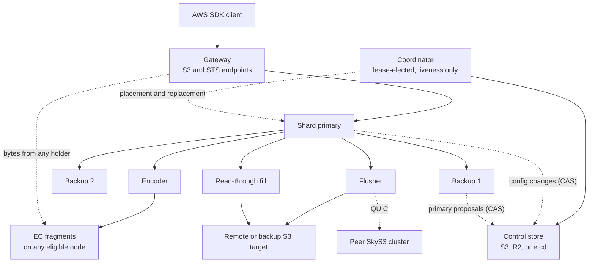
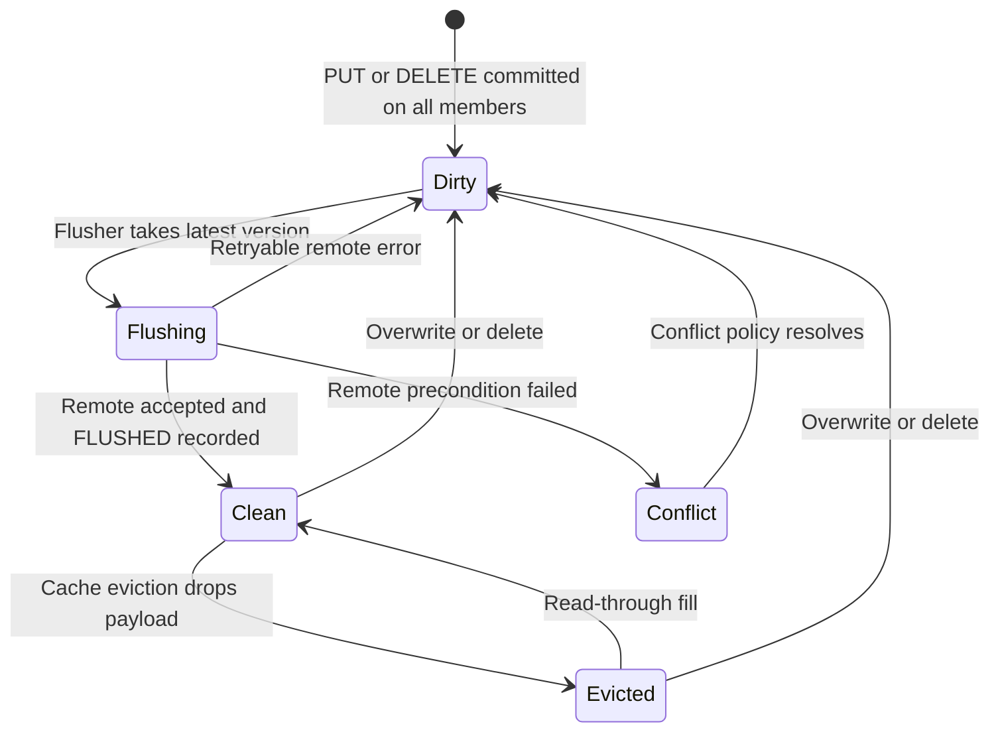
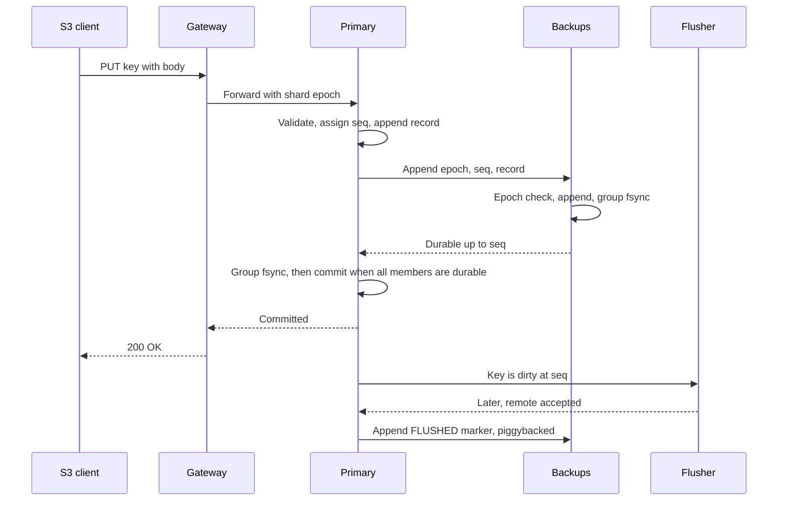
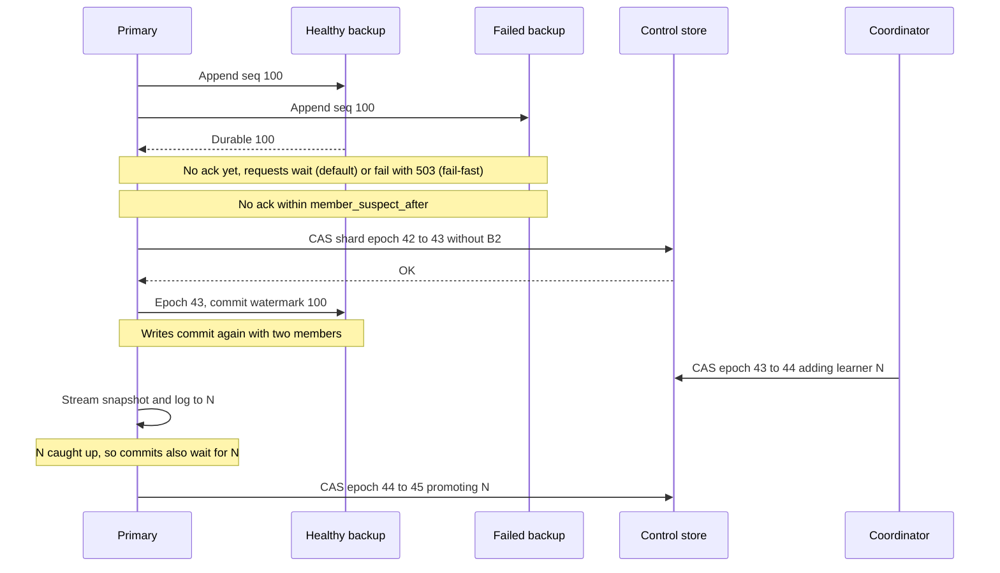
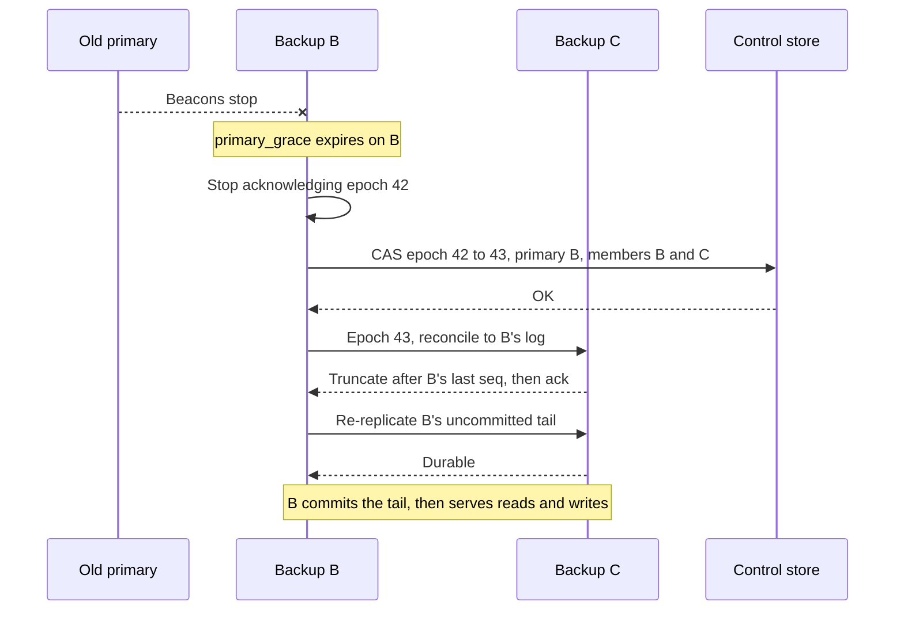
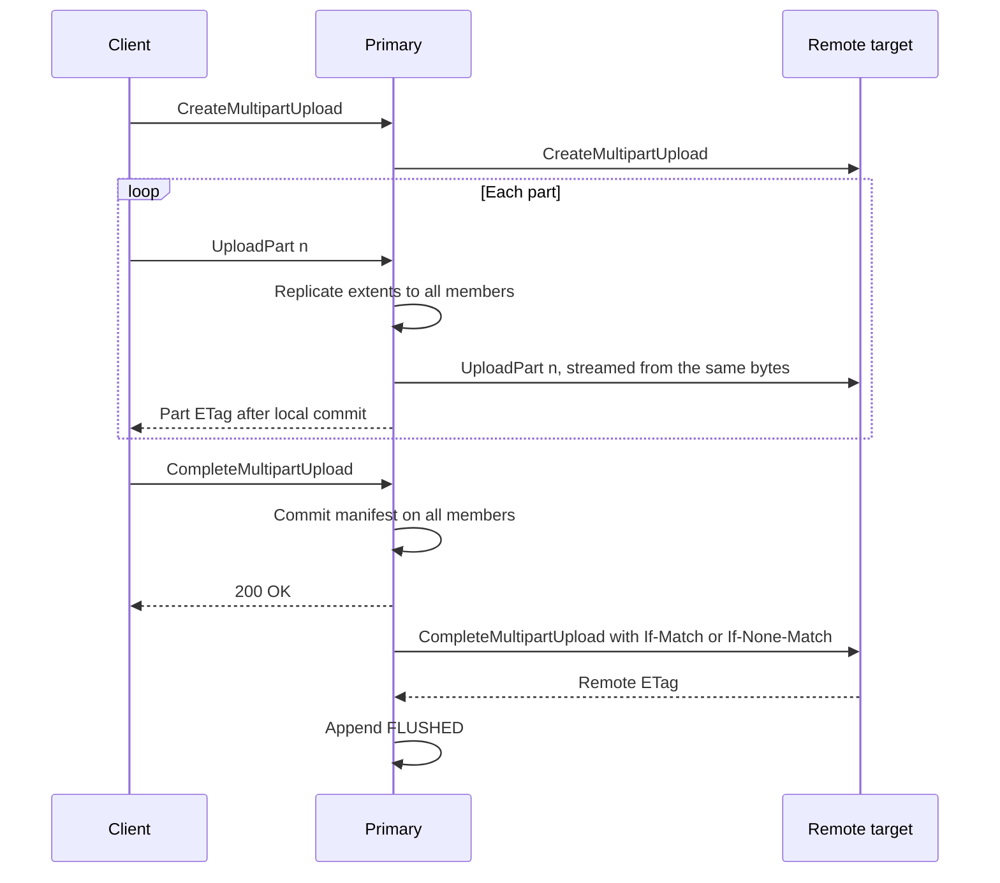
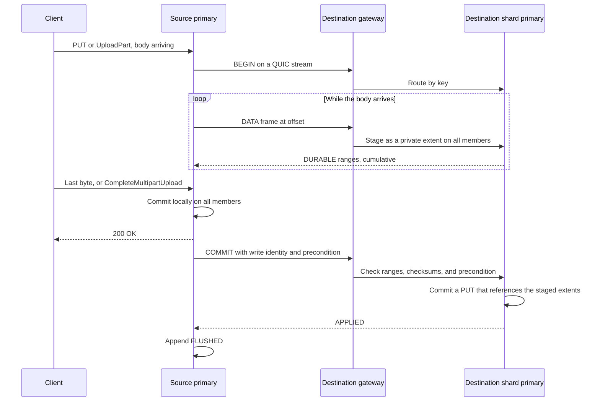
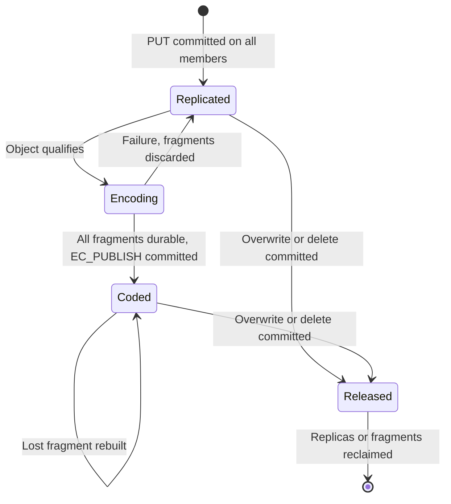

# SkyS3: Replicated S3 Cache and Object Store Design

**Status:** Proposed, for review
**Date:** 2026-09-22
**Supersedes:** the architecture proposal in [skys3/skys3#2](https://github.com/skys3/skys3/pull/2)
**Scope:** S3-compatible storage cluster in Rust whose buckets are either write-back caches in front of remote S3 targets or local, erasure-coded object storage

## Contents

- [1. Context and summary](#1-context-and-summary)
- [2. Goals, non-goals, and assumptions](#2-goals-non-goals-and-assumptions)
- [3. Architecture](#3-architecture)
- [4. Data model](#4-data-model)
- [5. Shard replication: all members acknowledge](#5-shard-replication-all-members-acknowledge)
- [6. Automatic membership without a consensus service](#6-automatic-membership-without-a-consensus-service)
- [7. Write-back flush](#7-write-back-flush)
- [8. Local buckets and erasure coding](#8-local-buckets-and-erasure-coding)
- [9. Reads, namespace, and cache management](#9-reads-namespace-and-cache-management)
- [10. Node storage engine](#10-node-storage-engine)
- [11. S3 surface and workload identity](#11-s3-surface-and-workload-identity)
- [12. Security](#12-security)
- [13. Failure matrix](#13-failure-matrix)
- [14. Illustrative configuration](#14-illustrative-configuration)
- [15. Rust dependencies](#15-rust-dependencies)
- [16. Testing and acceptance](#16-testing-and-acceptance)
- [17. Delivery plan](#17-delivery-plan)
- [18. Alternatives considered](#18-alternatives-considered)
- [19. Open questions and risks](#19-open-questions-and-risks)
- [References](#references)

## 1. Context and summary

SkyS3 is an S3-compatible storage cluster. Each bucket runs in one of two main modes, which share the same write path, replication, and membership machinery:

- **Write-back buckets** sit in front of a remote S3 target. Clients get local latency for reads and writes. The remote target is the system of record: every write is flushed to it asynchronously, and local copies of flushed data are cache.
- **Local buckets** keep their data only in the cluster. Large objects are erasure-coded in the background for space efficiency, and small objects stay replicated. A local bucket can also flush to a backup target.

The previous proposal (#2) designed SkyS3 as an authoritative object store with deferred erasure coding, Raft metadata groups, and native cross-region replication. Three review findings shaped this design:

1. Two Raft rounds per PUT cost more durable I/O than the replication scheme saved. A replicated log where every member acknowledges needs one durable round and no consensus on the request path.
2. Membership must change automatically. Operators should never have to evict, promote, or replace replicas by hand.
3. The main use case is a write-back cache, but local-only buckets must remain possible. The design covers both, so it can replace the previous proposal without Raft (section 1.3).

### 1.1 Decisions

1. **No consensus on the request path.** Each key belongs to a shard. Each shard has one primary and a small set of backups (three replicas by default). A write succeeds only after **every current member** has made it durable. A member that stops acknowledging is removed automatically. By default, requests wait through the removal; a fail-fast mode returns 503 instead (section 5.2). This is the SeaweedFS volume model[^seaweed-repl] applied to both payload and metadata.
2. **Membership changes automatically through a pluggable control store.** Every shard's configuration is one small compare-and-swap register. The first backends are etcd[^etcd-api], the recommended production default, and S3 conditional writes (`If-Match` / `If-None-Match`)[^s3-cond] on AWS S3, Cloudflare R2[^r2-api], or any provider that passes a startup probe, placed in a different failure domain from every data target (section 6.1). Epochs fence stale primaries. Primary leases are granted by the backups, and every node keeps a durable local copy of the control state it uses, so the data path never waits on the control store. This is the PacificA / Vertical Paxos family of designs[^pacifica][^vpaxos], with the control store as the configuration master.
3. **Replicate first, then move data to its durable home.** New writes are replicated to every shard member (3 by default). A write-back bucket then flushes to its remote target and keeps `clean_copies` local copies as evictable cache. A local bucket erasure-codes each large object in the background and keeps small objects replicated. Each object is encoded on its own, so deletes free space without a cross-node cleaner.
4. **Ordered, coalescing, conditional flush.** Each shard flushes its keys in commit order, uploads only the latest version of a key, and uses conditional requests so that out-of-band writes to the remote are detected instead of silently overwritten.
5. **Streaming flush for large objects.** Multipart parts, and large single PUTs, are streamed to the remote while the client is still uploading. The remote object becomes visible only when the local upload has committed. When the remote is another SkyS3 cluster, flush uses a native protocol over QUIC with byte-range resume, built for long, lossy links (section 7.8).
6. **One durable round per small PUT.** Payload and metadata travel in a single replicated log record. A small PUT costs 3 group-committed fsyncs in one round, with no consensus round.
7. **Reads scale out.** The shard primary resolves which version is current. The bytes can come from any replica, fragment, or node-local hot cache holding that exact version.

### 1.2 Changes from the previous proposal

| Area | Previous proposal (#2) | This design |
|---|---|---|
| Role of the local cluster | Authoritative object store, plus a separate read-through cache | Per bucket: write-back cache (remote is the system of record), local store, or read-only origin cache |
| Metadata | Regional Raft groups with 5 voters | Per-shard primary/backup replication, every member acknowledges |
| Membership changes | Raft reconfiguration | CAS registers in a pluggable control store (S3, R2, etcd) plus a lease-elected coordinator, fully automatic |
| Local redundancy | 3 replicas, then deferred EC | Write-back: replicas while dirty, then `clean_copies` evictable copies. Local: replicas, then per-object EC for large objects |
| Erasure coding and cleaning | Packed segments with cross-node EC-to-EC cleaning | Per-object EC in local buckets; node-local compaction only |
| Cross-region durability | Native streaming replication over QUIC | Streaming flush to a remote or backup target. Between SkyS3 clusters, a native QUIC protocol with byte-range resume; S3 REST otherwise |
| Small PUT before acknowledgement | 3 serial durable rounds, about 13 sync participants | 1 round, 3 participants |

### 1.3 Coverage of the previous proposal

With local buckets, this design covers the previous proposal's single-region feature set without Raft:

| Previous proposal (#2) | This design | Remaining gap |
|---|---|---|
| 3-replica ingest, then deferred EC | 3-replica ingest, then per-object EC for objects of at least `ec_min_object_bytes` (section 8) | Small objects stay replicated. Packing them into shared EC segments is deferred (section 19). |
| Strongly consistent regional metadata | Per-shard, all-member commit with leases (sections 5 and 6) | None |
| Survives two node failures | Any two of a shard's three replicas, or two of a stripe's fragments | The budget counts failures before repair completes. After a member loss, the shard's data has two copies until backfill restores the third, so the exposure is the repair time (section 6.4). A single surviving replica is read-only until replacements catch up. |
| Fully on-site operation | The data path is fully on-site. Membership changes need the control store. | Sites without S3 access use etcd, or the future embedded-Raft backend (section 6.1) |
| S3 API, STS / workload identity, read-through origins | Same (sections 9 and 11) | Local versioning is deferred (section 19) |
| Native pre-completion multi-region replication | A backup or write-back target that is another SkyS3 cluster, over the native QUIC transport (sections 7.8 and 8.9) | None between SkyS3 clusters. Other S3 providers resume per multipart part. |

## 2. Goals, non-goals, and assumptions

### 2.1 Goals

| Goal | How the design meets it |
|---|---|
| Low-latency, low-IOPS writes, especially small objects | One replicated log append per PUT, group commit, no consensus on the path |
| Durability of acknowledged writes before flush | Durable on every member of the shard (3 by default) before success |
| No manual membership changes | Failure detection, member removal, primary failover, replacement, and rebalancing are automatic |
| Remote S3 as system of record for write-back buckets | Ordered, conditional, idempotent flush; clean data is evictable |
| Space-efficient local-only storage | Per-object erasure coding of large objects in local buckets |
| Hot reads served locally, and read scaling | Clean cache with read-through fill; bytes served by any holder of the exact version, plus node-local hot caches |
| AWS SDK compatibility including OIDC/STS workload identity | Standard S3 wire protocol plus `AssumeRoleWithWebIdentity` |
| Client-side encryption (E2EE) | Ciphertext is stored and flushed byte for byte; no SSE or KMS |
| Upload overlaps transfer to the remote | Streaming flush of multipart parts and large PUTs |
| Reliable replication over long, lossy links | Native QUIC transport between SkyS3 clusters: byte-range resume, preconditions on every operation, and batched small objects (section 7.8) |

### 2.2 Non-goals for the first release

- Multiple SkyS3 clusters writing the same remote prefix. Other clusters may attach it read-only.
- Sharing a remote prefix with other writers. Out-of-band writes are detected (section 7.2), not merged.
- Local S3 versioning APIs (`ListObjectVersions`, version-id reads). The remote bucket of a write-back bucket may have versioning enabled. Local buckets are the main reason to add versioning later (section 19).
- Packing small objects into shared erasure-coded segments, and tiering between local storage classes.
- Object Lock, S3 Select, inventory, notifications, and bucket-level replication APIs.
- Server-side encryption (SSE-S3, SSE-KMS, SSE-C). Requests for them are rejected explicitly.

### 2.3 Assumptions

- Linux on x86-64 or AArch64 with local disks that honor `fsync`.
- 3 or more storage nodes per cluster. Nodes may have different disk counts.
- Monotonic clocks whose rate drift is bounded by `ρ` (1% is assumed). Wall-clock agreement is not required.
- The control store offers a linearizable compare-and-swap per key (section 6.1): an S3 bucket with conditional writes, such as AWS S3 or Cloudflare R2, or an etcd cluster. S3 providers must pass a startup probe.
- Erasure coding needs at least 5 eligible nodes. Smaller clusters keep local buckets fully replicated.
- Remote targets of write-back buckets are reachable most of the time. SkyS3 rides through remote outages for reads of cached data and for writes up to a dirty-data budget.

## 3. Architecture


```mermaid
flowchart TB
    Client["AWS SDK client"] --> GW["Gateway<br/>S3 and STS endpoints"]
    GW --> P["Shard primary"]
    P --> B1["Backup 1"]
    P --> B2["Backup 2"]
    P --> F["Flusher"]
    F --> Remote["Remote or backup S3 target"]
    F -. "QUIC" .-> Peer["Peer SkyS3 cluster"]
    P --> Fill["Read-through fill"]
    Fill --> Remote
    P --> Enc["Encoder"]
    Enc --> Frag["EC fragments<br/>on any eligible node"]
    GW -. "bytes from any holder" .-> Frag
    Coord["Coordinator<br/>lease-elected, liveness only"] --> CS["Control store<br/>S3, R2, or etcd"]
    P -. "config changes (CAS)" .-> CS
    B1 -. "primary proposals (CAS)" .-> CS
    Coord -. "placement and replacement" .-> P
```

All roles run from a single binary. Every node runs the gateway and the storage engine by default, and any node can be elected coordinator.

- **Gateway.** Terminates S3 and STS HTTP, authenticates requests, routes each key to its shard primary using a cached shard map, and streams request bodies.
- **Shard replica.** Holds one shard's log records, index, and replicated or cached payload. The primary orders writes, replicates them, resolves reads, and runs the shard's flusher and encoder.
- **Fragment store.** Every node stores erasure-coded fragments for any shard's objects in node-local fragment segments (section 10.1).
- **Coordinator.** Handles placement, replacement, rebalancing, and node bookkeeping. It holds a lease in the control store. It is never on the request path, and it can never break safety, because every change it makes is a CAS.
- **Control store.** A set of CAS registers, in an S3 bucket or an etcd key prefix, holding the cluster, bucket, shard, and identity configuration. No client request touches it, and every node keeps a durable local copy of the parts it uses (section 6.2). It should be the store nearest the cluster, which need not be a data target's endpoint, and it must not be a SkyS3 bucket.

## 4. Data model

### 4.1 Buckets, targets, and shards

Each **bucket** has a mode, fixed at creation:

| Mode | System of record | After a write commits |
|---|---|---|
| `write_back` | A remote S3 target: endpoint, bucket, optional prefix, credentials | Flushed to the target; `clean_copies` local copies kept as evictable cache |
| `local` | The SkyS3 cluster | Large objects erasure-coded, small objects stay replicated, and optionally everything flushed to a backup target (section 8) |
| `read_only` | An external origin that SkyS3 does not own | Writes are rejected; reads fill a cache (section 9.5) |

Attaching a `write_back` bucket imports the remote namespace (section 9.1). Deleting a SkyS3 bucket detaches it and leaves any remote untouched.

**Detaching.** DeleteBucket first seals every shard of the bucket. A sealed shard commits no client write, and reports what it holds, counting every write committed before the seal; flushing continues. A `write_back` bucket is refused with `409 BucketNotEmpty` while any entry is dirty, flushing, or in conflict, delete tombstones included: those changes exist nowhere else. Clean and evicted entries do not block, since their system of record is the remote. A `local` bucket is refused while it holds any object, as S3 refuses a non-empty bucket. A refusal lifts the seals, and the client retries once the flusher has drained the bucket. Detaching never waits for a drain itself, because a conflict held by the `hold` policy (section 7.2) may never drain without an operator. Otherwise the bucket register is deleted at the version read before sealing, and the shards are dropped. If the register changed in between, the seals are lifted and the request fails with `409 OperationAborted`. If the delete's outcome is unknown, the shards stay sealed, so no write is acknowledged into a bucket that may be gone, and the gateway remembers the pending deletion (at most 256, oldest forgotten first). A retried DeleteBucket resolves it by the lost-response rule for deletes (section 6.1). If the register is gone, or names a new bucket, the earlier delete applied: the retry drops the old shards, increments the generation that was never incremented, and answers `204`, the answer the first request would have had; AWS answers `404 NoSuchBucket` to a retry after a delete that succeeded, but there the client saw the success. If the register is still at the version the delete named, the delete may yet land, so the seals stay until a later attempt resolves it; once the register has moved to another version, no such delete can apply, and the seals are lifted. A restart lifts them too. Seals nest, so concurrent DeleteBucket requests cannot lift each other's. In M1 the gateway and every shard share a process, so a crash lifts the seals with everything else; a seal held across nodes is specified with the shard map (plan M2-08). Shards whose bucket ID no register names, left by a creation or deletion whose outcome was unknown, are reclaimed by startup recovery (plan M1-13).

Replication is configured per bucket, because every shard belongs to exactly one bucket:

- `replicas`: the number of shard members, and so of copies of every write until it reaches its durable home (default 3).
- `min_write_replicas`: the fewest copies every new write must reach, counting members and learners already acknowledging (default 2, section 6.4).
- `clean_copies`: for `write_back` buckets, how many members keep a flushed object as cache, from 0 to `replicas` (default 1). More copies spread read load (section 9.2).

Each bucket has a fixed number of shards chosen at creation (`shards_per_bucket`, default 8, maximum 256). A key is assigned by `hash(bucket_id, key) mod shards`. Hash sharding avoids split and merge machinery. The cost is that LIST merges results from every shard of the bucket (section 9.4). Changing a bucket's shard count later is deferred.

**Bucket IDs.** A bucket's ID is not its S3 name. It is assigned when the bucket is created and never reused in the cluster, even after the bucket is deleted. A bucket recreated with the same name and remote therefore hashes keys differently and writes identities that no object flushed by its predecessor carries, so the 412 recovery rule (section 7.2) cannot mistake an old remote object for a new write. Bucket IDs are at most 25 bytes (section 7.2).

**The shard hash.** A key's shard can never change for an existing bucket, so the hash is fixed and frozen with golden vectors. Version 1 hashes the bytes `"skys3-shard-v1" 0x00 bucket_id 0x00 key` with SHA-256 (FIPS 180-4), using the key's bytes exactly as stored. The first 8 bytes of the digest, read as a big-endian integer, are the key hash, and the shard is the key hash mod `shards_per_bucket`. A bucket ID never contains a zero byte, so the encoding is unambiguous, and the modulo bias is below 2⁻⁵⁶. SHA-256 is chosen because its specification is a standard that every language and `sha256sum` implement, so any tool can reproduce shard assignment. It is already a dependency for checksums (section 15), and its cost, about a microsecond or less for a typical key, is small next to a request. Rust's `DefaultHasher` makes no stability guarantee, and fast non-cryptographic hashes such as xxHash would add a dependency and a less universal specification for no measurable gain.

Each shard has a **configuration**: an epoch, a primary, members, learners, and `min_write_replicas`. Members acknowledge every write. Learners receive the log while catching up and do not acknowledge.

### 4.2 Object states

Every key in a shard's index has one entry. In a `write_back` bucket, entries move through these states:


```mermaid
stateDiagram-v2
    [*] --> Dirty: PUT or DELETE committed on all members
    Dirty --> Flushing: Flusher takes latest version
    Flushing --> Dirty: Retryable remote error
    Flushing --> Clean: Remote accepted and FLUSHED recorded
    Flushing --> Conflict: Remote precondition failed
    Conflict --> Dirty: Conflict policy resolves
    Clean --> Evicted: Cache eviction drops payload
    Evicted --> Clean: Read-through fill
    Clean --> Dirty: Overwrite or delete
    Evicted --> Dirty: Overwrite or delete
```

- **Dirty** entries carry payload on every member and are never evicted.
- **Clean** entries match the remote. At most `clean_copies` members keep the payload (default 1).
- **Evicted** entries (stubs) keep metadata only: key, size, ETag, remote ETag, remote version ID, checksums, user metadata, and tags.
- A flushed delete removes the entry from the index entirely.

Local buckets use the same replicated state for new writes, then move large objects to a coded state instead of flushing them (section 8.4).

**Applying records.** Every replica applies a shard's records with one deterministic function of the record and its index, specified in the `skys3-shard` crate's `machine` module. A rejected record leaves every entry as it was; it still advances the applied position, and the writer learns why. The rules the diagram leaves open:

- `PUT`, `DELETE`, and `TAGS` make a new version at the record's position, dirty, from any state and from no entry; a `DELETE` of a key with no entry leaves a tombstone (section 9.1). A key in conflict stays in conflict until the conflict policy resolves it. The new version keeps the entry's `remote_etag` and `remote_version_id`, which still describe the remote. `TAGS` keeps the bytes, size, ETag, and `Last-Modified`, and its version's write identity names the `TAGS` record; how it reaches the remote is decided with the flusher (plan M1-16). It is rejected for a key with no live object.
- `FLUSHED` of the current `seq` moves a dirty, flushing, or conflicted entry to clean, or removes a tombstone; it is rejected for a clean or evicted entry, for a `seq` newer than the entry's, and when its `remote_etag` is absent for an object or present for a tombstone. `FLUSHED` of an older `seq` while a newer version is not yet clean records the remote ETag and version ID the flush produced, so that the newer version's flush conditions on them (section 7.1), and leaves the entry dirty. Once a newer version is clean, it is rejected. The flusher commits the `FLUSHED` of a tombstone only once the import has passed its key (section 9.1).
- `IMPORT` creates an evicted stub, with `remote_etag` and `local_etag` the listed ETag, only for a key with no entry at all.
- `ADOPT` applies only to a clean or evicted entry whose `seq` is the one named. The remote version replaces it as an evicted stub at the `ADOPT` record's position, so its version identity is new; its tags are unknown and left empty.
- `EXTENT` and a `PUT` with inline data enter their record into the node-local location map. Applying never removes a location: which payload is still live is decided by compaction (section 10.3).
- `CONFIG` and `TRUNCATE` change no entry.

An entry records `local_etag` (what S3 clients see), `remote_etag` (what the remote returned), and `remote_version_id` when the remote is versioned. These usually match (section 7.4).

## 5. Shard replication: all members acknowledge

### 5.1 Write path


```mermaid
sequenceDiagram
    participant C as S3 client
    participant G as Gateway
    participant P as Primary
    participant B as Backups
    participant F as Flusher
    C->>G: PUT key with body
    G->>P: Forward with shard epoch
    P->>P: Validate, assign seq, append record
    P->>B: Append epoch, seq, record
    B->>B: Epoch check, append, group fsync
    B-->>P: Durable up to seq
    P->>P: Group fsync, then commit when all members are durable
    P-->>G: Committed
    G-->>C: 200 OK
    P->>F: Key is dirty at seq
    F-->>P: Later, remote accepted
    P->>B: Append FLUSHED marker, piggybacked
```

1. The gateway sends the request to the shard primary. The request carries the shard epoch the gateway knows about. A primary that is not current rejects it with a redirect hint.
2. The primary validates the request: authorization, conditional headers against its index, signature, length, and checksums. It then assigns the next per-shard sequence number `seq` and appends one record to its local log. The record holds the key, the object metadata, and either the payload inline (up to `inline_max_bytes`) or references to extent records already streamed.
3. The primary sends the record to every member in parallel. Each member rejects appends from an epoch older than the newest one it knows, checks that `seq` follows its last record, appends, and acknowledges once a group fsync covers the record.
4. **Commit rule.** A record at `seq` in epoch `e` is committed when every member of epoch `e`'s configuration, including the primary, has acknowledged it as durable. The primary then applies it to its index and returns success.
5. Members learn the commit watermark from later appends and heartbeats, and apply committed records to their own index.

Large bodies are streamed as 1 MiB extent records, which are replicated the same way while the body arrives. The final PUT record references them. Payload and metadata never take separate durable rounds.

**Sequencing on a replica.** The primary checks that a record encodes, and for a `PUT`, that every extent it references is applied, before it gives the record a position, so a refused record never leaves a gap in the log. Records become durable out of order, because extents and other records are in segments that sync independently (section 10.1), but they are applied strictly in position order: a record is applied, and its writer answered, only once every earlier record of the shard is durable and applied. So an applied position means every earlier record was applied, `EXTENT` records included (section 10.2), and a small `PUT` is never applied ahead of the extents of an upload sequenced before it. A record that cannot be made durable stops the shard: it and every later record fail, and nothing is acknowledged on the shard until the node reopens it after replaying its log. A replica that opens a shard in a newer epoch first appends a `CONFIG` record at `(epoch, last seq)` (section 10.1). A replica that has the shard open already adopts a newer epoch in order with its writes: the `CONFIG` record takes `(epoch, last seq)` after every record sequenced before it, later records are sequenced in the new epoch, and none of them is acknowledged before the `CONFIG` record is durable and applied. Opening the shard in the configuration it is in returns it unchanged; a configuration in an older epoch, or another configuration in the same epoch, is refused, because one epoch names one configuration. A shard being removed cannot open again until the removal finished, so a reopened shard never sequences from index state the removal then deletes. A seal is ordered with the shard's writes: it waits for every record sequenced before it, and refuses client writes (`PUT`, `DELETE`, `TAGS`, and `EXTENT`) sequenced after it, while `FLUSHED`, `IMPORT`, and `ADOPT` continue (section 4.1).

### 5.2 Failed writes

If any member has not acknowledged within `replica_ack_timeout`, the request fails with `503 SlowDown`. Every write needs every current member's acknowledgement. The timeout only decides how long a request waits for the membership to change.

A failed response means **not acknowledged**, not **not applied**. S3 has the same semantics for a 5xx or a timeout. The record may already be on some members. It will later either commit, when a reconfiguration removes the unresponsive member (section 6.4), or be discarded, when a new primary does not have it (section 6.6). Two rules keep this safe:

- **No reordering.** The log is strictly sequential per shard. A later committed write always supersedes an earlier failed one, so a failed PUT can never resurface over a later PUT or DELETE of the same key.
- **No holes.** A member cannot accept `seq + 1` without `seq`. While a member is unresponsive, the shard cannot commit anything until that member catches up or is removed.

`replica_ack_timeout` decides what clients see while a member is failing:

- **Wait through removal (default, 5 s).** The timeout is longer than `member_suspect_after` plus one control-store round trip. Configuration loading enforces this with a fixed allowance of 1 s for the removal CAS: `replica_ack_timeout > member_suspect_after + 1 s`. Requests in flight wait while the primary removes the member, then commit with the remaining members. Clients see added latency, not errors.
- **Fail fast (opt-in with `replica_ack_timeout_mode = "fail_fast"`, for example 2 s).** Requests fail with 503 as soon as a member is late. AWS SDK default retry policies (three attempts, backoff starting near 100 ms) usually give up inside the removal window. One sick disk then becomes client-visible errors on every shard that includes it: about `replicas × shards ÷ nodes` shards, or 240 in the section 6.1 example.

If the member cannot be removed, because the control store is unreachable, requests fail after the timeout in both modes. Section 16.3 measures the p99 cost of each.

### 5.3 Durable I/O per small PUT

| | Previous proposal, no batching | This design |
|---|---:|---:|
| Serial durable rounds before success | 3 (intent Raft round, payload, publish Raft round) | 1 |
| Sync participants before success | about 13, up to about 23 with durable Raft apply | 3 (primary and 2 backups) |
| Consensus or control-store calls on the path | 2 Raft commits | 0 |
| Background I/O per object | EC conversion writes about 1.5x the payload, plus cleaning | Write-back: one remote PUT. Local, large objects: one encoding pass writing `(k+m)/k` × the payload. Either way, a marker record carried in a later group commit |

Group commit batches fsyncs across all shards that share a disk, so the per-object sync count falls further under concurrency. Section 16.3 defines how these counts are measured. These counts assume a full replica set. After a member loss, writes commit with one fewer copy until a replacement starts acknowledging, and existing data has one fewer copy until backfill finishes (section 6.4).

The cost of this model is tail latency. Every PUT waits for the slowest of the member fsyncs, and one sick member stalls its shards until it is removed. Section 6.4 bounds that stall to roughly `member_suspect_after` plus one CAS round trip.

### 5.4 Leases and strong reads

The primary serves strongly consistent reads (GET, HEAD, LIST, and conditional checks) only while it holds a **lease from every member**. Leases are carried on heartbeats and appends every `lease_renew_interval`.

- A member that acknowledges a beacon sent at primary-local time `t` grants a lease valid until `t + primary_lease`, measured on the primary's clock.
- A member does not propose a new primary until `primary_grace` has passed on its own clock since the last beacon it acknowledged. `primary_grace ≥ primary_lease × (1+ρ)/(1−ρ) + margin` (defaults: 4 s lease, 6 s grace). The margin is 500 ms. It covers the time between the primary's lease check and the index read it admits, and timer granularity. Configuration loading enforces the inequality, and also `lease_renew_interval < primary_lease`.
- A node that restarts does not know when it last acknowledged a beacon, so it counts the restart as one: it proposes no new primary until `primary_grace` has passed since the restart.
- Learners in the acknowledgement set (section 6.4) grant leases as members do. While a promotion CAS is outstanding, the primary also needs the learner's lease to serve reads (section 6.7).
- **A new primary acknowledges nothing, neither reads nor writes, until the old primary can no longer serve reads.** There are two ways to establish that:
  - *Takeover after silence.* The candidate proposes only after `primary_grace` has passed since it last granted the old primary a lease. By then that lease has expired under the drift bound. The old primary needs a lease from every member, so it has already stopped serving. The new primary can serve as soon as reconciliation (section 6.6) finishes.
  - *Planned handoff.* The old primary first stops serving reads and writes, stops renewing its leases, and sends the candidate a step-down message with its last `seq`. Only then does the candidate propose. If the step-down message does not arrive, the candidate falls back to waiting out `primary_grace`. The step-down is durable: the old primary never serves again in that epoch, even after a restart, because a delayed step-down message still lets the candidate propose at once. A step-down message counts only for the epoch it names.

  Epochs alone fence the old primary's writes. The wait is for reads: without it, a gateway with a stale shard map could read an old value from the old primary after the new primary had acknowledged a newer write.

Clock assumptions affect **read linearizability** only. Write safety depends on epochs and the all-member commit rule, not on clocks. Leases come from members, not from the control store, so reads and writes continue while the control store is unreachable as long as no shard needs to change membership.

## 6. Automatic membership without a consensus service

### 6.1 The control store

The control store is a small interface, so different backends can hold the same registers:

```rust
trait ControlStore {
    /// Read a register and its version, or None if it does not exist.
    async fn get(&self, key: &str) -> Result<Option<(Bytes, Version)>>;
    /// Write only if the register is still at `expected`, or still absent.
    async fn put_if(&self, key: &str, expected: Expected, value: Bytes) -> Result<PutOutcome>;
    /// Delete only if the register is still at `expected`.
    async fn delete_if(&self, key: &str, expected: Version) -> Result<DeleteOutcome>;
    /// List registers under a prefix, for bootstrap and recovery.
    async fn list(&self, prefix: &str) -> Result<Vec<(String, Version)>>;
    /// Stream changes after a generation, from a native watch or by polling.
    async fn changes(&self, after: Generation) -> Result<ChangeStream>;
}
```

`put_if` and `delete_if` must be linearizable per key, and every value a register holds, across deletions and re-creations, has a version of its own. Nothing else is required: SkyS3 needs no transactions across registers, and the coordinator lease (section 6.7) is built from `put_if` plus local timers.

| Backend | Compare-and-swap | Change notification | Status |
|---|---|---|---|
| AWS S3 | `PutObject` with `If-Match: <etag>` or `If-None-Match: *`[^s3-cond] | Poll `cluster.json` | First release |
| Cloudflare R2 | The same headers, listed as supported on `PutObject`[^r2-api] | Poll `cluster.json` | First release, subject to the probe |
| Other S3-compatible stores | The same headers | Poll `cluster.json` | Only if the probe passes |
| etcd v3 | A transaction that compares the key's `mod_revision`[^etcd-api] | Native watch | First release |
| Embedded Raft on SkyS3 nodes | Compare-and-swap applied from the Raft log | Push | Future, for air-gapped sites |
| Local directory | Under an exclusive lock on the directory: write a temporary file, `fsync`, rename, `fsync` the directory | In-process | Single-node development; refuses to open once a second node is registered |
| In memory | A map under a lock | In-process | Tests and simulation |

etcd and embedded Raft are consensus systems themselves. They need no external service, but if a majority of their voters is lost permanently, recovering them needs an operator. An S3 or R2 backend has no voters to lose, but its provider must be reachable for membership to change (section 6.10).

Every backend uses the same register layout:

```text
<cluster-prefix>/
  cluster.json                  cluster id, format version, generation, global settings
  coordinator.lease             coordinator lease register
  nodes/<node-id>.json          node registration: address, failure domain, disks
  buckets/<bucket-name>.json    bucket mode, target binding, shard count, replication settings
  shards/<bucket-id>/<n>.json   shard configuration register
  identity/                     OIDC providers, roles, trust and session policies
```

**S3 backends.** Registers are objects in a control bucket. They are updated with `PutObject` and `If-Match: <etag>`, created with `If-None-Match: *`, and deleted with `DeleteObject` and `If-Match: <etag>`. A precondition failure (412) means someone else won. A `409 ConditionalRequestConflict` means a concurrent conditional write was in progress, and the caller retries after re-reading[^s3-cond]. At startup, each node probes an S3 control store. It runs 100 rounds across several scratch keys, racing conditional writers on different nodes, and requires exactly one winner in every round. After each round, the losers read the register and must see the winner's value, because the lost-response rule below depends on read-after-write. A store that fails any round is refused. The conformance suite (section 16.1) runs the same probe against every backend, not only at startup.

A bucket register is keyed by the bucket's S3 name, which requests use to find it. Its shards are keyed by the bucket ID, which is never reused (section 4.1), so a bucket recreated under the same name never inherits an old shard register. Keys are `/`-separated segments of ASCII letters, digits, `-`, `_`, and `.`, none empty or starting with `.`, so every backend can store them as object keys, etcd keys, or file paths.

**Lost responses.** Each write includes a unique `proposal_id` in the value. If a response is lost and the retry fails its precondition, the proposer re-reads the register. If the register contains its own `proposal_id`, the write succeeded. This applies to every backend. The retry sends the same value under the same precondition, so at most one attempt can apply, even one still in flight. A `409` or an outage applied nothing, and the request is sent again as it is. A write that landed and was overwritten before the re-read cannot be told from a lost race, and is treated as one: the proposer acts on the register's current value, as a loser would. For bootstrap, this means a node may not learn that it created `cluster.json`, which is harmless because bootstrap is idempotent.

A deleted register holds no `proposal_id`, so a lost delete response is resolved by the register's absence. The retry sends the same conditional delete, which can apply only while the register is still at the version the proposer read. If it fails its precondition after an unanswered attempt, the proposer re-reads: an absent register counts as deleted, whether by this proposal or by another proposer, since either way the version it read is gone. A present register means the delete did not apply, or applied before the register was created again; both are treated as a lost race. Because the original request reported neither, the change was never announced: the proposer that later learns an unannounced create or delete applied increments the generation then. CreateBucket increments it whenever its create loses to an existing register it did not know, which covers a creation whose answers were all lost, and DeleteBucket does when it resolves a pending deletion (section 4.1). Tombstone values carrying a `proposal_id` were rejected: registers would never disappear, and every reader and lister would have to skip them.

An example shard register:

```json
{
  "bucket_id": "b-7f3a",
  "shard": 5,
  "epoch": 42,
  "primary": "node-3",
  "members": ["node-3", "node-7", "node-9"],
  "learners": [],
  "min_write_replicas": 2,
  "replicas": 3,
  "proposal_id": "01J8Z6K3V2Q4"
}
```

Register values are JSON objects. Readers reject unknown fields and invalid values, and the format version in `cluster.json` covers every register, so a new field comes with a new format version.

#### Traffic and latency

**No object request reads or writes the control store.** Routing, leases, commits, and reads all stay inside the cluster. Of the bucket operations, only CreateBucket and DeleteBucket do: they write the bucket register and increment the generation, and DeleteBucket reads the register first. HeadBucket, ListBuckets, and GetBucketLocation are answered from the node's local copy (section 6.2). The control store sees background traffic, plus bursts when membership changes:

| Activity | Control-store requests | Effect of a 100 ms round trip |
|---|---|---|
| Any object request | 0 | None |
| CreateBucket, DeleteBucket | 2 to 4 (read, CAS, generation increment) | Adds a few round trips to an operation that is rare |
| Primary leases | 0 (granted by backups, section 5.4) | None |
| Coordinator lease renewal | 1 conditional PUT every `coordinator_lease / 3` | None while renewal fits well inside the lease |
| Configuration propagation (section 6.2) | S3 backends: 1 conditional GET per node every `config_poll_interval`, usually `304 Not Modified`. etcd: a watch. | None |
| Member removal or primary takeover | 1 CAS per affected shard | Adds about 1–2 round trips to a failover dominated by `member_suspect_after` or `primary_grace` |
| Member replacement | 2 CAS per shard (add learner, promote) | None on writes; promotion does not pause commits (section 6.7) |
| Node restart with an intact local copy | 0 for shards whose membership did not change | None |
| Node restart without a local copy | 1 GET per register it needs, issued in parallel | Proportional to register count ÷ parallelism |

Losing a node generates a burst of CAS requests: one per shard the node belonged to, for example about 240 in a 20-node cluster with 1,600 shards. Issued in parallel, the burst adds well under a second. It stays far below S3 per-prefix request limits.

**Placement.** The control store must not share a failure domain with any data target. Otherwise one regional outage removes flushing and membership changes together, and during it a single node failure takes that node's shards offline: about `replicas × shards ÷ nodes` shards. For production:

- **etcd running on-site is the recommended default.** It is independent of every remote target by construction.
- **An S3 or R2 control store** is supported when it is in a different provider or region from every data target. For example, R2 can serve a cluster whose targets are in AWS, or whose buckets are all `local`.
- **The configuration validator refuses** a control store that it can tell shares a provider region with a data target, unless `allow_correlated_control_store = true`. It can tell when both endpoints have the same host name or IP address, or are AWS S3 endpoints in the same region. Configuration loading checks backup targets; attaching a bucket checks its target.

Within those rules, prefer the store nearest the cluster. Its latency only affects failover time.

### 6.2 Local copies of control state

The control store holds **only cluster control state**. Object metadata lives in each shard's index on every shard replica (section 9.1). The remote targets hold the objects and their S3 metadata.

Every node also keeps a durable local copy of the control state it uses:

| State | Local copy | Kept current by |
|---|---|---|
| Configuration of each shard the node belongs to | A `CONFIG` record in that shard's log (section 10.1) | The replica appends it, and group commit makes it durable, before the replica acts on the new epoch |
| Shard map used by the gateway for routing | Node-local index, with each shard's epoch | Redirect hints from shard replicas, and coordinator pushes |
| Bucket bindings, identity and trust configuration, node registry | Node-local index, tagged with a configuration generation | Coordinator pushes, plus polling of `cluster.json` |

**Propagation.** Every control-store change the coordinator makes also increments the generation number in `cluster.json`, and the coordinator pushes the change to every node. As a backstop, each node polls `cluster.json` every `config_poll_interval` with `If-None-Match: <etag>`, and refetches changed objects only when the generation moves.

`cluster.json` is created at generation 1 with `If-None-Match: *`. The generation is incremented after the writes it announces, never before, so a node that sees the new generation and then lists the registers finds them. An increment that loses its CAS to another increment needs no retry: the winner wrote after the loser's changes, so its generation announces them.

`changes(after)` delivers reports with these semantics, for every backend:

- It reports when it observes a generation other than the one it last reported, or than `after` before its first report. The first report is a snapshot: every register under `nodes/`, `buckets/`, `shards/`, and `identity/`, with its version. Later reports list the registers whose version changed since the previous report. `cluster.json` and `coordinator.lease` are not reported.
- A write announced by generation `g` is reported, at its version or a later one, no later than the first report at or after `g`. A write never followed by an increment may be reported early, or never.
- Reports are coalesced and at least once: a register written several times between reports appears once, at its latest version, and the reader acts on the value it reads, not on the reported version. A node with no local copy passes generation 0 and receives a snapshot at once.

**Stale routing.** A shard replica that is not the current primary rejects a forwarded request with its current configuration (epoch, primary, members). The gateway updates its shard map from that hint and retries, without touching the control store. It reads the shard register directly only if no member of the configuration it knows answers.

**The control store is the authority; local copies are caches.** Membership changes are CAS operations against the control store's current version, so there is exactly one place where competing changes are ordered. A stale local copy cannot cause an incorrect commit, because every data-path message carries an epoch and members reject old ones (rule R2 in section 6.3). The worst a stale copy costs is a redirect.

What the local copies make possible:

- **Restart while the control store is unreachable.** On restart, a replica loads each shard's latest `CONFIG` record and resumes. A shard whose membership did not change while the node was down resumes serving without contacting the control store. A shard whose membership did change is fenced by epochs, because the other members reject the stale configuration, until the node can read the current register.
- **STS during a control-store outage.** STS keeps validating tokens with the cached trust configuration and roles. A revocation made in the control store during the outage cannot reach the node, so new session issuance fails closed once the cached identity configuration is older than `identity_max_staleness`. Sessions already issued stay valid until they expire.
- **Rebuilding a lost control store.** If the control bucket is lost, a replacement can be rebuilt from the newest `CONFIG` record of every shard plus the cached bucket and identity configuration. Rebuilding is a deliberate operator action (section 6.9). Doing it automatically could let two clusters claim the same prefix.

### 6.3 Configuration rules

A new configuration always has epoch `e+1` and is written with CAS over configuration `e`. Four kinds of change exist:

| Change | Who proposes | Precondition |
|---|---|---|
| Remove a member | Current primary, or the coordinator | Member unresponsive for `member_suspect_after`, or the coordinator's placement decision |
| Take over as primary | A member of `e`, for itself only | `primary_grace` has passed since it last granted the primary a lease, or the primary has stepped down (section 5.4) |
| Add a learner | Coordinator | Placement rules allow the node |
| Promote a learner to member | Current primary | The primary already requires the learner's acknowledgements, and the learner is durable up to the commit watermark (section 6.7) |

Three rules carry the safety argument (section 6.8):

- **R1.** A configuration with a new primary can be written only by that new primary. It must have been a member (not a learner) of `e`, and before it proposes it must stop acknowledging epoch-`e` appends and stop granting leases.
- **R2.** Every member rejects appends stamped with an epoch older than the newest one it has seen.
- **R3.** A learner becomes a member only after it holds every committed record.

**Proposals are durable.** A node records each configuration it proposes, with its `proposal_id`, before it issues the CAS, and until it learns the outcome, across restarts too, it acts as if the CAS succeeded. A candidate keeps acknowledging nothing in epoch `e` and granting no leases (R1); a promoting primary keeps waiting for the learner (section 6.7). The lost-response rule (section 6.1) needs the `proposal_id` kept anyway. A candidate that forgot its proposal on restart could grant the old primary a lease and then find itself primary, and serve while that lease still holds.

### 6.4 Member failure


```mermaid
sequenceDiagram
    participant P as Primary
    participant B1 as Healthy backup
    participant B2 as Failed backup
    participant CS as Control store
    participant K as Coordinator
    P->>B1: Append seq 100
    P->>B2: Append seq 100
    B1-->>P: Durable 100
    Note over P,B2: No ack yet, requests wait (default) or fail with 503 (fail-fast)
    Note over P,B2: No ack within member_suspect_after
    P->>CS: CAS shard epoch 42 to 43 without B2
    CS-->>P: OK
    P->>B1: Epoch 43, commit watermark 100
    Note over P,B1: Writes commit again with two members
    K->>CS: CAS epoch 43 to 44 adding learner N
    P->>P: Stream snapshot and log to N
    Note over P: N caught up, so commits also wait for N
    P->>CS: CAS epoch 44 to 45 promoting N
```

Records that were pending when the member failed commit under the new epoch, because every remaining member has them.

If removing a member would leave fewer than `min_write_replicas` acknowledging copies, the removal still happens, so the shard stays readable. The shard rejects writes until a learner brings the acknowledgement set back to `min_write_replicas`.

**Durability window after a member loss.** The two-failure budget counts failures before repair completes. After a shard loses one member, **every** record it holds, old or new, has two copies. A second failure leaves one copy, and a third loses data. That is the usual replication contract, and the exposure is the time until the third copy is back. With the defaults (`replicas = 3`, `min_write_replicas = 2`), the shard keeps accepting writes during that time, and new writes are exactly as exposed as old ones. Three measures keep the window short and visible:

- **Live stream first.** A new learner joins the acknowledgement set as soon as it can store new records, before it has backfilled any history. New writes have three copies again within seconds of the learner being added. While it is in the acknowledgement set, a slow learner holds up commits just as a member would. Learners are not counted by the commit rule, so the primary drops a learner that misses `member_suspect_after` from the acknowledgement set on its own, without a CAS. If that leaves fewer than `min_write_replicas` acknowledging copies, writes stall until another learner joins. A dropped learner must catch up again before it rejoins the set or is promoted.
- **Under-replicated data first.** Backfill copies dirty and unencoded objects first, since they have no other home, and then the rest. Its duration is the exposure window for existing data. Promotion (rule R3) waits until backfill is complete.
- **Exposure metrics.** `under_replicated_bytes` and `oldest_under_replicated_age` report data with fewer than `replicas` copies.

A bucket can set `min_write_replicas = 3` for a stricter acknowledgement: every acknowledged write had three copies when it was acknowledged. That does not shorten the window for data already stored. Its cost is that, after any member loss, writes to the affected shards stall until a learner joins the acknowledgement set. That needs a spare eligible node, so in a 3-node cluster writes stall until the lost node returns.

### 6.5 Primary failure


```mermaid
sequenceDiagram
    participant A as Old primary
    participant B as Backup B
    participant C as Backup C
    participant CS as Control store
    A--xB: Beacons stop
    Note over B: primary_grace expires on B
    B->>B: Stop acknowledging epoch 42
    B->>CS: CAS epoch 42 to 43, primary B, members B and C
    CS-->>B: OK
    B->>C: Epoch 43, reconcile to B's log
    C-->>B: Truncate after B's last seq, then ack
    B->>C: Re-replicate B's uncommitted tail
    C-->>B: Durable
    Note over B,C: B commits the tail, then serves reads and writes
```

If several backups propose at once, CAS picks exactly one winner. The losers read the new register and follow it. Candidates may add a small random delay that shrinks as their durable `seq` grows, so the member with the longest log usually wins. That preference is not needed for safety.

If only one member survives, it can still take over. Every committed record is on every member, so a single survivor holds the full committed history. That is the main durability advantage of all-member commit over majority quorums. The shard stays readable, and becomes writable again once enough learners have caught up.

A deposed primary finds out on its next CAS attempt or on its next rejected append, and then stops serving.

Planned handoffs, used for rebalancing, follow the step-down path in section 5.4, so they do not wait for `primary_grace`.

### 6.6 Reconciling logs after a primary change

The new primary's log is authoritative for the new epoch:

1. It collects each member's last `(epoch, seq)`.
2. Each member truncates the records past the longest prefix of its log that matches the new primary's, comparing records by `(epoch, seq)`. A record keeps the epoch of the primary that created it when a later primary rolls it forward, and one primary per epoch assigns each `seq` once, so the pair identifies the record. Comparing `seq` alone is not enough: a member can hold, at a `seq` the new primary also holds, a different record from another epoch, for example a node re-admitted with its old log (section 6.7). The truncated records were never committed, because committing requires the new primary's acknowledgement. The shared per-disk log is not physically truncated. A `TRUNCATE(shard, epoch, seq)` record invalidates them (section 10.1).
3. The new primary re-replicates its log past each member's matching prefix, which includes its own uncommitted tail, commits it, and then accepts new writes.

The uncommitted tail is **rolled forward**. Clients that received a 503 for those writes may find them applied. Section 5.2 allows exactly that.

### 6.7 Placement, replacement, and node lifecycle

The coordinator holds `coordinator.lease`. It renews every `coordinator_lease / 3` with `If-Match`. A candidate takes over only after it has observed the same lease ETag for longer than `coordinator_lease × (1+ρ)`, measured on its own monotonic clock. No clock comparison between nodes is needed. Every renewal writes a fresh `proposal_id` (section 6.1), so the ETag changes even though the holder does not.

Every change the coordinator makes is a CAS, so two nodes that briefly both believe they are coordinator can only compete. They cannot corrupt state.

The coordinator:

- Tracks node health from heartbeats it receives directly. This is advisory only. Shard failover never depends on it.
- **Replaces** lost members. It adds a learner on an eligible node that respects failure-domain separation and capacity. The learner receives the live log at once and backfills a snapshot of the shard index and the payload it needs in parallel, under-replicated data first (section 6.4). Clean payload of write-back buckets is not copied, because the new member can fetch it from the remote if needed. Replicated objects of local buckets are copied. Coded objects are not, because their fragments live outside the shard (section 8.6).
- **Promotes** caught-up learners **without pausing commits**. The primary adds a learner to the set of acknowledgements every new commit waits for as soon as it accepts the live log, and drops it again, without a CAS, if it stops keeping up (section 6.4). When backfill is complete and the learner is durable up to the commit watermark, it holds every committed record, and the primary CASes the promotion. Commits keep flowing during the CAS and only wait for the learner's LAN acknowledgement. The control-store round trip is never on the write path. Requiring an extra acknowledgement never weakens the commit rule. If the CAS fails, the primary re-reads the register and either retries or stops waiting for the learner. Until the primary knows the outcome, after a lost response or a restart too, it keeps waiting for the learner even if it falls behind, and it serves reads only while it also holds the learner's lease (section 5.4). A CAS that succeeded unseen has already made the learner a member: a record committed without it would be missing from a member, and the old members' leases do not stop the new member from taking over.
- **Rebalances** shards and primaries across nodes, including newly joined ones, with add-learner, promote, remove steps. Primaries are moved by planned handoff: the current primary steps down and the target member proposes itself (section 5.4 and rule R1).
- **Re-admits** returning nodes. A node that was removed from a shard rejoins only as a learner. Its old records for that shard may seed catch-up after their `(epoch, seq)` prefix is verified, and are otherwise discarded.
- **Forgets** nodes that stay unreachable for `node_forget_after`, after re-homing their shards.

**Failure domains.** Nodes carry `zone` and `rack` labels, and `failure_domain` selects the level placement must respect: `node` (the default), `rack`, or `zone`. The coordinator enforces two rules at that level:

- at most one member of a shard per domain,
- at most `m` fragments of a stripe per domain, and never more than one per node, so losing a whole domain loses no more than a stripe can rebuild.

A bucket whose policy the cluster cannot satisfy is rejected at creation. If the cluster later stops satisfying it, for example after losing a rack, the coordinator never co-locates to make up the difference. Shards run with fewer members, encoding pauses so objects stay replicated, and cluster health reports the unsatisfied policy until capacity returns.

Joining a new node is a provisioning action: the node starts with valid credentials and registers itself. Every membership decision after that is automatic.

### 6.8 Safety argument (sketch)

- **Committed records survive.** A committed record is durable on every member of its epoch (commit rule). R3 extends this to every later member, and R1 guarantees any new primary was a member. Committed data is lost only if every member of a shard loses its disk before the data reaches its durable home.
- **One writer per epoch.** Committing in epoch `e` needs every member of `e`. When a member takes over, it first stops acknowledging `e` (R1). The CAS on the register serializes competing proposals, and R2 fences stragglers. A deposed primary therefore cannot commit anything after the takeover begins. A member removal leaves the primary unchanged and only shrinks the set whose acknowledgements are required.
- **Linearizable reads.** A primary serves reads only while every member's lease is valid. A new primary acknowledges nothing until the old primary has either stepped down or lost its lease from the new primary (section 5.4). So no read at the old primary can follow a write acknowledged by the new one.
- **Promotion keeps R3.** A learner is promoted only while every commit already waits for it and it has everything up to the commit watermark. Nothing commits in between without it, and the primary keeps waiting for it until it knows the outcome of the CAS.
- **Stale coordinators and stale local copies are harmless.** Every register update is a CAS, and every data-path message carries an epoch (section 6.2).

This protocol is PacificA's[^pacifica] with a control-store register as the configuration manager. Vertical Paxos[^vpaxos] gives the general correctness argument for this design family. The TLA+ model in `spec/` checks these properties with TLC, including restarts, clock drift within `ρ`, and gateways with stale shard maps, and CI checks that it catches a set of deliberately seeded protocol bugs (section 16.1). The durable proposals of section 6.3, the restart rule and the learner lease of section 5.4, and the `(epoch, seq)` comparison of section 6.6 came out of that model.

### 6.9 What still needs a human

- **Provisioning hardware.** Adding and physically retiring machines. Membership changes that follow are automatic.
- **Loss of the control store.** Bucket deleted, credentials revoked, or a provider that stops honoring conditional writes. The data path keeps running from local copies (section 6.2), but no membership change can happen until the store is restored, or an operator rebuilds it from the nodes' local copies.
- **Flush conflicts under the `hold` policy** (section 7.2).
- **Loss of a majority of voters** in an etcd or embedded-Raft control store.
- **Every member of a shard lost.** Data that had not reached its durable home is lost. The shard's index is lost too, so the cluster alone cannot list every lost key. SkyS3 reports what it can from the latest index snapshot (section 8.9): the keys whose data existed only on the lost members, and the time window after the snapshot in which other keys may also have been lost. For `local` buckets, coded objects are re-indexed from their fragment headers (section 8.4) by an operator-run recovery.

### 6.10 Control-store outages and the choice of referee

Local copies (section 6.2) let a cluster run **indefinitely** without its control store, not just for a grace period, as long as no shard needs a membership change. Reads, writes, flushing, encoding, and fragment repair all continue. STS is the one bounded exception (`identity_max_staleness`).

What cannot happen without the control store is a membership change. If a node fails while the control store is unreachable, every shard that includes the node stops accepting writes at once, and stops serving reads when its leases lapse (about `primary_lease`). The shards recover automatically once the control store is back.

Local copies cannot remove that dependency, because the problem is agreement, not information. Take a shard with members A, B, and C. Two properties would both be useful:

1. **Survive the loss of one member without the control store**, by letting the two surviving members agree on the next configuration.
2. **Let a single survivor take over automatically**, with the control store as referee.

They are incompatible. Under property 1, A and C may agree to drop B. Under property 2, B may at the same time get the control store to accept B alone. The two decisions have no participant in common, so nothing prevents both, and the shard would have two primaries.

This design chooses property 2: the control store is the only referee. The exposure is a node failure during a control-store outage, which is roughly the store's unavailability per node failure. Sites that cannot accept that use a control store that runs on-site: etcd now, or embedded Raft later. Section 6.1 keeps the control store out of every data target's failure domain, so one regional outage cannot take out both.

## 7. Write-back flush

### 7.1 Ordering and coalescing

Each shard primary runs a flusher over committed records in `seq` order:

- **Per-key order is preserved.** Each key has at most one flush in flight. If a newer version commits while an older one is being flushed, the newer version is flushed next, conditioned on the ETag the older flush produced.
- **Intermediate versions are coalesced.** Only the latest committed state of a key is flushed. If that state is a tombstone, the flusher issues `DeleteObject`.
- **Keys flush concurrently**, with adaptive concurrency per shard between `flush_min_concurrency_per_shard` and `flush_max_concurrency_per_shard` (section 7.7). Remote observers may see writes to different keys in a different order than they were committed. SkyS3 does not provide a cross-key snapshot at the remote.
- When the remote accepts, the primary appends a `FLUSHED(key, seq, remote_etag, remote_version_id)` record. The record is piggybacked on the next group commit and never triggers an fsync of its own. If it is lost in a crash, the key is flushed again. The retry is idempotent (section 7.2).

### 7.2 Conditional flush and ownership conflicts

SkyS3 assumes it **exclusively owns** the remote prefix. Every flush is conditional, so a violation of that assumption is detected:

| Local knowledge | Flush request |
|---|---|
| Key absent at the remote (imported namespace or earlier delete) | `PutObject` with `If-None-Match: *` |
| Key present with a known `remote_etag` | `PutObject`, `CompleteMultipartUpload`, or `DeleteObject` with `If-Match: <remote_etag>` |
| Remote state unknown, because the key was written locally before the import reached it (section 9.1) | `HeadObject` first, then one of the rows above |
| Copy of a clean source in the same target | `CopyObject` with `REPLACE` metadata and tagging directives, the copy's own write identity, `x-amz-copy-source-if-match`, and the destination precondition from the rows above (section 11) |

**Write identity.** Every object SkyS3 writes to a remote carries a write identity in its user metadata: `x-amz-meta-skys3-wid: <cluster>/<bucket>/<shard>/<epoch>.<seq>`. It names exactly one local write, by the `(epoch, seq)` of a specific log record. Streamed uploads need the identity before the body has arrived, so the record depends on how the write reaches the remote:

| Write | The identity names | Carried into |
|---|---|---|
| PUT, DELETE, or copy flushed after it commits | The committing `PUT` or `DELETE` record. A copy commits as a `PUT` that records its source (section 10.1). | Nothing else |
| Multipart upload | The `MPU_CREATE` record that opened it | The `MPU_COMPLETE` record |
| Large single PUT streamed during upload (section 7.3 or 7.8) | An `UPLOAD_BEGIN` record committed when streaming starts | The final `PUT` record |

The final record stores the identity it inherits, so the remote `CreateMultipartUpload`, a native `BEGIN`, a `COMMIT` replay, and the 412 HEAD check all compare the same value. A new primary that takes over a multipart upload reads it from the log. A streamed single PUT that fails never commits its final record, so its identity is never published. SkyS3 strips it from responses to its own clients. S3 counts both metadata keys and values against the 2 KiB user-metadata limit, so SkyS3 reserves 105 bytes out of the limit it enforces: the key `skys3-wid` and a value of at most 96 bytes. Other readers of the remote bucket can see it.

**Identity limits.** The fixed parts of a write identity take at most 47 bytes: a shard number of at most 3 digits, epoch and seq of at most 20 digits each, and 4 separators. Cluster IDs are limited to 24 bytes and bucket IDs to 25, so every identity fits in 96 bytes. Cluster, bucket, and node IDs (node IDs up to 63 bytes) use lowercase ASCII letters, digits, and `-`, and start and end with a letter or digit, the lowercase form of a DNS label. They are safe in register paths, header values, and file names on case-insensitive file systems, and never contain the separators `/` and `.`. Numbers are written in canonical decimal, without sign or leading zeros, so each identity has exactly one text form and the 412 check compares bytes.

On 412, the flusher HEADs the remote object. S3 answers an `If-Match` write to a key that has no current object with `404 NoSuchKey` rather than 412, so a 404 to a conditional write is handled the same way, and so is `404 NoSuchUpload` to a retried `CompleteMultipartUpload` whose first attempt completed the upload. If the object carries the write identity being flushed, an earlier attempt succeeded and only its response was lost, so the flush is recorded as done. A matching checksum and size are not enough: another writer could upload identical bytes with different metadata or tags. For a delete, a 412 or 404 followed by a HEAD that finds no object means the delete already happened. Anything else puts the key in **conflict**, and `flush_conflict_policy` decides what happens:

- `hold` (default). The key stays dirty and is not flushed. The conflict is reported through metrics and the admin API. Local reads keep returning the local version.
- `overwrite`. Flush unconditionally. Local writes win.
- `discard_local`. Adopt the remote version and drop the local one. This loses acknowledged writes, so it must be opted into per bucket.

Conditional-write support differs by provider and operation. When a target is attached, SkyS3 probes which of `PutObject`, `CompleteMultipartUpload`, and `DeleteObject` honor preconditions. Cloudflare R2, for example, lists conditional headers on `PutObject` but not on the other two[^r2-api]. A provider may ignore an unsupported header, applying the write unconditionally, or reject it with `501 NotImplemented`; the probe tells the two apart and treats both as unsupported. Operations without support are sent unconditionally, so an out-of-band write to that key can be overwritten silently. The bucket's status lists which operations are unprotected.

**The probe.** It tests each header of each operation separately (`If-None-Match: *` and `If-Match` on `PutObject` and `CompleteMultipartUpload`, `If-Match` on `DeleteObject`), once with a precondition that fails and once with one that holds. A header is *honored* if the failing write gets `412` and the holding one succeeds, *ignored* if the failing write is applied, and *rejected* if a write carrying it fails even when it holds (`501`, a `400`, or a `412`). An operation is protected only if all its headers are honored. Any other error, such as `403` or a transient one, fails the probe, and attaching fails or is retried; the probe itself does not retry. It writes only under a scratch prefix inside the target's prefix, `<prefix>.skys3-probe/<nonce>/`, with a fresh 64-bit nonce per run so that probes from several nodes never share keys. Before it returns, success or not, it deletes everything it created: each version and delete marker by version ID on a versioned bucket, so no history is left behind, each key on an unversioned one, and any multipart upload it left open. A write whose response was lost may have been applied, and is the last request the probe sends to its key, so the probe finds the version it may have created with `HeadObject` and deletes it. Two things it cannot find without `ListObjectVersions` or `ListMultipartUploads`, which the object-store interface does not have: the delete marker a lost `DeleteObject` response may hide on a versioned bucket, and the upload a lost `CreateMultipartUpload` response may hide (the abort-incomplete-uploads lifecycle rule of §7.3 removes it). Both are reported as possibly left behind. What it cannot remove is reported with its error.

A conditional write can also fail with `409 ConditionalRequestConflict` when another write to the key is applied while it is in progress. Nothing was written: the flusher re-reads the key (HEAD) and retries, as the control store does (section 6.1).

### 7.3 Streaming flush for large objects

For multipart uploads, and for single PUTs of at least `streaming_flush_min_bytes`, data is sent to the remote while the client uploads:


```mermaid
sequenceDiagram
    participant C as Client
    participant P as Primary
    participant R as Remote target
    C->>P: CreateMultipartUpload
    P->>R: CreateMultipartUpload
    loop Each part
        C->>P: UploadPart n
        P->>P: Replicate extents to all members
        P->>R: UploadPart n, streamed from the same bytes
        P-->>C: Part ETag after local commit
    end
    C->>P: CompleteMultipartUpload
    P->>P: Commit manifest on all members
    P-->>C: 200 OK
    P->>R: CompleteMultipartUpload with If-Match or If-None-Match
    R-->>P: Remote ETag
    P->>P: Append FLUSHED
```

- Each remote part is streamed from the incoming body and also from the local extents, so a slow remote falls back to reading local data instead of holding memory. A part that fails local validation is never listed in the remote Complete call. A client's re-upload of that part replaces it at the remote too.
- The remote object appears only after the local commit and the remote `CompleteMultipartUpload`. No partial object is ever visible there.
- The remote `CreateMultipartUpload` carries the write identity of the local `MPU_CREATE` record (section 7.2), so the completed object has it.
- Remote multipart upload IDs are stored in the shard log. If the local upload is aborted, or a remote upload is orphaned, the flusher calls `AbortMultipartUpload`. The remote bucket should also have an abort-incomplete-uploads lifecycle rule as a backstop. It is the only backstop for an upload whose `CreateMultipartUpload` response was lost: its ID never reaches the log, and finding it would take a `ListMultipartUploads` scan of the prefix.
- Each remote part's ETag is recorded in a `PART_FLUSHED(upload, part, remote_etag)` record, piggybacked like `FLUSHED`. A new primary that takes over an upload reconciles with a remote `ListParts` before completing. It re-uploads every part that is missing at the remote, or whose ETag differs from the local part's MD5, which is the expected remote ETag because part boundaries match (section 7.4). A part whose acknowledgement was lost in a crash is therefore either found or sent again.
- A large single PUT is streamed as a remote multipart upload with `flush_part_bytes` parts. Its `remote_etag` then differs from the MD5 `local_etag` that clients see (section 7.4).

### 7.4 ETag and checksum fidelity

- A single PUT flushed as a single PUT gets the same MD5 ETag locally and at the remote.
- A multipart upload is flushed with the client's exact part boundaries, so the remote multipart ETag equals the local one.
- Client checksums (`x-amz-checksum-*`, `Content-MD5`) are stored and forwarded on flush, so the remote verifies the same bytes end to end. Ciphertext is never transformed.

**Validation.** The gateway hashes a request body while it streams, on a hashing pool rather than the reactor, and checks every value the request supplies once the body ends: `Content-MD5`, and at most one `x-amz-checksum-*` value (CRC32, CRC32C, CRC64NVME, SHA1, or SHA256), in a header or in an `aws-chunked` trailer that `x-amz-trailer` declares. Nothing commits before the checks pass. A body uploaded without an `x-amz-checksum-*` value gets a computed CRC64NVME checksum, as S3 adds one. Failures get S3's answers:

| Case | Answer |
|---|---|
| `Content-MD5` is not the base64 of 16 bytes | `400 InvalidDigest` |
| `Content-MD5` or an `x-amz-checksum-*` value does not match the body, or the value is not base64 | `400 BadDigest` |
| An `x-amz-checksum-*` value is base64 of the wrong length | `400 InvalidRequest` |
| `x-amz-sdk-checksum-algorithm` names another algorithm than the value | `400 BadDigest` |
| `x-amz-sdk-checksum-algorithm` without a value, more than one value, or an unknown algorithm | `400 InvalidRequest` |
| An algorithm S3 defines that SkyS3 does not support (SHA512, `x-amz-checksum-md5`, XXHASH) | `501 NotImplemented` |

SkyS3 never answers `XAmzContentChecksumMismatch`, which some S3-compatible stores use: the S3 API reference and the `s3-tests` suite expect `BadDigest`.

**Stored form.** An entry and its `PUT`, `ADOPT`, and multipart records keep at most one checksum per algorithm: the digest, and for a `COMPOSITE` multipart checksum the part count, which S3 prints as `<base64>-<parts>`. Any other checksum is `FULL_OBJECT`. A composite checksum is the digest of the parts' digests in part order; CRC32, CRC32C, SHA1, and SHA256 have one. A multipart `FULL_OBJECT` checksum is a CRC combined from the parts' CRCs and lengths; CRC32, CRC32C, and CRC64NVME have one. A multipart ETag is the MD5 of the parts' MD5 digests in part order, then `-` and the part count.

### 7.5 Write-through buckets

A bucket may set `ack_policy = "write_through"`. A PUT then succeeds only after the local commit **and** the remote flush. Every acknowledged write is already at the remote, so losing the local cluster loses no acknowledged data (zero RPO). The cost is at least one remote round trip on every write, plus transfer time. Streaming flush (section 7.3) hides the transfer time for large objects, but not the final round trip. Reads still benefit from the cache.

### 7.6 Backpressure and loss exposure

- A dirty-data budget applies per bucket and per cluster (`max_dirty_bytes`). New writes get `503 SlowDown` when it is exhausted, including during a remote outage.
- Loss exposure (RPO) with `ack_policy = "local"` is the dirty set of any shard whose members are all lost together. The metrics `dirty_bytes`, `oldest_dirty_age`, and `flush_lag_seconds` measure it.
- Metric names in this document omit the `skys3_` prefix and sometimes the unit. The [metrics reference](skys3-metrics.md) gives the exported names, such as `skys3_oldest_dirty_age_seconds`, and the naming conventions.
- Flush bandwidth must exceed the ingest rate over time, or the dirty set grows until admission control stops writes. Remote request-rate limits (for example per-prefix limits) are handled with adaptive concurrency and retry with backoff.

### 7.7 High-latency remote targets

Remote targets may sit behind a slow link, for example a 100 ms round trip. That latency never reaches local writes with `ack_policy = "local"`, but it bounds flush throughput and shows up wherever a request has to wait for the remote:

| Path | Effect of round trip `RTT` | Mitigation |
|---|---|---|
| Local writes, `ack_policy = "local"` | None | |
| Small-object flush throughput | About `concurrency ÷ RTT` requests per second per shard | Adaptive concurrency sized from the bandwidth-delay product |
| Large-object flush | Transfer overlaps the client upload | Streaming flush (section 7.3) |
| Write-through PUT | At least one `RTT` per write | Use only on buckets that need zero RPO |
| Cache miss | At least one `RTT` before the first byte | Cache sizing, fill coalescing |
| Namespace import | 1,000 keys per `RTT` per listing stream | Parallel import by key range (section 9.1) |
| Long, lossy link to a SkyS3 peer | Per-part resume, a round trip per small object, head-of-line blocking | Native QUIC transport (section 7.8) |

Flush concurrency adapts per target. It grows additively while throughput rises and latency stays near the target's base round trip, and it shrinks multiplicatively on `503 SlowDown` or rising latency. The ceiling, `flush_max_concurrency_per_shard`, together with `flush_max_inflight_bytes_per_target`, keeps enough requests in flight to fill the link: roughly `bandwidth × RTT ÷ average object size`. For example, 8 shards at 64 requests each keep 512 small-object PUTs in flight. At a 100 ms round trip that is about 5,000 PUTs per second per bucket, before the target's own rate limits apply.

### 7.8 Native transport between SkyS3 clusters

A write-back target or a backup target can itself be a SkyS3 cluster, for example one on another continent. Between two SkyS3 clusters, the flusher uses a native peer protocol over QUIC[^rfc9000] instead of S3 REST. S3 REST remains the fallback, and the only transport to other providers.

**Why S3 REST falls short on long, lossy links.** Cross-continent paths often combine 150–300 ms round trips with random packet loss.

- *Loss-driven congestion control.* Classic TCP congestion control treats every lost packet as congestion. Per connection, throughput is bounded by about `1.22 × MSS ÷ (RTT × √p)`[^mathis]. At a 200 ms round trip and 1% loss, that is roughly 0.7 Mbit/s. Cubic does better, but it is still driven by loss. The REST path compensates with many parallel connections (section 7.7). QUIC does not remove this limit by itself: a loss-driven controller over QUIC has the same per-connection bound. Only a loss-tolerant controller does.
- *Head-of-line blocking.* One lost packet stalls everything behind it on a TCP connection, including every HTTP/2 stream multiplexed on it. Filling the link then takes hundreds of connections, each with its own slow start.
- *Coarse recovery and per-request cost.* A failed transfer resumes per multipart part, which is at least 5 MiB and usually `flush_part_bytes`. Every small object is its own request and round trip, and preconditions depend on what the provider supports (section 7.2).

**What the native transport changes.** Its baseline justification is correctness and efficiency, not raw throughput:

- **Byte-range resume.** A flap costs the frames in flight, not a whole multipart part.
- **Preconditions on every operation**, evaluated by the destination itself, regardless of what an S3 provider supports.
- **Batched small objects**, instead of one request and one round trip each.
- **No head-of-line blocking** between objects that share a connection.

With a loss-driven controller, throughput is expected to **match** the REST path, not beat it, because both are bounded per connection and both use enough connections to fill the link. The peer connection budget has the same scope and ceiling as REST flush concurrency: `peer_connections_per_shard` mirrors `flush_max_concurrency_per_shard`, so a node that is primary for many shards of a bucket gets as many peer connections as it would REST connections. Throughput **above** REST on lossy links needs a loss-tolerant controller, and that is gated on measurement.

Quinn[^quinn] provides:

- many independent streams per connection, so a lost packet delays only the stream it belonged to,
- pluggable congestion control per connection: Cubic (the default), NewReno, and BBR. BBR[^bbr] paces sending from measured bandwidth and round trip instead of backing off on every loss, which suits random-loss paths. Quinn marks its BBR implementation experimental, so peer links use Cubic until BBR, or a controller SkyS3 implements through Quinn's pluggable interface, passes the lossy-link tests in section 16.3,
- one handshake per peer connection, and connection migration across address changes,
- 0-RTT, which SkyS3 disables for peer traffic, because a replayed mutation must never be accepted.

**Protocol.** The peer protocol restores the previous proposal's streaming replication, mapped onto the flush semantics of this design:

| Message | Meaning |
|---|---|
| `HELLO` | Cluster identities, protocol versions, and capabilities |
| `BEGIN` | Open private staging at the destination for one write identity: bucket, key, and the `(epoch, seq)` of the record that opened the upload (section 7.2) |
| `DATA` | A frame of ciphertext at an offset, with its checksum (`peer_frame_bytes`) |
| `DURABLE` | These ranges are durable on every member of the destination shard |
| `RESUME` | After a reconnect, the destination returns its durable ranges, and the source resends only what is missing |
| `COMMIT` | Metadata, final checksums, the write identity, and the precondition: the destination's expected current write identity, or absent |
| `APPLIED` | The destination's result: committed, precondition failed (with the current write identity), or error |
| `BATCH` | Many small objects with inline payload and their `COMMIT`s, applied in one group commit |
| `ABORT` | Discard the staging for a write identity |


```mermaid
sequenceDiagram
    participant C as Client
    participant S as Source primary
    participant G as Destination gateway
    participant D as Destination shard primary
    C->>S: PUT or UploadPart, body arriving
    S->>G: BEGIN on a QUIC stream
    G->>D: Route by key
    loop While the body arrives
        S->>G: DATA frame at offset
        G->>D: Stage as a private extent on all members
        D-->>S: DURABLE ranges, cumulative
    end
    C->>S: Last byte, or CompleteMultipartUpload
    S->>S: Commit locally on all members
    S-->>C: 200 OK
    S->>G: COMMIT with write identity and precondition
    G->>D: Check ranges, checksums, and precondition
    D->>D: Commit a PUT that references the staged extents
    D-->>S: APPLIED
    S->>S: Append FLUSHED
```

- **Pre-completion streaming with byte-range resume.** Each frame is sent as soon as its extent is durable at the source, while the client is still uploading. The destination stages frames as private extent records, replicated on its own shard members, and acknowledges durable ranges cumulatively, never with a round trip per frame. After a disconnect, `RESUME` restarts from the last durable byte, not from the start of a part.
- **Whole-object visibility.** Staged data is invisible at the destination. `COMMIT` is sent only after the source's local commit. The destination publishes the object in one record that references the staged extents, without copying them.
- **Preconditions on every operation.** The destination evaluates the precondition in its own shard log, so PUTs, multipart completions, copies, and deletes are all conditional, without any provider gaps. A `COMMIT` is keyed by write identity, so a replay after a lost `APPLIED` returns the stored result.
- **Small objects in batches.** Objects of up to one frame skip staging. Many of them travel in one `BATCH`, and the destination commits them in one group commit. That keeps destination-side durable operations per small object close to the source's (section 5.3).
- **Flow control.** Stream and connection windows are sized from the bandwidth-delay product and capped by `peer_max_inflight_bytes`. The destination limits staged bytes per source (`peer_staging_quota_bytes`) and discards uncommitted staging after `peer_staging_ttl_seconds`.
- **Topology.** Each shard primary's flusher may use up to `peer_connections_per_shard` QUIC connections to destination gateways, adapting the count the way REST flush concurrency adapts (section 7.7). A node pools the connections of all the shards it hosts per destination and spreads streams across them. It opens one stream per object or batch. Destination gateways relay to their shard primaries over the LAN.
- **Receiving buckets.** A bucket that receives native replication names its source cluster (`peer_source`). By default it is read-only to the destination's own clients, so each key has a single writer.
- **Acknowledgement policies.** `write_through` buckets and `backup_ack = "write_through"` wait for `APPLIED`. The default policies acknowledge after the local commit, as before.

**Discovery and fallback.** A target's `target_transport` is `auto` (the default), `native`, or `s3`. With `auto`, the flusher asks the target's S3 endpoint for a signed SkyS3 peer descriptor: cluster identity, QUIC addresses, and protocol versions. It uses QUIC if the handshake succeeds within `peer_connect_timeout`. Otherwise it falls back to S3 REST and probes again periodically, so a network that blocks UDP degrades to REST instead of failing. Peer connections use mutual TLS with the peer cluster's identity from a configured trust bundle (section 12).

## 8. Local buckets and erasure coding

A `local` bucket is its own system of record. It uses the same write path as a `write_back` bucket (section 5): every write is durable on every shard member before it is acknowledged. What changes is where data goes afterwards.

### 8.1 Durable homes by bucket mode

| | `write_back` bucket | `local` bucket |
|---|---|---|
| Until the object is moved | `replicas` copies on the shard members | The same |
| Durable home | The remote target | Small objects: the shard members. Large objects: erasure-coded fragments. |
| Local copies afterwards | `clean_copies` evictable copies | Small objects: `replicas` copies. Large objects: `k + m` fragments per stripe, no replicas. |
| Final local space | About `clean_copies` × size, evictable | `replicas` × size for small objects, `(k+m)/k` × size for large ones |

Both modes use one mover. The shard primary walks committed records. For each object, it moves the object to its durable home, records the result in a replicated log record, and only then drops the replicas that are no longer needed.

### 8.2 What gets encoded, and when

A committed object in a `local` bucket is encoded when all of these hold:

- it is at least `ec_min_object_bytes` (default 4 MiB), so each data fragment of a 4+2 stripe is at least 1 MiB,
- it has been committed for `ec_after_seconds` (default 600), so short-lived objects are usually deleted before anything is encoded,
- the cluster has at least `min_eligible_nodes` (default 5) eligible nodes.

An object is encoded as a sequence of stripes of up to `ec_stripe_data_bytes` (default 64 MiB) of data. Each stripe is placed independently, so a very large object spreads across the cluster. Smaller objects stay replicated at `replicas` copies. They usually hold a small share of the bytes (section 19).

### 8.3 Geometry and placement

Count eligible **nodes**, not disks, and put at most one fragment of a stripe on a node. With the default two parity fragments:

| Eligible nodes | Geometry for new stripes | Space | Nodes left outside a stripe |
|---|---|---:|---|
| 3–4 | None; large objects stay replicated | 3x | n/a |
| 5–6 | 3+2 | 1.67x | 0–1 |
| 7–8 | 4+2 | 1.5x | 1–2 |
| 9–10 | 6+2 | 1.33x | 1–2 |
| 11 or more | 8+2 | 1.25x | 1 or more |

The table's node counts apply when `failure_domain = "node"`. At the `rack` or `zone` level, the per-domain cap of `m` fragments (section 6.7) also bounds the width: a stripe of `k+m` fragments needs at least `⌈(k+m)/m⌉` eligible domains, which is three for 3+2 and 4+2, four for 6+2, and five for 8+2. The coordinator picks the widest geometry that both the node count and the domain count allow. For example, an 11-node cluster in three racks uses 4+2, not 8+2.

Two parity fragments survive any two node losses, the same failure budget as three replicas. A stripe with a spare node outside it can be repaired onto a new failure domain right away. A 5-node cluster has no spare, so repair waits for a replacement node.

Fragments may land on any eligible node, not only the shard's members. Placement follows failure domains (section 6.7) and free space. Each stripe records its geometry, codec ID, and fragment locations, and these are never recomputed from the current cluster size. Growing the cluster changes only new stripes. Rebalancing moves fragments with the same publish-before-retire steps as encoding.

### 8.4 Encoding: publish before retire


```mermaid
stateDiagram-v2
    [*] --> Replicated: PUT committed on all members
    Replicated --> Encoding: Object qualifies
    Encoding --> Replicated: Failure, fragments discarded
    Encoding --> Coded: All fragments durable, EC_PUBLISH committed
    Coded --> Coded: Lost fragment rebuilt
    Replicated --> Released: Overwrite or delete committed
    Coded --> Released: Overwrite or delete committed
    Released --> [*]: Replicas or fragments reclaimed
```

1. The primary's encoder reads the object from its local replica and encodes it stripe by stripe with a systematic Reed-Solomon code (`reed-solomon-simd`[^rs-simd] behind a versioned `EcCodec` interface).
2. It writes each fragment to its target node. The node appends the fragment to a fragment segment, fsyncs it, and acknowledges with a fragment ID. A fragment's header holds the bucket, key, version identity, stripe number, and object metadata. So if a shard's index is ever lost, coded objects can be re-indexed from their fragments.
3. Once every fragment of every stripe is durable, the primary commits an `EC_PUBLISH` record with the geometry and fragment locations. Like any write, it commits only when every member has it.
4. After that, each member drops its replicated copy of the object.

A crash before step 3 leaves the replicas authoritative, plus some unreferenced fragments. Fragment nodes reclaim such fragments after `fragment_orphan_after_seconds`, once the shard primary confirms that no `EC_PUBLISH` references them. A crash after step 3 leaves extra replicas, which the members drop on recovery. There is never a moment when neither representation is complete.

If the object is overwritten or deleted while it is being encoded, the `EC_PUBLISH` is dropped when it is applied, because it names a version that is no longer current. Its fragments become orphans.

### 8.5 Reads of coded objects

The read plan (section 9.2) lists the fragment nodes for the requested range. The code is systematic, so a healthy read fetches only the data fragments that cover the range, with no decoding. If a fragment is missing or fails its checksum, the gateway reads any `k` fragments of that stripe and decodes the needed range.

### 8.6 Repair

When a node is lost, each shard primary uses its per-shard index from node to fragments to find the stripes that had a fragment there. For each stripe, it reads `k` surviving fragments, rebuilds the missing one on another eligible node, and commits an `EC_RELOCATE` record. Stripes that have lost two fragments are repaired first. Repair bandwidth is capped per node (`repair_bytes_per_second_per_node`).

Repair is automatic and follows the same publish-before-retire rule as encoding. It costs `k` fragment reads per rebuilt fragment. That is the price of keeping data only locally: a lost node's coded data must be rebuilt, because there is no remote copy to fetch.

### 8.7 Overwrites, deletes, and space reclamation

An overwrite or delete commits like any other write. The superseded version's fragments are then released with an `EC_RELEASE` record. Reads that already hold the old read plan are protected by registration. Before fetching, a gateway registers the plan's version with each holder it reads from, and renews the registration every `read_registration_renew_interval_seconds` while it streams. A holder keeps released data while any registration references it, for fragments and replicated payload alike. Two timers bound this:

- `fragment_release_delay_seconds` (default 60) covers the gap between the primary issuing a plan and the gateway registering it.
- `read_registration_ttl_seconds` (default 30) expires the registrations of a gateway that vanished without releasing them.

If a registration lapses anyway, for example because a gateway is partitioned from a holder for longer than the TTL, the GET fails mid-stream. The client sees a failed response and retries. No data is lost.

Dead fragments are reclaimed by node-local compaction of fragment segments (section 10.3). Fragment locations inside a node never appear in shard metadata, so no stripe is ever re-encoded and there is no cross-node cleaner. That is the difference from the previous proposal's packed segments, where deleting one object meant rewriting a shared stripe across nodes.

Local buckets support lifecycle expiration rules and cleanup of abandoned multipart uploads. Each shard primary evaluates them over its index, and expirations commit as ordinary deletes.

### 8.8 Space and I/O

For a large object of size `B` in a 4+2 geometry:

| Phase | Writes | Space held |
|---|---:|---:|
| Foreground, every member acknowledges | `3B` | `3B` |
| Encoding | `1.5B` more, plus a `1B` read | `4.5B` briefly |
| After the replicas are dropped | | `1.5B` |

For example, if 95% of bytes are in objects of at least 4 MiB, the overall footprint is about `0.95 × 1.5 + 0.05 × 3 ≈ 1.58x`, versus 3x with replication alone.

Encoding runs off the request path, in large sequential writes. The small-PUT cost of one durable round with three participants (section 5.3) is unchanged.

### 8.9 Backup targets and multi-cluster replication

A `local` bucket may name a `backup_target`. The flusher (section 7) then also uploads every committed change to it, with the same ordering, conditional writes, write identity, and streaming multipart flush, but nothing is evicted locally. `backup_ack` is `local` (the default, asynchronous) or `write_through`, where a write succeeds only after the backup has it.

The backup target can be any S3-compatible store, including another SkyS3 cluster. Between SkyS3 clusters, the native QUIC transport (section 7.8) streams uploads while the client is still uploading, resumes from the last durable byte after a disconnect, and publishes objects at the destination only after the local commit. That restores the previous proposal's native cross-region replication.

**Protecting local data and metadata.** A `local` bucket whose data matters should have a `backup_target`. Without one, losing every member of a shard loses its replicated small objects for good. Every bucket also writes periodic per-shard snapshots (`index_snapshot_interval_seconds`) to a `snapshot_target`: by default the backup target, otherwise a bucket outside the data namespace. What a snapshot contains depends on the mode, so its cost does not scale with bucket size:

- **`write_back` buckets** snapshot only dirty entries and in-flight multipart state. The rest of the index can be re-imported from the remote (section 9.1), and dirty state is what the lost-key report needs.
- **`local` buckets** snapshot the full index incrementally: a periodic base snapshot, plus deltas of changed entries between bases. The interval can be short without rewriting the whole index each time.

A snapshot gives re-indexing a starting point, and lets SkyS3 report lost keys as section 6.9 describes. Restore drills are part of the acceptance tests (section 16.1).

## 9. Reads, namespace, and cache management

### 9.1 Namespace mirror

Every shard's index holds an entry for every key in its slice of the bucket, including keys whose payload has been evicted. This makes HEAD, LIST, conditional checks, and 404 responses local and strongly consistent.

Attaching a `write_back` bucket runs a resumable **import**. The remote prefix is listed, and the primary commits an `IMPORT` record for each object: key, size, ETag, last-modified, and storage class. User metadata and content type are loaded lazily on the first HEAD or GET. The import rate is limited.

Clients can use the bucket while the import runs, so an `IMPORT` must never overwrite a newer local change. `IMPORT` records go through the shard log like any write, and applying one is conditional: it creates a stub only if the key has **no entry at all**, and is dropped otherwise. Two rules make "no entry" mean "no local change":

- A DELETE of a key with no entry still commits a tombstone while the import is running. The tombstone is kept until the import has passed that key and the delete has been flushed. A later `IMPORT` of the key finds the tombstone and is dropped, so the key is not resurrected.
- A PUT of a key with no entry creates a dirty entry whose remote state is unknown. The flusher resolves it with a HEAD before its conditional write (section 7.2).

Log order makes this deterministic: every member applies the same `IMPORT` and client records in the same order, so they all reach the same decision.

One listing stream imports at most 1,000 keys per round trip, which is about 10,000 keys per second at 100 ms. A 100-million-object bucket would take roughly three hours that way. So the import splits the key space and lists ranges in parallel (`import_parallel_streams`). It first discovers split points with delimiter listings, or by sampling keys, then lists each range with `StartAfter` up to the next split point. Each range checkpoints its last imported key, so a restart resumes where it stopped.

Until the import finishes, a local miss falls through to a remote HEAD, and LIST merges the remote listing with local entries. Afterwards, a local miss is a 404.

An optional periodic **reconciliation scan** re-lists the remote and reports differences. Under exclusive ownership there should be none.

### 9.2 GET and HEAD

1. The gateway sends the request to the shard primary, which resolves the key under a valid lease. HEAD and conditional checks are answered here.
2. For a GET, the primary returns a **read plan**: the object's version identity (`seq` and ETag), its size, and the holders of its bytes. Holders are members with a local copy, fragment nodes for coded objects, or the remote for evicted write-back objects. Holder lists are hints: a holder that no longer has the version says so, and the gateway tries the next.
3. The gateway fetches the bytes directly from the best holder. It prefers its own node-local hot cache, then the least-loaded member with a copy, then fragments, then the remote. Any holder of that exact version is correct, because a version never changes. The primary only sends metadata, so it does not become a bandwidth bottleneck.
4. A fill from the remote uses `If-Match: <remote_etag>`, plus `versionId` when the remote is versioned. Concurrent fills of the same range are coalesced. Ranges are served while the fill streams, and the filled payload becomes clean cache on up to `clean_copies` members.
5. If the fill precondition fails, the remote was changed out of band. The remote is the system of record for clean data, so the primary commits an `ADOPT(key, remote_etag, remote_version_id, metadata)` record through the shard log, and the gateway retries. `ADOPT` applies only if the entry is still clean at the `seq` the read plan named. If a local write committed in between, the entry is dirty, the `ADOPT` is dropped, and the flusher's conflict policy owns the key (section 7.2). The conflict is counted either way.

**Hot cache.** Every node can keep recently read objects in a node-local cache (`hot_cache_bytes_per_node`), keyed by bucket, key, and version identity. It is only used for the version named in the primary's read plan, so it never serves a stale version. It spreads reads of hot objects across every gateway without adding copies inside the shard.

### 9.3 Clean copies and eviction

When a key becomes clean, `clean_copies` members keep the payload as cache, the primary first. The other members mark their copies dead. A bucket with more read load than one copy can serve raises `clean_copies`, up to `replicas`. Eviction is local LRU per node, bounded by `cache_max_bytes_per_node`, and needs no coordination.

Dirty payload is never evicted. The capacity model per node is: dirty and unencoded replicas + EC fragments + clean cache + learner catch-up reserve + filesystem overhead. Cache is reclaimed first.

For write-back buckets, repair traffic after a node is lost is therefore proportional to **metadata plus the dirty set**, not the total data volume. Local buckets also rebuild the fragments the node held (section 8.6).

### 9.4 Listing

`ListObjectsV2` (and V1) fans out to every shard primary of the bucket. Each shard returns a sorted page from its index with prefix and delimiter handling. The gateway k-way merges the pages, deduplicates common prefixes, and returns an opaque, HMAC-authenticated continuation token that holds the last key.

Each page reflects a lease-valid read on each shard. A multi-page listing is not a snapshot. The cost per page grows with `shards_per_bucket`, which is why the default is small.

### 9.5 Read-only origin buckets

A bucket can also be attached with `mode = "read_only"` to a remote prefix that SkyS3 does not own. Writes are rejected. Every GET revalidates with the origin by default (`freshness = "revalidate"`). Alternatively, a bounded-staleness TTL can be configured. There is no namespace import: LIST is forwarded to the origin. The cache key includes the origin configuration and its credential scope.

## 10. Node storage engine

### 10.1 Log segments

Each disk has append-only segment files shared by every shard replica on that disk. Group commit therefore amortizes one fsync across all of them. There are two segment classes, so that small records and bulk payload age separately:

- **hot** segments for metadata records and inline payload up to `inline_max_bytes`,
- **bulk** segments for 1 MiB extent records of large objects,
- **fragment** segments for erasure-coded fragments, which any shard's encoder may place on the node.

Record header: magic, format version, record kind, shard id, epoch, seq, key hash, header and payload lengths, and CRC32C. Record kinds are `PUT`, `DELETE`, `EXTENT`, `MPU_CREATE`, `MPU_PART`, `MPU_COMPLETE`, `MPU_ABORT`, `UPLOAD_BEGIN`, `FLUSHED`, `PART_FLUSHED`, `TAGS`, `IMPORT`, `ADOPT`, `EC_PUBLISH`, `EC_RELOCATE`, `EC_RELEASE`, `TRUNCATE`, and `CONFIG`.

**Record format, version 1.** The `skys3-log` crate's `record` module specifies the layout byte for byte. It is fixed and little-endian, with no serialization framework:

- An 80-byte fixed header, then a kind-specific header, then the payload. `header_len` counts both headers and is at most 2 MiB; `payload_len` counts the inline body or the one extent and is at most 16 MiB. Configuration loading keeps `inline_max_bytes` at most 16 MiB and `extent_bytes` from 64 KiB to 16 MiB, so a 5 GiB PUT references at most 81,920 extents. Every text field, map, and list in a body has its own bound.
- Segments are shared by every shard on a disk, so the shard id is the bucket ID and the shard number. The key hash is the §4.1 hash of the record's key, and zero for `CONFIG` and `TRUNCATE`, which name no key.
- The CRC32C covers every byte after the magic and the CRC field: the rest of the fixed header, the kind-specific header, and the payload. A reader checks the magic, the version, and both lengths, then the CRC, and only then interprets other fields.
- The format version covers the fixed header and every defined body, and any change to them takes a new version. Readers reject versions they do not know. Version 1 is the first format; version 2 adds a part count after each checksum digest of `PUT` and `ADOPT`, so a stored checksum can be `COMPOSITE` (section 7.4). Writers write version 2; readers also read version 1, whose checksums are all `FULL_OBJECT`. Kind codes follow the order of the list above, from `PUT` = 1 to `CONFIG` = 18. A reserved kind whose body a build does not define is rejected as unsupported and never parsed. Defining it later needs no new version.
- Every record, `EXTENT` included, has its own `(epoch, seq)`. A `PUT` references its extents by position and length. `CONFIG` and `TRUNCATE` are appended by a replica for itself and take no sequence number of their own. A `TRUNCATE(shard, epoch, seq)` is exactly its header, with `seq` the last valid record. A `CONFIG`'s `seq` is the replica's last `seq` when it adopted the configuration.
- A `PUT` carries the key, size, `Last-Modified` from the primary's clock (so every replica reports the same), the local ETag, the position of an inherited write identity (`UPLOAD_BEGIN`, section 7.2), stored metadata (standard headers and `x-amz-meta-*`), tags, client checksums (section 7.4), the optional copy source, and either inline data or extent references. `FLUSHED`, `IMPORT`, and `ADOPT` carry the fields of sections 7.1, 9.1, and 9.2. `ADOPT` also carries the `seq` the read plan named, the size, and `Last-Modified`.
- Decoding errors are classified. An incomplete or corrupt record can be a torn tail. A record that is unsupported (an unknown version or kind) or invalid (a verified CRC but broken content) is a whole record this build cannot use, not a torn tail.

A copy has no record kind of its own. It commits as a `PUT` that records its source: bucket, key, version identity, and the source's `remote_etag`. The flusher uses that source reference to choose a remote `CopyObject` with `x-amz-copy-source-if-match` (section 11).

A `CONFIG` record holds a full shard configuration: epoch, primary, members, learners, and replica targets. A replica appends one, and group commit makes it durable, whenever it adopts a new epoch, before it acknowledges or serves anything in that epoch. Checkpoints keep each shard's latest `CONFIG` record reachable, so it survives log reclamation. It is the replica's local copy of its membership (section 6.2).

Parsing checks lengths before allocating, uses checked arithmetic, and rejects unknown versions. On recovery, a torn tail is cut back to the last record whose CRC verifies.

**Segments.** The `skys3-log` crate's `SegmentLog` owns a disk's segments:

- A segment file is named `<class>-<id>.seg`, with the class `hot` or `bulk` and the id as 16 lowercase hex digits. One counter per disk numbers segments of both classes, so ids follow creation order. Records hold no segment header: each record carries its own magic, version, and CRC.
- `EXTENT` records go to bulk segments and every other kind to hot segments. A record in a hot segment carries at most `inline_max_bytes` of payload. Records of one class are written in the order they were queued. Records of different classes become durable independently, even in one group commit, so a `PUT` is appended only after its extents are acknowledged.
- A record's location is `(segment id, offset, length)`. The log returns it on acknowledgement, and the location map (section 10.2) stores it for extents and inline payload.
- A class starts a new segment only between group commits: before a commit writes to a non-empty segment past `segment_bytes`. So every segment except the last of each class was fully synced before its successor existed, and only the last of each class can have a torn tail. A segment exceeds `segment_bytes` only if one group commit's records for the class do.

**Recovery** scans the last segment of each class and stops at the first bytes that are not a record whose CRC verifies. It acts on the decoding error's class:

- Incomplete: a torn tail, cut.
- Corrupt (bad magic, impossible lengths, or a CRC mismatch): a crash leaves at most one group commit unsynced, less than `group_commit_max_bytes` plus one maximum-size record. If a verifiable record starts beyond that window, synced records were damaged, and recovery refuses to start. Otherwise the tail is cut, including whole records inside the window: they followed a lost record in an unacknowledged group commit.
- Unsupported (a newer version or a kind this build does not define) or invalid (a verified CRC but a broken header): a whole record this build cannot use. Recovery refuses to start rather than cut it.

Recovery then syncs those segments and the directory, so every record it leaves in place is durable even after a process crash that kept the page cache. Earlier segments are read by replay (section 10.2), where any error is damage.

### 10.2 Index and checkpoints

A per-node `redb` database[^redb] holds:

- each shard's namespace index, keyed by `(shard, key)`, with state, ETags, checksums, metadata, and payload location,
- the node-local location map, from a record holding payload (an extent or inline data) to `(segment, offset, length)`,
- each shard's applied `(epoch, seq)`,
- the node's local copy of control state: the gateway shard map, bucket bindings, identity configuration, and node registry, each tagged with its configuration generation (section 6.2).

Index updates are committed **without fsync** (`Durability::None`). A durable checkpoint runs every `index_checkpoint_interval`. After a crash, redb reverts to the last durable checkpoint, and records after the checkpointed `seq` are replayed from the log. The log is the source of truth, and only log appends are fsynced on the write path. Log segments are released only once they are behind the durable checkpoint.

The `skys3-index` crate's `codec` module specifies the tables and encodings. The rules that the sentences above leave open:

- **Payload by position.** An entry names its payload by log position: the record holding inline data, or the `EXTENT` records. Entries are therefore the same on every replica. The location map resolves a position to `(segment, offset, length)` on this node, for `EXTENT` records and for `PUT` records with inline data.
- **One apply path.** Live writes and replay apply records through the same function, a shard's records in position order. A record at or before the shard's applied position is skipped, so replay is idempotent. An applied position therefore means that every earlier record of the shard was applied, `EXTENT` records included. Replay applies every durable record past its shard's checkpointed position. It collects each shard's records from every disk of the node, then sorts them by position: a shard's extents and its other records are in segments of different classes, and nothing pins a shard replica's records to one disk. Applying a record before an earlier one on another disk would hide that one behind the applied position. The location map names no disk yet, so the PR that places shard replicas on a node's disks (M1-13) either adds the disk to it or keeps each replica's payload on one disk. A record whose CRC verifies but whose body does not decode is damage (§10.1).
- **Segment summaries.** The log keeps a summary of each segment: the highest position of each shard among the records it acknowledged there. Each checkpoint folds these into a summary of each segment from offset zero, and stores it in the same durable commit as the applied positions. A segment other than the last of its class is released once its summary covers its whole length and every position in it is at or before its shard's checkpointed position. Replay starts reading a segment where such a summary ends, and otherwise reads it whole. Summaries cover acknowledged records, not applied ones, so a record acknowledged but not yet applied holds its segment back. So does a shard that never applies again, so dropping a shard from a node must also account for its segments.
- **Control state.** The local copy of control state does not come from the log, so replay cannot restore it. Each change to it commits durably at once.
- **Value formats.** Every value starts with a format byte, under the same rule as the log's format version: any change to a value's encoding takes a new format, and readers reject formats they do not know. Format 2 adds a part count after each checksum digest of an entry, as log version 2 does. Writers write format 2; readers also read format 1, whose checksums are all `FULL_OBJECT`, and in which every other value is the same.

### 10.3 Reclaiming space

Segments are reclaimed on each node, with no cross-node coordination, because payload locations are node-local. A segment with a low live ratio (`compaction_live_threshold`) is reclaimed as follows:

- dirty records and metadata records that are still needed are copied to a new segment,
- clean payload is **evicted instead of copied**, unless it is recently used and fits the cache budget. Cache semantics make that legal, so compaction rarely rewrites much data.
- in fragment segments, live fragments are copied and the node-local fragment map is updated. Fragment locations inside a node never appear in shard metadata, so this needs no coordination either.

### 10.4 Durability discipline

A member acknowledges a record only after `fdatasync` covers it. New segment files also get a directory `fsync`. Disk I/O runs on dedicated blocking workers, never on the Tokio reactor. Each disk has its own fixed pool of workers, so a stalled disk delays only its own I/O. A sync error takes the disk out of service, and the node reports it. It never acknowledges after a failed sync: as on Linux, the bytes a failed sync covered may be lost even if a later sync of the same file succeeds.

Group commit runs as one task per disk. A group starts with the first queued record. It takes every record already queued, waits for more until `group_commit_max_delay_us` after the first record's arrival, and stops once it holds `group_commit_max_bytes`. The delay bounds only the wait: records that queued behind a slow sync of the previous group join the next group even if they arrived after its first record's deadline. Closing a group at the deadline would commit only one delay window of records per sync, so once syncs take longer than the delay, the queue would grow without bound. Tokio timers have millisecond resolution, so a delay below 1 ms rounds up to the next timer tick. The task writes each class's records with one append, syncs every file it wrote and, if it created a file, the directory, and only then acknowledges the group. The first I/O error of any kind (a write, a sync, or creating a file) takes the disk out of service: the group and every queued record fail, and the task never retries. After a sync error, the page cache can still show bytes the disk lost, and recovery cannot tell them from durable records, so a disk taken out of service is used again only after the host restarts.

## 11. S3 surface and workload identity

| Surface | First release |
|---|---|
| Objects | PUT, GET, HEAD, DELETE, DeleteObjects, CopyObject, range reads, conditional requests, user metadata, tagging |
| Multipart | Create, UploadPart, UploadPartCopy, Complete, Abort, ListParts, ListMultipartUploads |
| Listing | ListObjectsV2, ListObjects V1, prefixes and delimiters |
| Buckets | Create (with a mode, and a target for `write_back`), Delete (detach), Head, ListBuckets, GetBucketLocation |
| Local buckets | Lifecycle expiration rules and abandoned-multipart cleanup (section 8.7) |
| Signing and integrity | SigV4 headers, presigned URLs, session tokens, aws-chunked bodies and trailers, SDK-default checksums (CRC32, CRC32C, CRC64NVME, SHA1, SHA256), Content-MD5 |
| Identity | STS `AssumeRoleWithWebIdentity` with OIDC trust policies, expiring session credentials |
| Rejected explicitly | SSE-S3, SSE-KMS, SSE-C, Object Lock, local versioning APIs, ACL grants other than bucket-owner-enforced |

S3 parsing and serialization use `s3s`[^s3s]. SkyS3 implements authentication, authorization, and resource limits itself.

**Signing.** Requests are signed with `AWS4-HMAC-SHA256`, in the `Authorization` header or as a presigned URL; SigV2 and SigV4a are refused with `400 InvalidRequest`. The gateway verifies the signature itself and hands `s3s` the request without it, so `s3s` takes it as anonymous.

- **Canonical request.** It is built from the bytes received. Path and query components are never decoded and re-encoded: a `%XX` escape is kept (its hexadecimal digits uppercased), an unreserved character and the path's `/` are kept, a `+` in the query becomes `%20`, and any other byte is percent-encoded. Paths are not normalized. So `%2F` and `/` stay distinct, as the client signed them. The rule is that two requests `s3s` reads differently never share a canonical form: `s3s` decodes the query as a form, where a raw `+` is a space and `%2B` a plus, so a raw `+` is signed as the space it means. The AWS SDKs' signer does the same, and refusing a raw `+` instead would refuse requests it signed correctly. A signed query may not repeat a parameter (`400 InvalidArgument`): signing sorts repeated parameters by value, so their order, which `s3s` keeps, is not signed. Decisions on a query parameter's name (whether the request is presigned, which parameters carry the signature and are removed before `s3s` sees the request) use the name decoded as `s3s` decodes it, so an escaped `X-Amz-%53ignature` is the signature.
- **Scope and time.** The credential scope may name any region, since SkyS3 has none, and must name the service `s3`. The signing time is `x-amz-date`; the `Date` header is not accepted in its place. A header signature must be within 15 minutes of the node's wall clock (`403 RequestTimeTooSkewed`). A presigned URL is valid from 15 minutes before its `X-Amz-Date` until `X-Amz-Expires`, at most seven days, after it (`403 AccessDenied`).
- **Signed headers.** `host`, every `x-amz-*` header, and every `x-skys3-*` header the request has must be signed (`403 AccessDenied`), and an unsigned request may carry no `x-skys3-*` header.
- **Credentials.** The access key and any session token (`x-amz-security-token`, or `X-Amz-Security-Token` in a presigned URL) are looked up together, and signatures are compared in constant time with `aws-lc-rs`.
- **Payloads.** A header-signed request needs `x-amz-content-sha256`. A SHA-256 there is checked when the body ends (`400 XAmzContentSHA256Mismatch`). The gateway decodes `aws-chunked` bodies in all three forms, `STREAMING-AWS4-HMAC-SHA256-PAYLOAD`, `STREAMING-AWS4-HMAC-SHA256-PAYLOAD-TRAILER`, and `STREAMING-UNSIGNED-PAYLOAD-TRAILER`: it checks each chunk signature and the trailer signature, requires the trailers to be exactly those `x-amz-trailer` declares, and hands `s3s` the decoded body with `x-amz-decoded-content-length` as its length. A presigned URL signs `UNSIGNED-PAYLOAD` and cannot carry an `aws-chunked` body. A body is authenticated only once it has been read to its end without error, so no operation commits before then; a trailing checksum is available to the checksum checks (section 7.4) at that point too.

**Creating a bucket.** S3 has no field for a mode or a target, so CreateBucket takes them from two SkyS3 headers. `x-skys3-bucket-mode` is `write_back`, `local`, or `read_only`; without it, the bucket's `[buckets.<name>]` table or `[buckets.defaults]` decides (section 14). `x-skys3-bucket-target` is a `write_back` bucket's target, a path-style URL in the form of `backup_target`: `https://host[:port]/bucket[/prefix]`. A `write_back` bucket without a target, and a `local` bucket with one, are refused with `400 InvalidArgument`, as is a target in the control store's failure scope (section 6.1). `read_only` answers `501 NotImplemented` until read-only buckets land. The shard count and replication settings come from the configuration. A new bucket gets a random ID, `b-` and 23 base-32 characters (115 bits), so IDs are never reused without a registry of every ID ever issued. Its shards are opened before its register is created with `If-None-Match: *`, so a bucket is never visible without them. A name that exists answers `409 BucketAlreadyOwnedByYou`. The headers are not `x-amz-` headers, so SigV4 covers them only when the client signs them; the authenticator requires that they be signed (plan M1-07a). Any `LocationConstraint` is accepted and ignored: SkyS3 has no regions, and GetBucketLocation answers as for `us-east-1`. Requests are path-style (`/bucket/key`).

**Rejected features.** Headers that ask for a rejected feature are refused on every operation, so object operations need no checks of their own. Each answer is the one S3 gives where it has one:

| Request | Answer |
|---|---|
| `x-amz-server-side-encryption*` headers (SSE-S3, SSE-KMS, SSE-C, and the copy-source SSE-C headers); PutBucketEncryption | `501 NotImplemented` |
| GetBucketEncryption | `400 ServerSideEncryptionConfigurationNotFoundError` |
| `x-amz-bucket-object-lock-enabled: true`; PutObjectLockConfiguration | `501 NotImplemented` |
| `x-amz-object-lock-*` headers; Put and Get of object retention and legal hold | `400 InvalidRequest`, as for a bucket without Object Lock |
| GetObjectLockConfiguration | `404 ObjectLockConfigurationNotFoundError` |
| PutBucketVersioning; ListObjectVersions | `501 NotImplemented` |
| `versionId` other than `null` | `400 InvalidArgument`, as for an unversioned bucket; GetBucketVersioning reports no status |
| `x-amz-grant-*` headers, an `x-amz-acl` other than `private` or `bucket-owner-full-control`, or an ACL body | `400 InvalidBucketAclWithObjectOwnership` on CreateBucket, otherwise `400 AccessControlListNotSupported`, as for a bucket-owner-enforced bucket |
| Object ownership other than `BucketOwnerEnforced`, on CreateBucket or PutBucketOwnershipControls | `501 NotImplemented` |

CopyObject within the cluster copies the bytes into the destination shard and commits a `PUT` that records its source (section 10.1). If the source is clean and in the same target, the flush uses a remote server-side `CopyObject` to save WAN bandwidth. The remote copy must carry the copy's own write identity. With the default `COPY` metadata directive, it would keep the source's identity, and the 412 recovery rule (section 7.2) would report a successful flush as a conflict. So the flush sends `x-amz-metadata-directive: REPLACE` with the full metadata and the copy's write identity, `x-amz-tagging-directive: REPLACE` with the tags, `x-amz-copy-source-if-match: <source remote_etag>` so the source has not changed, and the destination precondition. A target that does not support all of these gets a regular upload instead.

**Workload identity.** STS implements `AssumeRoleWithWebIdentity`[^sts-wif]. It validates the JWT signature against allowlisted issuers (discovery and JWKS fetched with bounded size and rate), and checks `iss`, `aud`, `sub`, `exp`, `nbf`, and `azp` where required, using an algorithm allowlist. It then issues `AccessKeyId`, `SecretAccessKey`, `SessionToken`, and `Expiration`. Trust policies and roles live in the control store. Each node validates against its local copy, and stops issuing new sessions once that copy is older than `identity_max_staleness` (section 6.2). Session records live in an internal, local-only system bucket that is replicated like any shard and never flushed. Session tokens are stored hashed. Secrets needed for SigV4 are held in memory with `secrecy`/`zeroize`.

**Token validation rules.**

- **Issuer allowlist.** Each OIDC provider is a record under `identity/` with `issuer`, `audiences`, optional `authorized_parties`, and `algorithms` (default `["RS256"]`). A token's `iss` must equal an `issuer` exactly.
- **Algorithms.** RS256, RS384, RS512, PS256, PS384, PS512, ES256, ES384, and EdDSA (Ed25519). `none` and the HMAC algorithms are never accepted, so a public key can never serve as an HMAC secret. A key verifies only the algorithms of its own type and curve, and only its JWK `alg` if it has one. RSA keys have 2048 to 8192 bits. Keys marked `use: enc`, symmetric keys, and malformed keys are skipped.
- **Claims.** `exp` is required; `nbf` and `iat`, when present, must not be in the future. All three allow `[identity] oidc_clock_skew_seconds` (default 60, at most 300). `sub` must be present and not empty, and `aud` must contain an accepted audience.
- **`azp`.** It is checked only when the provider lists `authorized_parties`: then it is required and must be one of them. It never stands in for `aud`. In workload tokens `azp` often names the calling workload (Google ID tokens put the service account there), so the OpenID Connect Core rule that it names the relying party does not hold. Trust policies can still set conditions on it.
- **Keys.** Discovery is fetched from `<issuer>/.well-known/openid-configuration`, and its `issuer` must equal the provider's. Discovery documents and key sets are at most 64 KiB, key sets at most 100 keys, and fetches use HTTPS (plain HTTP only in tests, never through configuration) with a 10 s timeout and no redirects. Server certificates are checked against the system roots; the fetcher also accepts extra roots, for an issuer with a private CA. Keys are cached for an hour and discovery for a day. A token with an unknown `kid` triggers a refresh, since the issuer may have rotated its keys. At most one refresh is attempted per issuer every 30 s, so tokens with made-up key IDs cannot make SkyS3 flood an issuer. If a refresh fails, cached keys stay in use until they are a day old. These limits are constants, not configuration keys.
- **Implementation.** Tokens and key sets are parsed by SkyS3 (`skys3-sts`), and signatures are verified with `aws-lc-rs`, the provider rustls already uses. `openidconnect` is built for relying parties that run login flows, not for validating bearer tokens on a server. `jsonwebtoken` selects its crypto backend through a process-wide provider chosen by Cargo features, which panics when feature unification enables both backends. The parsing a validator needs is small enough to own and fuzz.

Clients point both `AWS_ENDPOINT_URL_S3` and `AWS_ENDPOINT_URL_STS` at SkyS3. The SDK matrix (section 16.2) verifies that each SDK's web-identity provider honors them.

SkyS3's own credentials for remote targets and the control store come from `aws-config` providers, including web identity when SkyS3 runs as a workload. The control-store credential is scoped to the control prefix.

## 12. Security

- Clients, headers, XML, chunk framing, and keys are untrusted. XML depth, header sizes, part counts, and ranges are bounded. Canonical request bytes are kept intact for SigV4.
- The gateway checks each request's head before authentication: at most 100 header fields and 16 KiB of header names and values, a request target of at most 16 KiB, keys of at most 1,024 bytes, part numbers from 1 to 10,000, and a `Range` header of at most 64 bytes, which `s3s` parses as a single range with offsets below 2⁶³. A request whose body is not object data has an XML body, which is read up to 4 MiB and must nest at most 32 elements deep, with no document type declaration, before `s3s` parses it. In an `aws-chunked` body, a chunk header line is at most 128 bytes and the trailer section at most 4 KiB, with at most 8 declared trailers; chunk data streams through unbuffered, and all of it together must equal `x-amz-decoded-content-length`, at most 5 GiB. These are constants of `skys3-gateway`, not configuration keys.
- Internal traffic uses mutual TLS with node identities issued by the operator's PKI. Replication, lease, and admin messages are authenticated per node and per role.
- The admin HTTP listener (metrics, health, and the admin API) binds to loopback by default (`[admin] listen = "127.0.0.1:7490"`). On a non-loopback address, callers present a bearer token read from `[admin] token_file` (`Authorization: Bearer`); configuration validation rejects a non-loopback `listen` without one. A configured token also applies on loopback. `/healthz` and `/readyz` never require it, so load balancers and orchestrators can probe them; they disclose only which components are not ready. The token is at least 32 bytes and compared in constant time. A bearer token rather than client certificates, because scrapers and operator tools send one from a file with no PKI enrollment, and node certificates identify nodes, not people. Until the listener serves TLS, the token crosses the network in cleartext, so a non-loopback listener belongs on a management network or behind a TLS-terminating proxy. TLS for the admin listener (`tls_cert_file`, `tls_key_file`), and client certificates as an alternative to the token, are added with the node PKI (plan M2-02).
- The control store is a trust anchor. Whoever can write it can reassign shards. It gets a dedicated bucket or prefix, least-privilege credentials, and remote-side versioning for audit.
- E2EE ciphertext never leaves its original form. The service never needs decryption keys. Keys, sizes, and access patterns remain visible to SkyS3 and to the remote.
- Peer clusters authenticate each other with mutual TLS against a configured trust bundle, and each peer is authorized for specific bucket pairs. QUIC 0-RTT is disabled, so a replayed peer message can never apply a mutation.
- Nodes are assumed non-malicious. No Byzantine tolerance is claimed.

## 13. Failure matrix

| Failure | Outcome |
|---|---|
| Backup slow or dead | In-flight writes on its shards wait through the removal (default) or fail with 503 (fail-fast, section 5.2). The primary removes it after `member_suspect_after`. The shard's data has two copies until a replacement joins the acknowledgement set (new writes) and finishes backfill (existing data) (section 6.4). |
| Primary dead | Its shards are unavailable for about `primary_grace` plus one CAS plus reconciliation (under 10 s by default). A backup takes over and rolls the tail forward. |
| Two of three members dead | The survivor becomes primary with the full committed history. The shard is read-only until a learner catches up. |
| Whole cluster loses power | Nodes replay logs from their checkpoints and resume from each shard's latest `CONFIG` record, even if the control store is unreachable. Shards whose membership changed while a node was down are fenced by epochs until that node reads the current register. |
| Every member of a shard permanently lost | Data that had not reached its durable home is lost. SkyS3 reports the lost keys it can identify from the latest index snapshot, and the window after it (section 6.9). Clean data is refilled from the remote. Coded objects survive in their fragments and can be re-indexed by an operator-run recovery. |
| Node holding EC fragments lost | Coded objects stay readable; degraded reads decode from any `k` fragments. Shard primaries rebuild the lost fragments on other nodes (section 8.6). |
| Node fails while the control store is unreachable | Shards that include the node stop taking writes, and stop serving reads when their leases lapse, until the control store returns (section 6.10). |
| Remote target unreachable | Writes continue up to the dirty budget. Reads of cached data continue. Reads of evicted data fail. |
| Link to a peer SkyS3 cluster drops or flaps | Transfers resume from the last durable range (`RESUME`). Objects stay dirty at the source until `APPLIED` arrives. |
| UDP blocked between peer clusters | `target_transport = "auto"` falls back to S3 REST, and the target's status reports it. |
| Control store unreachable | Data path continues from local copies. Shards that need a membership change stay unavailable for writes (and reads after lease expiry) until it returns. STS stops issuing new sessions after `identity_max_staleness`. |
| High-latency link to the control store | Client requests are unaffected. Failover and member removal take 1–2 extra round trips per CAS. |
| Coordinator dies | Another node takes the lease. Only placement work is delayed. |
| Primary partitioned from its backups | The primary loses its leases and stops serving. A backup takes over by CAS. |
| Out-of-band write at the remote | Detected at flush (conflict policy) or at fill (clean entry adopts the remote version). |
| Disk full or sync failure | No acknowledgement is issued. Admission control engages, and the disk is taken out of service on a sync error. |
| Clock rate drift beyond `ρ` | Read linearizability is at risk. Write safety is unaffected. |

## 14. Illustrative configuration

The [configuration reference](skys3-config.md) lists every key with its type, default, and the rules checked at load time. The values are starting points to be tuned by measurement. Unknown keys are rejected. `[buckets.defaults]` applies to every bucket, and a `[buckets.<name>]` table overrides it for the bucket with that S3 name.

```toml
[cluster]
cluster_id = "skys3-prod-a"
failure_domain = "node"       # "node", "rack", or "zone"; nodes carry rack and zone labels

[control_store]
backend = "etcd"              # "etcd" (production default) or "s3" (AWS S3, R2, other probed stores)
etcd_endpoints = ["https://etcd-1.example.internal:2379", "https://etcd-2.example.internal:2379", "https://etcd-3.example.internal:2379"]
prefix = "skys3-prod-a/"
# For backend = "s3": endpoint and bucket, in a different failure domain from every target
# endpoint = "https://s3.eu-central-1.amazonaws.com"
# bucket = "example-skys3-control"
allow_correlated_control_store = false
coordinator_lease_seconds = 10
config_poll_interval_seconds = 30

[replication]
replica_ack_timeout_ms = 5000        # wait-through default; 2000 for fail-fast
replica_ack_timeout_mode = "wait_through"   # or "fail_fast"
member_suspect_after_ms = 3000
lease_renew_interval_ms = 1000
primary_lease_ms = 4000
primary_grace_ms = 6000
assumed_clock_drift = 0.01
node_forget_after_hours = 24

[storage]
inline_max_bytes = 131072
extent_bytes = 1048576
segment_bytes = 268435456
group_commit_max_delay_us = 500
group_commit_max_bytes = 4194304
index_checkpoint_interval_seconds = 10
compaction_live_threshold = 0.5
read_registration_ttl_seconds = 30
read_registration_renew_interval_seconds = 10

[cache]
hot_cache_bytes_per_node = 68719476736
cache_max_bytes_per_node = 1099511627776
reserve_fraction = 0.10

[flush]
ack_policy = "local"          # "local" or "write_through"; a [buckets.<name>] table may override
flush_min_concurrency_per_shard = 4
flush_max_concurrency_per_shard = 64
flush_max_inflight_bytes_per_target = 1073741824
streaming_flush_min_bytes = 67108864
flush_part_bytes = 67108864
flush_conflict_policy = "hold" # or "overwrite"; "discard_local" only in a [buckets.<name>] table
max_dirty_bytes = 2199023255552

[ec]
parity_fragments = 2
max_data_fragments = 8
min_eligible_nodes = 5
fragment_release_delay_seconds = 60
fragment_orphan_after_seconds = 3600
repair_bytes_per_second_per_node = 104857600

[buckets.defaults]
mode = "write_back"           # "write_back", "local", or "read_only"
shards_per_bucket = 8
replicas = 3
min_write_replicas = 2
clean_copies = 1
import_parallel_streams = 32
ec_min_object_bytes = 4194304
ec_stripe_data_bytes = 67108864
ec_after_seconds = 600
backup_ack = "local"
index_snapshot_interval_seconds = 3600
target_transport = "auto"     # "auto", "native" (QUIC to a SkyS3 peer), or "s3"

[buckets.archive]             # example local bucket, replicated to a peer cluster
mode = "local"
backup_target = "https://s3.skys3-prod-eu.example.internal/archive"
snapshot_target = "https://s3.us-west-2.amazonaws.com/example-skys3-snapshots/archive/"

[buckets.archive-from-eu]     # receives native replication from the peer cluster
mode = "local"
peer_source = "skys3-prod-eu"

[peering]
quic_listen = "0.0.0.0:7443"
congestion_control = "cubic"  # "cubic", "new_reno", or "bbr" (experimental in Quinn)
peer_frame_bytes = 262144
peer_connect_timeout_ms = 3000
peer_connections_per_shard = 64    # upper bound; mirrors flush_max_concurrency_per_shard
peer_max_inflight_bytes = 268435456
peer_staging_quota_bytes = 1099511627776
peer_staging_ttl_seconds = 86400

[identity]
anonymous_access = false
sts_web_identity = true
session_default_seconds = 3600
session_maximum_seconds = 3600
identity_max_staleness_hours = 24
oidc_clock_skew_seconds = 60

[admin]                       # metrics, health checks, admin API (section 12)
listen = "127.0.0.1:7490"     # a non-loopback address requires token_file
token_file = "/etc/skys3/admin.token"   # optional on loopback; at least 32 bytes

[logging]
filter = "info"               # tracing EnvFilter directives, e.g. "info,skys3_flush=debug"
format = "text"               # "text" or "json"
```

## 15. Rust dependencies

| Concern | Choice | Notes |
|---|---|---|
| S3 HTTP | `s3s`, `hyper`, `http`, `bytes` | Wire adaptation only. Auth and limits are implemented in SkyS3.[^s3s] |
| Async runtime | `tokio` | Dedicated blocking pools for disk and hashing |
| Index | `redb` | Non-durable commits plus periodic durable checkpoints (section 10.2)[^redb] |
| Peer transport between clusters | `quinn` with `rustls` | QUIC streams, pluggable congestion control (section 7.8)[^quinn] |
| Remote targets and S3 control store | `aws-sdk-s3`, `aws-config` | Conditional writes, multipart, credential providers[^aws-sdk-rust]. The SDK's own retries are off, since callers retry by write identity. TLS is `rustls` with the `aws-lc-rs` provider, one TLS stack for the whole binary. AWS endpoints use virtual-hosted-style addressing, other providers path style. |
| etcd control store | `etcd-client` | Transactions and watches |
| Erasure coding | `reed-solomon-simd` behind a versioned `EcCodec` trait | The codec ID is stored with every stripe[^rs-simd] |
| Intra-cluster transport | TCP with `rustls`/`tokio-rustls`, `prost` headers, raw payload frames | Simple on a LAN. Traffic between clusters uses QUIC. |
| Identity | `aws-lc-rs` for signatures and SigV4 HMACs, `hyper-rustls` for discovery and key sets, `secrecy`, `zeroize` | Workload-token profile with explicit `azp` handling. SkyS3 parses tokens and key sets itself (section 11). |
| Integrity | `aws-lc-rs` (SHA-1, SHA-256), `md-5` (MD5, which `aws-lc-rs` lacks), `crc-fast` (CRC32, CRC32C, CRC64NVME, and combining CRCs of parts), `crc32c` (log records) | Checksums are validated at the protocol boundary (section 7.4). `crc-fast`, `md-5`, `sha1`, and `sha2` already come with `s3s` and the AWS SDK. |
| Config and observability | `serde`, `toml`, `serde_json`, `tracing`, `tracing-subscriber`, `prometheus-client` | Per-node metrics registry, not a process-global one, so simulated nodes in one process keep separate metrics. The admin listener runs on `hyper`. |
| Testing | `turmoil`, `proptest`, `cargo-fuzz` | Deterministic simulation of network, disk, and clocks[^turmoil] |

`Cargo.lock` pins exact versions once license and advisory checks pass.

## 16. Testing and acceptance

### 16.1 Model and simulation

- Specify the shard protocol (commit rule, R1 to R3, leases, reconciliation) and model-check it, in TLA+ or with a Rust model checker. Check durability of committed records, a single committing primary per epoch, and read linearizability under the drift bound. The model is `spec/ShardProtocol.tla`, checked by TLC on changes to `spec/` and nightly at larger bounds; `spec/README.md` states the bounds and the seeded bugs CI requires it to catch.
- Run the real replication and flush code under deterministic simulation. The simulated disk distinguishes written from fsynced data and takes the worst case POSIX allows: a crash loses unsynced bytes, files created or removed since the last directory `fsync` revert, unsynced writes may tear, and a failed sync loses the bytes it covered. It also injects sync errors and full disks. The simulated S3 store supports conditional writes, with each operation's preconditions honored, ignored, or rejected as a provider profile sets them, and `409 ConditionalRequestConflict` for conditional writes that race another write to the key. It injects delay, 5xx errors, `503 SlowDown`, lost requests, and lost responses, drawn from a seeded generator. Inject crashes, partitions, message loss, reordering, and clock drift. Record seeds so failures replay.
- Include planned handoffs racing gateway reads that use stale shard maps, and imports racing client PUTs and DELETEs of the same keys.
- Run one conformance suite against every control-store backend: the startup probe repeated at scale, linearizable `put_if`, lost responses, 409 retries, and watch or poll delivery.
- For erasure coding: every loss combination up to `m` fragments, crashes at each encoding and repair step, repair racing overwrites and deletes, and golden codec vectors kept across upgrades.
- Include the peer protocol: lost `DURABLE` and `APPLIED` messages, reconnects mid-transfer, duplicate `COMMIT`s, and staging expiry.
- Include control-store faults: long outages, 100 ms and higher round trips, lost CAS responses, and whole-cluster restarts while the control store is unreachable. Nodes must resume from their `CONFIG` records, and stale configurations must stay fenced.
- Restore drills: rebuild a shard's index from its latest snapshot plus fragment headers, and compare the lost-key report with the known ground truth.
- Check histories for linearizability per key at the primary. Check that every acknowledged write is either flushed, or present on a surviving member, or reported lost.

### 16.2 Compatibility

- A selected subset of `ceph/s3-tests`[^s3-tests], plus explicit tests for every rejected feature.
- AWS SDK matrix (Python, Go v2, JavaScript v3, Java v2, Rust, CLI): default checksums, aws-chunked uploads, multipart, presigned URLs, and web-identity credential refresh under load.
- Remote targets: AWS S3 and each supported S3-compatible provider. Pass the conditional-write probe, streaming flush, and conflict detection.

### 16.3 Performance

Measure on fixed hardware and against remote targets with shaped links:

- PUT p50/p99 for 1 KiB to 1 GiB objects, including fsyncs per acknowledged PUT, records per group commit, and serial durable rounds. Section 5.3's table is the claim to verify.
- Failover time distribution for primary and backup failures, and the write-unavailability window per shard, with the control store at 1 ms and at 100 ms round trips. Confirm that learner promotion adds no write stall.
- Flush lag, dirty backlog, and sustained flush throughput at target round trips from 1 ms to 150 ms. Confirm that adaptive concurrency reaches the bandwidth-delay product. Measure import rate with parallel key ranges. Streaming-flush overlap: the fraction of bytes already at the remote when the client completes.
- Peer transport: flush throughput and lag between two clusters over shaped links (150–300 ms round trips, 0–2% random loss), for QUIC with each congestion controller and connection count, and for S3 REST at its adaptive concurrency. Also resume after link flaps, and fallback when UDP is blocked.
- Durability window: time from a member loss until new writes, and then all existing data, have `replicas` copies again, and p99 write latency in wait-through and fail-fast modes.
- Cache hit rate, fill latency, and compaction write amplification.
- Read scaling: GET throughput for one hot object as `clean_copies` and the number of gateways grow.
- Local buckets: stored bytes per logical byte at the measured object-size distribution, encoding backlog, and repair time after a node loss.

## 17. Delivery plan

| Milestone | Scope | Exit criterion |
|---|---|---|
| M1 Single node | S3 core, STS, log and index, flusher, read-through, eviction, `write_back` and replicated `local` buckets, `replicas = 1` | SDK matrix passes; crash tests lose no acknowledged write; flush and fill are correct against AWS S3 and one other provider |
| M2 Replicated shards | All-member commit, epochs, leases, planned handoff, the control-store interface with S3 (AWS S3, R2) and etcd backends, member removal, primary takeover, learner catch-up | Model check and simulation pass; kill and partition tests lose no acknowledged write |
| M3 Coordinator | Placement, replacement, rebalancing, node lifecycle | Node loss and addition heal with no operator action |
| M4 Large objects | Multipart, streaming flush, write identity, conflict policies, write-through buckets, backup targets | No partial remote objects under fault injection; ETags match |
| M5 Local erasure coding | Per-object encoding, placement, degraded reads, repair, fragment compaction, lifecycle expiration | All loss combinations up to `m` fragments pass; node loss heals with no operator action |
| M6 Native peer transport | QUIC peer protocol, staging, byte-range resume, batching, discovery and S3 REST fallback, peer mTLS | Over shaped lossy links, throughput at least matches S3 REST with Cubic; flaps resume without resending durable ranges; small-object flush needs fewer round trips than REST. A loss-tolerant controller becomes the peer default only after it beats REST in section 16.3. |
| M7 Hardening | Conformance matrix, fuzzing, metrics, runbooks, performance | Published compatibility matrix; section 16.3 targets met or the design revised |

## 18. Alternatives considered

| Alternative | Why not the baseline |
|---|---|
| Embedded Raft (openraft or raft-rs) as the only control store | Needs no external service, but brings a consensus implementation into the first release, and losing a voter majority permanently needs an operator. Kept as a future backend behind the same interface (section 6.1). |
| FoundationDB for configuration | Same majority-loss limitation as etcd and a heavier dependency. etcd is supported as a backend instead. |
| Membership by majority vote of shard members | Survives one member loss during a control-store outage, but then a single survivor cannot take over automatically (section 6.10) |
| Majority quorum per shard (Raft per shard, as in #2) | Masks one slow replica without reconfiguring, which gives better p99. But 3 replicas tolerate only 1 failure, versus 2 with all-member commit, and every write pays consensus |
| Chain replication[^chain] | Same fault tolerance as all-member commit and lower primary bandwidth, but latency grows with chain length. Small-write latency is the priority. |
| Hedged writes (send to r+1, wait for r) | Better p99, but it is a quorum system and needs quorum-style reconciliation. Worth revisiting if measured p99 demands it. |
| Packed-segment EC (#2) | Better space for small objects, but deleting one object means re-encoding a shared stripe across nodes. Per-object EC of large objects needs only node-local compaction. Revisit if small objects hold a large share of bytes. |
| S3 REST as the only transport between SkyS3 clusters | One protocol, but loss-driven TCP throughput, head-of-line blocking, per-part resume, and provider-dependent preconditions on long, lossy links. Kept as the fallback. |
| gRPC or HTTP/2 over TCP for peer traffic | Better tooling, but the same TCP loss and head-of-line behaviour |
| SeaweedFS with Cloud Drive and `filer.remote.sync`[^seaweed-cloud] | Existing, proven write-back to cloud storage and the strongest reuse option. Not Rust. Its metadata consistency depends on the chosen filer store, and ordered conditional flush and streaming multipart flush would need assessment. |

## 19. Open questions and risks

1. **Control-store backend (decided).** etcd on-site is the production default. S3 or R2 is allowed only in a different failure domain from every data target (section 6.1). Open: whether sites that cannot run etcd need the embedded-Raft backend in an early release.
2. **Provider support.** Which remote targets must be supported, and which operations honor preconditions on each? An S3 control store needs linearizable conditional `PutObject`. Data targets need preconditions only for conflict detection.
3. **Dirty budget and RPO.** What dirty-data volume and flush lag are acceptable, and which buckets need `write_through`?
4. **Tail latency.** All-member commit makes p99 depend on the slowest fsync. Measure before considering hedging.
5. **Hot buckets.** A bucket's write throughput is bounded by `shards_per_bucket` primaries. Resharding is deferred.
6. **Metadata size.** The namespace mirror stores an entry per remote object on every member. Very large imported buckets need capacity planning, or a later lazy-namespace mode.
7. **Versioning.** Do applications need local S3 versioning APIs? Local buckets are the strongest case. Write-back buckets would also have to flush every version in order, with coalescing disabled.
8. **Small objects in local buckets.** What share of bytes sits in objects smaller than `ec_min_object_bytes`? If it is large, packing small objects into shared EC segments may be worth its cleaner.
9. **Peer congestion control.** Quinn marks its BBR implementation experimental. Until BBR, or a controller implemented through Quinn's pluggable interface, beats REST on measured cross-continent loss (section 16.3), the native transport is justified by resume, preconditions, and batching, not by throughput. Also confirm that UDP is allowed between sites.
10. **EC thresholds.** `ec_min_object_bytes`, `ec_stripe_data_bytes`, and `ec_after_seconds` need measurement against real object sizes and overwrite rates.

## References

[^seaweed-repl]: SeaweedFS, *Replication*. "All the writes are strongly consistent and all N replica should be successful. If one of the replica fails to write, the whole write request will fail." [Source](https://github.com/seaweedfs/seaweedfs/wiki/Replication)

[^s3-cond]: AWS, *Conditional requests* in the Amazon S3 User Guide. `PutObject`, `CopyObject`, and `CompleteMultipartUpload` accept `If-Match` and `If-None-Match`, and `DeleteObject` accepts `If-Match`. A failed precondition returns 412, and a conflicting concurrent operation returns `409 ConditionalRequestConflict`. These details were checked against the API model in `aws-sdk-s3` 1.149.0. [Source](https://docs.aws.amazon.com/AmazonS3/latest/userguide/conditional-requests.html)

[^pacifica]: Wei Lin, Mao Yang, Lintao Zhang, Lidong Zhou, *PacificA: Replication in Log-Based Distributed Storage Systems*, Microsoft Research, 2008. [Source](https://www.microsoft.com/en-us/research/publication/pacifica-replication-in-log-based-distributed-storage-systems/)

[^vpaxos]: Leslie Lamport, Dahlia Malkhi, Lidong Zhou, *Vertical Paxos and Primary-Backup Replication*, MSR-TR-2009-63, 2009. [Source](https://www.microsoft.com/en-us/research/publication/vertical-paxos-and-primary-backup-replication/)

[^chain]: Robbert van Renesse, Fred B. Schneider, *Chain Replication for Supporting High Throughput and Availability*, OSDI 2004. [Source](https://www.usenix.org/conference/osdi-04/chain-replication-supporting-high-throughput-and-availability)

[^seaweed-cloud]: SeaweedFS, *Cloud Drive Architecture*. "Local changes are write back by the `weed filer.remote.sync` process, which is asynchronous." [Source](https://github.com/seaweedfs/seaweedfs/wiki/Cloud-Drive-Architecture)

[^r2-api]: Cloudflare, *R2 S3 API compatibility*. The table lists `If-Match` and `If-None-Match` as supported on `PutObject`, and no conditional headers for `DeleteObject` or `CompleteMultipartUpload`. Checked in the cloudflare-docs repository source of this page. [Source](https://developers.cloudflare.com/r2/api/s3/api/)

[^etcd-api]: etcd, *API guarantees and transactions*: a transaction compares key revisions and applies atomically. [Source](https://etcd.io/docs/v3.5/learning/api/)

[^rs-simd]: Anders Trier, *reed-solomon-simd*. [Source](https://github.com/AndersTrier/reed-solomon-simd)

[^quinn]: Quinn, a Rust QUIC implementation. Version 0.11 provides Cubic (the default), NewReno, and BBR congestion controllers, and marks BBR experimental. Checked in the `quinn-proto` 0.11.18 source. [Source](https://github.com/quinn-rs/quinn)

[^rfc9000]: IETF, *RFC 9000: QUIC, a UDP-based multiplexed and secure transport*, 2021. [Source](https://www.rfc-editor.org/rfc/rfc9000)

[^mathis]: Matthew Mathis, Jeffrey Semke, Jamshid Mahdavi, Teunis Ott, *The macroscopic behavior of the TCP congestion avoidance algorithm*, ACM SIGCOMM Computer Communication Review, 1997. [Source](https://dl.acm.org/doi/10.1145/263932.264023)

[^bbr]: Neal Cardwell et al., *BBR congestion control*, IETF Internet-Draft. [Source](https://datatracker.ietf.org/doc/html/draft-cardwell-iccrg-bbr-congestion-control)

[^redb]: redb, README and design notes. [Source](https://github.com/cberner/redb)

[^s3s]: s3s project. [Source](https://github.com/s3s-project/s3s)

[^sts-wif]: AWS STS, *AssumeRoleWithWebIdentity*. [Source](https://docs.aws.amazon.com/STS/latest/APIReference/API_AssumeRoleWithWebIdentity.html)

[^aws-sdk-rust]: AWS, *AWS SDK for Rust Developer Guide*. [Source](https://docs.aws.amazon.com/sdk-for-rust/latest/dg/welcome.html)

[^turmoil]: tokio-rs, *turmoil*: deterministic simulation of hosts, network, and filesystem faults. [Source](https://github.com/tokio-rs/turmoil)

[^s3-tests]: Ceph, *s3-tests*. [Source](https://github.com/ceph/s3-tests)
