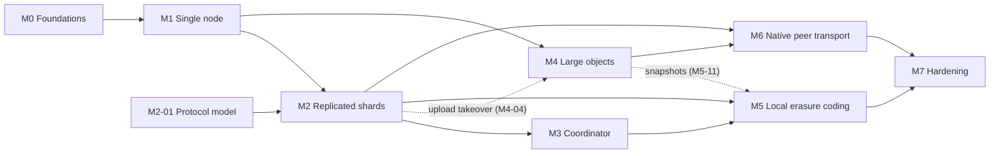

# SkyS3: Task and Pull Request Plan

**Status:** Proposed, for review
**Date:** 2026-09-23
**Implements:** the [SkyS3 design](skys3-design.md). Every `§` below refers to a section of that document.
**Scope:** Breaks the design's delivery plan (§17) into pull requests, with their order, dependencies, and the checks each one must pass

## Contents

- [1. How to read this plan](#1-how-to-read-this-plan)
- [2. Changes relative to design section 17](#2-changes-relative-to-design-section-17)
- [3. Milestones and dependencies](#3-milestones-and-dependencies)
- [4. Repository layout](#4-repository-layout)
- [5. CI and test infrastructure](#5-ci-and-test-infrastructure)
- [6. M0 Foundations](#6-m0-foundations)
- [7. M1 Single node](#7-m1-single-node)
- [8. M2 Replicated shards](#8-m2-replicated-shards)
- [9. M3 Coordinator](#9-m3-coordinator)
- [10. M4 Large objects](#10-m4-large-objects)
- [11. M5 Local erasure coding](#11-m5-local-erasure-coding)
- [12. M6 Native peer transport](#12-m6-native-peer-transport)
- [13. M7 Hardening](#13-m7-hardening)
- [14. Design gaps assigned to PRs](#14-design-gaps-assigned-to-prs)
- [15. Open questions from design section 19](#15-open-questions-from-design-section-19)

## 1. How to read this plan

- The plan follows the design's milestones M1 to M7 and adds **M0** for the foundations every later PR relies on. Section 2 lists every place where this plan moves or adds scope relative to §17.
- Each task is one pull request with an ID such as `M1-09`. PR titles start with the ID (`[M1-09] Object PUT, GET, HEAD, and DELETE`), and branch names include it. A PR that grows past about 1,500 lines of non-test code is split, with suffixed IDs (`M1-09a`, `M1-09b`).
- Each entry gives the design sections it implements, the PRs it depends on, a size, its scope, and **Done when**: the tests or checks the PR adds and passes. A PR is done when those checks pass in CI, not when its code exists.
- Sizes are rough. **S** is under 500 lines of non-test code, **M** is 500 to 1,500, and **L** is a candidate for splitting.
- Each ID should become a GitHub issue, so the plan can be tracked without editing this document.

### 1.1 Rules for every PR

- CI is green: formatting, clippy with `-D warnings`, tests, and the jobs added by M0 (section 5).
- Every crate keeps `#![forbid(unsafe_code)]`.
- Configuration keys use the names in §14, are validated at load time, and are added to the configuration reference (M0-03).
- Metrics use the names the design gives (`dirty_bytes`, `oldest_dirty_age`, `flush_lag_seconds`, `under_replicated_bytes`, `oldest_under_replicated_age`) and are added to the metrics reference (M0-06).
- A parser of untrusted input (log records, SigV4 and aws-chunked framing, XML, tokens, continuation tokens, peer frames) ships with a proptest and a `cargo-fuzz` target in the same PR.
- Code on the replication, flush, encoding, or peer paths runs under the simulation harness (M0-04, M2-03), and the PR adds its failure cases as seeded scenarios.
- Disk I/O runs on dedicated blocking workers, never on the Tokio reactor (§10.4).
- A PR that finds the design wrong or ambiguous updates `docs/skys3-design.md` in the same PR, or links an issue that does.
- A feature is reachable from the binary only once it is complete. Until then it is not wired in, or it sits behind a configuration flag that defaults to off.

## 2. Changes relative to design section 17

| Change | Why |
|---|---|
| New **M0 Foundations**: workspace, core types, configuration, disk and clock abstractions, simulated S3 store | §16.1 runs the real replication and flush code under deterministic simulation. Those abstractions must exist before the first storage PR. |
| Local, non-streaming multipart moves from M4 to M1 | M1's exit criterion is the SDK matrix (§16.2), which exercises multipart, and SDK transfer managers switch to multipart for large files by default. M4 keeps streaming flush, takeover of in-flight uploads, and UploadPartCopy. |
| Write identity for PUT, DELETE, and copy moves from M4 to M1 | M1's flusher must be correct, and its 412 recovery rule (§7.2) depends on the write identity. M4 adds the `MPU_CREATE` and `UPLOAD_BEGIN` cases for streamed uploads. |
| The `hold` conflict policy is in M1. `overwrite` and `discard_local` stay in M4. | Conditional flush detects conflicts from the first flusher PR. `hold` is the default and needs no extra machinery. |
| The `ControlStore` trait, the register layout, and in-memory and file backends are in M1 | A single node already needs bucket bindings and identity configuration. M2 adds the S3 and etcd backends and the conformance suite. |
| The protocol model (M2-01) starts during M1 and gates the replication PRs | §6.8: the state machine is model-checked before implementation. |
| Items §17 does not schedule are placed: namespace import and the dirty budget (M1); read plans, read registration, and the hot cache (M2); the control-store rebuild tool (M3); adaptive flush concurrency, index snapshots, and read-only origin buckets (M4); restore drills (M5); the reconciliation scan (M7) | The design requires each of them, so each needs an owner. |
| `Cargo.lock` is committed | §15 says `Cargo.lock` pins exact versions. The bootstrap `.gitignore` excludes it. |

## 3. Milestones and dependencies

| Milestone | PRs | Can start after | Exit criterion |
|---|---:|---|---|
| M0 Foundations | 6 | Now | CI, simulation, and configuration baselines in place |
| M1 Single node | 26 | M0 | SDK matrix passes; crash tests lose no acknowledged write; flush and fill are correct against AWS S3 and one other provider |
| M2 Replicated shards | 20 | M2-01, M2-02, M2-04, and M2-05 during M1; the replication path after M1-13 | Model check and simulation pass; kill and partition tests lose no acknowledged write |
| M3 Coordinator | 8 | M2-04 and M2-05; replacement also needs M2-15 | Node loss and addition heal with no operator action |
| M4 Large objects | 13 | M1-16; M4-04 also needs M2-12 | No partial remote objects under fault injection; ETags match |
| M5 Local erasure coding | 12 | M5-01 and M5-02 early; the encoder after M3-03; coded reads after M2-18 | All loss combinations up to `m` fragments pass; node loss heals with no operator action |
| M6 Native peer transport | 9 | M6-01 and M6-02 early; staging after M2-07; the source side after M4-03 and M4-09 | The §17 M6 criteria, measured on shaped lossy links |
| M7 Hardening | 9 | Continuous; closes after M5 and M6 | Published compatibility matrix; §16.3 targets met or the design revised |

The exit criteria of M1 to M7 are quoted from §17.



**Critical path.** Counted in PRs, the longest chain runs through the storage engine and the first object operations (M1-01 to M1-04, M1-09, M1-13), then replication (M2-03, M2-07, M2-10 to M2-12, M2-14, M2-15), then replacement, rebalancing, and heal tests (M3-05, M3-06, M3-08). The large-object and peer chain (M1-12, M1-16, M4-01 to M4-03, M4-09, M6-06 to M6-09) is nearly as long, so it should run beside M2 rather than after M3. The protocol model (M2-01) must merge before M2-07, so it starts during M1.

## 4. Repository layout

M0-01 turns the bootstrap crate into a Cargo workspace. The first PR that needs a crate creates it.

```text
Cargo.toml              workspace
crates/
  skys3/                binary: configuration, wiring, startup recovery, admin commands
  skys3-types/          ids, epochs, seq, write and version identities, key hashing
  skys3-config/         configuration schema (§14) and validation
  skys3-io/             disk, clock, and blocking-pool abstractions, real and simulated
  skys3-log/            record format, segments, group commit, recovery (§10.1, §10.4)
  skys3-index/          redb index, checkpoints, local control-state copies (§10.2)
  skys3-shard/          shard state machine, replication, leases, reconciliation (§5, §6.3–6.6)
  skys3-control/        ControlStore trait, backends, startup probe (§6.1, §6.2)
  skys3-coord/          coordinator and placement (§6.7)
  skys3-net/            intra-cluster transport: mutual TLS over TCP, prost headers
  skys3-remote/         remote target client and capability probe
  skys3-flush/          flusher, import, fill, snapshots (§7, §8.9, §9.1)
  skys3-ec/             EcCodec, fragment store, encoder, repair (§8)
  skys3-gateway/        S3 on s3s, SigV4, routing, listing merge (§9, §11)
  skys3-sts/            OIDC validation and STS (§11)
  skys3-peer/           QUIC peer protocol (§7.8)
  skys3-sim/            simulated S3 store, cluster harness, history checkers (§16.1)
spec/                   protocol model
tests/                  SDK matrix, s3-tests subset, provider and fault-injection tests
bench/                  performance suite (§16.3)
```

## 5. CI and test infrastructure

| Job | Added by | When it runs |
|---|---|---|
| Formatting, clippy, unit tests | Existing | Every push and PR |
| `cargo-deny` (licenses, advisories, bans) and an MSRV build | M0-01 | Every push and PR |
| Simulation with a fixed seed set | M0-04 | Every push and PR |
| Simulation with random seeds and long runs | M2-03 | Nightly. A failing seed becomes a regression test with its replay command. |
| Fuzz smoke runs | M1-01 | Every push and PR, briefly per target. Long runs nightly (M7-03). |
| Protocol model check | M2-01 | Changes under `spec/`, and nightly |
| etcd integration | M2-05 | Every push and PR |
| SDK matrix | M1-25 | PRs that touch the gateway or identity, and nightly |
| Remote providers (AWS S3 and a second provider) | M1-26 | Nightly, with credentials held as CI secrets |
| Kill and partition tests | M2-20 | Nightly |
| Shaped-link and performance suites | M6-09, M7-06 | On fixed hardware, before each release |

## 6. M0 Foundations

Workspace, core types, configuration, and the abstractions that let every later PR run under simulation. No S3 functionality.

#### M0-01 Workspace and CI baseline

**Design:** §15 · **After:** none · **Size:** S

- Convert the crate into the workspace of section 4, keeping edition 2024. Raise `rust-version` only when a dependency requires it.
- Commit `Cargo.lock` and remove it from `.gitignore`.
- Add `cargo-deny` with a license allowlist, RustSec advisories, and duplicate-version bans, plus an MSRV build job.
- **Done when:** the new CI jobs run and pass on the workspace.

#### M0-02 Core types

**Design:** §4.1, §6.1, §7.2, §9.2 · **After:** M0-01 · **Size:** S

- `ClusterId`, `BucketId`, `ShardId`, `NodeId`, `Epoch`, `Seq`, ordered `(epoch, seq)` pairs, and `ProposalId`.
- Shard assignment `hash(bucket_id, key) mod shards`. Choose the hash and freeze it with golden vectors, because it can never change for an existing bucket.
- `WriteIdentity` (`<cluster>/<bucket>/<shard>/<epoch>.<seq>`, at most 96 bytes) and the version identity (`seq` and ETag).
- `ShardConfig` and the other register documents, with serde round trips against the §6.1 JSON example.
- **Done when:** golden vectors cover hashing and write identities; proptests cover round trips.

#### M0-03 Configuration

**Design:** §14 · **After:** M0-02 · **Size:** M

- A TOML schema and defaults for every section of §14.
- Validation at load time, including: `primary_grace ≥ primary_lease × (1+ρ)/(1−ρ) + margin`; in wait-through mode, `replica_ack_timeout` above `member_suspect_after` plus a CAS allowance (§5.2); `min_write_replicas ≤ replicas`; `clean_copies ≤ replicas`; `shards_per_bucket ≤ 256`; `lease_renew_interval < primary_lease`; `read_registration_renew_interval < read_registration_ttl`.
- A configuration reference under `docs/` that later PRs extend.
- **Done when:** the §14 example loads unchanged, and each validation rule has a test with a config that breaks it.

#### M0-04 Disk and clock abstractions

**Design:** §10.4, §16.1 · **After:** M0-01 · **Size:** M

- A disk and segment-file trait: append, `fdatasync`, directory `fsync`, and reads at an offset. The real implementation runs on dedicated blocking workers.
- A simulated disk that tracks written versus synced bytes, drops unsynced bytes on a simulated crash, and injects sync errors, torn writes, and full disks.
- A `Clock` trait with monotonic time and per-node rate drift up to `ρ`, used by leases and every timer.
- A seeded simulation runner on `turmoil` that prints the seed and replay command on failure.
- **Done when:** tests show the simulated disk losing unsynced data and keeping synced data across a crash.

#### M0-05 Simulated S3 store

**Design:** §6.1, §7.2, §16.1 · **After:** M0-02 · **Size:** M

- An in-memory S3 store behind an object-store trait: Put, ranged Get, Head, Delete, ListObjectsV2, Copy, multipart, and optional versioning.
- Conditional writes on `PutObject`, `CompleteMultipartUpload`, `DeleteObject`, and `CopyObject` (including `x-amz-copy-source-if-match`). Each can be switched off per operation to mimic providers such as R2 (§7.2).
- 412 and `409 ConditionalRequestConflict` semantics, and seeded injection of delay, 5xx, `503 SlowDown`, and lost responses (applied but unanswered).
- Every simulation uses it both as a remote target and as an S3 control store.
- **Done when:** its tests cover each precondition and each injected fault.

#### M0-06 Observability scaffolding

**Design:** §6.4, §7.6 · **After:** M0-01 · **Size:** S

- `tracing` setup, a metrics exporter, and an admin HTTP listener with metrics and health endpoints.
- Metric naming conventions and a metrics reference under `docs/`.
- **Done when:** a test scrapes a registered metric from the listener.

## 7. M1 Single node

**Design scope:** S3 core, STS, log and index, flusher, read-through, eviction, `write_back` and replicated `local` buckets, `replicas = 1`. In M1, a `local` bucket is simply stored: it is never flushed or evicted. Replication arrives in M2 and erasure coding in M5.

Four tracks can run in parallel after M0:

- **Storage engine:** M1-01 to M1-04, then M1-13 and M1-14. M1-22 follows once the write-back track reaches M1-21.
- **S3 API:** M1-05 to M1-12. M1-05 to M1-08 need nothing from the engine, and M1-06 to M1-08 run against an in-memory shard stub until M1-04 lands.
- **Write-back:** M1-15 needs only M0-05, then M1-16 to M1-21.
- **Identity:** M1-23, then M1-24.

#### M1-01 Log record format

**Design:** §10.1 · **After:** M0-02 · **Size:** M

- Record header: magic, format version, record kind, shard id, epoch, seq, key hash, header and payload lengths, and CRC32C.
- Reserve every record kind listed in §10.1. This PR defines the bodies of `PUT`, `DELETE`, `EXTENT`, `TAGS`, `FLUSHED`, `IMPORT`, `ADOPT`, `CONFIG`, and `TRUNCATE`. Later PRs define the rest: the `MPU_*` kinds in M1-12, `UPLOAD_BEGIN` and `PART_FLUSHED` in M4, and the `EC_*` kinds in M5.
- A `PUT` carries metadata, either an inline payload or extent references, and an optional copy-source reference (§10.1).
- Parsing checks lengths before allocating, uses checked arithmetic, and rejects unknown versions and kinds.
- **Done when:** proptests cover encode and decode round trips; a `cargo-fuzz` target covers the parser, and the CI fuzz smoke job runs it.

#### M1-02 Segments, group commit, and recovery

**Design:** §10.1, §10.4 · **After:** M1-01, M0-04 · **Size:** L

- Append-only segment files per disk, shared by every shard replica on that disk: **hot** segments for metadata and inline payload up to `inline_max_bytes`, and **bulk** segments for 1 MiB extents. Fragment segments come in M5-02.
- Group commit bounded by `group_commit_max_delay_us` and `group_commit_max_bytes`. A record is acknowledged only after `fdatasync` covers it. New segment files also get a directory `fsync`.
- A sync error takes the disk out of service. Nothing is acknowledged after a failed sync.
- Recovery cuts a torn tail back to the last record whose CRC verifies.
- **Done when:** simulated crashes at every write and sync boundary lose no acknowledged record; no acknowledgement ever follows a failed sync; a benchmark reports records per group commit.

#### M1-03 Index and checkpoints

**Design:** §10.2 · **After:** M1-02 · **Size:** M

- redb tables: the namespace index keyed by `(shard, key)` with state, `local_etag`, `remote_etag`, `remote_version_id`, checksums, metadata, and payload location; the node-local location map from extent to `(segment, offset, length)`; each shard's applied `(epoch, seq)`; and control-state tables tagged with a configuration generation (§6.2).
- Commits use `Durability::None`, with a durable checkpoint every `index_checkpoint_interval`. Log segments are released only once they are behind the durable checkpoint.
- **Done when:** after a simulated crash, redb reverts to its checkpoint, and replaying the log reproduces the pre-crash index exactly.

#### M1-04 Shard state machine with one replica

**Design:** §4.2, §5.1, §9.1, §9.2 · **After:** M1-03 · **Size:** M

- Per-shard sequencing and a deterministic `apply(record)`, which every member runs from M2 on. It covers the object states of §4.2, tombstones, `IMPORT` (applied only if the key has no entry at all), `ADOPT` (applied only if the entry is still clean at the named `seq`), and `FLUSHED` (moves an entry to clean only if its `seq` is still current).
- With `replicas = 1`, a record commits once it is durable locally.
- **Done when:** a proptest shows that replaying any record sequence from any checkpoint yields the same index, and every transition in §4.2 is covered, including the rejection of invalid ones.

#### M1-05 Control store interface and local backends

**Design:** §6.1, §6.2 · **After:** M0-02 · **Size:** M

- The `ControlStore` trait (`get`, `put_if`, `list`, `changes`) and the register layout: `cluster.json`, `coordinator.lease`, `nodes/`, `buckets/`, `shards/`, and `identity/`.
- An in-memory backend for tests, and a file backend for single-node development. The file backend refuses to start once a second node registers.
- A `proposal_id` in every value, and the lost-response rule: after a failed precondition, re-read and look for one's own `proposal_id`.
- Cluster bootstrap: create `cluster.json` with `If-None-Match: *`, and maintain its generation counter.
- **Done when:** the lost-response rule is tested against the in-memory backend with injected lost responses.

#### M1-06 Gateway skeleton and bucket operations

**Design:** §3, §4.1, §11, §12 · **After:** M0-03, M1-05 · **Size:** M

- `s3s` on `hyper`, with bounds on header sizes, XML depth, key length, part counts, and ranges (§12).
- Route each key to its shard with the M0-02 hash. On a single node, every shard is local.
- CreateBucket with a mode (`write_back` with a target, or `local`; `read_only` is rejected until M4-12), DeleteBucket as detach, HeadBucket, ListBuckets, and GetBucketLocation. Bucket records live in the control store.
- Explicit rejection of SSE-S3, SSE-KMS, SSE-C, Object Lock, local versioning APIs, and ACL grants other than bucket-owner-enforced.
- Decide detach semantics for a bucket that still has dirty data (section 14).
- **Done when:** each rejected feature has a test; bucket operations pass against the shard stub.

#### M1-07 SigV4 authentication and authorization

**Design:** §11, §12 · **After:** M1-06 · **Size:** L

- SigV4 header authentication and presigned URLs, keeping the canonical request bytes intact; session tokens; `aws-chunked` bodies with signed chunks and trailers.
- Static credentials for bootstrap and service accounts, held with `secrecy` and `zeroize`. `anonymous_access = false` is enforced.
- Authorization that evaluates role and session policies. The policy subset is decided here (section 14). Until M1-24 lands, static credentials map to policies.
- **Done when:** published SigV4 test vectors pass; fuzz targets cover the canonicalizer and the chunk parser; presigned URL expiry and clock-skew cases are tested.

#### M1-08 Checksums and ETags

**Design:** §7.4, §11 · **After:** M1-06 · **Size:** S

- Streaming validation of CRC32, CRC32C, CRC64NVME, SHA1, SHA256, and Content-MD5 at the protocol boundary, on the blocking pool. MD5 ETags and multipart ETags.
- Checksums are stored with the entry and returned as S3 does.
- **Done when:** known-answer tests pass for each algorithm, and mismatches return the S3 error codes.

#### M1-09 Object PUT, GET, HEAD, and DELETE

**Design:** §5.1, §7.2, §9.2, §11 · **After:** M1-04, M1-07, M1-08 · **Size:** L

- Bodies up to `inline_max_bytes` go inline. Larger bodies are streamed as 1 MiB `EXTENT` records while they arrive, and the final `PUT` references them.
- GET, HEAD, range reads, and conditional requests (`If-Match`, `If-None-Match`, `If-Modified-Since`, `If-Unmodified-Since`) evaluated against the index, including conditional PUTs.
- User metadata is limited to 2 KiB minus the 96 bytes reserved for the write identity. `x-amz-meta-skys3-wid` is stripped from responses (§7.2).
- **Done when:** request-level tests cover each conditional header and range form, and a PUT is acknowledged only after its record is durable.

#### M1-10 DeleteObjects, tagging, and CopyObject

**Design:** §10.1, §11 · **After:** M1-09 · **Size:** M

- DeleteObjects, and object tagging stored as `TAGS` records.
- CopyObject copies the bytes into the destination shard and commits a `PUT` that records its source: bucket, key, version identity, and the source's `remote_etag`. The remote server-side copy comes in M4-07. Until then, copies flush as regular uploads.
- **Done when:** tests cover copies within a shard, across shards, and across buckets, with both metadata directives.

#### M1-11 Listing

**Design:** §9.4 · **After:** M1-09 · **Size:** M

- ListObjectsV2 and V1: each shard returns a sorted page with prefix and delimiter handling, and the gateway k-way merges the pages, deduplicates common prefixes, and returns an HMAC-authenticated continuation token holding the last key.
- **Done when:** a proptest compares merged listings with a single sorted model over random keys, prefixes, delimiters, and page sizes; tampered tokens are rejected.

#### M1-12 Multipart upload, local

**Design:** §7.4, §10.1, §11 · **After:** M1-09 · **Size:** L

- CreateMultipartUpload, UploadPart, CompleteMultipartUpload, AbortMultipartUpload, ListParts, and ListMultipartUploads, as `MPU_CREATE`, `MPU_PART`, `MPU_COMPLETE`, and `MPU_ABORT` records.
- Part boundaries are kept, so a flush can reproduce the multipart ETag (§7.4).
- **Done when:** multipart ETags match AWS S3 for the same parts, and aborted uploads release their extents.

#### M1-13 Node binary and startup recovery

**Design:** §3, §10.2 · **After:** M1-05, M1-09 · **Size:** M

- The `skys3` binary: load and validate configuration, discover disks, recover each disk's log from its checkpoint, start the gateway and the shards, and shut down gracefully.
- Node-local copies of bucket bindings and identity configuration, kept in the index and loaded at startup (§6.2).
- An admin API skeleton for bucket status and health, extended by later PRs (section 14).
- **Done when:** an end-to-end test starts the binary, writes, restarts it, and reads the data back.

#### M1-14 Crash-consistency suite

**Design:** §16.1, §17 · **After:** M1-13 · **Size:** M

- Simulated crashes at every sync boundary under a concurrent PUT, DELETE, and multipart workload, plus `kill -9` loops against the real binary on a real filesystem.
- A history recorder and checker: every acknowledged write survives recovery unless a later acknowledged write superseded it, and no unacknowledged write resurfaces over a later acknowledged one (§5.2).
- From M1-16 on, the checker also requires every acknowledged write in a `write_back` bucket to be either flushed or still dirty locally.
- **Done when:** the suite runs in CI with fixed seeds and nightly with random seeds.

#### M1-15 Remote target client and capability probe

**Design:** §7.2, §11 · **After:** M0-03, M0-05 · **Size:** M

- A remote-target trait implemented over `aws-sdk-s3`, with credentials from `aws-config` providers including web identity, and also by the simulated store.
- On attach, probe which of `PutObject`, `CompleteMultipartUpload`, and `DeleteObject` honor preconditions, using scratch keys, and list the unprotected operations in the bucket status.
- **Done when:** the probe correctly classifies simulated stores configured like AWS S3 and like R2.

#### M1-16 Flusher

**Design:** §7.1, §7.2, §7.4 · **After:** M1-09, M1-12, M1-15 · **Size:** L

- A per-shard flusher over committed records in `seq` order: at most one flush in flight per key, only the latest committed state of a key flushed, tombstones flushed as `DeleteObject`, and a fixed concurrency per shard (adaptive in M4-10).
- Conditional requests per the §7.2 table, including a HEAD first for keys whose remote state is unknown.
- A write identity on every flushed object. On 412, HEAD the object: a matching identity means the flush already succeeded; for a delete, a missing object means the delete already happened; anything else is a conflict held under `hold`.
- `FLUSHED(key, seq, remote_etag, remote_version_id)` rides the next group commit and never triggers an fsync of its own.
- Completed multipart uploads flush after commit as remote multipart uploads with the client's part boundaries. Streaming comes in M4-02.
- Retry with backoff on 5xx and `503 SlowDown`.
- Metrics `dirty_bytes`, `oldest_dirty_age`, `flush_lag_seconds`, and conflict counts. The admin API lists conflicts.
- **Done when:** simulation with lost responses, 5xx errors, and out-of-band remote writes shows that every acknowledged write reaches the remote in its latest state, that lost responses are recognized by write identity, and that out-of-band writes become conflicts instead of being overwritten on protected operations.

#### M1-17 Dirty budget and admission control

**Design:** §7.6, §10.4, §13 · **After:** M1-16 · **Size:** S

- `max_dirty_bytes` per bucket and per cluster. New writes get `503 SlowDown` when a budget is exhausted, including during a remote outage. Disk-full conditions engage admission control too.
- How a budget is shared among shards whose primaries sit on different nodes is decided here (section 14).
- **Done when:** a simulated remote outage fills the budget, writes get 503, and writes resume as the flush drains.

#### M1-18 Namespace import

**Design:** §9.1 · **After:** M1-11, M1-16 · **Size:** L

- A resumable, rate-limited import on attach. It lists the remote prefix and commits an `IMPORT` record per object (key, size, ETag, last-modified, storage class), checkpointing the last imported key.
- A DELETE of a key with no entry commits a tombstone, kept until the import has passed the key and the delete has flushed. A PUT of a key with no entry is dirty with unknown remote state.
- While the import runs, a local miss falls through to a remote HEAD, and LIST merges the remote listing with local entries.
- User metadata and content type are loaded lazily on the first HEAD or GET.
- **Done when:** simulation of imports racing PUTs and DELETEs of the same keys never resurrects a deleted key or overwrites a newer local write (§16.1). The PR also reports index bytes per imported entry (§19 item 6).

#### M1-19 Parallel import

**Design:** §7.7, §9.1 · **After:** M1-18 · **Size:** M

- Split points discovered with delimiter listings or by sampling keys. `import_parallel_streams` ranges are listed with `StartAfter`, each with its own checkpoint.
- **Done when:** a restart mid-import resumes every range, and import rate scales with the stream count against a simulated 100 ms target.

#### M1-20 Read-through fill and ADOPT

**Design:** §9.2 · **After:** M1-16 · **Size:** M

- Evicted payload is filled from the remote with `If-Match: <remote_etag>`, plus `versionId` when the remote is versioned. Concurrent fills of the same range are coalesced, ranges are served while the fill streams, and the filled payload becomes clean cache.
- If the fill precondition fails, commit `ADOPT` and retry. The `ADOPT` is dropped if a local write made the entry dirty in between. Conflicts are counted either way.
- **Done when:** simulation with out-of-band remote changes shows reads switching to the remote's version after the `ADOPT`, and never adopting over a dirty local write.

#### M1-21 Clean cache and eviction

**Design:** §4.2, §9.3 · **After:** M1-20 · **Size:** M

- Clean payload is kept on up to `clean_copies` members (one, on a single node). Per-node LRU eviction is bounded by `cache_max_bytes_per_node`. Eviction leaves a stub with the §4.2 metadata. Dirty payload is never evicted.
- Capacity accounting follows the §9.3 model, with `reserve_fraction`.
- **Done when:** a workload larger than the cache keeps every dirty byte, evicts only clean payload, and refills evicted keys.

#### M1-22 Segment compaction

**Design:** §10.3 · **After:** M1-21 · **Size:** M

- Segments below `compaction_live_threshold` are reclaimed: dirty records and needed metadata records are copied, and clean payload is evicted instead of copied unless it is recently used and fits the cache budget. Each shard's latest `CONFIG` record stays reachable.
- **Done when:** crashes during compaction lose nothing in simulation, and compaction write amplification is exported as a metric.

#### M1-23 OIDC token validation

**Design:** §11 · **After:** M0-03 · **Size:** M

- Allowlisted issuers; discovery and JWKS fetched with bounded size and rate; an algorithm allowlist; checks of `iss`, `aud`, `sub`, `exp`, `nbf`, and `azp` where required; signing-key rotation.
- **Done when:** tests reject forged, expired, not-yet-valid, wrong-audience, and wrong-algorithm tokens (including `none` and algorithm confusion) and oversized JWKS documents; a fuzz target covers token parsing.

#### M1-24 STS and session credentials

**Design:** §6.2, §11 · **After:** M1-05, M1-07, M1-23 · **Size:** L

- `AssumeRoleWithWebIdentity` on the STS endpoint, with roles and trust policies read from the node's local copy of `identity/`. It issues `AccessKeyId`, `SecretAccessKey`, `SessionToken`, and `Expiration`, bounded by `session_default_seconds` and `session_maximum_seconds`.
- Session records live in an internal, local-only system bucket that is never flushed. Session tokens are stored hashed, and secrets are held in memory with `secrecy` and `zeroize`.
- New sessions fail closed once the identity copy is older than `identity_max_staleness`. Sessions already issued stay valid until they expire.
- **Done when:** an SDK web-identity provider obtains and refreshes credentials from the endpoint; M1-25 extends this to every SDK.

#### M1-25 SDK matrix

**Design:** §16.2 · **After:** M1-12, M1-13, M1-24 · **Size:** M

- Containerized clients for Python, Go v2, JavaScript v3, Java v2, Rust, and the AWS CLI, with `AWS_ENDPOINT_URL_S3` and `AWS_ENDPOINT_URL_STS` pointed at SkyS3.
- Default checksums, aws-chunked uploads, multipart, presigned URLs, and web-identity credential refresh under load.
- Starts the `ceph/s3-tests` subset that M7-01 completes.
- **Done when:** the matrix runs in CI and passes. This is the first M1 exit criterion.

#### M1-26 Remote provider validation

**Design:** §16.2, §17 · **After:** M1-18, M1-21 · **Size:** M

- Flush, import, and fill against AWS S3 and one other provider. R2 is the suggested second provider, because it lacks preconditions on `CompleteMultipartUpload` and `DeleteObject` and so exercises the unprotected path (§7.2).
- Covers the capability probe, conflict detection, and fill preconditions.
- **Done when:** the nightly job passes against both providers. This is the third M1 exit criterion.

**M1 exit.** SDK matrix passes: M1-25. Crash tests lose no acknowledged write: M1-14. Flush and fill are correct against AWS S3 and one other provider: M1-26.

## 8. M2 Replicated shards

**Design scope:** all-member commit, epochs, leases, planned handoff, the control-store interface with S3 (AWS S3, R2) and etcd backends, member removal, primary takeover, learner catch-up.

Shard placement in M2 is static: a bootstrap command or the test harness writes the shard registers. M3 makes placement automatic.

#### M2-01 Protocol model

**Design:** §5, §6.3–§6.8, §16.1 · **After:** none; starts during M1 · **Size:** M

- Specify the shard protocol in TLA+, or with a Rust model checker if the PR makes the case for one: the all-member commit rule, rules R1 to R3, member removal, primary takeover, reconciliation with `TRUNCATE` and roll-forward, learner live streaming and promotion, planned handoff, leases under the drift bound `ρ`, and gateways reading with stale shard maps.
- Invariants: committed records survive; one committing primary per epoch; reads are linearizable under the drift bound.
- **Done when:** the model checks in CI at bounds stated in the PR, and deliberately seeded bugs are caught, for example promoting a learner before it holds the commit watermark, or a new primary serving before `primary_grace` has passed. M2-07 does not merge before this PR.

#### M2-02 Intra-cluster transport

**Design:** §12, §15 · **After:** M0-04 · **Size:** M

- TCP with mutual TLS (`rustls`, `tokio-rustls`) and node identities from the operator's PKI. `prost` headers and raw payload frames. Replication, lease, and admin messages are authenticated per node and per role.
- Runs over `turmoil`'s simulated network in tests.
- **Done when:** unauthenticated peers and peers using the wrong role are rejected, and a fuzz target covers the frame parser.

#### M2-03 Cluster simulation harness

**Design:** §16.1 · **After:** M0-05, M1-13, M2-02 · **Size:** L

- Runs several real nodes in one deterministic simulation, with simulated disks, network, drifting clocks, a remote S3 store, and a control store.
- Injects crashes, partitions, message loss and reordering, clock drift, control-store outages, 100 ms and higher control-store round trips, and lost CAS responses.
- Checkers: per-key linearizability of histories at the primary, and that every acknowledged write is flushed, present on a surviving member, or reported lost.
- Every later PR on these paths adds its scenarios here.
- **Done when:** the harness runs the M1 workload under faults with both checkers passing.

#### M2-04 S3 control-store backend

**Design:** §6.1 · **After:** M1-05, M1-15 · **Size:** M

- `put_if` with `If-Match: <etag>` or `If-None-Match: *`. A 412 means another writer won. A `409 ConditionalRequestConflict` means re-read and retry. The lost-response rule from M1-05 applies.
- `changes()` by polling `cluster.json` with `If-None-Match` every `config_poll_interval`.
- The startup probe: 100 rounds across several scratch keys, with conditional writers racing from different nodes, exactly one winner per round, and losers reading the winner's value. A store that fails any round is refused.
- The validator refuses a control store it can tell shares a provider region with a data target, unless `allow_correlated_control_store = true`. The control-store credential is scoped to the control prefix.
- **Done when:** the probe passes on the simulated store and fails on simulated stores with broken conditional writes or stale reads.

#### M2-05 etcd control-store backend

**Design:** §6.1 · **After:** M1-05 · **Size:** M

- `put_if` as a transaction comparing the key's `mod_revision`, `changes()` as a native watch, and the same register layout under a key prefix.
- **Done when:** integration tests pass against a real etcd in CI.

#### M2-06 Control-store conformance suite

**Design:** §16.1 · **After:** M2-04, M2-05 · **Size:** M

- One suite for every backend: the startup probe repeated at scale, linearizable `put_if` under concurrency, lost responses, 409 retries, and watch or poll delivery.
- Runs against the in-memory backend, the simulated S3 store, and etcd in CI, and against AWS S3 and R2 nightly.
- **Done when:** every backend passes. Any future backend, including embedded Raft, must pass the same suite.

#### M2-07 Replication data path

**Design:** §5.1, §5.3, §6.3, §10.1 · **After:** M1-04, M2-01, M2-03 · **Size:** L

- The primary appends a record and sends `(epoch, seq, record)` to every member in parallel. Members reject older epochs (R2) and gaps, append, and acknowledge once a group fsync covers the record. A record commits when every member of its epoch's configuration, including the primary, has it durably. The commit watermark travels on appends and heartbeats, and members apply committed records.
- Extent records are replicated while the body arrives, ahead of the final `PUT`.
- A replica durably appends a `CONFIG` record before it acknowledges or serves anything in a new epoch.
- Configurations are static in this PR.
- **Done when:** simulation with crashes and message loss shows no committed record lost and no acknowledgement before every member is durable; fsyncs per acknowledged PUT and records per group commit are measured against §5.3.

#### M2-08 Shard map and routing

**Design:** §5.1, §6.2 · **After:** M2-07 · **Size:** M

- The gateway's shard map, with epochs, in the node-local index. Requests carry the epoch the gateway knows. A replica that is not the current primary rejects the request with its configuration as a redirect hint, and the gateway updates its map and retries. It reads the shard register only when no member it knows answers.
- **Done when:** simulated gateways with stale maps are redirected and never served by a non-primary.

#### M2-09 Leases and strong reads

**Design:** §5.4 · **After:** M2-07 · **Size:** M

- Lease beacons on heartbeats and appends every `lease_renew_interval`. A member's acknowledgement grants a lease until `t + primary_lease` on the primary's clock. The primary serves GET, HEAD, LIST, and conditional checks only while it holds a lease from every member.
- Each member tracks the time since the last beacon it acknowledged, for `primary_grace`.
- **Done when:** simulation with partitions and drift within `ρ` finds no stale read. A scenario with drift beyond `ρ` documents the expected read anomaly and shows that writes stay safe (§13).

#### M2-10 Acknowledgement timeout modes

**Design:** §5.2 · **After:** M2-07 · **Size:** S

- `replica_ack_timeout` in the wait-through default and the fail-fast option. A timeout returns `503 SlowDown`, and a failed response means not acknowledged, not necessarily not applied.
- **Done when:** simulation shows that a failed PUT never resurfaces over a later acknowledged PUT or DELETE of the same key.

#### M2-11 Member removal

**Design:** §6.3, §6.4 · **After:** M2-04, M2-10 · **Size:** M

- The primary CASes epoch `e+1` without a member that has been unresponsive for `member_suspect_after`. Pending records commit under the new epoch. If fewer than `min_write_replicas` acknowledging copies remain, the shard stays readable and rejects writes.
- Metrics `under_replicated_bytes` and `oldest_under_replicated_age`.
- **Done when:** a failing member stalls its shards' writes for about `member_suspect_after` plus one CAS round trip, and in wait-through mode requests in flight complete without errors.

#### M2-12 Primary takeover and reconciliation

**Design:** §5.4, §6.3, §6.5, §6.6 · **After:** M2-09, M2-11 · **Size:** L

- Once `primary_grace` has passed since it last granted the primary a lease, a member stops acknowledging epoch `e` and granting leases (R1), then CASes itself in as primary after a small random delay that shrinks as its durable `seq` grows. Losers follow the new register.
- Reconciliation: collect each member's last `(epoch, seq)`, invalidate records past the new primary's `seq` with `TRUNCATE`, re-replicate and commit the uncommitted tail, then serve.
- A deposed primary stops serving on its next rejected append or failed CAS. A single surviving member can take over.
- **Done when:** simulation with competing candidates, partitions, and crashes during reconciliation keeps all three §6.8 invariants, and primary failover completes in under 10 s with default settings (§13).

#### M2-13 Planned handoff

**Design:** §5.4, §6.5 · **After:** M2-12 · **Size:** S

- The old primary stops serving and renewing, then sends a step-down message with its last `seq`. The candidate proposes without waiting for `primary_grace`, and falls back to waiting it out if the message is lost.
- **Done when:** simulation of handoffs racing gateway reads with stale shard maps (§16.1) finds no stale read.

#### M2-14 Learners: live stream and promotion

**Design:** §6.3, §6.4, §6.7 · **After:** M2-12 · **Size:** L

- Adding a learner is a CAS, issued by a test driver until M3-05. A learner joins the acknowledgement set as soon as it can store new records. The primary drops a learner that misses `member_suspect_after` from that set without a CAS, and the learner must catch up before it rejoins.
- The primary promotes a learner by CAS once backfill is complete and the learner is durable up to the commit watermark, without pausing commits. If the CAS fails, it re-reads the register and retries or stops waiting for the learner.
- **Done when:** simulation shows promotion adds no write stall and never violates R3, and M2-01's model covers the same steps.

#### M2-15 Backfill and re-admission

**Design:** §6.4, §6.7 · **After:** M2-14 · **Size:** L

- Backfill sends a snapshot of the shard index plus the payload the learner needs, dirty and unencoded objects first. Clean payload of `write_back` buckets is not copied. Replicated objects of `local` buckets are.
- A node removed from a shard rejoins only as a learner. Its old records for the shard seed catch-up only after their `(epoch, seq)` prefix is verified, and are discarded otherwise.
- **Done when:** after a simulated member loss, new writes regain `replicas` copies within seconds and all data regains them once backfill ends; both times are reported (§16.3).

#### M2-16 Local control-state copies and propagation

**Design:** §6.2, §6.10 · **After:** M2-04, M2-12 · **Size:** M

- On restart, each replica resumes from its shard's latest `CONFIG` record, even while the control store is unreachable. A shard whose membership changed while the node was down stays fenced until the node reads the current register.
- Each node polls `cluster.json` for generation changes and refetches changed registers. STS staleness is measured from the identity copy's last refresh.
- **Done when:** a whole-cluster restart with the control store unreachable resumes every shard whose membership did not change, and stale configurations stay fenced (§16.1).

#### M2-17 Primary-scoped work across failover

**Design:** §7.1, §7.2, §9.1 · **After:** M1-18, M2-12 · **Size:** M

- The flusher and the import run on the primary only. A new primary resumes them from the log: `FLUSHED` records, import checkpoints, retained tombstones, and conflict state.
- **Done when:** primary failover during flush and import loses no flush, re-flushes idempotently by write identity, and resurrects no key.

#### M2-18 Read plans and holder fetch

**Design:** §8.7, §9.2, §9.3 · **After:** M2-09 · **Size:** M

- For a GET, the primary returns a read plan: version identity, size, and holders. The gateway fetches from its own node, then the least-loaded member with a copy, then the remote. Holder lists are hints, and a holder without the version says so.
- With `clean_copies` above 1, the primary keeps its copy first and the other members keep copies up to the count.
- Read registration: the gateway registers the plan's version with each holder and renews it every `read_registration_renew_interval_seconds`, with a TTL of `read_registration_ttl_seconds`. A holder keeps released payload while a registration references it, and for a release delay after the release.
- **Done when:** simulation with overwrites and evictions during reads never returns bytes of the wrong version, and a lapsed registration fails the GET mid-stream.

#### M2-19 Hot cache

**Design:** §9.2 · **After:** M2-18 · **Size:** S

- A node-local cache keyed by bucket, key, and version identity, bounded by `hot_cache_bytes_per_node`, and used only for the version the read plan names.
- **Done when:** GETs of one hot object spread across gateways, and a new version never returns cached old bytes.

#### M2-20 Kill and partition tests

**Design:** §16.1, §17 · **After:** M2-13, M2-15, M2-16, M2-17 · **Size:** M

- Real multi-node clusters in containers, with process kills, network partitions, and sync-failure injection under a checked workload. Also records failover-time distributions and p99 write latency in wait-through and fail-fast modes, with the control store at 1 ms and 100 ms round trips.
- **Done when:** no acknowledged write is lost across the scenario set.

**M2 exit.** Model check passes: M2-01. Simulation passes: M2-03 with every M2 scenario. Kill and partition tests lose no acknowledged write: M2-20.

## 9. M3 Coordinator

**Design scope:** placement, replacement, rebalancing, node lifecycle.

#### M3-01 Coordinator lease and change propagation

**Design:** §6.2, §6.7 · **After:** M2-04, M2-05 · **Size:** M

- `coordinator.lease` renewed every `coordinator_lease / 3` with `If-Match`. A candidate takes over only after observing the same lease ETag for longer than `coordinator_lease × (1+ρ)` on its own monotonic clock.
- Every change the coordinator makes increments the generation in `cluster.json` and is pushed to every node.
- **Done when:** simulation with two nodes that both believe they are coordinator shows every change is a CAS and none corrupts state, and coordinator failover delays only placement work.

#### M3-02 Node registry and lifecycle

**Design:** §6.7 · **After:** M3-01 · **Size:** M

- A node registers itself in `nodes/<node-id>.json` on first start, with its address, `zone` and `rack` labels, and disks. Nodes heartbeat to the coordinator, which uses health only as advice. Nodes unreachable for `node_forget_after` are forgotten after their shards are re-homed.
- **Done when:** a node that starts with valid credentials joins with no other action.

#### M3-03 Placement engine

**Design:** §6.7 · **After:** M3-02 · **Size:** M

- A pure function from nodes, labels, capacity, and bucket policy to shard members, with at most one member per domain at the `failure_domain` level.
- A bucket whose policy the cluster cannot satisfy is rejected at creation. A later shortfall never leads to co-location. Cluster health reports unsatisfied policies.
- **Done when:** property tests over random topologies never place two members of a shard in one domain.

#### M3-04 Automatic bucket and shard creation

**Design:** §4.1, §6.1 · **After:** M3-03 · **Size:** S

- CreateBucket writes the bucket register and `shards_per_bucket` shard registers with placed members. DeleteBucket detaches. This replaces M2's static placement.
- **Done when:** buckets created through the S3 API on a multi-node cluster serve reads and writes.

#### M3-05 Replacement

**Design:** §6.4, §6.7 · **After:** M2-15, M3-03 · **Size:** M

- The coordinator finds shards below `replicas` members and adds a learner on an eligible node, using the M2-14 and M2-15 machinery. It also proposes removals that follow from placement decisions.
- **Done when:** after a node loss, every affected shard returns to `replicas` members with no operator action.

#### M3-06 Rebalancing

**Design:** §6.7 · **After:** M2-13, M3-05 · **Size:** M

- Moves shards and primaries across nodes, including new ones, with add-learner, promote, and remove steps, and moves primaries by planned handoff. Rate-limited.
- **Done when:** a new node receives its share of shards and primaries, with no write stall beyond planned-handoff time.

#### M3-07 Control-store rebuild tool

**Design:** §6.2, §6.9 · **After:** M2-16, M3-01 · **Size:** M

- An operator command that rebuilds a lost control store from the newest `CONFIG` record of every shard plus the cached bucket and identity configuration. It never runs automatically.
- **Done when:** a drill deletes the simulated control bucket, rebuilds it, and membership changes resume.

#### M3-08 Heal tests

**Design:** §17 · **After:** M3-04, M3-06 · **Size:** M

- Simulation and real-cluster tests for node loss, node addition, rack loss with `failure_domain = "rack"`, and coordinator loss in the middle of a change.
- **Done when:** every scenario heals with no operator action.

**M3 exit.** Node loss and addition heal with no operator action: M3-08.

## 10. M4 Large objects

**Design scope:** multipart, streaming flush, write identity, conflict policies, write-through buckets, backup targets. Local multipart and write identity for simple writes landed in M1 (section 2).

Most of M4 depends only on M1 and can run beside M2 and M3. M4-04, and the failover scenarios of M4-13, need M2-12.

#### M4-01 Write identity for streamed uploads

**Design:** §7.2, §10.1 · **After:** M1-16 · **Size:** S

- An `UPLOAD_BEGIN` record committed when a large single PUT starts streaming, and the identity of the `MPU_CREATE` record for multipart uploads. The final `PUT` or `MPU_COMPLETE` stores the identity it inherits. A streamed PUT that fails never publishes its identity.
- **Done when:** the remote create, a replayed completion, and the 412 HEAD check all compare the same identity in tests.

#### M4-02 Streaming multipart flush

**Design:** §7.3 · **After:** M1-12, M4-01 · **Size:** L

- Remote `CreateMultipartUpload` with the write identity when the local upload is created. Each part is streamed from the incoming body and from the local extents, falling back to local extents when the remote is slow. A part that fails local validation is never listed in the remote Complete, and a client re-upload replaces it at the remote too.
- `PART_FLUSHED` records ride group commits. Remote upload IDs are kept in the shard log. The remote Complete, with `If-Match` or `If-None-Match`, is sent only after the local commit. `AbortMultipartUpload` runs on local aborts and for orphaned remote uploads.
- A streaming-overlap metric: the fraction of bytes at the remote when the client completes (§16.3).
- **Done when:** the remote multipart ETag equals the local one, and no remote object appears before the local commit under fault injection.

#### M4-03 Streaming flush for large single PUTs

**Design:** §7.3, §7.4 · **After:** M4-02 · **Size:** M

- Single PUTs of at least `streaming_flush_min_bytes` stream as remote multipart uploads of `flush_part_bytes`. The entry records the remote multipart ETag as `remote_etag` alongside the MD5 `local_etag`.
- **Done when:** both ETags are recorded correctly, and flush preconditions use `remote_etag`.

#### M4-04 Upload takeover after a primary change

**Design:** §7.3 · **After:** M2-12, M4-02 · **Size:** M

- A new primary reconciles each in-flight upload with a remote `ListParts`, and re-uploads every part that is missing or whose ETag differs from the local part's MD5, before completing.
- **Done when:** primary crashes at each step of a streamed upload never produce a partial or wrong remote object.

#### M4-05 UploadPartCopy

**Design:** §11 · **After:** M1-12 · **Size:** M

- UploadPartCopy from any source object in the cluster, with source preconditions and byte ranges.
- **Done when:** SDK copy helpers that use UploadPartCopy work, and the resulting multipart ETags match AWS S3.

#### M4-06 Conflict policies and conflict administration

**Design:** §7.2 · **After:** M1-16 · **Size:** M

- The `overwrite` policy, and `discard_local` as a per-bucket opt-in, because it drops acknowledged writes. Admin API calls to list held conflicts and to resolve one, which returns the key to dirty under a chosen policy.
- **Done when:** each policy is tested against out-of-band writes on protected and unprotected operations.

#### M4-07 Remote server-side copy

**Design:** §7.2, §11 · **After:** M1-10, M1-16 · **Size:** M

- A copy of a clean source in the same target flushes as a remote `CopyObject` with `x-amz-metadata-directive: REPLACE` and the full metadata including the copy's own write identity, `x-amz-tagging-directive: REPLACE` with the tags, `x-amz-copy-source-if-match: <source remote_etag>`, and the destination precondition. The attach probe learns whether the target supports all of these; if not, the copy flushes as a regular upload.
- **Done when:** a copy flushed this way is recognized as its own earlier flush after a 412, not reported as a conflict.

#### M4-08 Write-through buckets

**Design:** §7.5 · **After:** M4-03 · **Size:** S

- `ack_policy = "write_through"`: a PUT succeeds only after the local commit and the remote flush. Streaming flush hides the transfer time of large objects.
- **Done when:** losing the whole simulated cluster after an acknowledgement loses no acknowledged write.

#### M4-09 Backup targets for local buckets

**Design:** §8.9 · **After:** M4-03 · **Size:** M

- `backup_target` for `local` buckets, flushed with the same ordering, conditional writes, write identity, and streaming as a write-back target, but with nothing evicted locally. `backup_ack` is `local` or `write_through`.
- **Done when:** every committed change of a `local` bucket reaches its backup target, and `write_through` acknowledges only after the backup has it.

#### M4-10 Adaptive flush concurrency

**Design:** §7.7 · **After:** M1-16 · **Size:** M

- Per-target concurrency between `flush_min_concurrency_per_shard` and `flush_max_concurrency_per_shard`, bounded by `flush_max_inflight_bytes_per_target`. It grows additively while throughput rises and latency stays near the base round trip, and shrinks multiplicatively on `503 SlowDown` or rising latency.
- **Done when:** in simulation at 1 ms to 150 ms round trips, concurrency approaches the bandwidth-delay product, and it backs off under simulated rate limits.

#### M4-11 Index snapshots and lost-key report

**Design:** §6.9, §8.9 · **After:** M1-12, M4-09 · **Size:** M

- Per-shard snapshots every `index_snapshot_interval_seconds` to `snapshot_target`, which defaults to the backup target. `write_back` buckets snapshot dirty entries and in-flight multipart state. `local` buckets snapshot a periodic base plus deltas of changed entries.
- A lost-key report for a shard whose members are all lost: the keys whose data existed only on those members, and the time window after the snapshot in which other keys may also have been lost.
- **Done when:** a restore drill for replicated objects produces a report that matches the known ground truth. Re-indexing from fragment headers is added in M5-11.

#### M4-12 Read-only origin buckets

**Design:** §9.5 · **After:** M1-20 · **Size:** M

- `mode = "read_only"`: writes are rejected, GETs revalidate with the origin by default (`freshness = "revalidate"`) or use a bounded-staleness TTL, and LIST is forwarded to the origin. The cache key includes the origin configuration and its credential scope.
- **Done when:** origin changes are visible on the next GET under `revalidate`, and within the TTL otherwise.

#### M4-13 Large-object fault injection

**Design:** §17 · **After:** M4-04, M4-08, M4-09 · **Size:** M

- Crashes, primary failover, remote 5xx errors and lost responses, and link drops during multipart uploads and streamed PUTs, for write-back, write-through, and backup targets.
- **Done when:** no partial remote object is ever visible, and ETags match.

**M4 exit.** No partial remote objects under fault injection, and ETags match: M4-13.

## 11. M5 Local erasure coding

**Design scope:** per-object encoding, placement, degraded reads, repair, fragment compaction, lifecycle expiration.

#### M5-01 EcCodec

**Design:** §8.4, §15 · **After:** M0-02 · **Size:** S

- A versioned `EcCodec` trait whose codec ID is stored with every stripe, implemented with systematic Reed-Solomon from `reed-solomon-simd`. Golden vectors are kept across upgrades.
- **Done when:** every erasure pattern of up to `m` fragments decodes for every geometry in §8.3.

#### M5-02 Fragment segments and fragment store

**Design:** §8.4, §10.1, §10.3 · **After:** M1-02, M2-02 · **Size:** M

- The fragment segment class. A fragment header holds the bucket, key, version identity, stripe number, and object metadata. A node-local fragment map. Calls to write and fsync a fragment (returning a fragment ID) and to read a range of one with its checksum.
- Compaction of fragment segments copies live fragments and updates only the node-local map.
- **Done when:** crashes during fragment writes and compaction lose no acknowledged fragment.

#### M5-03 Geometry and fragment placement

**Design:** §6.7, §8.3 · **After:** M3-03 · **Size:** M

- Geometry from the counts of eligible nodes and eligible domains (a stripe of `k+m` needs at least `⌈(k+m)/m⌉` domains), `min_eligible_nodes`, `parity_fragments`, and `max_data_fragments`. At most `m` fragments of a stripe per domain and one per node. Geometry and locations are recorded per stripe and never recomputed.
- **Done when:** property tests reproduce the §8.3 table and its example of an 11-node cluster in three racks using 4+2.

#### M5-04 Encoder and EC_PUBLISH

**Design:** §8.2, §8.4 · **After:** M2-07, M5-01, M5-02, M5-03 · **Size:** L

- An object qualifies once it is at least `ec_min_object_bytes`, has been committed for `ec_after_seconds`, and the cluster has enough eligible nodes for a satisfiable policy. Otherwise encoding pauses.
- Encoding runs stripe by stripe, up to `ec_stripe_data_bytes` of data per stripe. `EC_PUBLISH` commits on every member after every fragment is durable, and members then drop their replicas. An `EC_PUBLISH` for a superseded version is dropped when applied.
- A per-shard index from node to fragments.
- **Done when:** crashes at each encoding step never leave the object without a complete representation.

#### M5-05 Orphan fragment reclamation

**Design:** §8.4 · **After:** M5-04 · **Size:** S

- After `fragment_orphan_after_seconds`, a fragment node reclaims fragments once the shard primary confirms that no `EC_PUBLISH` references them.
- **Done when:** fragments left by crashed or superseded encodings are reclaimed, and published fragments never are.

#### M5-06 Coded reads

**Design:** §8.5, §9.2 · **After:** M2-18, M5-04 · **Size:** M

- Read plans list the fragment nodes. A healthy read fetches only the data fragments that cover the range, with no decoding. A missing or corrupt fragment triggers a read of any `k` fragments of that stripe and a decode of the needed range.
- **Done when:** degraded reads return correct bytes for every loss pattern up to `m`.

#### M5-07 Fragment release and reclamation

**Design:** §8.7 · **After:** M1-22, M5-06 · **Size:** M

- `EC_RELEASE` after an overwrite or delete. Fragments are kept for `fragment_release_delay_seconds` and while read registrations reference them, then reclaimed by fragment-segment compaction.
- **Done when:** reads that hold an old plan finish or fail cleanly, and released space is reclaimed.

#### M5-08 Repair

**Design:** §8.6 · **After:** M3-02, M5-04 · **Size:** M

- When a node is lost, each shard primary finds its stripes with a fragment there, reads `k` surviving fragments, rebuilds the missing fragment on another eligible node, and commits `EC_RELOCATE`. Stripes missing two fragments go first. Bandwidth is capped by `repair_bytes_per_second_per_node`.
- **Done when:** node loss is repaired with no operator action, and repair time is reported (§16.3).

#### M5-09 Fragment rebalancing

**Design:** §8.3 · **After:** M3-06, M5-08 · **Size:** S

- Moves fragments with the same publish-before-retire steps as encoding.
- **Done when:** rebalancing under concurrent reads and node loss never leaves a stripe below its geometry.

#### M5-10 Lifecycle expiration and multipart cleanup

**Design:** §8.7, §11 · **After:** M1-12 · **Size:** M

- Lifecycle configuration for `local` buckets: expiration rules and cleanup of abandoned multipart uploads, evaluated by each shard primary over its index. Expirations commit as ordinary deletes.
- **Done when:** expiration matches the configured rules, including prefix and tag filters if the PR supports them.

#### M5-11 Re-indexing and restore drills

**Design:** §6.9, §8.4, §8.9, §16.1 · **After:** M4-11, M5-04 · **Size:** M

- An operator-run recovery that re-indexes coded objects from their fragment headers, and a restore drill that combines the latest snapshot with fragment headers.
- **Done when:** the drill's lost-key report matches the known ground truth.

#### M5-12 Erasure-coding simulation suite

**Design:** §16.1, §17 · **After:** M5-07, M5-08 · **Size:** M

- Every loss combination of up to `m` fragments, crashes at each encoding and repair step, and repair racing overwrites and deletes.
- **Done when:** every scenario passes and node loss heals with no operator action.

**M5 exit.** All loss combinations up to `m` fragments pass, and node loss heals with no operator action: M5-12.

## 12. M6 Native peer transport

**Design scope:** QUIC peer protocol, staging, byte-range resume, batching, discovery and S3 REST fallback, peer mTLS.

#### M6-01 Peer protocol messages

**Design:** §7.8 · **After:** M0-02 · **Size:** S

- `HELLO`, `BEGIN`, `DATA`, `DURABLE`, `RESUME`, `COMMIT`, `APPLIED`, `BATCH`, and `ABORT`, with protocol versions and capabilities.
- **Done when:** proptests cover round trips, and a fuzz target covers the decoder.

#### M6-02 QUIC endpoint and connection pool

**Design:** §7.8, §12 · **After:** M6-01 · **Size:** M

- `quinn` with `rustls` mutual TLS against the configured peer trust bundle, and 0-RTT disabled. The congestion controller comes from `congestion_control`, with Cubic as the default.
- Connections are pooled per destination, up to `peer_connections_per_shard` for each shard, adapting like REST flush concurrency. Windows are sized from the bandwidth-delay product and capped by `peer_max_inflight_bytes`.
- Each peer is authorized for specific bucket pairs.
- **Done when:** untrusted peers, unauthorized bucket pairs, and 0-RTT attempts are rejected.

#### M6-03 Destination staging, DURABLE, and RESUME

**Design:** §7.8 · **After:** M2-07, M6-02 · **Size:** L

- The destination gateway relays to the shard primary, which stages frames as private extent records on its shard's members and acknowledges durable ranges cumulatively. `RESUME` returns the durable ranges after a reconnect. Staging is bounded by `peer_staging_quota_bytes` and expires after `peer_staging_ttl_seconds`.
- **Done when:** a reconnect resends only the ranges that were not yet durable.

#### M6-04 COMMIT, APPLIED, and ABORT

**Design:** §7.8 · **After:** M6-03 · **Size:** M

- `COMMIT` carries the precondition, the destination's expected current write identity or none, and the destination evaluates it in its own shard log. It publishes the object in one record that references the staged extents. A replayed `COMMIT` returns the stored result. `ABORT` discards staging.
- A receiving bucket names its source with `peer_source`, and by default is read-only to the destination's own clients.
- **Done when:** duplicate `COMMIT`s apply once, and precondition failures return the current write identity.

#### M6-05 Small-object batches

**Design:** §7.8 · **After:** M6-04 · **Size:** M

- Objects of up to one frame skip staging and travel in a `BATCH`, which the destination applies in one group commit.
- **Done when:** a small-object workload needs fewer round trips per object than the REST path.

#### M6-06 Source-side flusher integration

**Design:** §7.8, §8.9 · **After:** M4-03, M4-09, M6-04 · **Size:** M

- The source sends each frame once its extent is durable locally, while the client is still uploading. `COMMIT` follows the local commit, and `APPLIED` leads to `FLUSHED`. `write_through` buckets and `backup_ack = "write_through"` wait for `APPLIED`.
- **Done when:** objects stay dirty at the source until `APPLIED` arrives, including across link drops.

#### M6-07 Discovery and fallback

**Design:** §7.8 · **After:** M6-06 · **Size:** M

- `target_transport` is `auto`, `native`, or `s3`. With `auto`, the flusher fetches a signed peer descriptor from the target's S3 endpoint, uses QUIC if the handshake succeeds within `peer_connect_timeout`, and otherwise falls back to S3 REST and probes again later. The target status reports the transport in use.
- **Done when:** with UDP blocked, flushing continues over S3 REST, and it returns to QUIC once UDP is allowed again.

#### M6-08 Peer protocol simulation

**Design:** §16.1 · **After:** M6-05, M6-07 · **Size:** M

- Lost `DURABLE` and `APPLIED` messages, reconnects mid-transfer, duplicate `COMMIT`s, and staging expiry.
- **Done when:** the M2-03 checkers pass across these scenarios.

#### M6-09 Shaped-link evaluation

**Design:** §16.3, §17 · **After:** M4-10, M6-08 · **Size:** M

- Two clusters over shaped links with 150 to 300 ms round trips and 0 to 2% random loss. QUIC with each congestion controller and connection count, against S3 REST at its adaptive concurrency. Also resume after link flaps, and fallback with UDP blocked.
- **Done when:** the M6 exit criteria are met, and the report decides whether BBR or a SkyS3 controller may become the peer default (§19 item 9).

**M6 exit.** Throughput at least matches S3 REST with Cubic; flaps resume without resending durable ranges; small-object flush needs fewer round trips than REST: M6-09.

## 13. M7 Hardening

**Design scope:** conformance matrix, fuzzing, metrics, runbooks, performance. Fuzz targets and metrics are added throughout by the rules in section 1.1. M7 completes and publishes them.

#### M7-01 S3 conformance and compatibility matrix

**Design:** §16.2 · **After:** M1-25 · **Size:** M

- The selected `ceph/s3-tests` subset, explicit tests for every rejected feature, and the SDK matrix, published as a compatibility matrix under `docs/`.
- **Done when:** the matrix is published and CI keeps it current.

#### M7-02 Remote provider matrix

**Design:** §16.2 · **After:** M1-26, M4-13 · **Size:** M

- AWS S3 and each supported S3-compatible provider: the conditional-write probe, streaming flush, and conflict detection. The published matrix lists each provider's unprotected operations.
- **Done when:** every supported provider passes, or is documented with its gaps.

#### M7-03 Fuzzing campaign

**Design:** §12 · **After:** M6-01 · **Size:** S

- Long runs of every fuzz target, a corpus kept in the repository, and fixes for what they find.
- **Done when:** every target has run for the agreed time with no open findings.

#### M7-04 Metrics, alerts, and dashboards

**Design:** §6.4, §7.6, §13 · **After:** M3-08 · **Size:** S

- A complete metrics reference, and alerts for dirty age, under-replication, held conflicts, unsatisfied placement policy, control-store reachability, and identity staleness.
- **Done when:** each row of the §13 failure matrix has a metric or alert that shows it.

#### M7-05 Runbooks

**Design:** §6.9, §13 · **After:** M3-07 · **Size:** S

- Runbooks for each item in §6.9 and each row of the §13 failure matrix, including control-store loss and rebuild, held conflicts, etcd majority loss, and the loss of every member of a shard.
- **Done when:** each runbook has been exercised once in a drill.

#### M7-06 Performance suite

**Design:** §16.3 · **After:** M5-12, M6-09 · **Size:** L

- Every measurement in §16.3 on fixed hardware, including fsyncs per acknowledged PUT against the §5.3 table, failover distributions, flush lag against target round trips, import rate, streaming overlap, the durability window, cache and compaction behavior, read scaling, and local-bucket space and repair time.
- **Done when:** the §16.3 targets are met, or the design is revised with the measurements attached.

#### M7-07 Reconciliation scan

**Design:** §9.1 · **After:** M2-17 · **Size:** S

- An optional periodic re-listing of the remote that reports differences from the index.
- **Done when:** out-of-band remote changes appear in the report, and the scan changes nothing.

#### M7-08 Security review

**Design:** §12 · **After:** M6-02 · **Size:** S

- Review against §12: input bounds, mutual TLS on every internal path, control-store credential scope and remote-side versioning, disabled 0-RTT, secret handling, and a dependency audit.
- **Done when:** findings are fixed or tracked as issues.

#### M7-09 Packaging and release

**Design:** §2.3 · **After:** M7-01 to M7-08 · **Size:** S

- x86-64 and AArch64 builds, a container image, the configuration reference, and upgrade rules for the format versions of log records, the index, snapshots, codec IDs, and the peer protocol.
- **Done when:** a release candidate installs from the published artifacts, and an upgrade test from the previous build passes.

**M7 exit.** Published compatibility matrix: M7-01 and M7-02. §16.3 targets met or the design revised: M7-06.

## 14. Design gaps assigned to PRs

The design leaves these points open. Each named PR decides the point and records the decision in the design doc.

| Gap | Decided in |
|---|---|
| The shard hash function, frozen with golden vectors | M0-02 |
| DeleteBucket (detach) of a `write_back` bucket that still has dirty entries: refuse until drained, or drain and then detach | M1-06 |
| The authorization model: the policy language subset for roles and session policies, and static credentials for bootstrap and service accounts | M1-07, M1-24 |
| Where the continuation-token HMAC key lives and how it rotates | M1-11 |
| The admin API surface (bucket status, conflicts, health), which the design refers to without specifying | M1-13, extended by M1-16, M3-03, and M4-06 |
| How per-bucket and per-cluster `max_dirty_bytes` apply when a bucket's shard primaries are on different nodes | M1-17, revisited in M3-02 |
| How lazily loaded user metadata and content type are recorded, since §10.1 lists no record kind for it | M1-18 |
| Upgrade rules for on-disk and wire format versions | M7-09, with version fields present from M1-01 |

## 15. Open questions from design section 19

| # | Question | Where this plan answers it |
|---|---|---|
| 1 | Embedded-Raft control store for sites that cannot run etcd | Not scheduled. Revisit after M2 with site requirements. The conformance suite (M2-06) is the entry test for any new backend. |
| 2 | Provider support, and which operations honor preconditions | Needed before M1-26 picks its second provider, and again for M7-02. The attach probe (M1-15) measures it per target. |
| 3 | Dirty budget and RPO | Defaults in M1-17, tuned per deployment. `write_through` is available from M4-08. |
| 4 | Tail latency under all-member commit | Measured from M2-20 on and in M7-06. Hedged writes (§18) only if the measurements call for them. |
| 5 | Hot buckets and resharding | Deferred. M7-06 measures per-bucket write throughput against `shards_per_bucket`. |
| 6 | Metadata size of the namespace mirror | M1-18 reports index bytes per entry; M7-06 turns that into capacity guidance. |
| 7 | Local versioning | Deferred. No PR in this plan implements it. |
| 8 | Small objects in local buckets | M7-06 measures the share of bytes below `ec_min_object_bytes`. |
| 9 | Peer congestion control | Decided by the M6-09 measurements. |
| 10 | EC thresholds | Configurable from M5-04; measured in M7-06. |
